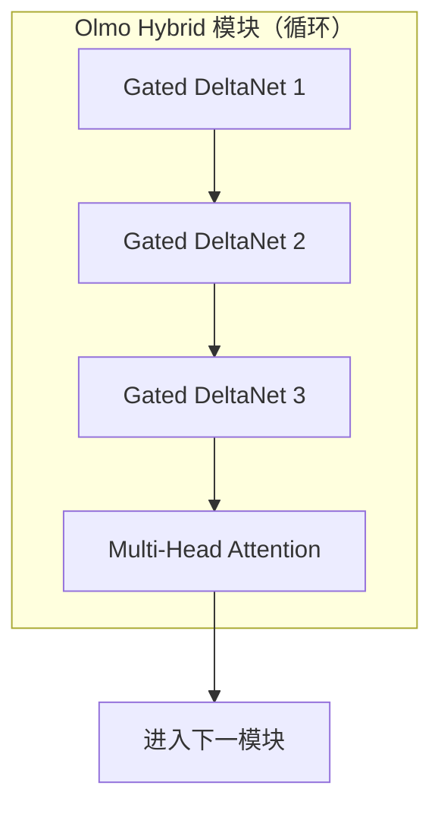

## 为什么选择混合架构

2026年3月，AI2（Allen Institute for AI）发布了Olmo Hybrid。这是一个7B参数规模的模型，采用了将Transformer的Attention层与Linear RNN（Gated DeltaNet）层相结合的混合架构。

核心成果非常明确：<strong>在MMLU上以比Olmo 3少49%的token量达到同等精度</strong>。这实质上意味着2倍的数据效率——模型训练所需的成本和时间可能缩减一半。

本文将分析Olmo Hybrid的架构设计、基准测试结果、理论背景，以及从EM/CTO视角出发的实务启示。

## 架构：3:1 DeltaNet-Attention 模式

Olmo Hybrid的核心是3:1模式。在整个网络中，每3个Gated DeltaNet子层之后接1个Multi-Head Attention子层，如此反复。

- <strong>Gated DeltaNet（75%）</strong>：专长于状态追踪（state tracking），线性复杂度。
- <strong>Multi-Head Attention（25%）</strong>：专长于精确信息检索（precise recall）。

## 基准测试：用数据说话的效率提升

### 数据效率

| 基准测试 | 相比Olmo 3的token节省率 | 含义 |
|---------|----------------------|------|
| MMLU | 节省49% | 约2倍数据效率 |
| Common Crawl 评估 | 节省35% | 在通用文本上同样高效 |

### 长上下文处理

| 评估项 | Olmo Hybrid（DRoPE） | Olmo 3 |
|------|---------------------|--------|
| RULER 64K token | 85.0 | 70.9 |

### 训练吞吐量
在训练速度上没有损失。效率提升来源于架构本身。

## 训练基础设施与规模

- 7B参数，使用6万亿token进行预训练
- 512块GPU（从NVIDIA H100迁移至HGX B200）
- 这是基于B200训练的最早案例之一

## 理论背景：混合架构为何更强

### 表达能力（Expressivity）分析
- 混合模型的表达能力比单纯Transformer更为丰富
- 两种架构的优势结合后产生超越各自之和的效果

### 扩展定律（Scaling Laws）
随着规模增大，效率收益也随之增长：

| 参数规模 | token节省倍数 |
|---------|-------------|
| 1B | 〜1.3倍 |
| 7B | 〜1.5倍 |
| 70B（预测） | 〜1.9倍 |

## 完全开放发布
Base、SFT、DPO各阶段模型、全部权重、中间检查点、完整训练代码以及技术报告均已公开。

## EM/CTO视角下的启示

1. <strong>相同预算下可训练出更高性能的模型</strong>
2. <strong>64K token下性能提升</strong> → 扩大长上下文应用场景
3. <strong>训练成本可能削减50%</strong>
4. <strong>开源生态系统日趋成熟</strong>

## 未来展望
1. Pure Transformer的时代正在走向终结
2. 扩展定律对混合架构更为有利
3. 开源模型竞争力持续增强

## 参考资料
- [AI2 官方博客](https://allenai.org/blog/olmohybrid)
- [技术报告](https://allenai.org/papers/olmo-hybrid)
- [Hugging Face 模型](https://huggingface.co/allenai/Olmo-Hybrid-7B)
- [Lambda 训练案例](https://lambda.ai/blog/open-model-open-metrics-how-lambda-and-the-olmo-team-trained-olmo-hybrid)
