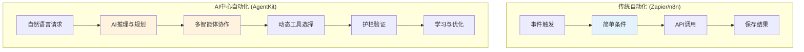
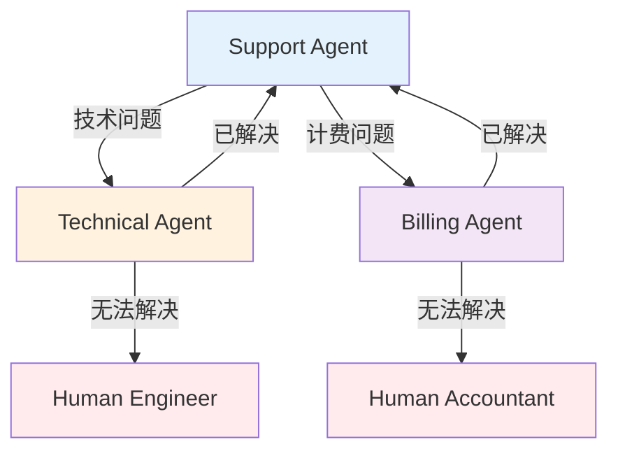

> **系列：掌握OpenAI AgentKit** (1/2)
>
> 1. **OpenAI AgentKit完全指南第1部分：核心概念与入门** ← 当前文章
> 2. [OpenAI AgentKit完全指南第2部分：实战应用与高级模式](/zh/blog/zh/openai-agentkit-tutorial-part2)

# OpenAI AgentKit完全指南第1部分：核心概念与入门

2025年10月6日，在旧金山举行的OpenAI DevDay上，Sam Altman发布了将彻底改变开发者生态系统的产品——<strong>AgentKit</strong>。

正如Sam Altman所说："从原型到生产，以更少的阻力构建、部署和优化智能体（Agent）所需的一切"，AgentKit不仅仅是简单的API更新。这是<strong>AI站在工作流中心的全新范式</strong>。

本文将帮助您理解AgentKit的核心概念，并提供创建首个AI智能体的完整教程。

## 核心要点 (TL;DR)

- 🎯 <strong>AgentKit = AI工作流平台</strong>：与Zapier/n8n竞争，但AI推理是核心
- 🧩 <strong>4个核心组件</strong>：Agent Builder（可视化）、ChatKit（UI）、Connector Registry（工具）、Evals（性能）
- 🐍 <strong>提供Python SDK</strong>：通过`openai-agents`包实现代码优先开发
- 🔌 <strong>原生支持MCP</strong>："AI应用的USB-C"，标准化工具集成
- 📊 <strong>测试阶段</strong>：Agent Builder目前处于测试阶段，2025年11月1日开始收费
- 💡 <strong>使用场景</strong>：AI中心工作流、多智能体协作、复杂决策自动化

## AgentKit是什么？

### OpenAI的战略转型

OpenAI不再只是"API提供商"。通过AgentKit，正在演变为<strong>平台企业</strong>。

如果传统工作流自动化工具（Zapier、n8n、Make）专注于<strong>"连接API"</strong>，那么AgentKit创建的是<strong>"AI推理和协调的工作流"</strong>。



<strong>核心区别</strong>：

- 传统工具：预定义的<strong>基于规则的流程</strong>
- AgentKit：AI<strong>理解情况并做出决策</strong>的智能体流程

### 4个核心组件

AgentKit由4个集成系统组成：

#### 1️⃣ Agent Builder（测试版）

<strong>"AI工作流的Figma"</strong>

- 拖放式可视化画布
- 无代码/低代码多智能体系统设计
- 内联预览和测试
- 内置版本管理
- 便签支持团队协作

<strong>使用场景</strong>：

- 与非开发人员协作时
- 需要可视化复杂工作流时
- 需要快速原型开发时

#### 2️⃣ ChatKit

<strong>"可嵌入的ChatGPT UI"</strong>

- 可直接嵌入应用的聊天界面
- 支持文件上传（每月1GB免费）
- 与Agent Builder工作流集成
- 白标定制化

<strong>使用场景</strong>：

- 向SaaS添加AI聊天功能
- 构建客户支持机器人
- 向内部工具添加AI界面

#### 3️⃣ Connector Registry（连接器注册表）

<strong>"智能体的工具箱"</strong>

- 集中式工具和数据管理
- 支持MCP（Model Context Protocol）服务器
- 管理员权限控制
- 安全工具集成

<strong>使用场景</strong>：

- 在企业环境中控制工具访问
- 通过MCP服务器添加自定义工具
- 安全连接外部API

#### 4️⃣ Evals（评估系统）

<strong>"智能体性能仪表板"</strong>

- 追踪评分（执行日志评估）
- 数据集管理
- 自动提示词优化
- 实时调试

<strong>使用场景</strong>：

- 测量智能体性能
- 提示词A/B测试
- 生产监控
- 成本优化

## 核心概念：Agents、Handoffs、Guardrails

要理解AgentKit的哲学，需要了解3个核心原则：

### 1. Agents（智能体）

<strong>定义</strong>：具有特定角色和工具的LLM

```python
from agents import Agent

agent = Agent(
    name="Customer Support Agent",
    instructions="""
    You are a customer support specialist for a SaaS company.
    Your role:
    - Answer product questions
    - Troubleshoot technical issues
    - Escalate to human if needed
    """,
    tools=[search_knowledge_base, create_ticket]
)
```

<strong>核心</strong>：智能体不仅仅是提示词。它们是具有<strong>角色、工具和约束</strong>的自主行为者。

### 2. Handoffs（交接）

<strong>定义</strong>：智能体之间的任务委托

```python
from agents import Agent

support_agent = Agent(
    name="Support Agent",
    instructions="Handle basic inquiries",
    handoffs=["Technical Agent", "Billing Agent"]
)

technical_agent = Agent(
    name="Technical Agent",
    instructions="Resolve technical issues",
    handoffs=["Support Agent"]  # 可以返回
)
```

<strong>使用模式</strong>：

- <strong>分层委托</strong>：管理者 → 专家
- <strong>同级协作</strong>：智能体之间协作
- <strong>升级</strong>：AI → 人工



### 3. Guardrails（护栏）

<strong>定义</strong>：输入输出验证和安全措施

```python
from agents import Agent, guardrails

agent = Agent(
    name="Content Generator",
    instructions="Generate marketing content",
    input_guardrails=[
        guardrails.no_pii,           # 阻止个人信息
        guardrails.content_filter    # 有害内容过滤
    ],
    output_guardrails=[
        guardrails.brand_voice_check, # 品牌语调验证
        guardrails.factual_accuracy   # 事实核查
    ]
)
```

<strong>为什么重要？</strong>：

- 保证生产环境的<strong>安全性</strong>
- <strong>防止成本失控</strong>（无限循环、不必要的API调用）
- <strong>品牌保护</strong>（阻止不当响应）
- <strong>合规性</strong>（遵守法规）

## 创建首个智能体：分步教程

### 准备工作

#### 1. OpenAI账户和API密钥

```bash
# 1. 在https://platform.openai.com注册
# 2. 在API Keys菜单生成密钥
# 3. 设置为环境变量
export OPENAI_API_KEY=sk-proj-...
```

#### 2. 安装Python SDK

```bash
# 需要Python 3.8或更高版本
pip install openai-agents
```

#### 3. 验证安装

```python
from agents import Agent, Runner

print("✓ OpenAI Agents SDK安装完成")
```

### 教程1：简单的天气智能体

<strong>目标</strong>：接收城市名称并提供天气信息的智能体

#### Step 1：定义工具

```python
from agents.tools import function_tool

@function_tool
def get_weather(location: str) -> str:
    """
    Get current weather information for a location.

    Args:
        location: City name (e.g., "Seoul", "Tokyo")

    Returns:
        Weather description with temperature
    """
    # 实际应调用API（例如：OpenWeatherMap）
    # 这里仅为模拟
    weather_data = {
        "Seoul": "晴天，22°C",
        "Tokyo": "多云，18°C",
        "New York": "下雨，15°C"
    }

    return weather_data.get(
        location,
        f"找不到{location}的天气信息"
    )
```

<strong>核心</strong>：`@function_tool`装饰器将函数转换为智能体可使用的工具。文档字符串告诉智能体如何使用工具。

#### Step 2：创建智能体

```python
from agents import Agent

weather_agent = Agent(
    name="Weather Assistant",
    instructions="""
    You are a helpful weather assistant.
    When users ask about weather, use the get_weather tool.
    Provide friendly, conversational responses.
    If a city isn't found, suggest nearby alternatives.
    """,
    tools=[get_weather]
)
```

#### Step 3：运行智能体

```python
from agents import Runner

# 同步执行
result = Runner.run_sync(
    weather_agent,
    "首尔天气怎么样？"
)

print(result.final_output)
# 输出："首尔目前天气晴朗，气温22°C！"
```

<strong>异步执行</strong>（生产环境）：

```python
import asyncio

async def main():
    result = await Runner.run(
        weather_agent,
        "What's the weather in Tokyo?"
    )
    print(result.final_output)

asyncio.run(main())
```

### 教程2：多智能体客户支持系统

<strong>目标</strong>：对问题进行分类并路由到合适的专业智能体

#### Step 1：定义专业智能体

```python
from agents import Agent

# 技术支持智能体
technical_agent = Agent(
    name="Technical Support",
    instructions="""
    You are a technical support specialist.
    Help users with:
    - Login issues
    - API errors
    - Performance problems

    If the issue is urgent, handoff to Human Engineer.
    """,
    handoffs=["Triage Agent"]  # 可以返回
)

# 计费支持智能体
billing_agent = Agent(
    name="Billing Support",
    instructions="""
    You are a billing specialist.
    Help users with:
    - Payment issues
    - Subscription changes
    - Refund requests

    Always verify user identity before discussing billing.
    """,
    handoffs=["Triage Agent"]
)

# 产品信息智能体
product_agent = Agent(
    name="Product Expert",
    instructions="""
    You are a product expert.
    Answer questions about:
    - Features and capabilities
    - Best practices
    - Use cases and examples

    Provide detailed, educational responses.
    """,
    handoffs=["Triage Agent"]
)
```

#### Step 2：分类智能体

```python
triage_agent = Agent(
    name="Triage Agent",
    instructions="""
    You are the first point of contact for customer support.

    Your job:
    1. Greet the user warmly
    2. Understand their issue
    3. Route to the appropriate specialist:
       - Technical Support: login, errors, bugs
       - Billing Support: payments, subscriptions
       - Product Expert: features, how-to questions

    If unsure, ask clarifying questions.
    """,
    handoffs=["Technical Support", "Billing Support", "Product Expert"]
)
```

#### Step 3：执行和测试

```python
# 测试1：技术问题
result = Runner.run_sync(
    triage_agent,
    "I'm getting a 401 error when calling the API"
)
print(result.final_output)
# → 交接给Technical Support智能体

# 测试2：计费问题
result = Runner.run_sync(
    triage_agent,
    "I was charged twice this month"
)
print(result.final_output)
# → 交接给Billing Support智能体

# 测试3：产品问题
result = Runner.run_sync(
    triage_agent,
    "How do I integrate webhooks?"
)
print(result.final_output)
# → 交接给Product Expert智能体
```

#### Step 4：使用会话管理对话历史

```python
from agents import Runner, Session

# 开始新会话
session = Session()

# 多轮对话
turns = [
    "I need help with my account",
    "I can't log in",
    "It says invalid password",
    "Yes, I tried resetting it"
]

for user_message in turns:
    result = Runner.run_sync(
        triage_agent,
        user_message,
        session=session  # 传递会话以保持历史
    )
    print(f"User: {user_message}")
    print(f"Agent: {result.final_output}\n")
```

<strong>会话的重要性</strong>：

- 保持对话上下文（记住之前的问题）
- 交接后也保留历史
- 生产环境中应将会话保存到数据库

## Agent Builder：可视化开发

如果代码有负担？使用Agent Builder的可视化画布。

### 访问Agent Builder

1. 访问https://platform.openai.com/agent-builder
2. 使用OpenAI账户登录
3. 点击"New Agent"

### 画布UI组成

```
┌────────────────────────────────────────────────┐
│  [New] [Save] [Deploy] [Preview]               │  ← 工具栏
├────────────────────────────────────────────────┤
│                                                │
│   ┌─────┐      ┌─────┐      ┌─────┐          │
│   │Agent│─────▶│Tool │─────▶│Agent│          │  ← 基于节点的工作流
│   │  A  │      │  X  │      │  B  │          │
│   └─────┘      └─────┘      └─────┘          │
│      │                          │             │
│      └──────┬──────────────────┘             │
│             ▼                                 │
│         ┌─────┐                               │
│         │Guard│                               │  ← 护栏
│         │rail │                               │
│         └─────┘                               │
│                                                │
│  [Properties Panel] ─────────────────────────▶│  ← 设置面板
│  Name: Agent A                                │
│  Instructions: [文本输入]                      │
│  Tools: [选择]                                 │
│  Handoffs: [选择]                              │
└────────────────────────────────────────────────┘
```

### 可视化创建多智能体

<strong>场景</strong>：内容生成工作流

1. <strong>拖动"Agent"节点</strong> → "Content Planner"

   - Instructions: "Create content outlines based on topics"

2. <strong>拖动"Agent"节点</strong> → "Content Writer"

   - Instructions: "Write blog posts from outlines"
   - Connect: Planner → Writer

3. <strong>拖动"Agent"节点</strong> → "SEO Optimizer"

   - Instructions: "Optimize content for SEO"
   - Connect: Writer → SEO Optimizer

4. <strong>拖动"Guardrail"节点</strong> → "Quality Check"

   - Type: Output Validation
   - Rules: Minimum 500 words, no plagiarism
   - Connect: SEO Optimizer → Quality Check

5. <strong>点击"Preview"</strong> → 测试运行

6. <strong>点击"Deploy"</strong> → 生产部署

### 可视化 vs 代码：何时使用什么？

| 标准               | Agent Builder（可视化）      | Python SDK（代码）        |
| ------------------ | ---------------------------- | ------------------------- |
| <strong>学习曲线</strong>      | 低（直观）                   | 中等（需要编程）    |
| <strong>灵活性</strong>         | 有限                          | 无限                    |
| <strong>协作</strong>           | 优秀（包括非开发人员）            | 一般（以开发人员为中心）        |
| <strong>版本管理</strong>      | 内置UI                         | Git集成                  |
| <strong>调试</strong>         | 可视化追踪                 | 代码级调试          |
| <strong>生产部署</strong>  | 一键部署                          | CI/CD管道          |
| <strong>推荐使用场景</strong> | 原型、业务工作流 | 企业、复杂逻辑 |

<strong>最佳实践</strong>：可视化原型 → 代码生产化

## Model Context Protocol (MCP) 集成

### 什么是MCP？

<strong>"AI应用的USB-C"</strong> - 以标准化方式连接工具和数据源

传统方式：

```
智能体 ─┬─ Custom API 1（自定义代码）
        ├─ Custom API 2（另一个自定义代码）
        └─ Custom API 3（又一个...）
```

MCP方式：

```
智能体 ─── MCP Protocol ─┬─ MCP Server 1（标准化）
                        ├─ MCP Server 2（标准化）
                        └─ MCP Server 3（标准化）
```

### 在AgentKit中使用MCP

#### 1. 添加MCP服务器

```python
from agents import Agent
from agents.mcp import MCPServer

# 连接MCP服务器
notion_server = MCPServer(
    url="http://localhost:3000/mcp/notion",
    capabilities=["read_database", "create_page"]
)

# 将MCP服务器连接到智能体
agent = Agent(
    name="Notion Assistant",
    instructions="Help users manage Notion databases",
    mcp_servers=[notion_server]
)
```

#### 2. 在Connector Registry中管理

```python
from agents import ConnectorRegistry

# 注册组织的MCP服务器
registry = ConnectorRegistry()

registry.add_server(
    name="Company Notion",
    mcp_url="http://internal.mcp/notion",
    permissions=["read", "write"],
    allowed_teams=["marketing", "product"]
)

# 在智能体中使用注册表
agent = Agent(
    name="Marketing Agent",
    connector_registry=registry
)
```

<strong>优势</strong>：

- 工具重用（多个智能体使用同一个MCP服务器）
- 集中式权限管理
- 标准化错误处理

### MCP生态系统

<strong>主要MCP服务器</strong>：

- Notion MCP
- Google Drive MCP
- Slack MCP
- GitHub MCP
- PostgreSQL MCP

<strong>自己创建</strong>：https://modelcontextprotocol.io/docs

## 深入理解护栏

### 为什么护栏是必需的？

<strong>实际生产事故案例</strong>：

- 聊天机器人泄露客户个人信息
- 无限循环导致$10,000 API账单
- 生成违反品牌指南的内容
- 生成有害内容

<strong>护栏的作用</strong>：事先阻止这些事故

### 输入护栏（Input Guardrails）

<strong>验证用户输入</strong>

```python
from agents import Agent, guardrails

agent = Agent(
    name="Customer Support",
    instructions="...",
    input_guardrails=[
        guardrails.no_pii(          # 阻止个人信息
            block_email=True,
            block_ssn=True,
            block_credit_card=True
        ),
        guardrails.content_filter(  # 有害内容过滤
            hate_speech=True,
            harassment=True,
            self_harm=True
        ),
        guardrails.language_check(  # 检查支持的语言
            allowed_languages=["ko", "en", "ja"]
        )
    ]
)
```

<strong>工作原理</strong>：

1. 用户输入到达
2. 按顺序执行护栏
3. 阻止时 → 不到达智能体
4. 通过时 → 智能体处理

### 输出护栏（Output Guardrails）

<strong>验证智能体响应</strong>

```python
agent = Agent(
    name="Content Generator",
    instructions="...",
    output_guardrails=[
        guardrails.brand_voice(        # 品牌语调验证
            tone="professional",
            avoid_words=["cheap", "worst", "scam"]
        ),
        guardrails.fact_check(          # 事实核查
            verify_statistics=True,
            verify_quotes=True
        ),
        guardrails.length_limit(        # 长度限制
            min_words=100,
            max_words=500
        ),
        guardrails.no_hallucination(    # 防止幻觉
            require_citations=True
        )
    ]
)
```

<strong>工作原理</strong>：

1. 智能体生成响应
2. 按顺序验证护栏
3. 失败时 → 重新生成或返回错误
4. 通过时 → 传递给用户

### 创建自定义护栏

```python
from agents.guardrails import Guardrail

class CustomProfanityFilter(Guardrail):
    def __init__(self, banned_words: list[str]):
        self.banned_words = banned_words

    def validate(self, text: str) -> tuple[bool, str]:
        """
        Returns (is_valid, error_message)
        """
        for word in self.banned_words:
            if word.lower() in text.lower():
                return False, f"Contains banned word: {word}"
        return True, ""

# 使用
agent = Agent(
    name="Family-Friendly Bot",
    output_guardrails=[
        CustomProfanityFilter(
            banned_words=["脏话1", "脏话2", "禁用词"]
        )
    ]
)
```

### 护栏最佳实践

1. <strong>保护输入和输出</strong>：双向防御
2. <strong>分层护栏</strong>：先快速检查，后昂贵检查
3. <strong>清晰的错误消息</strong>：告知用户为何被阻止
4. <strong>日志记录</strong>：通过追踪护栏阻止历史来改进
5. <strong>测试</strong>：用恶意输入测试护栏

## 会话和对话历史管理

### 会话的重要性

与智能体进行<strong>多轮对话</strong>时，需要记住之前的上下文。

```python
# 没有会话（无上下文）
result1 = Runner.run_sync(agent, "My name is John")
result2 = Runner.run_sync(agent, "What's my name?")
# 回答："I don't know your name" ← 没有记住之前的对话

# 使用会话（保持上下文）
session = Session()
result1 = Runner.run_sync(agent, "My name is John", session=session)
result2 = Runner.run_sync(agent, "What's my name?", session=session)
# 回答："Your name is John" ← 记住了之前的对话
```

### 会话持久化（Persistence）

```python
from agents import Session
import json

# 创建和使用会话
session = Session(user_id="user_123")
result = Runner.run_sync(agent, "Hello!", session=session)

# 将会话保存为JSON
session_data = session.to_dict()
with open("session_user_123.json", "w") as f:
    json.dump(session_data, f)

# 稍后恢复会话
with open("session_user_123.json", "r") as f:
    session_data = json.load(f)

restored_session = Session.from_dict(session_data)
result = Runner.run_sync(agent, "What did we talk about?", session=restored_session)
```

<strong>生产环境</strong>：将会话保存到Redis或PostgreSQL

```python
import redis

redis_client = redis.Redis(host='localhost', port=6379)

# 保存会话
redis_client.set(
    f"session:{user_id}",
    json.dumps(session.to_dict()),
    ex=3600  # 1小时后过期
)

# 加载会话
session_data = redis_client.get(f"session:{user_id}")
session = Session.from_dict(json.loads(session_data))
```

## 成本优化策略

AgentKit很强大，但使用不当可能导致成本激增。

### 1. 选择合适的模型

```python
# ❌ 低效：对所有任务使用GPT-5 Pro
expensive_agent = Agent(
    name="Simple Bot",
    model="gpt-5-pro",  # 非常昂贵
    instructions="Answer yes or no"
)

# ✅ 高效：根据任务选择模型
cheap_agent = Agent(
    name="Simple Bot",
    model="gpt-realtime-mini",  # 便宜且快速
    instructions="Answer yes or no"
)
```

<strong>模型选择指南</strong>：

- 简单分类/路由：`gpt-realtime-mini`
- 一般任务：`gpt-4o`
- 复杂推理：`gpt-5-pro`

### 2. 优化提示词

```python
# ❌ 低效：冗长的提示词
agent = Agent(
    instructions="""
    You are an extremely helpful, friendly, and knowledgeable assistant
    who loves to help users with all their questions and concerns.
    You always provide detailed, comprehensive answers that cover
    every possible angle and consideration...
    [500 words of unnecessary instructions]
    """
)

# ✅ 高效：简洁的提示词
agent = Agent(
    instructions="Answer user questions clearly and concisely."
)
```

<strong>Token = 成本</strong>：提示词越短越便宜

### 3. 使用护栏防止无限循环

```python
from agents import guardrails

agent = Agent(
    name="Research Agent",
    instructions="...",
    output_guardrails=[
        guardrails.max_iterations(5),      # 最多5次迭代
        guardrails.max_tool_calls(10),     # 最多10次工具调用
        guardrails.timeout_seconds(30)     # 30秒限制
    ]
)
```

### 4. 利用缓存

```python
from agents import Agent, caching

agent = Agent(
    name="Product Expert",
    instructions="...",
    enable_caching=True  # 缓存重复问题
)

# 首次调用：全部成本
result1 = Runner.run_sync(agent, "What is AgentKit?")

# 第二次调用：从缓存返回（免费）
result2 = Runner.run_sync(agent, "What is AgentKit?")
```

### 5. 使用Evals监控

```python
from agents import Evals

evals = Evals()

# 设置成本警报
evals.set_alert(
    metric="cost_per_day",
    threshold=100.00,  # 每天超过$100时警报
    action="email"
)

# 检测异常模式
evals.monitor(
    agent_name="Customer Support",
    anomaly_detection=True  # 检测突然的成本增加
)
```

## 生产部署检查清单

### 部署前确认事项

#### ✅ 功能测试

- [ ] 测试所有交接路径
- [ ] 确认边缘情况处理
- [ ] 验证错误处理
- [ ] 测试超时场景

#### ✅ 安全性

- [ ] 设置输入护栏
- [ ] 设置输出护栏
- [ ] 确认PII保护
- [ ] 审查合规性（GDPR、CCPA等）

#### ✅ 性能

- [ ] 测量响应时间（目标<3秒）
- [ ] 估算成本（基于预期流量）
- [ ] 并发请求负载测试
- [ ] 制定缓存策略

#### ✅ 监控

- [ ] 设置Evals仪表板
- [ ] 定义警报规则
- [ ] 构建日志基础设施
- [ ] 错误追踪（Sentry等）

#### ✅ 文档

- [ ] 记录智能体工作方式
- [ ] 编写团队入门指南
- [ ] API文档（使用ChatKit时）
- [ ] 事件响应手册

### 部署方法

#### 从Agent Builder部署

1. 在Agent Builder中点击"Deploy"
2. 选择部署环境（Staging / Production）
3. 输入版本标签（例如：`v1.0.0`）
4. 点击"Confirm Deploy"
5. 获取Webhook URL（集成ChatKit时）

#### Python SDK部署

```python
# deploy.py
from agents import Agent, deploy

agent = Agent(
    name="Production Agent",
    instructions="..."
)

# 部署到OpenAI平台
deployment = deploy(
    agent=agent,
    environment="production",
    version="1.0.0"
)

print(f"Deployed at: {deployment.url}")
```

<strong>CI/CD集成</strong>：

```yaml
# .github/workflows/deploy.yml
name: Deploy Agent
on:
  push:
    branches: [main]

jobs:
  deploy:
    runs-on: ubuntu-latest
    steps:
      - uses: actions/checkout@v2
      - name: Deploy to OpenAI
        run: |
          pip install openai-agents
          python deploy.py
        env:
          OPENAI_API_KEY: ${{ secrets.OPENAI_API_KEY }}
```

## 实战用例

### 案例1：客户支持自动化（Clay）

<strong>结果</strong>：10倍增长

<strong>实现</strong>：

```python
support_system = Agent(
    name="Support Triage",
    instructions="Classify and route customer inquiries",
    handoffs=[
        "Tier 1 Support",   # 一般问题
        "Tier 2 Support",   # 技术问题
        "Sales Team",       # 销售咨询
        "Human Agent"       # 复杂案例
    ]
)
```

<strong>成果</strong>：

- 80%自动解决率
- 平均响应时间从5分钟降至30秒
- 客户满意度提高15%

### 案例2：内容生成管道

<strong>实现</strong>：

```python
content_planner = Agent(
    name="Content Planner",
    instructions="Create SEO-optimized content outlines"
)

content_writer = Agent(
    name="Writer",
    instructions="Write engaging blog posts from outlines"
)

seo_optimizer = Agent(
    name="SEO Optimizer",
    instructions="Optimize for search engines"
)

# 工作流
result = Runner.run_sync(
    content_planner,
    "Create content about AgentKit tutorial",
    handoff_chain=[content_writer, seo_optimizer]
)
```

<strong>成果</strong>：

- 内容生产速度提高5倍
- SEO得分平均保持85+
- 减少作家倦怠

### 案例3：研究辅助系统

<strong>实现</strong>：

```python
@function_tool
def search_papers(query: str) -> list:
    """Search academic papers"""
    # 调用arXiv、PubMed API
    pass

@function_tool
def extract_key_findings(paper_url: str) -> str:
    """Extract key findings from a paper"""
    pass

research_agent = Agent(
    name="Research Assistant",
    instructions="""
    Help researchers by:
    1. Finding relevant papers
    2. Extracting key findings
    3. Synthesizing information
    4. Suggesting future research directions
    """,
    tools=[search_papers, extract_key_findings]
)
```

<strong>成果</strong>：

- 文献调研时间减少70%
- 更广泛的研究覆盖
- 发现遗漏的重要论文

## 下一步

现在您已经了解了AgentKit的核心概念并创建了首个智能体。

<strong>下篇预告</strong>：[OpenAI AgentKit完全指南第2部分：实战应用与高级模式](/zh/blog/zh/openai-agentkit-tutorial-part2)中将介绍：

- 🏗️ <strong>实战架构模式</strong>：企业级多智能体系统设计
- 🔧 <strong>高级工具集成</strong>：自己创建MCP服务器、外部API集成
- 📊 <strong>性能优化</strong>：使用Evals进行A/B测试和提示词优化
- 🛡️ <strong>安全与合规</strong>：生产环境的安全措施
- 💼 <strong>真实案例研究</strong>：3个行业的完整实现示例

## 额外资源

### 官方文档

- OpenAI AgentKit官方页面：https://openai.com/agent-platform/
- Agents SDK文档：https://openai.github.io/openai-agents-python/
- MCP协议：https://modelcontextprotocol.io/

### 社区

- OpenAI Developer Forum：https://community.openai.com/
- AgentKit GitHub：https://github.com/openai/openai-agents-python
- Reddit：r/OpenAI

### 教程视频

- OpenAI DevDay 2025 Keynote（YouTube）
- AgentKit Deep Dive（官方频道）

---

<strong>下篇文章见！</strong>让我们通过实战案例一起掌握AgentKit。

_如有问题或反馈，请在评论中留言。我会回复所有意见！_
