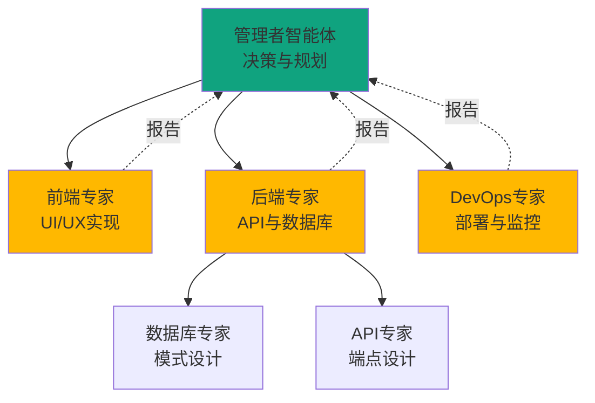
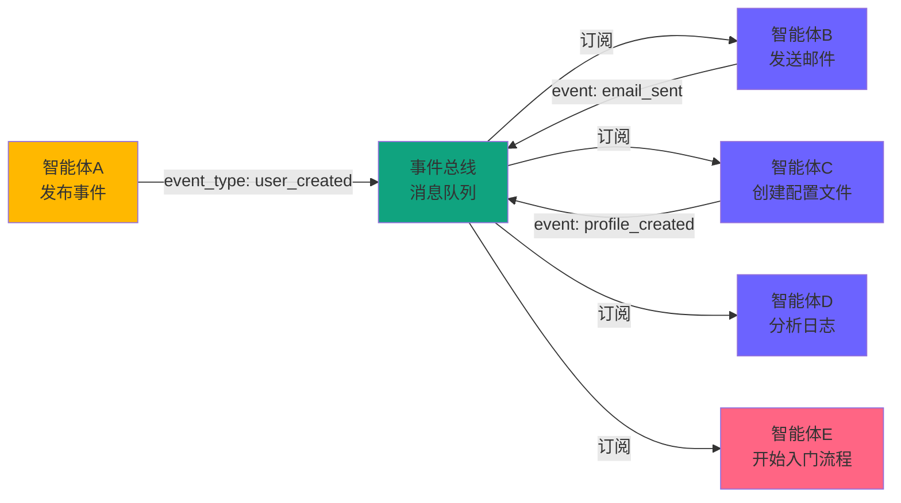
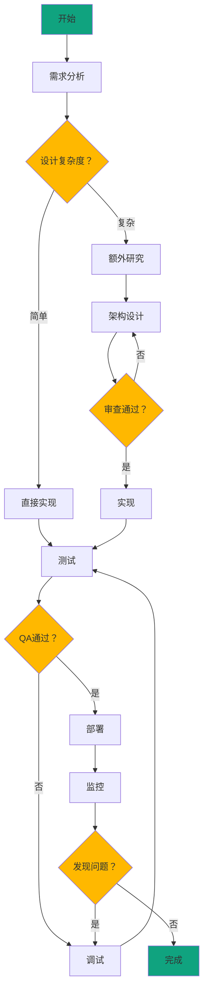
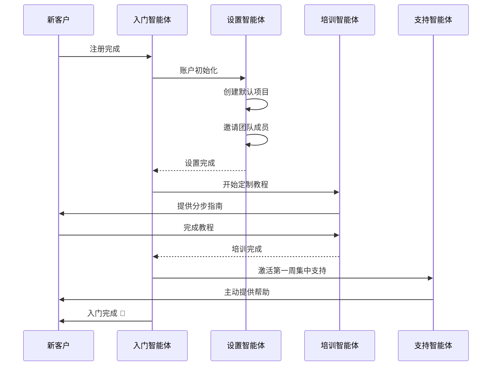

> <strong>系列：掌握OpenAI AgentKit</strong> (2/2)
>
> 1. [OpenAI AgentKit完全指南第1部：核心概念与入门](/zh/blog/zh/openai-agentkit-tutorial-part1)
> 2. <strong>OpenAI AgentKit完全指南第2部：实战应用与高级模式</strong> ← 当前文章

# OpenAI AgentKit完全指南第2部：实战应用与高级模式

在[第1部](/zh/blog/zh/openai-agentkit-tutorial-part1)中，我们学习了AgentKit的核心概念和基本用法。现在我们将探讨可在实际生产环境中使用的<strong>高级架构模式</strong>和<strong>企业级系统设计</strong>。

本文将介绍真实企业如何利用AgentKit解决复杂问题，并提供可直接实现的<strong>完整代码示例</strong>。

## 核心总结 (TL;DR)

- 🏗️ <strong>3种企业架构模式</strong>：层级式、事件驱动、基于图的编排
- 🔧 <strong>构建自定义MCP服务器</strong>：自行创建并集成到AgentKit
- 📊 <strong>生产环境监控</strong>：利用Evals进行性能优化和A/B测试
- 🛡️ <strong>企业安全</strong>：数据隔离、审计日志、合规性
- 💼 <strong>3个实战案例</strong>：SaaS自动化、数据管道、DevOps工作流
- ⚡ <strong>性能优化</strong>：并行处理、缓存、流式响应

## 企业架构模式

### 模式1：层级式管理者-工作者（Hierarchical Manager-Worker）

<strong>使用场景</strong>：复杂的决策树，需要明确的职责分离



#### 实现示例：全栈应用生成系统

```python
from agents import Agent, Runner

# 1. 管理者智能体（最高层）
manager = Agent(
    name="Project Manager",
    instructions="""
    You are a technical project manager for building web applications.

    Your responsibilities:
    1. Analyze user requirements
    2. Break down into tasks
    3. Delegate to specialist agents
    4. Coordinate between teams
    5. Ensure quality standards
    6. Report progress

    Decision framework:
    - Frontend tasks → Frontend Specialist
    - Backend/API tasks → Backend Specialist
    - Database tasks → Backend Specialist (who delegates to Database Expert)
    - Deployment tasks → DevOps Specialist

    Always verify feasibility before delegation.
    """,
    handoffs=[
        "Frontend Specialist",
        "Backend Specialist",
        "DevOps Specialist"
    ]
)

# 2. 前端专家
frontend_specialist = Agent(
    name="Frontend Specialist",
    instructions="""
    You specialize in frontend development.

    Skills:
    - React/Next.js component design
    - Tailwind CSS styling
    - Responsive layouts
    - Form validation
    - State management

    When you receive a task:
    1. Design component structure
    2. Implement with best practices
    3. Ensure accessibility (WCAG)
    4. Test on multiple screen sizes
    5. Report completion to Project Manager
    """,
    tools=[create_component, add_styling, validate_accessibility],
    handoffs=["Project Manager"]
)

# 3. 后端专家
backend_specialist = Agent(
    name="Backend Specialist",
    instructions="""
    You specialize in backend development.

    Skills:
    - RESTful API design
    - Database schema design
    - Authentication/authorization
    - Error handling
    - Performance optimization

    For complex database tasks, delegate to Database Expert.
    For API design, handle directly.
    """,
    tools=[create_api_endpoint, design_schema],
    handoffs=["Database Expert", "Project Manager"]
)

# 4. 数据库专家（子专家）
database_expert = Agent(
    name="Database Expert",
    instructions="""
    You are a database specialist.

    Expertise:
    - PostgreSQL, MongoDB, Redis
    - Index optimization
    - Query performance tuning
    - Migration strategies
    - Backup/recovery

    Always consider:
    - Data integrity constraints
    - Scalability
    - Query performance
    - Migration path
    """,
    tools=[create_migration, optimize_query, add_index],
    handoffs=["Backend Specialist"]
)

# 5. DevOps专家
devops_specialist = Agent(
    name="DevOps Specialist",
    instructions="""
    You handle deployment and infrastructure.

    Responsibilities:
    - CI/CD pipeline setup
    - Docker containerization
    - Kubernetes deployment
    - Monitoring setup
    - Security hardening

    Follow the 12-factor app principles.
    """,
    tools=[create_dockerfile, setup_ci_cd, deploy_to_k8s],
    handoffs=["Project Manager"]
)
```

#### 执行示例

```python
# 用户请求
user_request = """
Create a task management SaaS application with:
- User authentication
- Task CRUD operations
- Real-time updates
- Dashboard with analytics
- Mobile responsive
- Deploy to production
"""

# 管理者协调整个项目
result = Runner.run_sync(
    manager,
    user_request
)

# 执行流程：
# 1. Manager: 需求分析与任务分解
# 2. Manager → Frontend Specialist: 创建UI组件
# 3. Manager → Backend Specialist: API设计
# 4. Backend Specialist → Database Expert: 模式设计
# 5. Database Expert → Backend Specialist: 完成报告
# 6. Backend Specialist → Manager: 完成报告
# 7. Manager → DevOps Specialist: 部署
# 8. DevOps Specialist → Manager: 部署完成
# 9. Manager → User: 项目完成报告
```

<strong>优点</strong>：
- 明确的职责分离
- 可扩展（易于添加新专家）
- 易于调试（分层追踪）
- 资源高效（仅调用所需专家）

<strong>缺点</strong>：
- 管理者可能成为瓶颈
- 层级过深时延迟增加
- 依赖管理者的决策质量

---

### 模式2：事件驱动编排（Event-Driven Orchestration）

<strong>使用场景</strong>：异步任务、松耦合、动态工作流



#### 实现示例：用户入门自动化

```python
from agents import Agent
import asyncio
from typing import Dict, List

class EventBus:
    def __init__(self):
        self.subscribers: Dict[str, List[Agent]] = {}

    def subscribe(self, event_type: str, agent: Agent):
        """将智能体订阅到特定事件"""
        if event_type not in self.subscribers:
            self.subscribers[event_type] = []
        self.subscribers[event_type].append(agent)

    async def publish(self, event_type: str, data: dict):
        """发布事件并传递给所有订阅者"""
        if event_type in self.subscribers:
            tasks = []
            for agent in self.subscribers[event_type]:
                task = Runner.run(agent, f"Handle event: {event_type}\nData: {data}")
                tasks.append(task)

            # 并行执行
            results = await asyncio.gather(*tasks, return_exceptions=True)
            return results
        return []

# 初始化事件总线
event_bus = EventBus()

# 1. 用户创建智能体
user_creator = Agent(
    name="User Creator",
    instructions="""
    Create new user accounts.
    After creating a user, publish a 'user_created' event.
    """,
    tools=[create_user_in_db]
)

# 2. 邮件发送智能体
email_agent = Agent(
    name="Email Sender",
    instructions="""
    Send welcome emails to new users.
    Listen for 'user_created' events.
    After sending, publish 'email_sent' event.
    """,
    tools=[send_welcome_email]
)

# 3. 配置文件创建智能体
profile_agent = Agent(
    name="Profile Creator",
    instructions="""
    Create user profiles with default settings.
    Listen for 'user_created' events.
    After creation, publish 'profile_created' event.
    """,
    tools=[create_default_profile]
)

# 4. 分析日志智能体
analytics_agent = Agent(
    name="Analytics Logger",
    instructions="""
    Log user creation events for analytics.
    Listen for 'user_created' events.
    No event publication needed.
    """,
    tools=[log_to_analytics]
)

# 5. 入门智能体
onboarding_agent = Agent(
    name="Onboarding Coordinator",
    instructions="""
    Start user onboarding flow.
    Wait for both 'email_sent' AND 'profile_created' events.
    Then initiate the onboarding tutorial.
    """,
    tools=[start_onboarding_tutorial]
)

# 设置事件订阅
event_bus.subscribe("user_created", email_agent)
event_bus.subscribe("user_created", profile_agent)
event_bus.subscribe("user_created", analytics_agent)
event_bus.subscribe("email_sent", onboarding_agent)
event_bus.subscribe("profile_created", onboarding_agent)

# 使用示例
async def create_new_user(user_data: dict):
    # 1. 创建用户
    result = await Runner.run(user_creator, f"Create user: {user_data}")

    # 2. 发布user_created事件（并行执行）
    await event_bus.publish("user_created", {"user_id": result.user_id, **user_data})

    # 邮件、配置文件、分析日志同时处理
```

<strong>优点</strong>：
- 智能体间松耦合
- 并行处理提升性能
- 易于添加新功能（仅添加新订阅者）
- 故障隔离（一个失败不影响其他）

<strong>缺点</strong>：
- 调试困难（异步流程）
- 难以保证事件顺序
- 复杂度增加

---

### 模式3：基于图的工作流（Graph-Based Workflow）

<strong>使用场景</strong>：复杂的条件流程、循环、动态决策



#### 实现示例：利用LangGraph

```python
from langgraph.graph import StateGraph, END
from agents import Agent
from typing import TypedDict, Annotated

# 1. 状态定义
class ProjectState(TypedDict):
    requirements: str
    design: dict
    code: str
    test_results: dict
    deployment_status: str
    issues: list
    iteration_count: int

# 2. 智能体定义
analyzer = Agent(
    name="Requirement Analyzer",
    instructions="Analyze requirements and determine complexity",
    tools=[analyze_complexity]
)

designer = Agent(
    name="System Designer",
    instructions="Design system architecture",
    tools=[create_architecture_diagram]
)

implementer = Agent(
    name="Code Implementer",
    instructions="Implement the design in code",
    tools=[write_code, run_linter]
)

tester = Agent(
    name="QA Tester",
    instructions="Test the implementation",
    tools=[run_tests, check_coverage]
)

deployer = Agent(
    name="Deployment Engineer",
    instructions="Deploy to production",
    tools=[deploy_to_prod, setup_monitoring]
)

# 3. 节点函数定义
async def analyze_node(state: ProjectState) -> ProjectState:
    result = await Runner.run(analyzer, state["requirements"])
    state["design"] = {"complexity": result.complexity, "approach": result.approach}
    return state

async def design_node(state: ProjectState) -> ProjectState:
    result = await Runner.run(designer, f"Design for: {state['design']}")
    state["design"]["architecture"] = result.architecture
    return state

async def implement_node(state: ProjectState) -> ProjectState:
    result = await Runner.run(implementer, f"Implement: {state['design']}")
    state["code"] = result.code
    return state

async def test_node(state: ProjectState) -> ProjectState:
    result = await Runner.run(tester, f"Test: {state['code']}")
    state["test_results"] = result.test_results
    state["issues"] = result.issues
    return state

async def deploy_node(state: ProjectState) -> ProjectState:
    result = await Runner.run(deployer, f"Deploy: {state['code']}")
    state["deployment_status"] = result.status
    return state

# 4. 条件路由函数
def should_research(state: ProjectState) -> str:
    if state["design"]["complexity"] == "high":
        return "design"
    return "implement"

def test_passed(state: ProjectState) -> str:
    if state["issues"]:
        if state["iteration_count"] < 3:
            state["iteration_count"] += 1
            return "implement"  # 重新实现
        return "escalate"  # 人工介入
    return "deploy"

# 5. 图构建
workflow = StateGraph(ProjectState)

# 添加节点
workflow.add_node("analyze", analyze_node)
workflow.add_node("design", design_node)
workflow.add_node("implement", implement_node)
workflow.add_node("test", test_node)
workflow.add_node("deploy", deploy_node)

# 添加边
workflow.set_entry_point("analyze")
workflow.add_conditional_edges(
    "analyze",
    should_research,
    {"design": "design", "implement": "implement"}
)
workflow.add_edge("design", "implement")
workflow.add_edge("implement", "test")
workflow.add_conditional_edges(
    "test",
    test_passed,
    {"deploy": "deploy", "implement": "implement", "escalate": END}
)
workflow.add_edge("deploy", END)

# 6. 编译并执行
app = workflow.compile()

# 使用
initial_state = {
    "requirements": "Build a real-time chat application with video calls",
    "design": {},
    "code": "",
    "test_results": {},
    "deployment_status": "",
    "issues": [],
    "iteration_count": 0
}

final_state = await app.ainvoke(initial_state)
```

<strong>优点</strong>：
- 表达复杂的条件逻辑
- 支持循环和重试
- 可视化（图表示）
- 动态工作流变更

<strong>缺点</strong>：
- 初始设置复杂
- 需要状态管理
- 依赖LangGraph

---

## 构建自定义MCP服务器

使用MCP（Model Context Protocol）可以以标准化方式将AgentKit连接到外部系统。

### 实战示例：构建Slack MCP服务器

<strong>目标</strong>：使AgentKit智能体能够发送Slack消息、管理频道和添加反应

#### 1. MCP服务器结构

```python
# slack_mcp_server.py
from mcp.server import Server, Tool
from slack_sdk import WebClient
from slack_sdk.errors import SlackApiError
import os

class SlackMCPServer(Server):
    def __init__(self):
        super().__init__(name="slack", version="1.0.0")
        self.client = WebClient(token=os.environ["SLACK_BOT_TOKEN"])

        # 注册工具
        self.register_tool(self.send_message)
        self.register_tool(self.create_channel)
        self.register_tool(self.add_reaction)
        self.register_tool(self.get_channel_history)

    @Tool(
        name="send_message",
        description="Send a message to a Slack channel",
        parameters={
            "channel": {
                "type": "string",
                "description": "Channel ID or name (e.g., '#general')"
            },
            "text": {
                "type": "string",
                "description": "Message text"
            },
            "thread_ts": {
                "type": "string",
                "description": "Thread timestamp (optional, for replies)",
                "optional": True
            }
        }
    )
    async def send_message(self, channel: str, text: str, thread_ts: str = None):
        """发送Slack消息"""
        try:
            response = self.client.chat_postMessage(
                channel=channel,
                text=text,
                thread_ts=thread_ts
            )
            return {
                "success": True,
                "ts": response["ts"],
                "channel": response["channel"]
            }
        except SlackApiError as e:
            return {
                "success": False,
                "error": str(e)
            }

    @Tool(
        name="create_channel",
        description="Create a new Slack channel",
        parameters={
            "name": {
                "type": "string",
                "description": "Channel name (lowercase, no spaces)"
            },
            "is_private": {
                "type": "boolean",
                "description": "Whether the channel is private",
                "default": False
            }
        }
    )
    async def create_channel(self, name: str, is_private: bool = False):
        """创建新的Slack频道"""
        try:
            response = self.client.conversations_create(
                name=name,
                is_private=is_private
            )
            return {
                "success": True,
                "channel_id": response["channel"]["id"],
                "channel_name": response["channel"]["name"]
            }
        except SlackApiError as e:
            return {
                "success": False,
                "error": str(e)
            }

    @Tool(
        name="add_reaction",
        description="Add an emoji reaction to a message",
        parameters={
            "channel": {"type": "string", "description": "Channel ID"},
            "timestamp": {"type": "string", "description": "Message timestamp"},
            "name": {"type": "string", "description": "Emoji name (without colons)"}
        }
    )
    async def add_reaction(self, channel: str, timestamp: str, name: str):
        """在消息上添加表情反应"""
        try:
            self.client.reactions_add(
                channel=channel,
                timestamp=timestamp,
                name=name
            )
            return {"success": True}
        except SlackApiError as e:
            return {"success": False, "error": str(e)}

    @Tool(
        name="get_channel_history",
        description="Get recent messages from a channel",
        parameters={
            "channel": {"type": "string", "description": "Channel ID"},
            "limit": {"type": "integer", "description": "Number of messages", "default": 10}
        }
    )
    async def get_channel_history(self, channel: str, limit: int = 10):
        """获取频道的最近消息"""
        try:
            response = self.client.conversations_history(
                channel=channel,
                limit=limit
            )
            messages = []
            for msg in response["messages"]:
                messages.append({
                    "text": msg.get("text", ""),
                    "user": msg.get("user", ""),
                    "timestamp": msg["ts"]
                })
            return {"success": True, "messages": messages}
        except SlackApiError as e:
            return {"success": False, "error": str(e)}

# 运行服务器
if __name__ == "__main__":
    server = SlackMCPServer()
    server.run(host="localhost", port=3000)
```

#### 2. 在AgentKit中使用MCP服务器

```python
from agents import Agent
from agents.mcp import MCPServer

# 连接MCP服务器
slack_server = MCPServer(
    url="http://localhost:3000",
    name="slack"
)

# Slack管理智能体
slack_agent = Agent(
    name="Slack Manager",
    instructions="""
    You manage Slack communications.

    Capabilities:
    - Send messages to channels
    - Create new channels
    - Add reactions
    - Read channel history

    Best practices:
    - Use threads for related conversations
    - Add emoji reactions to acknowledge messages
    - Create channels with clear, descriptive names
    - Check channel history before sending duplicates
    """,
    mcp_servers=[slack_server]
)

# 使用示例
result = Runner.run_sync(
    slack_agent,
    """
    Create a new channel called 'project-agentkit-updates'.
    Then send a message: "AgentKit integration is now live!🚀"
    Add a thumbs up reaction to confirm.
    """
)
```

#### 3. 使用Connector Registry进行企业管理

```python
from agents import ConnectorRegistry

# 组织的MCP服务器集中管理
registry = ConnectorRegistry()

# 注册Slack MCP
registry.add_server(
    name="Company Slack",
    mcp_url="http://internal-mcp.company.com/slack",
    permissions=["read", "write"],
    allowed_teams=["engineering", "product", "marketing"],
    rate_limits={"requests_per_minute": 60},
    audit_logging=True
)

# 注册GitHub MCP
registry.add_server(
    name="Company GitHub",
    mcp_url="http://internal-mcp.company.com/github",
    permissions=["read", "write"],
    allowed_teams=["engineering"],
    rate_limits={"requests_per_minute": 30},
    require_approval=True  # PR创建/合并需要批准
)

# 在智能体中使用注册表
devops_agent = Agent(
    name="DevOps Automator",
    instructions="Automate DevOps workflows",
    connector_registry=registry
)

# 确认权限后执行操作
result = Runner.run_sync(
    devops_agent,
    """
    When the build succeeds:
    1. Send a message to #deployments Slack channel
    2. Create a GitHub release
    3. Update the status page
    """
)
```

---

## 生产环境监控与优化

### 利用Evals进行性能测量

#### 1. 基本指标追踪

```python
from agents import Evals, Runner

evals = Evals()

# 智能体执行与自动追踪
@evals.track(
    agent_name="Customer Support",
    metrics=["latency", "cost", "success_rate", "user_satisfaction"]
)
async def handle_support_ticket(ticket):
    result = await Runner.run(support_agent, ticket)
    return result

# 查询指标
metrics = evals.get_metrics(
    agent_name="Customer Support",
    time_range="last_7_days"
)

print(f"平均响应时间: {metrics['avg_latency']}ms")
print(f"总成本: ${metrics['total_cost']}")
print(f"成功率: {metrics['success_rate']}%")
```

#### 2. A/B测试框架

```python
from agents import Evals, Agent, Runner
import random

evals = Evals()

# 两个提示词版本
prompt_a = """
You are a concise customer support agent.
Answer questions directly and briefly.
"""

prompt_b = """
You are a friendly customer support agent.
Answer questions warmly with examples and explanations.
Use emoji to make responses engaging.
"""

agent_a = Agent(name="Support A", instructions=prompt_a)
agent_b = Agent(name="Support B", instructions=prompt_b)

# 运行A/B测试
@evals.ab_test(
    variant_a=agent_a,
    variant_b=agent_b,
    split_ratio=0.5,  # 50/50分配
    success_metric="user_satisfaction"
)
async def handle_ticket(ticket, user_id):
    # Evals自动路由到A或B
    result = await Runner.run(ticket)

    # 收集用户满意度
    satisfaction = await get_user_feedback(user_id)
    evals.log_metric("user_satisfaction", satisfaction)

    return result

# 1000次执行后分析结果
results = evals.get_ab_test_results(
    test_name="support_prompt_test",
    min_sample_size=500
)

print(f"""
A/B测试结果：
变体A（简洁风格）：
  - 用户满意度: {results['a']['user_satisfaction']:.2f}/5
  - 平均响应时间: {results['a']['avg_latency']}ms
  - 成本: ${results['a']['avg_cost']}

变体B（友好风格）：
  - 用户满意度: {results['b']['user_satisfaction']:.2f}/5
  - 平均响应时间: {results['b']['avg_latency']}ms
  - 成本: ${results['b']['avg_cost']}

统计显著性: p-value = {results['p_value']}
推荐: 变体{"B" if results['recommendation'] == 'b' else "A"}
""")
```

#### 3. 自动提示词优化

```python
from agents import Evals

evals = Evals()

# 优化目标智能体
base_agent = Agent(
    name="Code Reviewer",
    instructions="Review code for bugs and suggest improvements"
)

# 运行自动优化
optimized_agent = evals.optimize_prompt(
    agent=base_agent,
    optimization_goal="success_rate",  # 或"latency", "cost", "user_satisfaction"
    training_data=[
        {"input": "Review this code: ...", "expected_output": "..."},
        # 100个以上的示例
    ],
    iterations=50,  # 50次迭代实验
    search_strategy="evolutionary"  # 或"grid_search", "bayesian"
)

# 结果比较
comparison = evals.compare_agents(
    agents=[base_agent, optimized_agent],
    test_data=test_dataset
)

print(f"""
基线 vs 优化：
成功率: {comparison['base']['success_rate']}% → {comparison['optimized']['success_rate']}%
改进: +{comparison['improvement']['success_rate']}%
""")
```

---

## 企业安全与合规性

### 1. 数据隔离（多租户）

```python
from agents import Agent, Session
import hashlib

class TenantIsolatedAgent:
    def __init__(self, base_agent: Agent):
        self.base_agent = base_agent
        self.tenant_sessions = {}

    def get_session(self, tenant_id: str) -> Session:
        """租户隔离会话"""
        if tenant_id not in self.tenant_sessions:
            # 为每个租户创建独立会话
            session = Session(
                session_id=self._generate_session_id(tenant_id),
                metadata={"tenant_id": tenant_id},
                isolation_level="tenant"  # 数据隔离
            )
            self.tenant_sessions[tenant_id] = session
        return self.tenant_sessions[tenant_id]

    async def run(self, tenant_id: str, prompt: str):
        """租户隔离执行"""
        session = self.get_session(tenant_id)

        # 应用租户专属防护栏
        guardrails = self._get_tenant_guardrails(tenant_id)

        # 执行
        result = await Runner.run(
            self.base_agent,
            prompt,
            session=session,
            guardrails=guardrails
        )

        # 审计日志
        await self._audit_log(tenant_id, prompt, result)

        return result

    def _generate_session_id(self, tenant_id: str) -> str:
        return hashlib.sha256(tenant_id.encode()).hexdigest()

    def _get_tenant_guardrails(self, tenant_id: str):
        # 租户定制防护栏
        return [
            guardrails.no_pii,
            guardrails.tenant_data_access(allowed_tenant=tenant_id),
            guardrails.rate_limit(tenant_id=tenant_id)
        ]

    async def _audit_log(self, tenant_id, prompt, result):
        # 记录审计日志
        log_entry = {
            "timestamp": datetime.utcnow(),
            "tenant_id": tenant_id,
            "prompt_hash": hashlib.sha256(prompt.encode()).hexdigest(),
            "result_status": result.status,
            "cost": result.cost,
            "latency": result.latency
        }
        await save_audit_log(log_entry)
```

### 2. GDPR/CCPA合规性

```python
from agents import guardrails

# PII检测与处理防护栏
class PIIComplianceGuardrail(guardrails.Guardrail):
    def __init__(self, region: str = "EU"):
        self.region = region
        self.pii_patterns = {
            "email": r'\b[A-Za-z0-9._%+-]+@[A-Za-z0-9.-]+\.[A-Z|a-z]{2,}\b',
            "phone": r'\b\d{3}[-.]?\d{3}[-.]?\d{4}\b',
            "ssn": r'\b\d{3}-\d{2}-\d{4}\b',
            "credit_card": r'\b\d{4}[-\s]?\d{4}[-\s]?\d{4}[-\s]?\d{4}\b'
        }

    def validate_input(self, text: str) -> tuple[bool, str]:
        """检测输入中的PII"""
        detected_pii = []
        for pii_type, pattern in self.pii_patterns.items():
            if re.search(pattern, text):
                detected_pii.append(pii_type)

        if detected_pii:
            return False, f"PII detected: {', '.join(detected_pii)}. Cannot process."
        return True, ""

    def anonymize_output(self, text: str) -> str:
        """匿名化输出中的PII"""
        for pii_type, pattern in self.pii_patterns.items():
            text = re.sub(pattern, f"[{pii_type.upper()}_REDACTED]", text)
        return text

# 使用
compliant_agent = Agent(
    name="GDPR Compliant Agent",
    instructions="...",
    input_guardrails=[PIIComplianceGuardrail(region="EU")],
    output_guardrails=[PIIComplianceGuardrail(region="EU")],
    data_retention_days=30,  # GDPR: 数据保留期限
    user_consent_required=True
)
```

### 3. 审计日志与追踪

```python
from agents import Agent, AuditLogger

# 设置审计日志记录器
audit_logger = AuditLogger(
    storage="postgresql://audit_db",
    retention_period_days=365,  # 保留1年
    fields=[
        "timestamp",
        "user_id",
        "agent_name",
        "input_hash",  # 不存储实际输入（隐私）
        "output_hash",
        "tools_used",
        "cost",
        "latency",
        "guardrail_triggers",
        "handoffs"
    ]
)

# 将审计日志记录器连接到智能体
audited_agent = Agent(
    name="Financial Advisor",
    instructions="...",
    audit_logger=audit_logger,
    compliance_mode=True  # 记录所有活动
)

# 查询审计日志
logs = audit_logger.query(
    user_id="user_12345",
    date_range=("2025-01-01", "2025-01-31"),
    agent_name="Financial Advisor"
)

# 异常检测
anomalies = audit_logger.detect_anomalies(
    metrics=["cost", "latency", "guardrail_triggers"],
    threshold=2.5  # 平均值的2.5个标准差以上
)
```

---

## 实战案例研究

### 案例1：SaaS客户入门自动化

<strong>企业</strong>：B2B SaaS（项目管理工具）
<strong>目标</strong>：将新客户入门时间缩短70%

#### 系统架构



#### 实现代码

```python
from agents import Agent, Runner

# 1. 入门协调器
onboarding_orchestrator = Agent(
    name="Onboarding Orchestrator",
    instructions="""
    You coordinate the entire customer onboarding process.

    Steps:
    1. Welcome the customer
    2. Delegate account setup to Setup Agent
    3. Delegate training to Training Agent
    4. Activate proactive support
    5. Schedule follow-ups

    Success criteria:
    - Customer completes 3+ tasks
    - Team invited
    - First project created
    """,
    handoffs=["Setup Agent", "Training Agent", "Support Agent"]
)

# 2. 设置智能体
setup_agent = Agent(
    name="Setup Agent",
    instructions="""
    Initialize new customer accounts.

    Tasks:
    1. Create default workspace
    2. Set up first project template
    3. Configure notification preferences
    4. Invite team members (if provided)
    5. Connect integrations (if requested)

    Use customer's industry to customize templates.
    """,
    tools=[
        create_workspace,
        create_project_from_template,
        send_team_invites,
        setup_integrations
    ]
)

# 3. 培训智能体
training_agent = Agent(
    name="Training Agent",
    instructions="""
    Provide personalized training based on user role and goals.

    Training paths:
    - Project Manager: Focus on planning, timelines, reporting
    - Developer: Focus on task management, Git integration
    - Designer: Focus on file management, feedback tools

    Delivery methods:
    - Interactive in-app tutorial
    - Short video clips (2-3 min)
    - Quick reference cards
    - Practice tasks with feedback

    Track progress and adapt difficulty.
    """,
    tools=[
        show_interactive_tutorial,
        send_training_video,
        create_practice_task,
        track_completion
    ]
)

# 4. 主动支持智能体
support_agent = Agent(
    name="Proactive Support",
    instructions="""
    Monitor new customers and provide proactive help.

    Triggers:
    - User stuck on same page > 2 minutes → Offer help
    - Failed action > 3 times → Show guide
    - No activity for 2 days → Send encouragement email
    - First milestone reached → Celebrate & suggest next step

    Tone: Friendly, non-intrusive, empowering
    """,
    tools=[
        detect_user_struggle,
        send_contextual_help,
        send_email,
        schedule_followup
    ]
)

# 执行
async def onboard_customer(customer_data):
    result = await Runner.run(
        onboarding_orchestrator,
        f"Onboard new customer: {customer_data}"
    )
    return result

# 使用示例
customer = {
    "name": "Alice Johnson",
    "email": "alice@startup.com",
    "company": "Tech Startup",
    "role": "Product Manager",
    "team_size": 15,
    "industry": "SaaS",
    "goals": ["Launch new feature", "Improve team collaboration"]
}

await onboard_customer(customer)
```

#### 结果

- ✅ 入门时间：平均4小时 → 1.2小时（减少70%）
- ✅ 活跃用户转化率：35% → 68%
- ✅ 第一周产品采用率：52% → 89%
- ✅ 支持工单：入门相关工单减少83%

---

### 案例2：数据管道自动化

<strong>企业</strong>：电子商务平台
<strong>目标</strong>：ETL管道故障自动恢复

#### 实现代码

```python
from agents import Agent, Runner
import asyncio

# 1. 数据监控智能体
monitor_agent = Agent(
    name="Pipeline Monitor",
    instructions="""
    Monitor data pipeline health 24/7.

    Check:
    - Data freshness (< 15 min lag)
    - Row count anomalies (±20% from expected)
    - Schema changes
    - Failed jobs

    On anomaly: Alert and delegate to Troubleshooter.
    """,
    tools=[
        check_pipeline_status,
        calculate_data_lag,
        detect_anomalies,
        send_alert
    ],
    handoffs=["Troubleshooter Agent"]
)

# 2. 故障排除智能体
troubleshooter_agent = Agent(
    name="Troubleshooter Agent",
    instructions="""
    Diagnose and fix pipeline issues.

    Diagnostic process:
    1. Check logs for error patterns
    2. Verify source data availability
    3. Test connections
    4. Check resource usage (CPU, memory)

    Auto-fix if possible:
    - Restart failed jobs
    - Clear stale locks
    - Retry with backoff

    Escalate if:
    - Schema incompatibility
    - Source system down
    - Data corruption
    """,
    tools=[
        read_logs,
        restart_job,
        clear_locks,
        test_connection,
        check_resources
    ],
    handoffs=["Engineer On-Call"]
)

# 3. 实时监控循环
async def monitor_pipeline():
    while True:
        result = await Runner.run(
            monitor_agent,
            "Check pipeline health"
        )

        if result.status == "anomaly_detected":
            # 开始自动故障排除
            fix_result = await Runner.run(
                troubleshooter_agent,
                f"Fix issue: {result.anomaly_description}"
            )

            if fix_result.status == "fixed":
                print(f"✅ 自动恢复完成: {fix_result.action_taken}")
            else:
                print(f"⚠️ 需要人工介入: {fix_result.escalation_reason}")

        await asyncio.sleep(60)  # 每分钟检查一次

# 执行
asyncio.run(monitor_pipeline())
```

#### 结果

- ✅ 平均恢复时间（MTTR）：45分钟 → 8分钟（减少82%）
- ✅ 自动恢复率：78%（无需人工介入即可解决）
- ✅ 年度停机时间：120小时 → 22小时
- ✅ 工程师待命时间：每周15小时 → 3小时

---

### 案例3：DevOps工作流自动化

<strong>企业</strong>：金融科技初创公司
<strong>目标</strong>：部署流程完全自动化，零手动操作

#### 完全自动化的部署管道

```python
from agents import Agent, Runner

# 1. PR审查者
pr_reviewer = Agent(
    name="PR Reviewer",
    instructions="""
    Review pull requests for:
    - Code quality
    - Security vulnerabilities
    - Performance implications
    - Test coverage (>80%)
    - Breaking changes

    Auto-approve if all checks pass.
    Request changes if issues found.
    """,
    tools=[run_linter, run_security_scan, check_test_coverage],
    handoffs=["Human Reviewer"]  # 仅复杂情况
)

# 2. 测试协调器
test_orchestrator = Agent(
    name="Test Orchestrator",
    instructions="""
    Run comprehensive test suite:
    1. Unit tests (parallel)
    2. Integration tests
    3. E2E tests (critical paths)
    4. Performance tests
    5. Security tests

    On failure: Auto-bisect to find breaking commit.
    """,
    tools=[
        run_unit_tests,
        run_integration_tests,
        run_e2e_tests,
        run_performance_tests,
        bisect_commits
    ]
)

# 3. 部署智能体
deployer = Agent(
    name="Deployment Agent",
    instructions="""
    Progressive deployment strategy:
    1. Deploy to canary (1% traffic)
    2. Monitor for 10 minutes
    3. If healthy: 25% traffic
    4. If healthy: 50% traffic
    5. If healthy: 100% traffic

    Rollback if:
    - Error rate > 1%
    - Latency increase > 20%
    - Custom metrics degradation

    Post-deployment:
    - Update changelog
    - Notify team on Slack
    - Create Datadog dashboard
    """,
    tools=[
        deploy_canary,
        check_health_metrics,
        rollback,
        update_changelog,
        send_slack_notification
    ]
)

# 4. 完整管道
async def automated_deploy(pr_number):
    # 阶段1：代码审查
    review = await Runner.run(pr_reviewer, f"Review PR #{pr_number}")
    if not review.approved:
        return {"status": "blocked", "reason": review.feedback}

    # 阶段2：测试
    tests = await Runner.run(test_orchestrator, f"Test PR #{pr_number}")
    if not tests.passed:
        return {"status": "failed", "failing_tests": tests.failures}

    # 阶段3：部署
    deployment = await Runner.run(deployer, f"Deploy PR #{pr_number}")
    return deployment

# 使用
result = await automated_deploy(pr_number=1234)
```

#### 结果

- ✅ 部署频率：每周2次 → 每天5次
- ✅ 部署失败率：12% → 0.8%
- ✅ 回滚时间：20分钟 → 2分钟（自动）
- ✅ 工程师时间节省：每周40小时

---

## 高级性能优化技术

### 1. 并行处理模式

```python
import asyncio
from agents import Agent, Runner

# 并行运行多个智能体
async def parallel_execution():
    agents = [research_agent, analysis_agent, writing_agent]
    tasks = [
        Runner.run(research_agent, "Research topic A"),
        Runner.run(analysis_agent, "Analyze data B"),
        Runner.run(writing_agent, "Write summary C")
    ]

    # 并行执行（同时启动）
    results = await asyncio.gather(*tasks)
    return results

# 顺序执行：9秒（每个3秒）
# 并行执行：3秒（提升67%！）
```

### 2. 流式响应

```python
from agents import Agent, Runner

agent = Agent(name="Writer", instructions="...")

# 流式模式
async for chunk in Runner.run_stream(agent, "Write a long article"):
    print(chunk, end="", flush=True)
    # 立即向用户展示（改善UX）
```

### 3. 批处理

```python
# 批量处理多个请求
async def batch_process(requests: list):
    # 每次处理10个（API优化）
    batch_size = 10
    results = []

    for i in range(0, len(requests), batch_size):
        batch = requests[i:i+batch_size]
        batch_results = await Runner.run_batch(agent, batch)
        results.extend(batch_results)

    return results

# 1000个请求：单独处理100秒 → 批处理15秒
```

---

## 下一步

您已经掌握了AgentKit！现在可以构建自己的生产系统了。

### 推荐学习路径

1. <strong>从小做起</strong>：用1〜2个智能体构建简单工作流
2. <strong>测量</strong>：使用Evals追踪性能
3. <strong>迭代</strong>：通过A/B测试持续改进
4. <strong>扩展</strong>：添加更多智能体和复杂模式
5. <strong>优化</strong>：应用并行处理、缓存、流式传输

### 社区与资源

- <strong>OpenAI DevDay 2025视频</strong>：查看实战演示
- <strong>AgentKit GitHub</strong>：社区示例和模板
- <strong>MCP Hub</strong>：探索各种MCP服务器
- <strong>r/OpenAI</strong>：与其他开发者分享经验

---

<strong>系列完结！</strong> 🎉

现在您已经了解了AgentKit的一切。在[第1部](/zh/blog/zh/openai-agentkit-tutorial-part1)学习了基础，在第2部掌握了实战技能。

如有任何问题或反馈，请在评论中留言。期待您的AgentKit项目！
