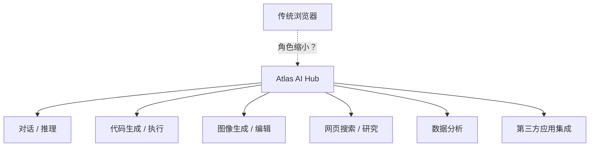
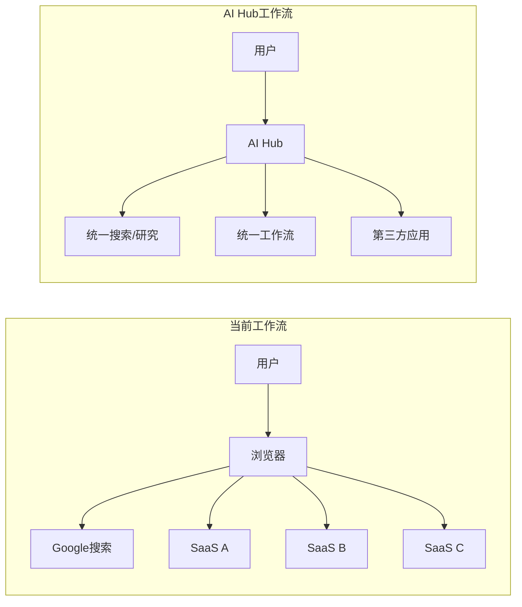

## 概述

OpenAI正在开发代号为<strong>Atlas</strong>的统一AI应用中心的消息传出后，科技行业掀起了热烈讨论。包括Dan Shipper在内的AI分析师们关注的核心问题只有一个 — <strong>AI原生平台会从根本上改变Web浏览器的角色吗？</strong>

本文将分析Atlas的概念、AI应用中心出现的背景，以及浏览器可能面临的变革。

## Atlas是什么？

OpenAI的Atlas不仅仅是ChatGPT的扩展。其核心在于将此前分散的AI功能 — 对话、代码生成、图像生成、数据分析、网页搜索 — 整合到<strong>一个统一平台</strong>中。

核心特点如下：

- <strong>多模态集成</strong>：在单一界面处理文本、图像、代码和数据
- <strong>应用生态系统</strong>：超越GPTs和插件的正式应用商店形态
- <strong>上下文连续性</strong>：任务间保持上下文的统一工作流
- <strong>基于Agent</strong>：理解用户意图并自动调用合适的工具

## 为什么现在是AI应用中心的时代？

### 1. 浏览器的局限性正在显现

Web浏览器起源于1990年代设计的<strong>文档查看器</strong>。虽然通过标签页、书签、扩展程序不断进化，但根本范式并未改变。

| 方面 | 浏览器范式 | AI Hub范式 |
|------|-----------|-----------|
| 交互方式 | 输入URL → 渲染页面 | 表达意图 → 生成结果 |
| 探索方式 | 手动导航 | 自动信息收集与综合 |
| 应用集成 | 标签页间手动切换 | 统一工作流 |
| 数据利用 | 按站点隔离 | 跨应用上下文共享 |

### 2. AI Agent时代的到来

2025-2026年是AI Agent真正实用化的时期。Claude的Computer Use、OpenAI的Operator、Google的Mariner等展示了<strong>AI直接操控计算机</strong>的技术。

在这种环境下，用户打开浏览器自行搜索、在多个网站间切换的行为越来越显得低效。

### 3. 超级应用趋势的AI版本

在亚洲，微信、LINE、KakaoTalk等<strong>超级应用</strong>已经部分替代了浏览器的角色。Atlas可以被视为将这种超级应用模式以AI原生方式重新诠释。

## 浏览器真的会被降级吗？

直接给出结论：<strong>不会完全替代，但角色变化不可避免</strong>。

### 浏览器仍然强势的领域

- <strong>开放Web</strong>：无审查的自由信息访问
- <strong>基于标准的生态系统</strong>：HTML/CSS/JS通用标准
- <strong>开发者工具</strong>：Web开发和调试的核心工具
- <strong>隐私</strong>：对将所有数据托付给AI Hub的抵触

### AI Hub将侵蚀的领域

- <strong>信息搜索</strong>：Google搜索流量已因AI回答而下降
- <strong>内容消费</strong>：融合摘要、翻译、分析的新消费方式
- <strong>业务自动化</strong>：整合此前需要在多个SaaS间切换的工作
- <strong>应用发现</strong>：像应用商店一样发现和使用AI工具

## 对开发者的启示

### 1. 重新思考平台战略

如果你在构建基于Web的SaaS，需要制定应对AI Hub平台的战略。MCP（Model Context Protocol）等标准已经在确立为AI工具集成的接口。

### 2. AI原生UX设计

需要思考超越URL和页面的、<strong>基于意图和结果</strong>的UX。用户说"分析这些数据"，系统自动选择合适工具并呈现结果的体验将成为标准。

### 3. 数据可移植性

随着AI Hub间竞争加剧，用户数据和工作流的<strong>可移植性</strong>将成为重要的差异化因素。

## 竞争格局

Atlas不仅是OpenAI的战略。主要玩家的动向如下：

| 公司 | 产品/战略 | 特点 |
|------|-----------|------|
| OpenAI | Atlas | 基于ChatGPT的统一Hub |
| Google | Gemini + Workspace | 与现有生产力工具的深度集成 |
| Anthropic | Claude + MCP | 基于开放协议的工具集成 |
| Apple | Apple Intelligence | 设备原生AI集成 |
| Microsoft | Copilot | Windows + Office生态系统集成 |

## 结论

以OpenAI Atlas为代表的AI应用中心的出现，不是<strong>浏览器的终结</strong>，而是<strong>计算接口的进化</strong>。

正如智能手机没有取代PC却获得了主要计算设备的地位一样，AI Hub很可能在不完全替代浏览器的情况下成为<strong>日常数字工作的起点</strong>。

作为开发者，我们应该以两个视角看待这一变化：

1. <strong>机遇</strong>：在AI Hub生态系统中创建新应用和服务的机会
2. <strong>警惕</strong>：保护开放Web和标准的价值，避免被锁定在特定平台

浏览器不是被降级，而是<strong>角色被重新定义</strong>。

## 参考资料

- [Dan Shipper on X — OpenAI Atlas分析](https://x.com/danshipper/status/2021615258540879936)
- [OpenAI官方博客](https://openai.com/blog)
- [MCP（Model Context Protocol）规范](https://modelcontextprotocol.io)
