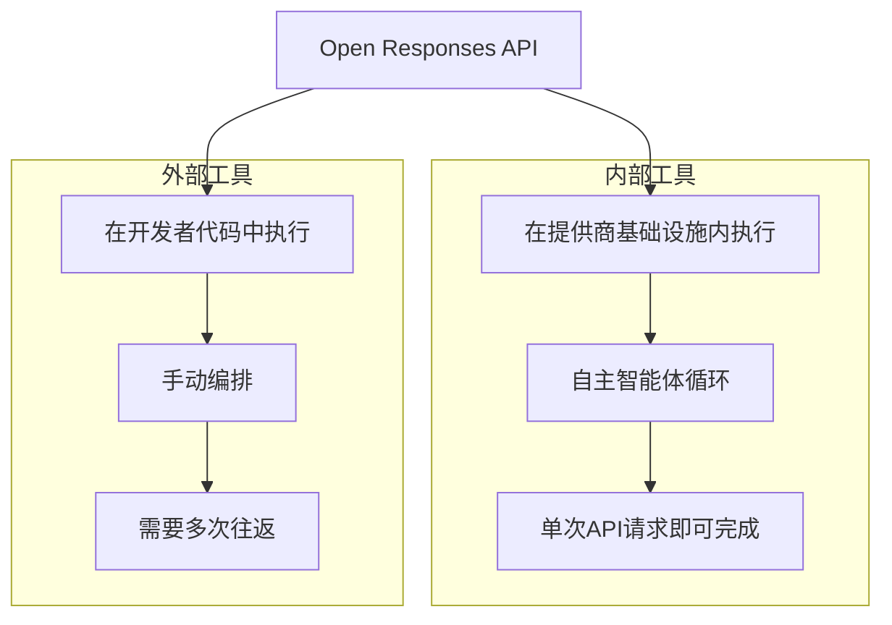
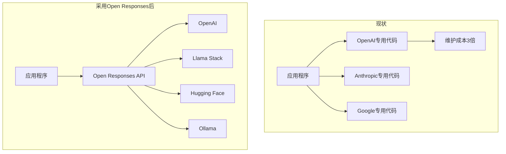

## 为什么智能体AI现在需要"标准"

截至2026年3月，智能体AI生态正在爆发式增长。Anthropic的Claude Agent SDK、OpenAI的AgentKit、Google的Agent Development Kit、LangChain、CrewAI等众多框架竞相涌现，虽然给开发团队带来了选择自由，但同时也造成了严重的碎片化问题。

由于每个框架的工具调用方式、响应格式、Agent循环处理方法各不相同，要更换模型或同时运行多个模型，往往需要从零开始重写集成代码。用一位开发者的话来说，这是一种<strong>"为wrapper再写wrapper"</strong>的恶性循环。

OpenAI于2026年2月发布的<strong>Open Responses</strong>规范正面应对了这一问题。作为一个供应商中立的开放规范，它旨在标准化智能体AI工作流，从根本上降低提供商之间的切换成本。

## Open Responses的三大核心概念

Open Responses规范定义了三个核心概念。

### 1. Items——智能体交互的原子单元

Items是表示模型输入、输出、工具调用和推理状态的原子单元。与Chat Completions API中`messages`数组仅表示文本交换不同，Items能够以类型安全的方式表示智能体工作流的所有阶段。

```typescript
// Items类型示例
type Item =
  | { type: "message"; role: "user" | "assistant"; content: string }
  | { type: "function_call"; name: string; arguments: string; call_id: string }
  | { type: "function_call_output"; call_id: string; output: string }
  | { type: "reasoning"; content: string };  // 公开推理过程
```

<strong>核心区别</strong>：新增了`function_call`、`function_call_output`、`reasoning`类型，使得智能体的工具使用和思维过程可以被结构化地追踪。

### 2. Reasoning Visibility——模型思维过程的可视化

Open Responses以提供商可控的方式公开模型的推理过程。此前，各提供商采用各自独有的方式（OpenAI的`reasoning_content`、Anthropic的`thinking`块等）来暴露推理过程，而Open Responses将其统一标准化为`reasoning` Item类型。

```json
{
  "type": "reasoning",
  "content": "用户请求了库存数据，因此我将首先调用inventory API，分析结果后提供摘要。",
  "provider_metadata": {
    "visibility": "full"
  }
}
```

这对于在生产环境中调试和审计智能体的决策过程至关重要。

### 3. Tool Execution Models——内部与外部工具执行

Open Responses将工具执行明确分为两种模型。



<strong>内部工具（Internal Tools）</strong>：在提供商基础设施内执行。模型自主地重复推理->工具调用->结果反馈->再推理的循环，最终结果以单次API响应返回。无需多次往返即可处理复杂的智能体工作流。

<strong>外部工具（External Tools）</strong>：在开发者的应用代码中执行。当模型请求工具调用时，由开发者端直接执行并将结果传回。适用于安全敏感的操作或无法委托给提供商的任务。

## 支持生态：已经开始行动

Open Responses最大的优势在于发布之初就获得了广泛的生态支持。

| 合作伙伴 | 类型 | 意义 |
|----------|------|------|
| Hugging Face | 开源Hub | 数千个模型的标准API访问 |
| OpenRouter | 模型路由 | 多提供商间的无缝切换 |
| Vercel | 前端平台 | 通过AI SDK集成实现前端开发标准化 |
| LM Studio | 本地推理 | 本地模型也可使用相同API |
| Ollama | 本地推理 | 自托管环境下的标准化 |
| vLLM | 推理引擎 | 与高性能推理服务器的兼容 |
| Red Hat / Llama Stack | 企业级 | 基于Llama模型的企业级智能体构建 |

<strong>值得关注</strong>：这份名单中包含了OpenAI的直接竞争对手（Hugging Face、Ollama、vLLM）。这是Open Responses并非OpenAI专属规范，而是真正面向行业标准的强烈信号。

## 实战实现模式

### 基本API调用

从现有Chat Completions迁移到Responses API的过程非常直观。

```python
# 现有方式：Chat Completions API
response = client.chat.completions.create(
    model="gpt-4o",
    messages=[
        {"role": "user", "content": "请分析库存状况"}
    ],
    tools=[inventory_tool],
)

# 新方式：Open Responses API
response = client.responses.create(
    model="gpt-4o",
    input="请分析库存状况",
    tools=[inventory_tool],
)
# response.output_text 包含最终结果（工具调用 + 分析完成后）
```

<strong>核心区别</strong>：在Chat Completions中，当工具调用发生时，开发者需要自行实现执行工具并将结果发回的循环；而Responses API对于内部工具会自动处理整个流程。

### 工具访问控制模式

Red Hat的Llama Stack实现所展示的工具访问控制模式在生产环境中尤其实用。

```python
# 按状态的工具访问控制
tool_config = {
    "skip_all_tools": False,        # 禁用所有工具
    "skip_mcp_servers_only": False,  # 仅禁用MCP服务器
    "allowed_tools": ["search", "calculator"],  # 仅允许特定工具
}

response = client.responses.create(
    model=model,
    input=messages,
    tools=tools_to_use,
    **tool_config,
)
```

### 安全：请求级别的Header隔离

```python
# 向MCP服务器传递用户级认证信息，
# 但不向智能体本身暴露用户信息
mcp_config = {
    "server_url": "https://api.internal/mcp",
    "headers": {
        "AUTHORITATIVE_USER_ID": current_user.id,
        "Authorization": f"Bearer {user_token}",
    }
}
```

该模式确保即使智能体出现异常行为，也无法访问其他用户的数据。

## EM/CTO视角：为什么这很重要

### 1. 摆脱供应商锁定——多模型策略的现实化

目前许多工程团队都面临着"从GPT-4o开始，想切换到Claude，却不得不全部重写集成代码"的问题。Open Responses从根本上解决了这一问题。



<strong>成本节约效果</strong>：将各提供商的集成代码统一为单一标准接口后，集成层的维护成本可降低60〜80%。

### 2. 渐进式迁移策略

Open Responses的引入无需大爆炸式转换，支持渐进式迁移。

<strong>Phase 1（1〜2周）</strong>：仅对新功能应用Responses API
- 现有Chat Completions代码保持不变
- 仅新的智能体功能使用Responses API开发

<strong>Phase 2（1〜2个月）</strong>：核心工作流转换
- 从工具调用频繁的工作流开始依次转换
- 性能基准对比（往返次数、响应时间）

<strong>Phase 3（季度）</strong>：启用多提供商
- 通过OpenRouter或自建代理实现提供商自动切换逻辑
- 基于成本、性能、可用性的动态路由

### 3. 可观测性与治理

Reasoning Visibility不仅仅是调试工具，更是<strong>AI治理的核心基础设施</strong>。

- <strong>审计追踪</strong>：结构化记录智能体为何做出特定决策
- <strong>合规性</strong>：在金融、医疗等监管行业中确保AI决策过程的透明性
- <strong>质量保证</strong>：通过分析推理过程，定量评估智能体的判断质量

## Chat Completions vs Responses API对比

| 对比项 | Chat Completions | Responses API |
|--------|------------------|---------------|
| 工具调用处理 | 开发者实现循环 | 内部工具自动处理 |
| 推理可视性 | 各提供商不同 | 标准化`reasoning`类型 |
| 多模态 | 需要单独配置 | 原生支持 |
| 流式传输 | 基于文本 | 基于事件的流式传输 |
| 提供商切换 | 需要重写代码 | 仅需更改端点 |
| 智能体循环 | 手动实现 | 框架内置 |

<strong>OpenAI官方立场</strong>：Chat Completions API将继续支持，但建议所有新项目使用Responses API。

## 待解决的问题与现实考量

### Anthropic和Google呢？

目前Anthropic和Google尚未作为官方合作伙伴参与Open Responses规范。由于这两家公司各自拥有智能体框架（Claude Agent SDK、Google ADK），它们是接受Open Responses还是推行独立标准，目前仍不确定。

不过，正如OpenAI和Anthropic超过30名员工近期在国防部诉讼中共同合作所显示的，AI行业的合作关系与竞争关系是共存的。随着行业对标准化的需求日益增长，它们加入的可能性是充分存在的。

### 生产就绪程度

Open Responses仍处于早期阶段。规范文档、Schema和合规性测试工具已在[openresponses.org](https://openresponses.org)上公开，但大规模生产环境中的验证案例仍然有限。对于早期采用者团队来说，先在新项目中应用并验证稳定性是比较现实的做法。

## 结论：工程领导者的行动清单

Open Responses规范的出现表明，智能体AI生态正从"框架混战期"向"标准化期"转型。这就像HTTP统一了Web一样，是为智能体AI工作流提供通用语言的尝试。

作为工程领导者，现在应该做的是：

1. <strong>审阅规范</strong>：在[openresponses.org](https://openresponses.org)查看规范文档，评估与团队当前智能体工作流的兼容性
2. <strong>试点项目</strong>：用Responses API实现一个新的智能体功能，与现有基于Chat Completions的方案进行开发效率对比
3. <strong>制定多提供商策略</strong>：利用OpenRouter、Llama Stack等工具，评审最小化提供商切换成本的架构方案
4. <strong>提升团队能力</strong>：随着智能体AI开发从简单的API调用演进为工作流设计，投资提升团队的智能体设计能力

智能体AI的标准化才刚刚开始。越早跟上这一趋势的团队，将获得越大的竞争优势。

## 参考资料

- [Open Responses Specification — openresponses.org](https://openresponses.org)
- [InfoQ: Open Responses Specification Enables Unified Agentic LLM Workflows](https://www.infoq.com/news/2026/02/openai-open-responses/)
- [Red Hat: Automate AI agents with the Responses API in Llama Stack](https://developers.redhat.com/articles/2026/03/09/automate-ai-agents-responses-api-llama-stack)
- [OpenAI: Migrate to the Responses API](https://developers.openai.com/api/docs/guides/migrate-to-responses/)
- [OpenAI: New tools for building agents](https://openai.com/index/new-tools-for-building-agents/)
