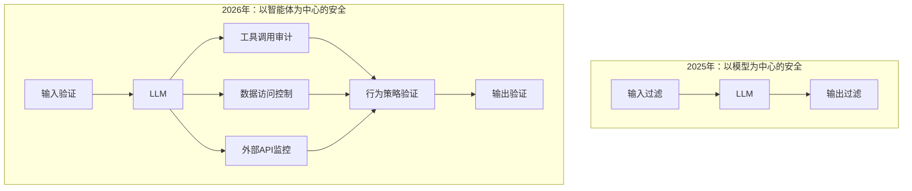
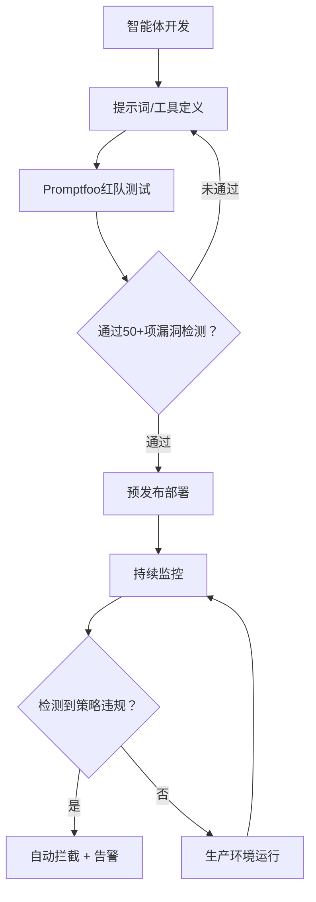
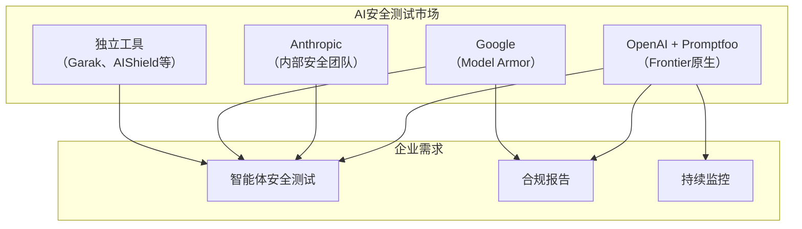

2026年3月9日，OpenAI宣布收购AI安全测试平台Promptfoo。这一拥有超过35万开发者社区、被Fortune 500中25%以上企业使用的开源工具，将正式集成到OpenAI的企业级平台Frontier。此次收购不仅仅是一次普通的企业并购，更标志着业界已形成共识：<strong>"AI智能体的安全流水线是不可或缺的基础设施"</strong>。

## Promptfoo是什么

Promptfoo是由Ian Webster和Michael D'Angelo于2024年创立的AI安全平台。最初作为一款简单的提示词评估工具起步，如今已演进为覆盖整个AI系统的综合安全框架，具备红队测试（Red Team Testing）和漏洞扫描能力。

### 核心功能

```yaml
# Promptfoo的主要功能领域
Red Teaming:
  - 自动测试50+种漏洞类型
  - 动态攻击生成（基于ML，而非静态越狱尝试）
  - 基于业务逻辑理解的定制化测试

Vulnerability Scanning:
  - 提示注入（Prompt Injection）
  - 护栏绕过（Guardrail Bypass）
  - 数据泄露
  - SSRF攻击
  - 敏感信息暴露
  - BOLA漏洞

Enterprise:
  - CI/CD流水线集成
  - SSO / 审计日志
  - 生产环境持续监控
  - 本地化部署支持
  - NIST AI风险管理框架支持
```

值得特别关注的是Promptfoo的红队测试方法。它并非简单地循环使用已有的静态越狱（jailbreak）列表，而是<strong>由经过最新ML技术训练的智能体，针对目标应用生成量身定制的动态攻击</strong>，能够更精准地模拟真实攻击者的行为。

## 这次收购为何意义重大

### 1. AI智能体安全的范式转变

2025年之前，AI安全大多聚焦于"模型安全性"——通过RLHF对齐模型、添加输出过滤器、设置护栏。然而，2026年的AI智能体已经可以<strong>调用工具、访问数据、与外部系统交互</strong>，攻击面已发生根本性变化。



### 2. Fortune 500中25%的企业已在使用

之所以不能将Promptfoo简单看作一次初创公司收购，是因为<strong>Fortune 500中已有25%（约127家企业）</strong>在AI开发生命周期中使用了这一工具。这是OpenAI巩固企业市场地位的战略性举措。

### 3. 与Frontier平台的深度整合

OpenAI的企业级平台Frontier为企业构建和运营AI协作者（coworker）提供基础支撑。当Promptfoo的安全测试能力原生集成到Frontier后：

- <strong>开发 → 安全测试 → 部署</strong>在同一流水线中一站式完成
- 智能体上线前自动执行红队测试
- 生产环境持续安全监控
- 实时检测违反策略的行为

## AI智能体DevSecOps流水线

以此次收购为契机，AI智能体开发领域正在建立起与传统软件DevSecOps类似的完整流水线体系。



### 与传统DevSecOps的对比

| 领域 | 传统DevSecOps | AI智能体DevSecOps |
|------|-------------|-------------------|
| 代码扫描 | SAST/DAST | 提示注入扫描 |
| 漏洞测试 | 渗透测试 | AI红队测试 |
| 访问控制 | RBAC/ABAC | 工具调用权限策略 |
| 持续监控 | WAF/IDS | 行为策略监控 |
| 合规 | SOC2/ISO27001 | NIST AI RMF |
| 事件响应 | SIEM告警 | 智能体自动拦截 |

## EM/CTO现在需要准备什么

### 1. 将AI安全测试纳入CI/CD

Promptfoo已支持CI/CD集成。正在部署AI智能体的团队可以立即上手。

```yaml
# .github/workflows/ai-security-test.yml
name: AI Agent Security Test
on:
  pull_request:
    paths:
      - 'agents/**'
      - 'prompts/**'

jobs:
  security-test:
    runs-on: ubuntu-latest
    steps:
      - uses: actions/checkout@v4

      - name: Install Promptfoo
        run: npm install -g promptfoo

      - name: Run Red Team Tests
        run: |
          promptfoo redteam run \
            --config agents/config.yaml \
            --output results/security-report.json

      - name: Check Results
        run: |
          promptfoo redteam report \
            --input results/security-report.json \
            --fail-on-vulnerability
```

### 2. 将智能体行为策略文档化

需要明确定义智能体可以调用哪些工具、可以访问哪些数据、哪些行为是被禁止的。

```yaml
# agent-policy.yaml
agent: customer-support-bot
version: "1.0"

allowed_tools:
  - knowledge_base_search
  - ticket_create
  - ticket_update

forbidden_actions:
  - 向外部传输客户个人信息
  - 批准超过500美元的退款
  - 使用内部系统管理员权限

data_access:
  allowed:
    - customer_tickets
    - product_catalog
  denied:
    - employee_records
    - financial_reports

escalation_triggers:
  - 涉及法律纠纷的请求
  - 个人信息删除请求
  - 安全事件报告
```

### 3. 建立安全测试基准

基于NIST AI风险管理框架，结合团队实际情况制定安全测试基准。

| 测试类别 | 最低基准 | 推荐基准 |
|-------------|---------|---------|
| 提示注入 | 90%拦截率 | 99%拦截率 |
| 护栏绕过 | 95%拦截率 | 99.5%拦截率 |
| 数据泄露防护 | 100%拦截 | 100%拦截 |
| 工具滥用检测 | 85%检测率 | 95%检测率 |
| 策略违规检测 | 90%检测率 | 98%检测率 |

## 对开源生态的影响

OpenAI表示将继续维护Promptfoo的开源项目。目前，13万名月活跃用户和35万名开发者正在GPT、Claude、Gemini、Llama等多个AI提供商的场景下使用Promptfoo。

这具有两层含义：

1. <strong>安全测试的民主化</strong>：不只是大型企业，初创公司和个人开发者也能够对AI智能体进行安全测试
2. <strong>供应商中立性能否持续</strong>：在被OpenAI收购后，是否仍会继续支持Claude、Gemini等竞争模型，值得持续关注

OpenAI收购的开源项目的长期走向，确实值得密切观察。在维系社区信任的同时，为Frontier提供差异化企业级功能，如何在两者之间保持平衡，将是关键所在。

## 竞争格局分析



此次收购使OpenAI在智能体安全测试领域占据了最强势的市场地位。其他竞争者将如何应对，将成为2026年下半年AI安全市场最值得关注的焦点。

## 结论：智能体时代的必备基础设施

这次收购传递出一个清晰的信号：<strong>要将AI智能体部署到生产环境，安全测试不是可选项，而是必选项</strong>。

作为Engineering Manager或CTO，请从现在开始着手以下三件事：

1. <strong>摸清当前AI智能体的攻击面</strong>。梳理智能体调用了哪些工具、访问了哪些数据，建立完整的资产清单。
2. <strong>在团队中引入Promptfoo CLI</strong>。由于是开源工具，零成本即可启动。执行 `npx promptfoo@latest redteam init`，5分钟内即可运行第一次红队测试。
3. <strong>将智能体行为策略纳入代码管理</strong>。编写人类可读的YAML策略文件，并在CI/CD中自动化验证。

AI智能体的能力越强，安全运营所需的基础设施就越重要。Promptfoo的收购，正是这套基础设施成为行业标准的重要里程碑。

## 参考资料

- [OpenAI收购Promptfoo官方公告](https://openai.com/index/openai-to-acquire-promptfoo/)
- [TechCrunch: OpenAI acquires Promptfoo to secure its AI agents](https://techcrunch.com/2026/03/09/openai-acquires-promptfoo-to-secure-its-ai-agents/)
- [Promptfoo官方网站](https://www.promptfoo.dev/)
- [Promptfoo GitHub仓库](https://github.com/promptfoo/promptfoo)
- [NIST AI Risk Management Framework](https://www.nist.gov/artificial-intelligence/risk-management-framework)
