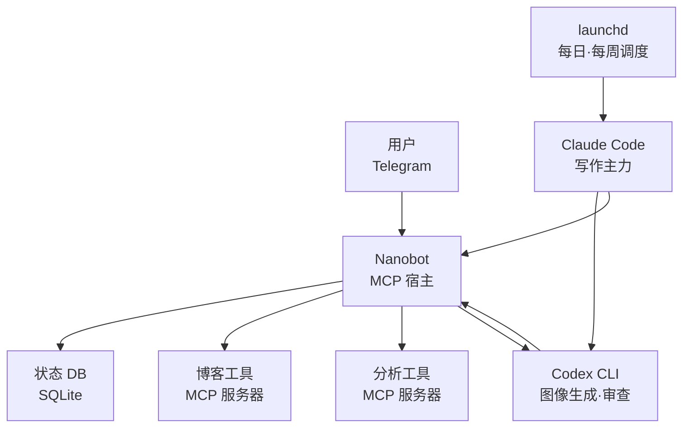

4月4日早上收到了Anthropic的邮件。通知说Claude Pro订阅不能再用在OpenClaw这类第三方工具上。准确说政策是"禁止把订阅签发的OAuth token用在外部工具里"，不过对OpenClaw用户来说基本是同一回事（[VentureBeat报道](https://venturebeat.com/technology/anthropic-cuts-off-the-ability-to-use-claude-subscriptions-with-openclaw-and)）。

二月份我还专门写过给OpenClaw用户的Codex迁移指南，看到这封邮件有点发愣。那篇文章的语气是"Claude/Gemini的条款都在动，先把Codex作为备份装上"，结果两个月后这个备份就成了主力。然后4月24日GPT-5.5发布（[OpenAI公告](https://openai.com/index/introducing-gpt-5-5/)），局面又抖了一次。

现在我的自动化栈长这样——Claude+launchd做主引擎，Codex负责重活（图像生成、代码审查），Nanobot+Telegram管状态和杂事。OpenClaw已经完全拔掉。这一个月里换了三轮，我想把学到的东西记一下。

## 第一次逃跑——先用launchd活下来

收到OAuth封锁通知后，我做的第一件事就是关掉OpenClaw。说是关掉，更头疼的其实是怎么把里面那些定时任务搬到别处。

我OpenClaw里塞了三个调度器——每日博客发布、每日收尾检查、周战略复盘。不是cron，是OpenClaw自己的调度器。工具用不了，调度也跟着死了。我手动跑了大概一周。太累了。

然后我搬到了macOS的launchd上。这个选择有两个理由——第一，没有额外的daemon。launchd比cron更接近OS原生。第二，我不想再被OpenClaw这种外部工具绑死一次。换过一次之后心有余悸，这次我挑了最薄的那一层。

```xml
<!-- ~/Library/LaunchAgents/net.jangwook.daily-post.plist -->
<plist version="1.0">
  <dict>
    <key>Label</key>
    <string>net.jangwook.daily-post</string>
    <key>ProgramArguments</key>
    <array>
      <string>/bin/zsh</string>
      <string>-lc</string>
      <string>cd /path/to/blog && claude code --command "/write-post-auto"</string>
    </array>
    <key>StartCalendarInterval</key>
    <dict>
      <key>Hour</key><integer>15</integer>
      <key>Minute</key><integer>23</integer>
    </dict>
  </dict>
</plist>
```

`launchctl load`注册一下，`launchctl list | grep jangwook`确认还活着。完事。一个小时之内我把OpenClaw的调度器全搬到launchd了。意外地稳。写到现在这一刻它还在跑——这是这次搬家里我唯一没动过的一层。

OpenClaw这种集成包工具的陷阱就在这里。多智能体、频道、调度器都装在一个壶里，刚开始确实方便。可一旦壶碎了，里面好端端的东西也跟着洒光。调度这件事用launchd就够了，既然够用，那一开始就该用launchd。我那时候才反应过来这个道理。

之前听说launchd比cron麻烦，所以一直拖着。真上手之后发现一个plist文件就解决了，没什么大不了。macOS重启后能自动恢复、系统日志也接得住，这两点都比cron强。唯一让我烦的是改完plist要敲两次`launchctl unload && load`。除此之外比OpenClaw的调度器好调试——至少日志写在哪里我心里有数。

## Channels本来是临时方案，结果这个临时方案拖太久

三月份Anthropic发布了Claude Code Channels。从Telegram发消息，本地终端的Claude会回复。刚好这个体验跟OpenClaw的Telegram频道几乎一样。我把它当成临时桥用——"如果没有OpenClaw也能从Telegram唤起Claude，那OAuth封锁的即时痛感就能减轻"，是这么算的。

实际上跑得挺好。在外面用Telegram发一句"今天的分析报告跑一下"，家里的Mac mini接到任务、处理完、把结果发回Telegram。这样用了将近一个月。和我之前在[Channels试用记](/zh/blog/zh/claude-code-channels-telegram-bridge)里写的差不多。

问题在于Channels是"消息-响应"模型。它没有状态。我问"昨晚开的backfill任务跑到哪了？"，Channels根本不知道这个backfill任务的存在。每次都是开一个新会话从零问起。OpenClaw能给每个频道维持上下文，Channels没这个能力。

这毛病累积一个月之后我开始爆。具体怎么爆——半夜两点想看backfill进度，发了Telegram，Channels回我"请问您说的是哪个backfill任务？"。第五次收到这种回复时我差点把笔记本扔出去。

"Telegram这个通道可以继续用，但后面必须有一层状态管理。"这个结论变得很清晰。没有状态的频道是给人聊天用的，不是自动化接口。这时候赶上GPT-5.5发布，我顺手单独签了Codex。

## 在Codex上重新装回OpenClaw的那30分钟

GPT-5.5在4月24日发布的时候（[OpenAI公告](https://openai.com/index/introducing-gpt-5-5/)），说实话我有点兴奋。我那篇OpenClaw迁移指南里写的"Codex作为备份"，眼看真的要成主力了。价格翻倍这件事（[apidog分析](https://apidog.com/blog/gpt-5-5-pricing/) 输入$5/M、输出$30/M）确实有点扎眼，但token效率提升把这部分抵消掉一些。

签完Codex单独的合约后，我做的第一件事——说起来有点不好意思——是把OpenClaw重新装回去。"反正Codex没有ToS问题，那把Codex插进OpenClaw，老的工作流不就能照旧跑吗？"30分钟后就后悔了。准确点说，OpenClaw本身装得很顺，Codex适配器接得也没问题。问题是接下来。

OpenClaw重不是因为模型依赖。它一次性扛着50多个集成、自带调度器、自带频道管理器、自带节点图——支撑这一整套的运行时永远在跑。我现在只是要调用Codex而已，把这个运行时全开起来太奢侈。在Mac mini上看着内存占用叹了口气，那天晚上全删了。

这不算OpenClaw的错，是我之前用OpenClaw的方式不对。OpenClaw是用来在一个地方[编排频道集成和多智能体路由](https://docs.openclaw.ai/concepts/multi-agent)的工具。我实际用到的也就"用Claude写文章+用Telegram拿结果"这点东西。95%的功能没用上，却扛着100%的重量。

请不要把这段理解成我在否定OpenClaw做得好。我依然认可[OpenClaw安装指南](/zh/blog/zh/openclaw-installation-tutorial)里写的那些优点——多模型、频道系统、节点图。只是这些优点在我手头的工作里用不上。

## 换到Nanobot之后

Nanobot是偶然撞见的。Obot AI做的[开源MCP宿主](https://github.com/nanobot-ai/nanobot)（[官方介绍](https://obot.ai/blog/introducing-nanobot-a-new-framework-for-turning-mcp-servers-into-ai-agents/)），用Go写的，alpha阶段，代码量很小。是真的小。照着README拉下来，基本上就是一个二进制文件加一份YAML。

配置文件大概长这样。

```yaml
# nanobot.yaml
agents:
  blog-ops:
    model: gpt-5.5
    instructions: |
      你是 jangwook.net 博客运维助手。
      接收来自 Telegram 的请求，调用合适的 MCP 工具。
    tools:
      - blog-publisher
      - analytics-reader
      - codex-handoff

mcpServers:
  blog-publisher:
    command: node
    args: [./scripts/mcp-blog-publisher.js]
  analytics-reader:
    command: python3
    args: [./scripts/mcp-ga.py]
  codex-handoff:
    command: bash
    args: [./scripts/codex-bridge.sh]
```

装完一小时之内就跟Telegram bot串起来了。准确说——Telegram来消息，Nanobot接到后路由到MCP工具调用（博客发布脚本、分析脚本之类），然后把结果丢回Telegram。和我在OpenClaw里做的事，结果上是一样的。区别在于重量。

Nanobot我喜欢的两点：

<strong>代码读得动</strong>，这是第一点。OpenClaw从某个时间点起就大到我跟不上了。哪里卡住了想追下去，得翻Discord或者搜GitHub Issue。Nanobot的main分支代码我30分钟之内就能扫一遍。把alpha工具放进生产环境时，这一点意外地是个安全网——"实在不行我自己打补丁"这个选项在不在，差别很大。

<strong>轻</strong>是第二点。在Mac mini上后台跑着也几乎不吃内存。可能因为是单一Go二进制吧。OpenClaw开着的时候风扇会响的活，到Nanobot这边就很安静。带着笔记本去咖啡馆也不用担心电量。

## Telegram是状态面板，Codex是干活的

把现在的结构画出来是这个样子。



居中把两个世界连起来的是Nanobot。一边是launchd跑的定时任务（Claude主力写文章，Codex接图像和审查），另一边是Telegram丢进来的临时请求。Nanobot两边都接，把状态写进SQLite，再把进度发回Telegram。

这里Telegram的角色变了。Channels时代它是"命令行"。丢命令、收答复。现在它是"状态面板"。昨晚开的发布任务跑到哪、下一个调度还有几小时、最后一次构建有没有成功，在Telegram上立刻能看到。命令其实基本不发——定时任务自己跑，我只看结果。

Codex的角色也清晰了。Claude写完文章，Codex接两件事——hero图生成和代码审查。GPT-5.5的token效率提升在这里能感受到。同样的审查任务，相比5.4那时候响应明显快一截。我没有精确的benchmark，这是我的主观感受。

价格这块得说一下。GPT-5.5是输入$5/M、输出$30/M，相比5.4整整翻了一倍。第一眼看到我有点恼火。结果跑一周看账单，跟5.4那时候差不多。OpenAI说"用更少的token拿到一样的结果"，这句不只是营销话。同一个代码审查任务，5.4平均要烧12k token的，5.5降到6到7k。价格涨2倍但token减半，实际账单差不多。说贵是真的贵了，但还没到爆掉的程度。

不过这是基于我的工作流。如果把Codex拿来当IDE里的代码自动补全用，token消耗会是另一种分布。代码审查是短输入短输出的活，token效率改进吃得很深。

## Nanobot的边界——老实说

读到这儿可能会觉得"Nanobot真好"，其实没那么简单。用了将近一个月，有两条边界变得很清楚。

<strong>第一，没有多智能体</strong>。Nanobot本质上是个MCP宿主——一个LLM调用一堆工具的结构。"多个agent互相对话分工合作"这种模式它做不到。OpenClaw用节点图把这件事处理得很到位。我90%的工作流是"一个agent加一堆工具"，Nanobot够用，剩下10%偶尔会觉得遗憾。

<strong>第二，几乎没有UI</strong>。localhost:8080上倒是有一个聊天UI，但别指望OpenClaw那种集成仪表盘。alpha阶段，没办法。Telegram其实就是我的仪表盘。这不算优点，是因为没别的选择。要是有人在边上说"让我看看你的状态"，我没什么界面可以给他看。

第三条边界稍微微妙——<strong>Nanobot还是alpha，随时可能崩</strong>。看GitHub的[release页面](https://github.com/nanobot-ai/nanobot/releases)就知道，更新很频繁。有一次我升了个0.x版本，MCP握手兼容性挂了，调试了一个小时。这是用alpha工具该接受的代价，不是Nanobot的错。

## 那OpenClaw完了吗——没有，只是不适合我

这篇文章的结论不是"Nanobot比OpenClaw好"。意思是工具的重量得跟工作的复杂度匹配。我的工作其实是Nanobot尺寸的，结果一直用着OpenClaw，意识到这点花了两个月。

OpenClaw合适的场景肯定有。我心里的标准是这样——agent之间需要互发消息的工作流，那些消息得是自由文本格式，而且不是一次性而是反复要跑的，这种情况下OpenClaw这种重量级编排器才是答案。节点图、频道、多智能体上下文——自己从头写真的是个大工程。

我没问的那个问题是——"我的工作流真的复杂到那种程度吗？"答案是"不"。Claude写文章、Codex画图，两边都把结果写进SQLite，Telegram显示给我看。没有agent之间的对话。也没有要发消息的场景。这种工作流上整个OpenClaw运行时是过剩的。

还有一点——Codex变好这件事在这个决定里占了不小比重。如果是GPT-5.4时代，"一个LLM配一堆工具"这种Nanobot结构会很弱。模型选错工具的频率太高。5.5在这块明显改善了。工具调用准确度上去之后，把任务拆给多个agent的理由就变少了。一个人聪明，开会的次数自然就少。这道理是一样的。

再坦白一点说——这一整轮搬家是从一封OAuth封锁邮件开始的。如果Anthropic没出这条政策，我现在还会被钉在OpenClaw上。"跑得好好的为什么要换？"这种惯性，基本上只能靠外力打破。这次冲击让我的自动化栈变得更轻、更清楚，这件事本身有点讽刺。Anthropic的目的是收回补贴，不是替我整理工作流，但结果上对我是有帮助的。

下个月我打算认真读一遍Nanobot的代码。MCP宿主怎么把工具调用结果再塞回上下文，状态管理是怎么处理的。正因为是alpha工具才更有意思——成熟之后就没什么可看的了。要是哪天我得自己提补丁，那本身就是另一篇文章的素材。
