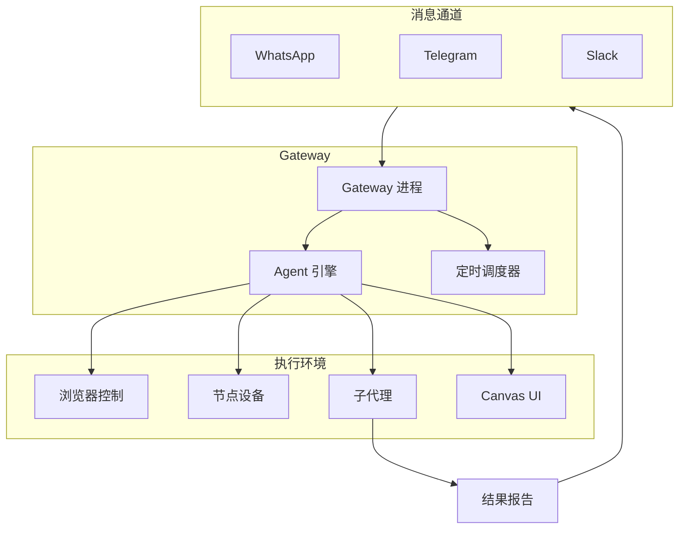
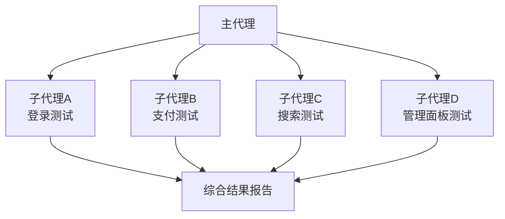
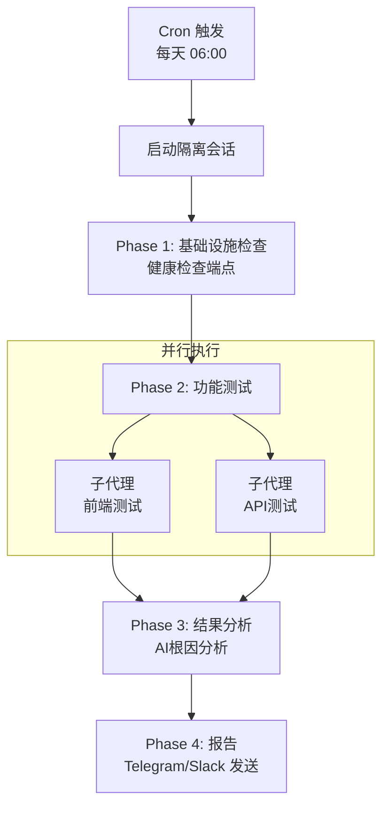

## 概述

Selenium、Cypress、Playwright 等传统E2E测试工具通过CSS选择器和命令式代码来编写测试。一旦UI发生变更，选择器就会失效，需要修改大量测试文件。

`<strong>`OpenClaw`</strong>`从根本上采用了不同的方式来解决这个问题。AI代理基于无障碍树（Accessibility Tree）理解网页，解释并执行以自然语言编写的测试场景。浏览器自动化、设备管理、定时调度、多代理编排均可在同一平台上统一运行。

本文将从E2E测试的角度分析OpenClaw的核心功能，并介绍如何实际构建测试自动化系统。

## 理解OpenClaw架构

OpenClaw采用`<strong>`以Gateway为中心的架构`</strong>`。Gateway是管理所有消息通道和WebSocket控制平面的单一长期运行进程。



从E2E测试的角度来看，各组件的作用如下：

| 组件                                | 作用                          | 测试中的用途           |
| ----------------------------------- | ----------------------------- | ---------------------- |
| `<strong>`Gateway`</strong>`    | 统一控制平面                  | 测试基础设施的中央枢纽 |
| `<strong>`Browser`</strong>`    | 基于Chromium的Web自动化       | Web应用功能·UI测试    |
| `<strong>`Nodes`</strong>`      | 设备控制（macOS/iOS/Android） | 跨平台测试             |
| `<strong>`Cron`</strong>`       | 调度引擎                      | 定期测试执行触发器     |
| `<strong>`Sub-agents`</strong>` | 并行代理执行                  | 测试套件并行化         |
| `<strong>`Canvas`</strong>`     | 可视化工作空间                | UI回归测试·结果仪表盘 |

## 浏览器自动化：基于无障碍树的测试

### 快照与Ref系统

OpenClaw浏览器自动化的核心是`<strong>`基于快照的交互`</strong>`。由于使用无障碍树而非CSS选择器，即使UI结构发生变化，也能找到语义上相同的元素。

```bash
# AI快照生成 — 为页面元素分配数字ref
openclaw browser snapshot

# 基于ref的交互
openclaw browser click 12          # 点击ref=12的元素
openclaw browser type 23 "hello"   # 在ref=23处输入文本

# 仅筛选可交互元素
openclaw browser snapshot --interactive
openclaw browser click e12         # 基于角色ref的点击
```

这种方法的优势在于`<strong>`自我修复（Self-healing）`</strong>`。即使按钮的类名从 `btn-primary` 变为 `button-main`，在无障碍树中具有"Submit"角色的按钮仍然能被准确识别。

### 登录流程测试示例

以自然语言向代理传递测试场景：

```bash
openclaw agent --message "请按以下顺序测试登录流程：
  1. 访问 https://myapp.com/login
  2. 在邮箱字段输入 test@example.com
  3. 在密码字段输入 password123
  4. 点击登录按钮
  5. 确认是否重定向到仪表盘URL
  6. 确认仪表盘上是否显示欢迎消息
  请附带截图报告结果。"
```

代理在内部执行以下工具调用：

```bash
browser open https://myapp.com/login
browser snapshot --interactive
browser type <email-ref> "test@example.com"
browser type <password-ref> "password123"
browser click <submit-ref>
browser wait --url "**/dashboard" --timeout-ms 10000
browser snapshot
# → AI分析快照确认仪表盘元素
```

### 状态管理与环境配置

在E2E测试中，环境配置是必不可少的。OpenClaw提供了丰富的状态管理API：

```bash
# 通过Cookie设置认证会话
openclaw browser cookies set session abc123 --url "https://myapp.com"

# 设备模拟
openclaw browser set device "iPhone 14"

# 网络状态测试
openclaw browser set offline on              # 离线模式
openclaw browser set headers --json '{"X-Debug":"1"}'  # 自定义请求头

# 本地化测试
openclaw browser set geo 37.7749 -122.4194   # 旧金山
openclaw browser set locale en-US
openclaw browser set timezone America/New_York
```

### 等待（Wait）功能

支持多种策略来等待异步UI变化：

```bash
# 复合条件等待
openclaw browser wait "#main" \
  --url "**/dashboard" \
  --load networkidle \
  --fn "window.ready===true" \
  --timeout-ms 15000
```

可以组合文本、URL模式（glob）、网络空闲状态、JavaScript条件和CSS选择器，构建精细的等待逻辑。

### 远程浏览器集成

在CI/CD环境中，可以连接Browserless等远程浏览器：

```json5
{
  browser: {
    enabled: true,
    defaultProfile: "browserless",
    profiles: {
      browserless: {
        cdpUrl: "https://production-sfo.browserless.io?token=<API_KEY>",
      },
    },
  },
}
```

## 节点（Nodes）：跨平台设备测试

### 节点类型与功能

节点是通过WebSocket连接到Gateway的伴侣设备。

| 节点类型                             | 支持功能                                              |
| ------------------------------------ | ----------------------------------------------------- |
| `<strong>`macOS应用`</strong>`   | Canvas、Camera、Screen Recording、System Run          |
| `<strong>`iOS应用`</strong>`     | Canvas、Camera、Location                              |
| `<strong>`Android应用`</strong>` | Canvas、Camera、Chat、Location、SMS、Screen Recording |
| `<strong>`Headless`</strong>`    | System Run、System Which                              |

### 多节点测试流水线

```bash
# 节点A（服务器）：启动测试环境
openclaw nodes run --node "Server" -- docker compose up -d

# 节点B（桌面）：执行浏览器测试
openclaw browser open https://server-node:3000
openclaw browser snapshot

# 节点C（移动端）：捕获真实设备UI
openclaw nodes camera snap --node "iPhone" --facing front

# 节点D（构建服务器）：执行单元测试
openclaw nodes run --node "Build Node" -- npm test
```

### 物理设备验证

利用摄像头功能，可以实现IoT设备LED状态检查或物理UI变化验证等工作：

```bash
# 通过摄像头捕获实物状态
openclaw nodes camera snap --node "IoT-Monitor" --facing back

# 通过屏幕录制记录UI流程
openclaw nodes screen record --node "Android-Test" --duration 10s --fps 10
```

## 定时任务（Cron）：定期测试调度

### 调度类型

| 类型      | 说明               | 示例                |
| --------- | ------------------ | ------------------- |
| `at`    | 一次性执行         | 部署5分钟后冒烟测试 |
| `every` | 固定间隔           | 每30分钟健康检查    |
| `cron`  | 5字段表达式 + 时区 | 每天07时全量测试    |

### 模式1：每日早间全量E2E测试

```bash
openclaw cron add \
  --name "Daily E2E Suite" \
  --cron "0 6 * * *" \
  --tz "Asia/Tokyo" \
  --session isolated \
  --message "请执行全量E2E测试：
    1. 访问 https://myapp.com 确认加载时间
    2. 验证登录流程
    3. 测试核心业务逻辑
    4. 确认API响应
    5. 附带截图进行结果摘要报告" \
  --model "anthropic/claude-sonnet-4-5" \
  --deliver \
  --channel telegram \
  --to "DevTeam"
```

关键在于 `--session isolated`。由于在隔离会话中执行，不会污染主代理的上下文。

### 模式2：部署后冒烟测试

```bash
openclaw cron add \
  --name "Post-Deploy Smoke" \
  --at "5m" \
  --session isolated \
  --message "部署后冒烟测试：
    1. 确认健康检查端点响应
    2. 确认主页面正常加载
    3. 确认是否可以登录" \
  --deliver \
  --channel slack \
  --to "channel:C_DEPLOYMENTS" \
  --delete-after-run
```

通过 `--delete-after-run` 标志，一次性执行后定时任务会自动删除。

### 模式3：每周深度分析

```bash
openclaw cron add \
  --name "Weekly Deep Test" \
  --cron "0 2 * * 0" \
  --tz "Asia/Tokyo" \
  --session isolated \
  --message "每周深度E2E测试：
    1. 验证完整用户流程
    2. 收集性能指标
    3. 无障碍检查
    4. 确认跨浏览器兼容性
    5. 分析与上周的变更差异" \
  --model "anthropic/claude-opus-4-5" \
  --thinking high \
  --deliver
```

深度分析使用 `claude-opus-4-5` 和 `--thinking high` 选项来进行更深层的推理。

### Cron vs 心跳

| 标准         | 心跳                 | Cron               |
| ------------ | -------------------- | ------------------ |
| 精确时间控制 | 一般（约30分钟间隔） | 精确（指定时间）   |
| 会话隔离     | 不支持（主会话）     | 支持（isolated）   |
| 模型覆盖     | 不支持               | 支持               |
| 成本效率     | 较高（批量处理）     | 一般（按任务计费） |

`<strong>`建议`</strong>`：定期E2E测试使用Cron（isolated），轻量级状态监控使用心跳。

## 利用子代理进行测试编排

### 并行测试执行

子代理是在后台独立运行的代理。可以同时执行多个测试，完成后自动报告结果。



并发控制配置：

```json5
{
  agents: {
    defaults: {
      subagents: {
        maxConcurrent: 8,  // 最大并发执行数
      },
    },
  },
}
```

### 分阶段验证流水线

实际场景中不仅需要简单的并行执行，还需要`<strong>`分阶段流水线`</strong>`：



### 多代理环境配置

可以为不同的代理指定不同的目标环境：

```json5
{
  agents: {
    list: [
      {
        id: "staging-tester",
        name: "Staging Tester",
        workspace: "~/.openclaw/workspace-staging",
        model: "anthropic/claude-sonnet-4-5",
      },
      {
        id: "prod-tester",
        name: "Production Tester",
        workspace: "~/.openclaw/workspace-prod",
        model: "anthropic/claude-opus-4-5",
      },
    ],
  },
  bindings: [
    { agentId: "staging-tester", match: { channel: "slack", peer: { kind: "channel", id: "C_STAGING" } } },
    { agentId: "prod-tester", match: { channel: "telegram" } },
  ],
}
```

## Canvas：UI验证与结果仪表盘

### 视觉回归测试

Canvas是内置于macOS应用中的代理可控可视化工作空间：

```bash
# 加载测试目标URL
openclaw nodes canvas present --node <id> --target https://myapp.com

# 捕获当前状态
openclaw nodes canvas snapshot --node <id> --format png --max-width 1200

# 通过JavaScript进行DOM验证
openclaw nodes canvas eval --node <id> --js "document.querySelectorAll('.error').length"
```

AI代理分析捕获的快照，验证布局变更、视觉元素缺失、颜色一致性等。

### 测试结果仪表盘

通过A2UI（Agent-to-UI）协议可以构建实时测试仪表盘：

```bash
cat > /tmp/test-dashboard.jsonl <<'EOF'
{"surfaceUpdate":{"surfaceId":"dashboard","components":[
  {"id":"root","component":{"Column":{"children":{"explicitList":["header","results"]}}}},
  {"id":"header","component":{"Text":{"text":{"literalString":"E2E Test Dashboard"},"usageHint":"h1"}}},
  {"id":"results","component":{"Text":{"text":{"literalString":"✅ 45 passed | ❌ 2 failed | ⏭ 3 skipped"},"usageHint":"body"}}}
]}}
{"beginRendering":{"surfaceId":"dashboard","root":"root"}}
EOF

openclaw nodes canvas a2ui push --jsonl /tmp/test-dashboard.jsonl --node <id>
```

还可以在Canvas中触发代理执行，直接从仪表盘重新运行测试。

## 实战应用模式

### SaaS产品每日状态验证

```bash
openclaw cron add \
  --name "SaaS Health Check" \
  --cron "0 7 * * *" \
  --tz "Asia/Tokyo" \
  --session isolated \
  --message "SaaS状态检查：
    1. 通过浏览器访问确认加载时间
    2. 使用测试账号登录
    3. 确认仪表盘核心组件加载
    4. 确认API健康检查响应
    5. 发现问题时立即报告，正常则简要总结
    请附带截图报告结果。" \
  --deliver \
  --channel telegram
```

### 跨设备测试

```bash
# 基于模拟的测试
openclaw browser set device "iPhone 14"
openclaw browser open https://myapp.com
openclaw browser screenshot --full-page

openclaw browser set device "iPad Pro"
openclaw browser open https://myapp.com
openclaw browser screenshot --full-page

# 真实iOS设备（节点）
openclaw nodes canvas present --node "iPhone" --target https://myapp.com
openclaw nodes canvas snapshot --node "iPhone" --format png
```

### 无障碍测试

```bash
# 无障碍树快照
openclaw browser snapshot --format aria

# 请求AI代理进行无障碍分析
openclaw agent --message "分析ARIA快照：
  1. 查找违反WCAG 2.1 AA标准的问题
  2. 确认是否支持键盘导航
  3. 确认屏幕阅读器兼容性
  4. 提出改进建议"
```

### 性能监控

```bash
openclaw cron add \
  --name "Performance Monitor" \
  --cron "*/15 * * * *" \
  --session isolated \
  --message "性能测量：
    1. 浏览器访问后测量加载时间
    2. 检查控制台错误
    3. 检查网络请求延迟
    4. 执行Core Web Vitals相关JS评估
    仅在发现问题时报告。" \
  --model "anthropic/claude-sonnet-4-5"
```

## 局限性与注意事项

### 技术局限

| 局限            | 说明                        | 替代方案           |
| --------------- | --------------------------- | ------------------ |
| 不支持CSS选择器 | 操作中无法直接使用CSS选择器 | 基于快照ref的方式  |
| ref不稳定       | 页面导航时ref会失效         | 操作前重新执行快照 |
| AI非确定性      | 相同测试可能产生不同结果    | 明确指定核心验证点 |
| 节点前台要求    | camera/canvas需要应用在前台 | 使用headless节点   |

### 成本优化

- 日常测试使用 `claude-sonnet-4-5`（低成本模型）
- 仅在深度分析时使用 `claude-opus-4-5`
- 通过心跳进行轻量检查的批量处理
- 子代理并行执行时合理设置 `maxConcurrent`

### 安全注意事项

- 浏览器配置文件可能包含登录会话，应作为敏感信息处理
- `evaluate` 函数在页面上下文中执行任意JS，需注意Prompt注入风险
- 远程CDP端点应通过隧道进行保护
- 合理设置exec工具的安全模式（`deny`/`allowlist`/`full`）

## 入门指南

```bash
# 1. 安装并配置Gateway
openclaw onboard --install-daemon

# 2. 启用浏览器
openclaw config set browser.enabled true

# 3. 注册第一个冒烟测试定时任务
openclaw cron add \
  --name "Smoke Test" \
  --cron "0 7 * * *" \
  --tz "Asia/Tokyo" \
  --session isolated \
  --message "访问 https://myapp.com 确认主页面是否正常加载。" \
  --deliver

# 4. 节点配对（需要设备测试时）
openclaw nodes status
openclaw devices approve <requestId>

# 5. 测试套件规模扩大后使用子代理并行化
# 6. 配置Telegram/Slack报告通道
```

## 总结

使用OpenClaw进行E2E测试的核心优势如下：

1. `<strong>`基于自然语言的测试定义`</strong>` -- 无需编写测试代码，直接用自然语言描述场景
2. `<strong>`自我修复`</strong>` -- 基于无障碍树，对UI变更具有强抗性
3. `<strong>`跨平台`</strong>` -- 在同一系统中测试Web、iOS、Android和服务器
4. `<strong>`智能报告`</strong>` -- AI分析结果并推理原因进行报告
5. `<strong>`灵活调度`</strong>` -- 通过Cron + 心跳支持多种测试周期

与其完全替代传统测试工具，OpenClaw更适合在`<strong>`冒烟测试、视觉回归测试、跨设备验证`</strong>`等场景中发挥优势。对于大规模重复测试或复杂业务逻辑验证，与现有工具互补使用更为合适。

## 参考资料

- [OpenClaw 官方文档](https://docs.openclaw.ai)
- [Browser Tool 文档](https://docs.openclaw.ai/tools/browser)
- [Nodes 文档](https://docs.openclaw.ai/nodes)
- [Cron Jobs 文档](https://docs.openclaw.ai/automation/cron-jobs)
- [Sub-Agents 文档](https://docs.openclaw.ai/tools/subagents)
- [Canvas (macOS)](https://docs.openclaw.ai/platforms/mac/canvas)
