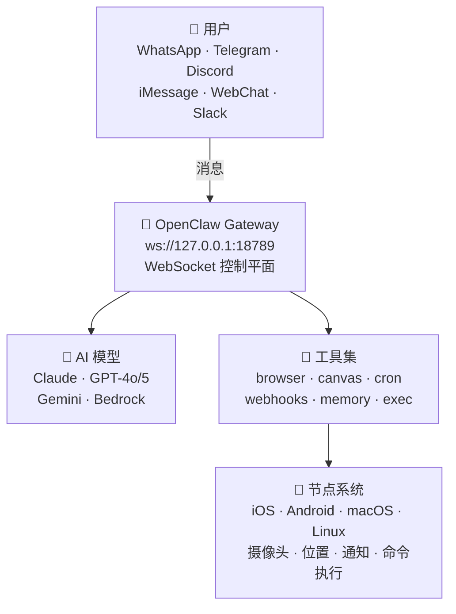

> 📚 <strong>系列：OpenClaw 完全攻略</strong>
> - <strong>第1篇：介绍篇（本文）</strong> — OpenClaw 是什么？为什么特别？
> - [第2篇：教程篇](/zh/blog/zh/openclaw-installation-tutorial/) — 从安装到第一次对话
> - [第3篇：实战篇](/zh/blog/zh/openclaw-practical-usage/) — 技能、自动化与高级工作流

---

## 🤖 AI 助手时代，为什么选择 OpenClaw？

ChatGPT、Claude、Gemini……如今几乎没有人没用过 AI 聊天机器人。但你是否曾经这样想过：

> "能不能直接在<strong>我的 Telegram</strong> 里用这个 AI？"  
> "如果 AI 能控制<strong>我手机的摄像头</strong>就好了……"  
> "数据存在别人的服务器上，总觉得不太放心……"  
> "能不能自由切换多个 AI 模型？"

正是为了解决这些痛点，一个项目应运而生。它就是 <strong>OpenClaw</strong> 🦞。

今天，我来详细介绍 OpenClaw 是什么、有什么特别之处，以及它适合哪些人！

---

## 🦞 OpenClaw 是什么？

<strong>OpenClaw</strong> 是一个开源的<strong>个人 AI 助手平台</strong>。

简单来说，它是一个可以将<strong>你自己的 AI 助手接入你已经在用的即时通讯工具</strong>（Telegram、WhatsApp、Discord 等）的系统。你可以自己挑选 AI 模型进行连接，添加各种工具和技能，构建专属工作流。

| 项目 | 内容 |
|---|---|
| <strong>许可证</strong> | MIT（完全自由使用） |
| <strong>GitHub</strong> | [github.com/openclaw/openclaw](https://github.com/openclaw/openclaw) |
| <strong>官方文档</strong> | [docs.openclaw.ai](https://docs.openclaw.ai) |
| <strong>创作者</strong> | Peter Steinberger([@steipete](https://twitter.com/steipete))、Mario Zechner（Pi 创作者） |
| <strong>技能市场</strong> | [ClawHub](https://clawhub.com) |
| <strong>社区</strong> | Discord — [discord.gg/clawd](https://discord.gg/clawd) |

因为采用 MIT 许可证，无论个人还是企业都可以自由使用和修改。社区也在活跃运营中，有问题的话欢迎加入 Discord！ 💬

### 浏览 GitHub 仓库

下图是 OpenClaw 的 GitHub 仓库主页。通过 README 可以了解项目的整体结构和快速入门指南。


---

## ✨ 主要特性

### 📱 多渠道 — 随时随地与 AI 对话

OpenClaw 最大的魅力之一就是<strong>渠道的多样性</strong>。

- <strong>WhatsApp</strong> — 通过 Baileys 实现 WhatsApp Web 协议对接
- <strong>Telegram</strong> — 基于 grammY 的 Bot API（私信 + 群组）
- <strong>Discord</strong> — 基于 discord.js 的 Bot API（私信 + 服务器频道）
- <strong>iMessage</strong> — macOS 的 imsg CLI 集成
- <strong>Mattermost</strong> — 通过插件实现 Bot 对接
- <strong>Slack、Signal、MS Teams</strong> — 额外插件支持
- <strong>WebChat</strong> — 通过浏览器直接访问的本地聊天 UI

无需安装额外应用，<strong>直接在你已经在用的通讯工具中</strong>使用 AI 助手。像在 Telegram 里发消息一样跟 AI 说话就行了。

### 💻 多平台

- <strong>macOS</strong> — 原生应用 + 菜单栏伴侣
- <strong>iOS</strong> — 节点应用配对 + Canvas 界面
- <strong>Android</strong> — 节点应用 Canvas + Chat + Camera
- <strong>Windows</strong> — 原生支持（也兼容 WSL2）
- <strong>Linux</strong> — 原生 + 服务器部署

几乎所有主流平台都支持。

### 🏗️ Gateway 架构

OpenClaw 的核心是 <strong>Gateway</strong>。它作为单一控制平面运行，通过 `ws://127.0.0.1:18789` 将所有渠道和工具连接在一起。

Gateway 的核心职责：
- <strong>渠道连接管理</strong> — 拥有所有通讯渠道的 WebSocket 连接
- <strong>代理桥接</strong> — 与 Pi 编码代理进行 RPC 通信
- <strong>工具路由</strong> — 中转浏览器、文件系统、定时任务等工具调用
- <strong>会话管理</strong> — 私信路由到共享的 `main` 会话，群组路由到隔离的会话
- <strong>Canvas 主机</strong> — 在 `http://<gateway>:18793` 为节点 WebView 提供 UI
- <strong>仪表板</strong> — 在 `http://127.0.0.1:18789/` 通过浏览器 Control UI 管理配置

### 🧠 多模型 AI 支持

- <strong>Anthropic Claude</strong>（Opus、Sonnet、Haiku）
- <strong>OpenAI</strong>（GPT-4o、GPT-5、o1 等）
- <strong>Google Gemini</strong>
- 通过 <strong>Amazon Bedrock</strong> 访问模型
- <strong>订阅认证</strong> — Claude Pro/Max、ChatGPT/Codex OAuth 集成

不被单一模型束缚，可以根据用途<strong>自由切换模型</strong>。定时任务用便宜的模型，重要分析用高性能模型——这种<strong>模型路由</strong>轻松实现。

### 🔧 强大的工具集

OpenClaw 的内置工具不只是简单的插件——它们是<strong>代理与真实世界交互的手段</strong>。

| 工具 | 说明 |
|---|---|
| 🌐 `browser` | AI 直接浏览和操作网页（含 Chrome 扩展中继） |
| 🎨 `canvas` | 代理控制的可视化工作区 — 在节点 WebView 中显示 UI |
| ⏰ `cron` | 从一次性提醒到定期任务的 Gateway 内置调度器 |
| 🔗 `webhooks` | 与外部服务（GitHub、Gmail 等）实时集成 |
| 🧠 `memory_search` | 用自然语言搜索过去的对话和存储的信息 |
| 💬 `message` | 跨渠道发送、编辑消息和添加反应 |
| 📱 `nodes` | iOS/Android/macOS 设备远程控制 |
| 🖥️ `exec` | Shell 命令执行（PTY 支持、安全审批系统） |
| 📝 `read`/`write`/`edit` | 直接操作文件系统 |
| 🔍 `web_search`/`web_fetch` | 网页搜索和页面内容提取 |
| 🎤 `tts` | 文本转语音 |

### 🛒 技能系统 & ClawHub

OpenClaw 拥有兼容 <strong>AgentSkills 格式</strong>的技能系统，可以从 <strong>ClawHub 市场</strong>安装其他用户创建的技能，或分享自己的技能。


技能从三个位置加载（按优先级排序）：
1. <strong>工作区技能</strong>（`<workspace>/skills/`） — 最高优先级
2. <strong>托管技能</strong>（`~/.openclaw/skills/`） — 所有代理共享
3. <strong>内置技能</strong> — OpenClaw 包中自带的默认技能

安装技能只需一行命令：
```bash
npx clawhub@latest install <技能名称>
```

### 📲 节点系统

将 iOS、Android、macOS 设备作为<strong>节点</strong>连接后，AI 就能与物理世界进行交互：

| 功能 | 说明 |
|---|---|
| 📷 相机快照 | 前置/后置摄像头拍照 |
| 🎬 相机录制 | 录制短视频 |
| 🖥️ 屏幕录制 | 捕获当前屏幕 |
| 🔔 推送通知 | 发送系统/悬浮/自动通知 |
| 📍 位置查询 | GPS 位置查询（粗略/平衡/精确） |
| 📱 短信 | 从 Android 节点发送短信 |
| ⌨️ 命令执行 | 在节点主机上执行 Shell 命令（需要 Exec 审批） |

节点通过 Gateway WebSocket 连接，必须经过<strong>配对审批</strong>才能激活。你的手机将成为 AI 的眼睛和耳朵！

### 🤖 多代理系统

OpenClaw 可以在一个 Gateway 上<strong>同时运行多个代理</strong>。

- <strong>独立工作区</strong> — 每个代理拥有自己独立的工作空间
- <strong>独立沙箱</strong> — 基于 Docker 的隔离执行环境
- <strong>工具限制</strong> — 可以对特定代理禁用 `exec`，只允许 `read`
- <strong>绑定规则</strong> — WhatsApp 群组 A → 工作代理，Telegram 私信 → 个人代理
- <strong>子代理</strong> — 主代理将后台任务委派给子代理

### 🎙️ 语音唤醒 + Talk Mode

无需键盘，<strong>用语音与 AI 对话</strong>。通过 macOS 应用的唤醒词功能呼叫 AI，然后在 Talk Mode 中自然交流。

---

## 🏛️ 架构全览



核心原则：
- <strong>本地回环优先</strong>：Gateway WS 默认只绑定 localhost
- <strong>一个 Gateway，一个主机</strong>：防止 WhatsApp Web 会话所有权冲突
- <strong>基于令牌的认证</strong>：非本地绑定时必须使用令牌
- <strong>Tailscale/VPN</strong>：远程访问推荐使用 SSH 隧道或 Tailnet

---

## 🆚 和其他 AI 助手有什么不同？

| 对比项目 | ChatGPT / Claude 应用 | <strong>OpenClaw</strong> |
|---|---|---|
| 托管方式 | 云端（第三方服务器） | <strong>自托管</strong>（你自己的电脑） |
| 数据隐私 | 存储在他们的服务器上 | <strong>仅存储在本地</strong> 🔒 |
| 使用渠道 | 仅限专用应用/网页 | <strong>Telegram、Discord 等现有通讯工具</strong> |
| AI 模型 | 仅限该公司的模型 | <strong>Claude、GPT、Gemini 自由选择</strong> |
| 可扩展性 | 有限（插件商店） | <strong>技能、Webhook、定时任务、MCP、自定义工具</strong> |
| 设备控制 | ❌ 不可以 | ✅ <strong>摄像头、屏幕、位置、命令执行</strong> |
| 自动化 | ❌ 不可以 | ✅ <strong>定时任务、心跳检测、Webhook</strong> |
| 多代理 | ❌ 不可以 | ✅ <strong>按代理路由、沙箱隔离</strong> |
| 开源 | ❌ | ✅ <strong>MIT 许可证</strong> |

核心区别一句话总结：

> <strong>"不是借用别人的服务，而是在自己的基础设施上、按自己的规则运行的 AI 助手。"</strong>

---

## 🎯 适合这些人！

- 🔐 <strong>注重隐私的用户</strong> — 所有数据仅保留在你的电脑上
- 🛠️ <strong>热爱自动化的开发者</strong> — 通过定时任务、Webhook、技能、MCP 无限扩展
- 📱 <strong>使用多个通讯工具的用户</strong> — 无论 Telegram 还是 Discord，随处都是同一个 AI 助手
- 🤓 <strong>想亲手探索 AI 技术的人</strong> — 开源项目，可以从代码层面理解
- 🏠 <strong>对智能家居感兴趣的人</strong> — 通过节点系统实现类 IoT 应用
- 👨‍💼 <strong>想在团队中引入 AI 的管理者</strong> — 多代理实现按角色分配 AI
- 🔧 <strong>想将 AI 集成到现有工作流的人</strong> — 轻松对接 Webhook、n8n、Make 等

反过来说，如果你只是"偶尔在 ChatGPT 网页上问问问题"就满足了，那可能不需要用到 OpenClaw。OpenClaw 是为<strong>"想将 AI 深度融入生活的人"</strong>打造的工具。

---

## 🌍 项目生态系统

OpenClaw 不是一个独立项目，而是由多个组件构成的<strong>生态系统</strong>：

| 组件 | 角色 |
|---|---|
| <strong>OpenClaw Gateway</strong> | 核心运行时 — 渠道、工具、代理管理 |
| <strong>Pi</strong> | 编码代理引擎 — 通过 RPC 模式与 Gateway 通信 |
| <strong>ClawHub</strong> | 技能注册表 — 搜索、安装、更新、分享 |
| <strong>OpenClaw.app</strong> | macOS 桌面应用 — 菜单栏 + 语音唤醒 |
| <strong>OpenClaw iOS</strong> | iPhone/iPad 节点应用 — Canvas + 摄像头 |
| <strong>OpenClaw Android</strong> | Android 节点应用 — Canvas + Chat + Camera |
| <strong>官方文档</strong> | docs.openclaw.ai — 综合指南 |

---

## 📢 下期预告

本文介绍了 OpenClaw 是什么以及它为什么特别。

在<strong>[第2篇：教程篇](/zh/blog/zh/openclaw-installation-tutorial/)</strong>中，我们将一步步<strong>安装和配置 OpenClaw</strong>！

- 安装 Node.js & Gateway 引导
- 连接并配对 Telegram 渠道
- 开始第一次 AI 对话
- 理解工作区文件结构

> 🦞 <strong>"百闻不如一Run"</strong> — 下一篇，让我们亲自动手吧！

---

*如果这篇文章对你有帮助，请分享出去！欢迎在 [Discord 社区](https://discord.gg/clawd) 提问。* 🙌
