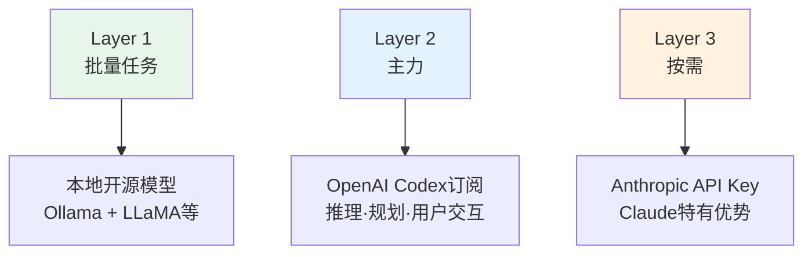

## 事件起因：Claude和Gemini的ToS变更

2026年初，Anthropic（Claude）和Google（Gemini）更新了服务条款。核心问题是：<strong>订阅计划（Pro/Max等）的OAuth认证能否用于第三方工具？</strong>

此前，许多OpenClaw用户通过OAuth连接Claude Pro或Gemini Advanced来运行Agent。ToS变更后，"还能继续这样用吗？"的疑虑迅速蔓延，社区开始寻找替代方案。

结论是：<strong>OpenAI的ChatGPT Plus/Pro订阅中包含的Codex OAuth明确允许第三方集成。</strong>本文整理了实际切换步骤和注意事项。

## 切换前需要确认的三件事

- <strong>Prompt兼容性</strong>：Claude和GPT-5.x-Codex对相同Prompt会给出不同响应。需要花几天时间调整`SOUL.md`和`AGENTS.md`
- <strong>各模型的优势差异</strong>：Codex在代码生成和工具调用（Tool Use）方面更强，而自然文笔方面Claude的评价更高
- <strong>API Key这个选项</strong>：想继续用Claude的话，可以选择API Key方式（`console.anthropic.com`），不受订阅OAuth的ToS限制。但Opus Agent循环每月容易超过$100

## 切换步骤（4步，约15分钟）

这是社区验证过的流程。

### 第1步：备份

首先备份整个OpenClaw配置。

```bash
cd ~
tar -czf openclaw-backup.tgz .openclaw
```

频道设置、记忆、定时任务、认证信息全都包含在内。

### 第2步：运行引导向导

```bash
openclaw onboard --auth-choice openai-codex
```

向导会提几个问题，按下表选择即可。

| 界面 | 选择 | 原因 |
|------|------|------|
| "This is risky" 警告 | <strong>直接继续</strong> | 只是告知Provider变更带来的行为差异 |
| Setup mode | <strong>Quickstart</strong> | 用默认值快速完成设置 |
| 现有值处理 | <strong>⚠️ 务必选 "Use existing values"</strong> | 选"Reset"会删除频道、记忆和定时任务配置 |

浏览器打开后，用ChatGPT账号登录并授权。

<strong>🔴 注意</strong>：授权完成后<strong>立即关闭终端的向导。</strong>在已有配置的情况下跑完向导，可能会覆盖现有设置。

### 第3步：更改默认模型

```bash
openclaw models set openai-codex/gpt-5.3-codex
```

### 第4步：验证

```bash
openclaw models status --plain
```

`primary`显示`openai-codex/gpt-5.3-codex`即为成功。

## 清除Anthropic认证（可选）

想彻底清理旧Provider的凭证：

```bash
# 删除fallback模型
openclaw models fallbacks clear

# 删除认证顺序
openclaw models auth order clear --provider anthropic

# 清理环境变量（~/.openclaw/.env）
# 删除 ANTHROPIC_API_KEY=... 这行

# 重启并验证
openclaw gateway restart
openclaw doctor
```

## 各Agent的模型设置 — 容易遗漏的关键点

迁移后最常见的错误出在这里。<strong>`openclaw models set`只更改全局默认值。</strong>如果某个Agent单独指定了模型，它仍然会使用旧模型。

检查`openclaw.json`中的`agents.list`：

```json
{
  "agents": {
    "defaults": {
      "model": {
        "primary": "openai-codex/gpt-5.3-codex"  // ← 全局（已更改）
      }
    },
    "list": [
      {
        "id": "branding",
        "model": {
          "primary": "anthropic/claude-opus-4-6"  // ← 仍是Claude
        }
      }
    ]
  }
}
```

修改方法有两种：

```bash
# 方法1：按定时任务单独指定
openclaw cron edit <cron-id> --model "openai-codex/gpt-5.3-codex"

# 方法2：删除Agent的model块 → 跟随全局默认值
```

全面切换的话，直接删除各Agent的`model`块最简单。

## 分层策略 — 社区推荐架构

与其押注单一Provider，不如按用途分配模型。这种<strong>分层策略</strong>正在社区中形成共识。



| Layer | 用途 | 模型 | 计费 |
|-------|------|------|------|
| <strong>Layer 1</strong> | 文件处理、探索性任务 | 本地开源（Ollama + LLaMA） | 免费（仅电费） |
| <strong>Layer 2</strong> | 推理、规划、用户交互 | OpenAI Codex订阅 | 月付 |
| <strong>Layer 3</strong> | 需要Claude优势时 | Anthropic API Key | 按Token计费 |

这样的架构下，Provider改变政策时<strong>只需修改配置文件的一行</strong>。

## 切换后的真实体验

来自已迁移用户的共同反馈：

- <strong>Prompt调优不可避免</strong>：`SOUL.md`、`AGENTS.md`需要几天的调整才能稳定
- <strong>代码和工具调用确实更强</strong>：代码生成和Tool Use有明显的体感差异
- <strong>自然写作有所不足</strong>：散文和社交帖子方面Claude更自然
- <strong>稳定性是优势</strong>：OAuth认证稳定，可以放心运行Agent循环

## 想继续使用Claude

API Key方式不受订阅OAuth的ToS限制。

```bash
openclaw onboard --auth-choice anthropic
```

在`console.anthropic.com`申请API Key，按Token计费。运行Opus Agent循环时月费容易超过$100，需要关注用量。

## 对比一览

| 方面 | Claude订阅OAuth | Codex订阅OAuth | Claude API Key |
|------|----------------|----------------|----------------|
| ToS风险 | ⚠️ 不确定 | ✅ 明确允许 | ✅ 合法 |
| 月费 | 订阅费 | 订阅费 | 按使用量 |
| 写作质量 | ⭐⭐⭐ | ⭐⭐ | ⭐⭐⭐ |
| 代码/工具 | ⭐⭐ | ⭐⭐⭐ | ⭐⭐ |
| 迁移难度 | — | 简单（15分钟） | 简单 |

最重要的是<strong>不要把自己锁死在某个Provider上</strong>。利用OpenClaw基于配置的架构，保持灵活切换的能力。

## 参考资料

- [OpenClaw官方文档 — Provider设置](https://docs.openclaw.ai/providers/openai)
- [OpenClaw Discord社区](https://discord.com/invite/clawd)
- [OpenAI Codex认证指南](https://docs.openclaw.ai/cli/index)
