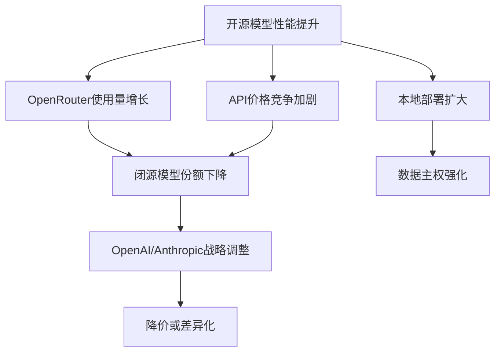

## 概述

AI模型路由平台<strong>OpenRouter</strong>的周使用量排行榜出现了惊人的变化。TOP5模型中<strong>有4个是开源模型</strong>。Qwen3-Coder、DeepSeek R2、MiniMax M2.5等占据了榜单上位，表明长期以来被视为理所当然的闭源模型优势正在瓦解。

本文基于OpenRouter排行数据，分析开源模型在实际使用量上超越闭源模型的结构性原因。

## OpenRouter周排行：发生了什么变化

### TOP5构成

根据Reddit的r/LocalLLaMA社区分享的数据，OpenRouter周使用量TOP5如下：

| 排名 | 模型 | 类型 | 特点 |
|------|------|------|------|
| 1 | Qwen3-Coder | 🟢 开源 | 阿里巴巴的编程特化模型 |
| 2 | DeepSeek R2 | 🟢 开源 | 推理特化大模型 |
| 3 | MiniMax M2.5 | 🟢 开源 | 高性价比通用模型 |
| 4 | GPT-4.1 | 🔵 闭源 | OpenAI旗舰模型 |
| 5 | Llama 4 Maverick | 🟢 开源 | Meta的开源大模型 |

5个中有4个是开源模型，这一事实具有超越数字本身的意义——因为这是<strong>开发者用真金白银做出的选择</strong>。

### OpenRouter为什么重要

OpenRouter是一个通过单一API访问各种AI模型的平台。用户自主选择模型，按实际token使用量付费。因此，该排行榜反映的是<strong>真实的使用偏好，而非营销或基准测试</strong>。

## 开源模型被选择的5个原因

### 1. 压倒性的成本优势

开源模型得益于API提供商之间的激烈竞争，同等性能的成本大幅降低。Qwen3-Coder以GPT-4.1约<strong>1/10的价格</strong>提供同等的编程性能。

```
成本对比（每1M token，估算）:
┌─────────────────┬──────────┬──────────┐
│ 模型            │ 输入     │ 输出     │
├─────────────────┼──────────┼──────────┤
│ GPT-4.1         │ $2.00    │ $8.00    │
│ Qwen3-Coder     │ $0.20    │ $0.60    │
│ DeepSeek R2     │ $0.30    │ $1.20    │
│ MiniMax M2.5    │ $0.15    │ $0.60    │
└─────────────────┴──────────┴──────────┘
```

### 2. 性能差距的消失

直到2024年，GPT-4还拥有压倒性的性能优势。但在2025-2026年间，开源模型的性能急速提升：

- <strong>Qwen3-Coder</strong>：编程基准测试中达到或超过GPT-4.1的性能
- <strong>DeepSeek R2</strong>：数学和推理方面顶尖性能，Chain-of-Thought推理能力突出
- <strong>MiniMax M2.5</strong>：通用任务中性价比最高

### 3. 透明性和可定制性

开源模型权重公开，支持：

- <strong>微调</strong>：针对特定领域的定制优化
- <strong>本地部署</strong>：确保数据隐私
- <strong>架构理解</strong>：验证模型工作原理
- <strong>自托管</strong>：构建无供应商锁定的基础设施

### 4. 中国AI企业的激进开源策略

阿里巴巴（Qwen）、DeepSeek、MiniMax等中国AI企业采取了将最佳模型开源的策略：

- <strong>生态系统抢占</strong>：获取开发者社区
- <strong>API盈利模式</strong>：通过开源吸引用户，通过云API变现
- <strong>全球影响力扩大</strong>：与西方闭源模型差异化竞争

### 5. 社区驱动的优化

开源模型发布后会被社区快速优化：

- <strong>量化</strong>：通过GGUF、GPTQ、AWQ等格式降低推理成本
- <strong>推理优化</strong>：应用vLLM、TensorRT-LLM等高性能推理引擎
- <strong>适配器共享</strong>：通过LoRA适配器实现领域特化

## 闭源模型剩余的优势

尽管开源模型强势崛起，闭源模型在某些领域仍保持优势：

- <strong>多模态集成</strong>：GPT-4o、Gemini等的视觉和语音集成能力
- <strong>企业支持</strong>：SLA、合规性、技术支持
- <strong>安全过滤</strong>：企业级安全防护
- <strong>前沿研究</strong>：新架构创新仍然从大型实验室开始

然而，这些优势也在被开源社区快速追赶。

## 行业影响



### 对开发者的启示

1. <strong>采用多模型策略</strong>：避免单一供应商锁定，利用OpenRouter等路由器
2. <strong>成本优化</strong>：按任务选择最优模型（编程 → Qwen3-Coder，推理 → DeepSeek R2）
3. <strong>考虑本地部署</strong>：处理敏感数据时自托管开源模型
4. <strong>参与社区</strong>：分享和利用量化、微调成果

## 结论

OpenRouter周排行榜中开源模型占据TOP5的4个席位，这不是一时的变化。它是由成本效率、性能差距消除、可定制性、中国企业激进策略、社区优化这5个结构性因素共同推动的<strong>范式转变</strong>。

闭源模型不会消失，但"最强性能=闭源模型"的等式已经被打破。未来的AI生态系统正在进入一个<strong>实用性和成本效率成为选择核心标准</strong>的时代。

## 参考资料

- [Reddit r/LocalLLaMA — 4 of the top 5 most used models on OpenRouter this week are Open Source](https://www.reddit.com/r/LocalLLaMA/comments/1r6g14s/4_of_the_top_5_most_used_models_on_openrouter/)
- [OpenRouter Rankings](https://openrouter.ai/rankings)
- [Qwen3-Coder 官方页面](https://huggingface.co/Qwen)
- [DeepSeek 官方网站](https://www.deepseek.com/)
