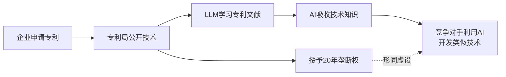
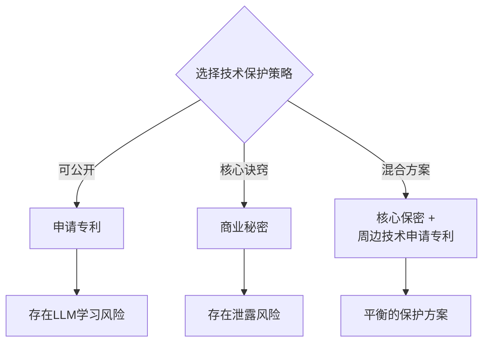

## 概述

Mark Cuban在X（原Twitter）上发表了一个发人深省的观点：<strong>"公开专利等于为LLM提供学习素材"</strong>。专利制度的本质是一种社会契约——以技术公开换取垄断权。然而，随着LLM大规模学习已公开的专利文献，这一根本前提正在动摇。

本文以Cuban的观点为出发点，分析LLM时代专利战略应如何变革。

## Mark Cuban的核心论点

Cuban的主张可以归纳如下：

1. <strong>专利是公开文件</strong>：向专利局申请后，技术内容将被详细公开
2. <strong>LLM学习公开数据</strong>：专利文献也包含在训练数据中
3. <strong>AI最终"掌握"了专利技术</strong>：虽然垄断权仍在，但技术知识本身已被AI吸收

这不仅仅是简单的专利侵权问题，而是意味着<strong>专利制度根本性的价值交换正在崩塌</strong>。

## 专利制度前提动摇的原因

### 传统专利的社会契约

专利制度在200多年来基于以下前提运作：

| 发明者方 | 社会方 |
|----------|--------|
| 详细公开技术 | 授予20年垄断权 |
| 以可实施的水平描述 | 专利期满后自由实施 |
| 为技术进步做贡献 | 为后续发明提供基础 |

### LLM如何改变游戏规则

在LLM时代，这一契约的平衡被严重打破：

- <strong>学习速度</strong>：人类工程师需要数年才能阅读的专利，AI只需数秒即可学习
- <strong>抽象化能力</strong>：提取专利的核心思想，以变形的方式加以利用
- <strong>规模问题</strong>：同时学习数百万件专利，发现技术之间的连接点
- <strong>法律灰色地带</strong>：基于AI学习知识的开发是否构成专利侵权尚不明确

### 正在发生的事实

这一问题已在多个领域成为现实：

1. <strong>代码生成AI</strong>：GitHub Copilot等生成与专利算法相似代码的案例
2. <strong>药物研发AI</strong>：学习了已公开医药专利的AI设计类似化合物的案例
3. <strong>硬件设计</strong>：学习了半导体专利的AI辅助电路设计的案例

## 企业的专利战略应如何变革

### 1. 商业秘密策略的复兴

以商业秘密代替专利进行保护的策略正在受到重新关注。

<strong>优势</strong>：
- LLM无法学习（因为未公开）
- 无期限限制（20年 vs 永久）
- 无需申请费用

<strong>劣势</strong>：
- 易受逆向工程攻击
- 无法对抗独立发明者
- 员工跳槽时存在泄露风险

### 2. 强化防御性专利策略

将专利作为<strong>防御手段</strong>而非攻击武器：

- <strong>专利池（Patent Pool）</strong>：全行业共享专利进行相互制衡
- <strong>防御性公开（Defensive Publication）</strong>：不申请专利，而是将技术作为先前技术公开，阻止竞争对手获取专利
- <strong>交叉许可</strong>：通过相互许可进行技术交换

### 3. AI时代的专利撰写方式

使专利文献本身不易被LLM充分学习的方法：

- <strong>分离核心诀窍</strong>：专利中仅记载最少信息，实施所需的详细诀窍以商业秘密保护
- <strong>调整抽象化水平</strong>：权利要求写得宽泛，说明书则策略性撰写
- <strong>多层保护策略</strong>：以多项专利与商业秘密的组合保护单一技术

### 4. 限制AI学习的法律应对

法律和政策层面的应对也不可或缺：

- <strong>限制AI学习专利数据的法案</strong>：部分国家正在讨论
- <strong>robots.txt式的专利保护</strong>：在专利数据库中添加学习限制元数据
- <strong>AI生成发明的可专利性讨论</strong>：AI创造的发明是否可以获得专利

## 各行业影响分析

| 行业 | 影响程度 | 主要风险 | 推荐策略 |
|------|----------|----------|----------|
| 制药/生物 | 非常高 | 化合物专利被用于AI药物研发 | 商业秘密 + 专利混合方案 |
| 半导体 | 高 | 电路设计专利被用于AI辅助设计 | 核心工艺商业秘密化 |
| 软件 | 中等 | 算法专利影响代码生成 | 开源 + 服务模式转型 |
| 机械/制造 | 中等 | 结构专利被用于CAD自动设计 | 维护制造诀窍的保密性 |

## 结论

Mark Cuban的观点不是简单的担忧，而是要求<strong>从根本上重新审视专利制度</strong>的问题提出。在LLM吸收一切公开知识的时代，"技术公开＝垄断权"这一延续200年的社会契约可能已无法发挥其原有功能。

企业应立即审视以下三点：

1. <strong>评估当前专利组合的LLM暴露程度</strong>
2. <strong>重新设计商业秘密与专利的最优组合</strong>
3. <strong>制定适应AI时代的知识产权战略路线图</strong>

专利战略的范式正在改变。只有快速适应的企业才能保持技术优势。

## 参考资料

- [Mark Cuban的X帖子](https://x.com/mcuban/status/2020857921928581592) — 关于专利公开与LLM学习的原文
- [WIPO — AI与知识产权](https://www.wipo.int/about-ip/en/artificial_intelligence/) — 世界知识产权组织的AI相关政策讨论
- [USPTO — AI相关专利指南](https://www.uspto.gov/initiatives/artificial-intelligence) — 美国专利商标局的AI发明相关指导
