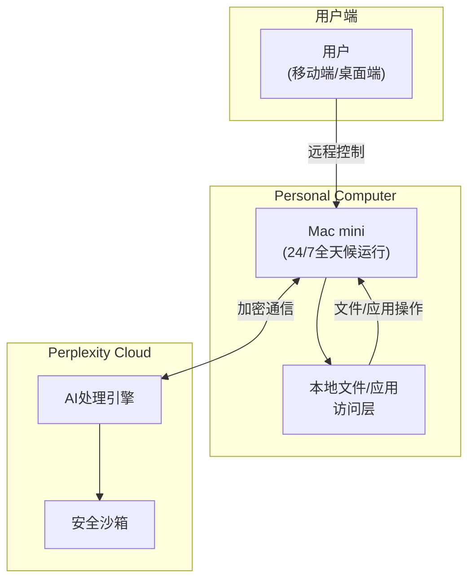
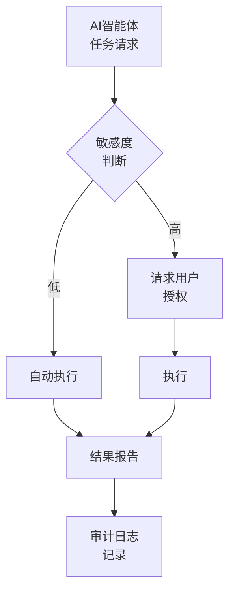

## "Everything is Computer"——AI即是计算机

2026年3月11日，Perplexity发布了<strong>"Everything is Computer"</strong>愿景，同时公开了三款产品：Computer、Personal Computer和Computer for Enterprise。此次发布的核心思想很简单——AI不再是"工具"，而是"代替你工作的计算机"。

本文将从EM（Engineering Manager）视角，分析Perplexity Computer对开发团队和组织将产生的影响。

## Perplexity Computer 产品线分析

### 1. Computer——云端AI智能体

基础产品Computer是在Perplexity云端运行的AI智能体，可代替用户执行网页浏览、代码运行、数据分析等任务。

### 2. Personal Computer——24/7全天候AI代理

<strong>最值得关注的产品</strong>是Personal Computer。它在专用Mac mini上始终保持运行，作为数字代理访问用户的文件和应用程序，24小时不间断处理工作。

核心特征：

- <strong>始终在线</strong>：在Mac mini上24/7运行，用户睡觉时也在持续工作
- <strong>本地访问</strong>：可直接访问Mac的文件系统和应用程序
- <strong>远程控制</strong>：支持从任何地点、任何设备进行控制
- <strong>安全模型</strong>：敏感操作需要用户授权，所有行为记录日志，内置紧急停止开关
- <strong>价格</strong>：月订阅费$200

### 3. Computer for Enterprise——组织级AI智能体

Enterprise版本为<strong>团队和组织</strong>量身设计。可直接对接Snowflake、Salesforce、HubSpot等企业软件，并支持在Slack私信或频道中进行协作。

<strong>核心成果</strong>：在针对16,000多条查询的内部测试中，以McKinsey、Harvard、MIT、BCG等机构使用的基准为标准，<strong>在4周内完成了3.25年的工作量</strong>，节省了约160万美元的人力成本。

安全基础设施：

- SOC 2 Type II认证
- SAML SSO
- 审计日志（Audit logs）
- 管理员控制
- 在隔离的云环境中执行任务

## 4周 = 3.25年，这组数据意味着什么

让我们拆解Perplexity的Enterprise测试结果。

| 项目 | 数据 |
|---|---|
| 处理查询数 | 16,000条+ |
| 等效工作时间 | 3.25年（约6,760小时） |
| 实际耗时 | 4周（约672小时） |
| 生产力倍数 | <strong>约10倍</strong> |
| 节省人力成本 | $1.6M（约1,160万元人民币） |

从EM视角来看，这组数据有两层含义。

<strong>第一，重复性分析工作的自动化</strong>。财务数据查询、市场分析、报告生成等工作可以交给AI智能体处理。团队成员从这些重复性工作中解放出来，可以专注于更高价值的决策。

<strong>第二，"AI人力"概念的出现</strong>。月费$200就相当于雇用了一名24小时工作的初级分析师。在10人团队中增加2个AI智能体，就有可能实现12人规模的产出——这样的计算已经成为可能。

## EM需要关注的3个要点

### 1. 治理模型——信任与控制的平衡

Perplexity Computer提出了一个有趣的治理模型。

核心在于<strong>分级权限（Graduated Authority）</strong>。低风险任务自动执行，敏感任务需要获得授权后才执行。所有行为均以日志形式记录，可通过紧急停止开关随时中断。

这一模式与Galileo的Agent Control（3月13日发布的AI智能体开源治理平台）所提出的原则一致。在企业级AI智能体运营中，<strong>集中式策略管理</strong>和<strong>运行时缓解</strong>正在成为行业标准。

### 2. "全天候AI"改变的工作模式

AI智能体24小时运行，意味着<strong>异步工作的极致化</strong>。

- <strong>AS-IS</strong>：工作 → 下班 → 第二天继续
- <strong>TO-BE</strong>：下达任务 → 下班 → AI通宵工作 → 上班时审查结果

当这种模式成为可能时，团队的处理量（throughput）将实现飞跃式增长。但EM也需要具备新的管理能力。

- <strong>任务分解能力</strong>：区分可以委托给AI的任务和必须由人类完成的任务
- <strong>结果审查能力</strong>：快速验证AI产出物质量的技能
- <strong>异步编排能力</strong>：管理[AI智能体的任务队列](/zh/blog/zh/ai-agent-framework-comparison-2026-langgraph-crewai-dapr-production)并调整优先级

### 3. 成本效益分析

| 比较项目 | 初级开发者 | Perplexity Personal Computer |
|---|---|---|
| 月成本 | $4,000〜$6,000 | $200 |
| 可用时间 | 8小时/天 | 24小时/天 |
| 工作范围 | 广泛 | 专注于分析/调研/自动化 |
| 判断力 | 高 | 有限（需要监督） |
| 成长潜力 | 无限 | 依赖模型更新 |

AI智能体并非<strong>替代</strong>初级开发者，而是用于团队<strong>增强（augmentation）</strong>的工具。与其让初级开发者做重复性工作，不如交给AI智能体处理，引导初级开发者去解决更高层次的问题——这才是正确的使用方式。

## 竞争格局与市场前景

Perplexity Computer并非孤军奋战。当前"全天候AI智能体"市场正在快速成型。

| 产品 | 特点 | 技术路径 |
|---|---|---|
| Perplexity Personal Computer | 基于Mac mini的24/7智能体 | 专用硬件 + 云端AI |
| OpenClaw | 开源AI助手（21万星标） | 在自有硬件上运行 |
| [Claude Managed Agents](/zh/blog/zh/claude-managed-agents-production-deployment-guide) | 基于MCP的工具联动智能体 | API + 协议标准化 |
| OpenAI Codex | 编程专用智能体 | 纯云端 |

Gartner预测，<strong>到2026年底，40%的企业应用将搭载AI智能体</strong>（从2025年不足5%急剧增长）。全天候AI智能体正处于这一趋势的最前沿。

## 落地注意事项

现在不必急于引入Perplexity Computer，但以下事项需要提前准备。

1. <strong>梳理可委托给AI的工作清单</strong>：列出团队中重复执行的调研、分析、报告生成等工作。
2. <strong>设计治理框架</strong>：定义AI智能体拥有何种级别的权限，哪些操作需要人工审批。
3. <strong>设计异步工作流</strong>：建立向[AI智能体](/zh/blog/zh/python-ai-agent-library-comparison-2026)委派任务并审查结果的流程。
4. <strong>审查安全策略</strong>：检查本地文件访问、云端数据传输、审计日志管理等方面的安全策略。

## 结论

Perplexity Computer的出现，标志着AI智能体从"对话工具"向"全天候任务执行者"进化的分水岭。月费$200的24小时数字代理，4周完成3.25年工作量的企业级智能体——这些数字已不再是科幻。

对EM和CTO而言，重要的不是技术本身，而是<strong>如何将这项技术融入团队</strong>的战略。设计治理模型、构建异步工作流、明确划分AI与人类的职责——做到这些的组织将占据先机。

## 参考资料

- [Perplexity: Everything is Computer](https://www.perplexity.ai/hub/blog/everything-is-computer)
- [Computer for Enterprise](https://www.perplexity.ai/hub/blog/computer-for-enterprise)
- [Perplexity Personal Computer — 9to5Mac](https://9to5mac.com/2026/03/11/perplexitys-personal-computer-is-a-cloud-based-ai-agent-running-on-mac-mini/)
- [Enterprise 3.25 Years in 4 Weeks — PYMNTS](https://www.pymnts.com/news/artificial-intelligence/2026/perplexity-computer-enterprise-completed-3-years-work-4-weeks/)
- [Gartner AI Agent Prediction](https://www.gartner.com/en/newsroom/press-releases/2025-08-26-gartner-predicts-40-percent-of-enterprise-apps-will-feature-task-specific-ai-agents-by-2026-up-from-less-than-5-percent-in-2025)
