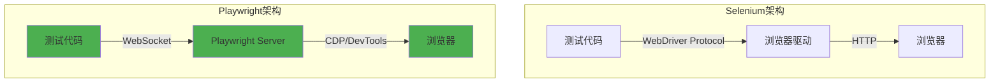

## 概述

在现代Web应用开发中，E2E（End-to-End）测试是不可或缺的要素。但测试代码编写耗时、维护困难，且难以重现复杂的用户场景。<strong>Playwright与AI技术的结合</strong>以创新方式解决了这些问题。

### 为什么选择Playwright + AI？

传统E2E测试的问题：

- <strong>耗费时间</strong>：需要手动编写所有测试用例
- <strong>维护负担</strong>：UI变更时需要修改全部测试代码
- <strong>需要专业知识</strong>：选择器编写、异步处理、等待时间调整等

<strong>Playwright + AI解决方案</strong>：

- ✅ <strong>AI Codegen</strong>：自动将浏览器操作转换为代码
- ✅ <strong>MCP集成</strong>：连接Claude与Playwright，用自然语言生成测试
- ✅ <strong>自动等待</strong>：通过Smart Auto-waiting实现稳定测试
- ✅ <strong>多浏览器支持</strong>：同时支持Chromium、Firefox、WebKit

本指南将构建从<strong>Playwright MCP</strong>、<strong>AI Codegen</strong>、<strong>GitHub Actions集成</strong>到<strong>视觉回归测试</strong>的完整自动化测试系统，可立即应用于实际工作。

---

## Playwright核心概念

### 1. 什么是Playwright？

由Microsoft开发的<strong>跨浏览器E2E测试框架</strong>。作为Puppeteer的后继者，提供更强大、更稳定的功能。

<strong>核心特性</strong>：

```typescript
// 多浏览器支持
import { chromium, firefox, webkit } from "playwright";

// Chromium (Chrome, Edge)
const browser1 = await chromium.launch();

// Firefox
const browser2 = await firefox.launch();

// WebKit (Safari)
const browser3 = await webkit.launch();
```

### 2. Auto-waiting机制

Playwright最强大的功能是<strong>自动等待（Auto-waiting）</strong>。无需手动编写`sleep()`或`waitFor()`。

```typescript
// ❌ 传统方式（Selenium）
await driver.sleep(5000); // 无条件等待5秒
const button = await driver.findElement(By.id("submit"));
await button.click();

// ✅ Playwright方式
await page.click("#submit"); // 自动等待元素准备就绪
```

<strong>自动等待条件</strong>：

- 元素存在于DOM中
- 元素在屏幕上可见
- 元素处于启用状态（非disabled）
- 元素未被其他元素遮挡

### 3. 强大的选择器引擎

Playwright提供多种选择器策略：

```typescript
// CSS选择器
await page.click("button.submit");

// 文本内容
await page.click("text=登录");

// ARIA角色（基于可访问性）
await page.click('role=button[name="提交"]');

// XPath
await page.click('xpath=//button[contains(text(), "确认")]');

// 可组合使用
await page.click('article:has-text("新闻") >> button');
```

### 4. 架构比较



<strong>Playwright的优势</strong>：

- <strong>基于WebSocket</strong>：比HTTP更快、更稳定
- <strong>CDP（Chrome DevTools Protocol）</strong>：直接访问浏览器内部API
- <strong>单一进程</strong>：无需驱动程序即可直接控制

---

## 基于AI的测试生成

### 1. Playwright Codegen

Playwright内置的<strong>代码生成器</strong>，自动将浏览器操作转换为TypeScript代码。

#### 基本用法

```bash
# 运行Codegen
npx playwright codegen https://example.com

# 指定特定浏览器
npx playwright codegen --browser=firefox https://example.com

# 移动设备模拟
npx playwright codegen --device="iPhone 13" https://example.com

# 深色模式
npx playwright codegen --color-scheme=dark https://example.com
```

#### Codegen实战：登录测试

1. <strong>启动Codegen</strong>：

```bash
npx playwright codegen https://github.com/login
```

2. <strong>在浏览器中操作</strong>：

   - 输入用户名
   - 输入密码
   - 点击"Sign in"按钮

3. <strong>自动生成的代码</strong>：

```typescript
import { test, expect } from "@playwright/test";

test("GitHub登录测试", async ({ page }) => {
  await page.goto("https://github.com/login");

  // Codegen自动生成的代码
  await page.getByLabel("Username or email address").fill("myusername");
  await page.getByLabel("Password").fill("mypassword");
  await page.getByRole("button", { name: "Sign in" }).click();

  // 确认登录成功
  await expect(page).toHaveURL(/.*github\.com$/);
});
```

### 2. Playwright MCP（Model Context Protocol）

<strong>连接Claude与Playwright</strong>，用自然语言生成测试的创新方法。

#### MCP安装与配置

```bash
# 1. 安装MCP服务器
npm install -g @automatalabs/mcp-server-playwright

# 2. 修改Claude配置文件（~/.claude/config.json）
{
  "mcpServers": {
    "playwright": {
      "command": "mcp-server-playwright"
    }
  }
}
```

#### MCP实战：用自然语言编写测试

<strong>自然语言命令</strong>：

```
"访问GitHub仓库页面并点击Star按钮的测试"
```

<strong>Claude生成的代码</strong>：

```typescript
import { test, expect } from "@playwright/test";

test("GitHub仓库Star测试", async ({ page }) => {
  // 1. 访问仓库页面
  await page.goto("https://github.com/microsoft/playwright");

  // 2. 查找并点击Star按钮
  const starButton = page.getByRole("button", { name: /star/i });
  await starButton.click();

  // 3. 确认Star成功
  await expect(starButton).toHaveAttribute("aria-pressed", "true");

  // 4. 确认Star数量增加
  const starCount = page.locator(".Counter");
  await expect(starCount).toBeVisible();
});
```

### 3. MCP高级功能

#### 基于快照的测试

```typescript
test("页面可访问性快照", async ({ page }) => {
  await page.goto("https://example.com");

  // 利用MCP的browser_snapshot功能
  const snapshot = await page.accessibility.snapshot();

  // 验证快照
  expect(snapshot).toMatchSnapshot("homepage-a11y.json");
});
```

#### 多页面操作

```typescript
test("在新标签页中操作", async ({ context }) => {
  // 第一个页面
  const page1 = await context.newPage();
  await page1.goto("https://example.com");

  // 点击链接打开新标签页
  const [page2] = await Promise.all([
    context.waitForEvent("page"),
    page1.click('a[target="_blank"]'),
  ]);

  // 在第二个页面中操作
  await page2.waitForLoadState();
  await expect(page2).toHaveTitle(/新页面/);
});
```

---

## 实战实现指南

### Step 1：项目初始化

```bash
# 1. 创建Playwright项目
npm init playwright@latest

# 配置选择
# ✓ 选择TypeScript
# ✓ 使用tests文件夹
# ✓ 添加GitHub Actions workflow
# ✓ 安装Playwright浏览器

# 2. 确认项目结构
playwright-demo/
├── tests/
│   └── example.spec.ts
├── playwright.config.ts
├── package.json
└── .github/
    └── workflows/
        └── playwright.yml
```

### Step 2：优化配置文件

```typescript
// playwright.config.ts
import { defineConfig, devices } from "@playwright/test";

export default defineConfig({
  // 测试文件位置
  testDir: "./tests",

  // 并行执行
  fullyParallel: true,

  // CI环境配置
  forbidOnly: !!process.env.CI,
  retries: process.env.CI ? 2 : 0,
  workers: process.env.CI ? 1 : undefined,

  // 报告器配置
  reporter: [
    ["html"], // HTML报告
    ["json", { outputFile: "test-results.json" }],
    ["junit", { outputFile: "junit.xml" }],
  ],

  // 全局配置
  use: {
    // 基础URL
    baseURL: "http://localhost:3000",

    // 追踪收集（失败时）
    trace: "on-first-retry",

    // 截图（失败时）
    screenshot: "only-on-failure",

    // 视频录制
    video: "retain-on-failure",
  },

  // 浏览器配置
  projects: [
    {
      name: "chromium",
      use: { ...devices["Desktop Chrome"] },
    },
    {
      name: "firefox",
      use: { ...devices["Desktop Firefox"] },
    },
    {
      name: "webkit",
      use: { ...devices["Desktop Safari"] },
    },
    // 移动端测试
    {
      name: "Mobile Chrome",
      use: { ...devices["Pixel 5"] },
    },
    {
      name: "Mobile Safari",
      use: { ...devices["iPhone 13"] },
    },
  ],

  // 自动运行开发服务器
  webServer: {
    command: "npm run dev",
    url: "http://localhost:3000",
    reuseExistingServer: !process.env.CI,
  },
});
```

### Step 3：编写第一个测试

```typescript
// tests/login.spec.ts
import { test, expect } from "@playwright/test";

test.describe("登录功能", () => {
  // 测试前执行
  test.beforeEach(async ({ page }) => {
    await page.goto("/login");
  });

  test("正常登录", async ({ page }) => {
    // 1. 填写登录表单
    await page.fill('[name="email"]', "user@example.com");
    await page.fill('[name="password"]', "SecurePassword123!");

    // 2. 点击登录按钮
    await page.click('button[type="submit"]');

    // 3. 确认重定向到仪表板
    await expect(page).toHaveURL("/dashboard");

    // 4. 确认欢迎消息
    await expect(page.locator("h1")).toContainText("欢迎");
  });

  test("错误密码", async ({ page }) => {
    await page.fill('[name="email"]', "user@example.com");
    await page.fill('[name="password"]', "WrongPassword");
    await page.click('button[type="submit"]');

    // 确认错误消息
    const errorMsg = page.locator('[role="alert"]');
    await expect(errorMsg).toBeVisible();
    await expect(errorMsg).toContainText("密码不正确");
  });

  test("邮箱格式验证", async ({ page }) => {
    await page.fill('[name="email"]', "invalid-email");
    await page.fill('[name="password"]', "password123");

    // Submit按钮应该被禁用
    await expect(page.locator('button[type="submit"]')).toBeDisabled();
  });
});
```

### Step 4：Page Object Model (POM)模式

```typescript
// pages/LoginPage.ts
import { Page, Locator } from "@playwright/test";

export class LoginPage {
  readonly page: Page;
  readonly emailInput: Locator;
  readonly passwordInput: Locator;
  readonly submitButton: Locator;
  readonly errorMessage: Locator;

  constructor(page: Page) {
    this.page = page;
    this.emailInput = page.locator('[name="email"]');
    this.passwordInput = page.locator('[name="password"]');
    this.submitButton = page.locator('button[type="submit"]');
    this.errorMessage = page.locator('[role="alert"]');
  }

  async goto() {
    await this.page.goto("/login");
  }

  async login(email: string, password: string) {
    await this.emailInput.fill(email);
    await this.passwordInput.fill(password);
    await this.submitButton.click();
  }

  async getErrorMessage() {
    return this.errorMessage.textContent();
  }
}

// 在测试中使用
test("POM模式登录测试", async ({ page }) => {
  const loginPage = new LoginPage(page);

  await loginPage.goto();
  await loginPage.login("user@example.com", "password123");

  await expect(page).toHaveURL("/dashboard");
});
```

### Step 5：API Mocking

```typescript
// tests/api-mocking.spec.ts
import { test, expect } from "@playwright/test";

test("API响应模拟", async ({ page }) => {
  // 拦截API请求
  await page.route("**/api/user", async (route) => {
    await route.fulfill({
      status: 200,
      contentType: "application/json",
      body: JSON.stringify({
        id: 1,
        name: "Test User",
        email: "test@example.com",
      }),
    });
  });

  await page.goto("/profile");

  // 确认模拟数据
  await expect(page.locator(".user-name")).toHaveText("Test User");
  await expect(page.locator(".user-email")).toHaveText("test@example.com");
});

test("网络错误模拟", async ({ page }) => {
  // 产生网络错误
  await page.route("**/api/data", (route) => route.abort("failed"));

  await page.goto("/data-page");

  // 确认错误状态
  await expect(page.locator(".error-message")).toBeVisible();
});
```

---

## 高级代码示例

### 1. 文件上传测试

```typescript
test("文件上传", async ({ page }) => {
  await page.goto("/upload");

  // 选择文件
  const fileInput = page.locator('input[type="file"]');
  await fileInput.setInputFiles("path/to/test-file.pdf");

  // 点击上传按钮
  await page.click('button:has-text("上传")');

  // 确认上传成功
  await expect(page.locator(".upload-success")).toBeVisible();

  // 多文件上传
  await fileInput.setInputFiles(["file1.pdf", "file2.jpg", "file3.png"]);
});
```

### 2. 拖放操作

```typescript
test("拖放", async ({ page }) => {
  await page.goto("/kanban-board");

  // 源和目标元素
  const task = page.locator(".task").first();
  const column = page.locator('.column[data-status="done"]');

  // 执行拖放
  await task.dragTo(column);

  // 确认移动
  await expect(column.locator(".task")).toHaveCount(1);
});
```

### 3. 无限滚动测试

```typescript
test("无限滚动加载", async ({ page }) => {
  await page.goto("/infinite-scroll");

  // 初始项目数
  let itemCount = await page.locator(".item").count();
  expect(itemCount).toBe(20);

  // 滚动加载更多
  for (let i = 0; i < 3; i++) {
    // 滚动到页面底部
    await page.evaluate(() => window.scrollTo(0, document.body.scrollHeight));

    // 等待新项目加载
    await page.waitForFunction(
      (prevCount) => document.querySelectorAll(".item").length > prevCount,
      itemCount
    );

    itemCount = await page.locator(".item").count();
  }

  // 总共加载80个项目
  expect(itemCount).toBe(80);
});
```

### 4. WebSocket测试

```typescript
test("实时聊天（WebSocket）", async ({ page }) => {
  await page.goto("/chat");

  // 等待WebSocket连接
  await page.waitForEvent("websocket");

  // 发送消息
  await page.fill("#message-input", "Hello WebSocket!");
  await page.click("#send-button");

  // 确认接收消息
  const lastMessage = page.locator(".message").last();
  await expect(lastMessage).toHaveText("Hello WebSocket!");

  // 监控WebSocket事件
  page.on("websocket", (ws) => {
    ws.on("framesent", (event) => console.log("Sent:", event.payload));
    ws.on("framereceived", (event) => console.log("Received:", event.payload));
  });
});
```

### 5. 认证状态重用

```typescript
// auth.setup.ts（只登录一次）
import { test as setup } from "@playwright/test";

const authFile = "playwright/.auth/user.json";

setup("认证", async ({ page }) => {
  await page.goto("/login");
  await page.fill('[name="email"]', "user@example.com");
  await page.fill('[name="password"]', "password123");
  await page.click('button[type="submit"]');

  // 保存Cookie
  await page.context().storageState({ path: authFile });
});

// playwright.config.ts
export default defineConfig({
  projects: [
    { name: "setup", testMatch: /.*\.setup\.ts/ },
    {
      name: "chromium",
      use: {
        ...devices["Desktop Chrome"],
        storageState: authFile, // 重用认证状态
      },
      dependencies: ["setup"],
    },
  ],
});

// 现在所有测试都以登录状态开始
test("访问仪表板", async ({ page }) => {
  await page.goto("/dashboard"); // 无需登录
  await expect(page).toHaveURL("/dashboard");
});
```

---

## GitHub Actions CI/CD集成

### 1. 基本工作流

```yaml
# .github/workflows/playwright.yml
name: Playwright Tests

on:
  push:
    branches: [main, develop]
  pull_request:
    branches: [main, develop]

jobs:
  test:
    timeout-minutes: 60
    runs-on: ubuntu-latest

    steps:
      - uses: actions/checkout@v4

      - uses: actions/setup-node@v4
        with:
          node-version: 20

      - name: 安装依赖
        run: npm ci

      - name: 安装Playwright浏览器
        run: npx playwright install --with-deps

      - name: 运行测试
        run: npx playwright test

      - name: 上传测试报告
        uses: actions/upload-artifact@v4
        if: always()
        with:
          name: playwright-report
          path: playwright-report/
          retention-days: 30
```

### 2. 多浏览器矩阵

```yaml
jobs:
  test:
    strategy:
      matrix:
        browser: [chromium, firefox, webkit]
        os: [ubuntu-latest, windows-latest, macos-latest]

    runs-on: ${{ matrix.os }}

    steps:
      - uses: actions/checkout@v4
      - uses: actions/setup-node@v4
        with:
          node-version: 20

      - run: npm ci
      - run: npx playwright install --with-deps ${{ matrix.browser }}
      - run: npx playwright test --project=${{ matrix.browser }}
```

### 3. 视觉回归测试集成

```yaml
jobs:
  visual-regression:
    runs-on: ubuntu-latest

    steps:
      - uses: actions/checkout@v4
      - uses: actions/setup-node@v4

      - run: npm ci
      - run: npx playwright install --with-deps

      # 截图比较
      - name: 视觉回归测试
        run: npx playwright test --update-snapshots
        if: github.event_name == 'push'

      # 差异报告
      - name: 上传快照差异
        uses: actions/upload-artifact@v4
        if: failure()
        with:
          name: snapshot-diff
          path: test-results/**/*-diff.png
```

### 4. Slack通知集成

```yaml
- name: Slack通知
  if: failure()
  uses: slackapi/slack-github-action@v1
  with:
    payload: |
      {
        "text": "❌ Playwright测试失败！",
        "blocks": [
          {
            "type": "section",
            "text": {
              "type": "mrkdwn",
              "text": "*Repository:* ${{ github.repository }}\n*Branch:* ${{ github.ref }}\n*Author:* ${{ github.actor }}"
            }
          },
          {
            "type": "actions",
            "elements": [
              {
                "type": "button",
                "text": {
                  "type": "plain_text",
                  "text": "View Logs"
                },
                "url": "${{ github.server_url }}/${{ github.repository }}/actions/runs/${{ github.run_id }}"
              }
            ]
          }
        ]
      }
  env:
    SLACK_WEBHOOK_URL: ${{ secrets.SLACK_WEBHOOK_URL }}
```

---

## 视觉回归测试

### 1. 截图比较

```typescript
// tests/visual.spec.ts
import { test, expect } from "@playwright/test";

test("首页视觉验证", async ({ page }) => {
  await page.goto("/");

  // 整页截图
  await expect(page).toHaveScreenshot("homepage.png");

  // 仅特定元素
  const header = page.locator("header");
  await expect(header).toHaveScreenshot("header.png");

  // 设置阈值（允许像素差异）
  await expect(page).toHaveScreenshot("homepage-flexible.png", {
    maxDiffPixels: 100,
  });
});
```

### 2. 响应式设计测试

```typescript
const viewports = [
  { width: 375, height: 667, name: "mobile" },
  { width: 768, height: 1024, name: "tablet" },
  { width: 1920, height: 1080, name: "desktop" },
];

for (const viewport of viewports) {
  test(`${viewport.name}视口测试`, async ({ page }) => {
    await page.setViewportSize(viewport);
    await page.goto("/");

    await expect(page).toHaveScreenshot(`${viewport.name}-homepage.png`);
  });
}
```

### 3. 深浅色模式比较

```typescript
test("浅色/深色模式比较", async ({ page }) => {
  await page.goto("/");

  // 浅色模式
  await expect(page).toHaveScreenshot("light-mode.png");

  // 切换到深色模式
  await page.emulateMedia({ colorScheme: "dark" });
  await expect(page).toHaveScreenshot("dark-mode.png");
});
```

### 4. 禁用动画

```typescript
test("无动画截图", async ({ page }) => {
  await page.goto("/");

  // 禁用CSS动画
  await page.addStyleTag({
    content: `
      *, *::before, *::after {
        animation-duration: 0s !important;
        transition-duration: 0s !important;
      }
    `,
  });

  await expect(page).toHaveScreenshot("no-animation.png");
});
```

---

## 最佳实践

### 1. 选择器编写原则

```typescript
// ❌ 不好的例子：脆弱的选择器
await page.click(".btn-primary.submit-form");
await page.click("div > div > button:nth-child(3)");

// ✅ 好的例子：有意义的选择器
await page.click('[data-testid="submit-button"]');
await page.getByRole("button", { name: "提交" });
await page.getByLabel("邮箱地址");

// 在HTML中添加test-id
<button data-testid="submit-button">提交</button>;
```

### 2. 等待策略

```typescript
// ❌ 硬编码等待（反模式）
await page.waitForTimeout(5000);

// ✅ 基于条件的等待
await page.waitForSelector(".loading-spinner", { state: "hidden" });
await page.waitForLoadState("networkidle");
await page.waitForResponse((resp) => resp.url().includes("/api/data"));

// ✅ 利用Auto-waiting
await page.click("button"); // 自动等待直到可点击
```

### 3. 测试隔离

```typescript
// ✅ 每个测试都有独立的上下文
test.describe("用户管理", () => {
  test.beforeEach(async ({ page }) => {
    // 每个测试前初始化
    await page.goto("/users");
  });

  test("添加用户", async ({ page }) => {
    // 独立的测试
  });

  test("删除用户", async ({ page }) => {
    // 不受前一个测试影响
  });
});
```

### 4. 错误处理

```typescript
test("网络错误处理", async ({ page }) => {
  // 捕获控制台错误
  const errors: string[] = [];
  page.on("console", (msg) => {
    if (msg.type() === "error") {
      errors.push(msg.text());
    }
  });

  await page.goto("/");

  // 确认无错误
  expect(errors).toHaveLength(0);
});

test("404页面处理", async ({ page }) => {
  const response = await page.goto("/non-existent-page");
  expect(response?.status()).toBe(404);

  await expect(page.locator("h1")).toHaveText("找不到页面");
});
```

### 5. 测试数据管理

```typescript
// fixtures/testData.ts
export const testUsers = {
  admin: {
    email: "admin@example.com",
    password: "AdminPass123!",
  },
  user: {
    email: "user@example.com",
    password: "UserPass123!",
  },
};

// 在测试中使用
import { testUsers } from "./fixtures/testData";

test("管理员登录", async ({ page }) => {
  await loginPage.login(testUsers.admin.email, testUsers.admin.password);
});
```

### 6. 并行执行优化

```typescript
// playwright.config.ts
export default defineConfig({
  // 根据CPU核心数自动调整
  workers: process.env.CI ? 2 : undefined,

  // 测试间完全隔离
  fullyParallel: true,

  // 失败时重试
  retries: 2,

  // 超时设置
  timeout: 30000,
  expect: {
    timeout: 5000,
  },
});
```

---

## 实际应用场景

### 1. 电子商务结账流程

```typescript
test("完整购买流程", async ({ page }) => {
  // 1. 搜索商品
  await page.goto("/");
  await page.fill('[name="search"]', "Laptop");
  await page.press('[name="search"]', "Enter");

  // 2. 选择商品
  await page.click('.product-card:has-text("MacBook Pro")');
  await expect(page).toHaveURL(/\/product\/\d+/);

  // 3. 加入购物车
  await page.click('button:has-text("加入购物车")');
  await expect(page.locator(".cart-badge")).toHaveText("1");

  // 4. 确认购物车
  await page.click('[aria-label="购物车"]');
  await expect(page.locator(".cart-item")).toHaveCount(1);

  // 5. 进行结账
  await page.click('button:has-text("结账")');

  // 6. 输入配送地址
  await page.fill('[name="address"]', "北京市朝阳区");
  await page.fill('[name="phone"]', "010-1234-5678");

  // 7. 选择支付方式
  await page.click('[value="credit-card"]');

  // 8. 完成订单
  await page.click('button:has-text("下单")');

  // 9. 确认完成页面
  await expect(page).toHaveURL("/order/success");
  await expect(page.locator("h1")).toContainText("订单已完成");
});
```

### 2. 表单验证测试

```typescript
test.describe("注册表单验证", () => {
  test("邮箱重复检查", async ({ page }) => {
    await page.goto("/signup");
    await page.fill('[name="email"]', "existing@example.com");

    // 实时验证
    await page.waitForResponse((resp) =>
      resp.url().includes("/api/check-email")
    );

    const errorMsg = page.locator(".email-error");
    await expect(errorMsg).toHaveText("该邮箱已被使用");
  });

  test("密码强度检查", async ({ page }) => {
    await page.goto("/signup");

    const passwordInput = page.locator('[name="password"]');
    const strengthIndicator = page.locator(".password-strength");

    // 弱密码
    await passwordInput.fill("123");
    await expect(strengthIndicator).toHaveClass(/weak/);

    // 强密码
    await passwordInput.fill("MySecure@Pass123");
    await expect(strengthIndicator).toHaveClass(/strong/);
  });
});
```

### 3. 性能监控

```typescript
test("页面加载性能", async ({ page }) => {
  // 使用Performance API
  await page.goto("/");

  const metrics = await page.evaluate(() => {
    const navigation = performance.getEntriesByType(
      "navigation"
    )[0] as PerformanceNavigationTiming;
    return {
      domContentLoaded:
        navigation.domContentLoadedEventEnd - navigation.fetchStart,
      loadComplete: navigation.loadEventEnd - navigation.fetchStart,
      firstPaint: performance.getEntriesByType("paint")[0]?.startTime,
    };
  });

  // 验证性能标准
  expect(metrics.domContentLoaded).toBeLessThan(2000); // 2秒内
  expect(metrics.loadComplete).toBeLessThan(5000); // 5秒内

  console.log("性能指标:", metrics);
});
```

---

## 注意事项与故障排除

### 1. 常见问题

#### 超时错误

```typescript
// ❌ 问题：超过默认30秒超时
test("慢速API测试", async ({ page }) => {
  await page.goto("/slow-page"); // TimeoutError!
});

// ✅ 解决：增加超时时间
test("慢速API测试", async ({ page }) => {
  test.setTimeout(60000); // 增加到60秒
  await page.goto("/slow-page", { timeout: 60000 });
});
```

#### 不稳定的测试

```typescript
// ❌ 不稳定的测试
test("不稳定测试", async ({ page }) => {
  await page.click("button"); // 有时失败
  await expect(page.locator(".result")).toBeVisible();
});

// ✅ 稳定的测试
test("稳定测试", async ({ page }) => {
  await page.click("button");
  // 等待网络请求
  await page.waitForResponse((resp) => resp.url().includes("/api"));
  await expect(page.locator(".result")).toBeVisible();
});
```

### 2. 调试技巧

```bash
# UI模式运行测试（可视化调试）
npx playwright test --ui

# 有头模式（显示浏览器）
npx playwright test --headed

# 只运行特定测试
npx playwright test login.spec.ts

# 调试模式
npx playwright test --debug

# 追踪查看器
npx playwright show-trace trace.zip
```

### 3. CI环境优化

```typescript
// playwright.config.ts
export default defineConfig({
  use: {
    // CI中始终收集追踪
    trace: process.env.CI ? "on" : "on-first-retry",

    // CI中禁用视频录制（节省磁盘空间）
    video: process.env.CI ? "retain-on-failure" : "on",

    // CI中使用更长的超时
    actionTimeout: process.env.CI ? 10000 : 5000,
  },
});
```

---

## 结论

<strong>Playwright + AI</strong>改变了E2E测试自动化的范式。总结本指南涵盖的内容：

### 核心要点

1. <strong>基于AI的代码生成</strong>：使用Codegen和MCP将测试代码编写时间减少80%
2. <strong>稳定的测试</strong>：通过Auto-waiting和智能选择器消除不稳定测试
3. <strong>CI/CD集成</strong>：使用GitHub Actions在每次提交时自动测试
4. <strong>视觉回归测试</strong>：通过截图比较预防UI错误
5. <strong>跨浏览器测试</strong>：同时测试Chromium、Firefox、WebKit

### 立即开始

```bash
# 1. 初始化项目
npm init playwright@latest

# 2. 运行第一个测试
npx playwright test

# 3. 查看HTML报告
npx playwright show-report

# 4. 用AI生成测试
npx playwright codegen https://your-app.com
```

### 下一步

- <strong>高级模式</strong>：自定义Fixtures、全局设置、测试分片
- <strong>性能测试</strong>：集成Lighthouse CI
- <strong>可访问性测试</strong>：集成axe-core
- <strong>移动测试</strong>：连接真实设备云

<strong>Playwright + AI</strong>不仅是测试工具，更是<strong>革新开发生产力的必备工具</strong>。现在就开始吧！

---

## 参考资料

### 官方文档

- [Playwright官方文档](https://playwright.dev/)
- [Playwright MCP GitHub](https://github.com/automatalabs/playwright-mcp)
- [Microsoft Playwright博客](https://devblogs.microsoft.com/playwright/)

### 教程与指南

- [Playwright测试最佳实践](https://playwright.dev/docs/best-practices)
- [视觉回归测试指南](https://playwright.dev/docs/test-snapshots)
- [GitHub Actions集成](https://playwright.dev/docs/ci)

### 社区与工具

- [Playwright Discord](https://discord.gg/playwright)
- [Awesome Playwright](https://github.com/mxschmitt/awesome-playwright)
- [Playwright Solutions](https://playwright.solutions/)

### 相关技术

- [Testing Library](https://testing-library.com/)
- [Cypress](https://www.cypress.io/)
- [Puppeteer](https://pptr.dev/)

---

<strong>编写日期</strong>：2025年10月25日
<strong>分类</strong>：E2E测试、自动化、TypeScript
<strong>难度</strong>：中级〜高级
