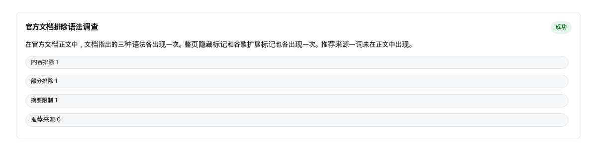
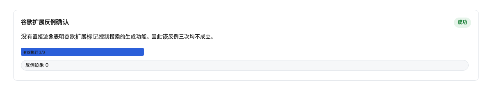
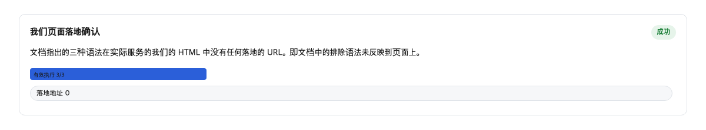

## 2026 年 8 月 20 日的发布和文档更新

这件事和你的网站有关。如果你的文章、商品页或公司官网会出现在谷歌的 AI 搜索回答里，你就需要一个办法控制它：想多出现，或者想少出现。这次发现的情况是——想多出现，谷歌修好了一条新路；想少出现，官方只留了一句旧说明。

2026 年 8 月 20 日，谷歌发布了一个叫 Preferred Source 的新功能。它的意思是：用户可以把自己喜欢的网站选为“首选来源”，之后在 AI 搜索的回答里，这个网站的内容会被特别标出来。

同一天，谷歌的开发者文档也更新了一页，专门讲怎么用这个功能。也就是说，从发布到说明书，一天就齐了。

这么一来，如果你的网站想被 AI 搜索重点推荐，现在有一条官方铺好的路可以走。

## 官方文档表面上的退出方式只有一句话

现在说退出这一边。谷歌有一份文档，讲的是 AI 搜索功能怎么运作。想让自己的网页内容少出现在 AI 搜索里，按这份文档，方法是把几种控制标记放进网页里。这几种标记是写在网页代码里的开关：nosnippet 表示“不要显示摘录”，data-nosnippet 表示“这一段不要显示摘录”，max-snippet 限制摘录的长度，noindex 则是让整个页面从搜索里消失。

它们的作用各不相同，但都和“摘录”有关。摘录就是搜索结果里显示的那一小段文字预览。谷歌把控制这些摘录的标记，当成控制 AI 搜索的唯一官方办法。

我们数了一下这份文档的原文字数。这 4 个标记，每个只被提到 1 次。而“退出”“排除”这类词，在这份文档里一次都没有出现。整个退出方向，都只靠这几种标记的说明撑着。

想进来的指引一应俱全，想出去的说明只有一行小字，两边完全不同。

如果你的团队哪天想从 AI 搜索里退出，别指望有一份专门的手册等着你，只有那一句旧办法。

## 进入方向拥有专门的文档和按钮代码

再看看进入方向得到了什么。Preferred Source 有一页专门文档，标题就是这个名字。它独立存在于开发者文档的目录里，是我们统计到的 154 个导航路径之一。这页文档状态正常，页面标注的更新日期正是 2026 年 8 月 20 日——和发布同一天。

谷歌的官方博客公告里还写了这样一段：

> If you're a publisher, you can find the new "Preferred Source" button code in our Google Search Central documentation to get started.
> — [Personalize search and discover news with preferred sources](https://blog.google/products-and-platforms/products/search/personalize-search-discover-news/)

翻译过来是：如果你是发布者，可以在谷歌搜索中心文档里找到新的“首选来源”按钮代码，开始使用。连现成的按钮代码都准备好了。

在这篇发布公告里，“preferred source”这个词出现了 7 次，谷歌的两种 AI 搜索功能（“AI 模式”和“AI 摘要”，就是搜索结果里由 AI 直接写出的回答）分别出现 2 次和 1 次。而“退出”这类词汇呢？实质上是 0 次。opt out（选择退出）这个词只出现了一次，还是在新闻订阅的退订说明里，和搜索毫无关系。

一边是专门页面、按钮代码、发布公告，三样齐备。另一边是一句旧话。这就是“新产品与旧句子”的不对称。

## Google-Extended 不影响搜索收录的官方原句

很多人以为，只要在网站的 robots.txt 文件里挡住某个爬虫，就能从 AI 搜索里退出。这里有一个关键误会要澄清。

robots.txt 是网站给自动访问程序看的一份说明文件，告诉它们哪些地方可以来、哪些不可以。Google-Extended 就是其中一个可以挡的名字，谷歌用它来抓取数据训练 AI。

挡住它，是不是就把你的网站从 AI 搜索里踢出去了？谷歌自己的文档写得很清楚：

> "Google-Extended does not impact a site's inclusion in Google Search nor is it used as a ranking signal in Google Search."
> — [Google-Extended / Google Search Central](https://developers.google.com/search/docs/crawling-indexing/google-common-crawlers)

意思是：Google-Extended 不影响你的网站是否被谷歌搜索收录，也不参与搜索排名。

也就是说，“挡住 AI 爬虫就等于退出 AI 搜索”这个想法，谷歌官方不认可。搜索里的 AI 功能被认为是搜索本身的一部分，所以退出它要靠摘录控制，而不是靠 robots.txt 里的这个开关。

这里需要留意：如果团队一直以为“已经挡了 Google-Extended，所以 AI 搜不到我们”，那是误以为有了保障。

## 我们自己的 12 个页面上，退出标记的实际使用数量为 0

道理讲完了，我们回头检查自己家。

网站目录清单（sitemap）就是一份列出网站全部页面网址的文件。我们从里面挑了 12 个网址，一个一个去看网页代码里有没有那 4 种退出标记。结果：12 个页面里，一个都没有。数字就是 0/12。

每个页面都可以在代码里放一行小标签，告诉搜索引擎“这个页面不要显示摘录”之类的话。我们 12 个页面，这行标签全部缺失。

与此同时，我们确实做过的动作是：在 robots.txt 里挡了 Google-Extended（2 行），还设置了一个单独的内容标记。结果呢，我们以为在管 AI 的事，但实际上管的是另一件事；真正能管搜索 AI 的那个标记，一个页面都没装。

说到底，不是谷歌没给退出工具，而是我们自己根本没装。

## 测量方法与控制

有人会说：退出方式只有一句话并不是问题。谷歌用来限制摘录的那几个标记，都是搜索行业用了很多年的老工具，把 AI 搜索当作搜索的一部分来管理，在产品设计上是说得通的——站长们只是还没开始用而已，这是选择，不是缺陷。

这个说法有它的道理，我们不否认。但对照另一边的事实，就能看到问题的另一面。2026 年 8 月 20 日，谷歌公布“首选来源”功能。同一天，想**加入**的网站拿到了三样东西：一份专门的使用说明、一段可以复制粘贴的按钮代码，还有官方博客上的公开宣布。而想**退出**的网站拿到什么呢？只有一句话——四个标记被并列在同一句里，仅此一句。

更值得注意的是，那四个标记在我们自己的网站上，实际放了几处？零处。我们抽查了自己网站的 12 个页面，没有一个页面的代码里写着这类标记。哪怕谷歌给了“一句话的退出方式”，我们自己连这一句都还没接上——至于没接上是因为主动不装还是没人提到过，这次测量判断不了。

所以“设计上说得通”和“实际不对称”可以同时成立。一边是三样东西齐备，一边是一句话加零处落地，普通站长一比就明白。

## 值得加进部署检查清单的两项

既然有了这些数字，实际动作就两条：

**加上“退出标记落地清单”。** 定期抽出站点地图里的一批页面，逐个检查那 4 种标记有没有真的装上。别靠记忆，靠清单。

**把 Google-Extended 的官方说明钉进团队文档。** 原文引用加出处，写明：挡它不影响搜索收录。这样下次谁再说“我们已经挡了 AI”，就有据可查，不会重复同一个误会。

## 想退出和想进入的人分别怎么做

想让自己少出现在 AI 搜索里的人：去检查自己的网页代码里，有没有那 4 种退出标记中的任何一种。做一张页面清单，一个个数。这次我们自己数了 12 个，结果一个都没有。

想让自己多出现在 AI 搜索里的人：去谷歌搜索中心找 Preferred Source 的那页专门文档，按上面的步骤获取按钮代码并部署。别忘了确认自己页面保持“摘录资格”——只要没有主动装退出标记，就是合格的。

## 这篇文章的判断在什么情况下会被推翻

如果哪天谷歌在同一份文档里，除了摘录控制之外，新增了一条专门用来退出 AI 搜索的路径；或者 Google-Extended 的文档改口说它也管搜索里的 AI 功能——那这篇文章的判断就错了，得重写。

## 本文未能核实的部分

这次有几样东西没有测量。谷歌的管理后台（搜索控制台）里有没有现成的开关，需要登录账号才能看。谷歌帮助页面用脚本加载，测不到就是测不到，不能当证据。其他网站的退出标记使用率我们没测，只看了自己一家。退出标记对 AI 搜索引用的实际效果也没测，这次只测了文档里写没写。接下来值得核实的是搜索控制台的实际界面，以及退出标记的真实效果。

## 参考资料

1. [AI features / Google Search Central](https://developers.google.com/search/docs/appearance/ai-features) — Google
2. [AI features / Google Search Central（Google-Extended 相关句子）](https://developers.google.com/search/docs/appearance/ai-features) — Google
3. [Google-Extended / Google Search Central](https://developers.google.com/search/docs/crawling-indexing/google-common-crawlers) — Google
4. [Preferred sources / Google Search Central](https://developers.google.com/search/docs/appearance/preferred-sources) — Google
5. [Personalize search and discover news with preferred sources / Google blog](https://blog.google/products-and-platforms/products/search/personalize-search-discover-news/) — Google
6. [AI features / Google Search Central（摘录资格相关句子）](https://developers.google.com/search/docs/appearance/ai-features) — Google