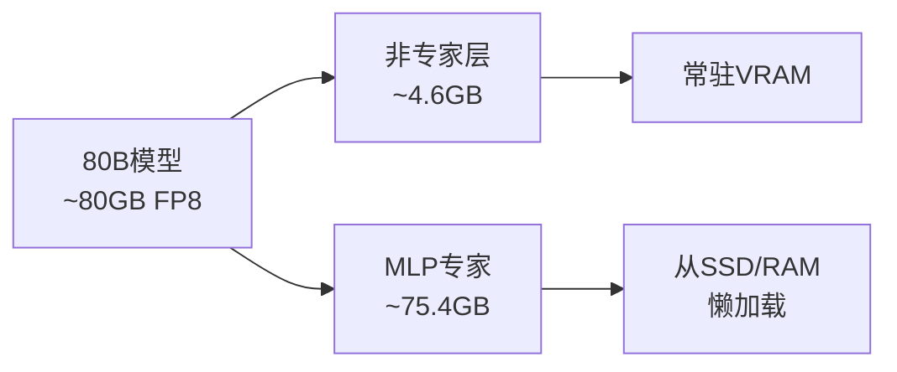

## 概述

如果能在仅有8GB VRAM的笔记本GPU上运行一个80B参数的编码专用模型会怎样？Reddit的r/LocalLLaMA社区中，一位名为<strong>nalexand</strong>的开发者公开了实现这一目标的项目。他成功在RTX 3070Ti（8GB VRAM）上以<strong>1.2 tokens/s</strong>的速度运行了Qwen3-Coder-Next 80B。

本文将分析该项目的核心技术——FP8量化、专家懒加载和缓存优化策略，并探讨在消费级GPU上运行大型LLM的实际意义与局限性。

## 核心挑战：将80B模型塞入8GB

### 为什么看起来不可能

Qwen3-Coder-Next是一个80B参数模型。即使在FP8量化状态下，模型大小也约为<strong>80GB</strong>。在8GB VRAM + 32GB RAM的环境中，将整个模型加载到内存中本身就是不可能的。

### 第一次尝试：磁盘卸载

开发者首先尝试使用Hugging Face的<strong>accelerate</strong>库通过`device="auto"`进行磁盘卸载。结果令人沮丧：

- 速度：<strong>1个token / 255秒</strong>
- 实际上完全无法使用

这是磁盘I/O瓶颈极端降低推理速度的典型案例。

## 解决方案：专家懒加载 + 缓存优化

### 利用MoE架构特性

关键洞察来自模型结构分析。80B模型中大部分大型张量集中在<strong>MLP专家</strong>中，而其余组件仅约<strong>4.6GB</strong>，完全可以放入VRAM。



### 自定义懒加载系统

开发者为MLP专家构建了<strong>自定义懒加载</strong>系统：

- <strong>2层缓存</strong>：VRAM缓存 + Pinned RAM缓存
- <strong>缓存命中率</strong>：最高85%
- <strong>速度提升</strong>：255秒/token → 1.2 tokens/s（<strong>约300倍加速</strong>）

### 缓存参数调优

```python
# VRAM缓存大小（每18单位 ≈ 约3GB）
self.max_gpu_cache = 18

# RAM缓存大小（基于可固定内存）
self.max_ram_cache = 100
```

| GPU | 推荐max_gpu_cache | 预期缓存命中率 |
|-----|-------------------|---------------|
| RTX 3070Ti (8GB) | 18 | ~85% |
| RTX 5090 (32GB) | 120 | >85% |

## 技术栈与安装方法

### 环境要求

- <strong>模型</strong>：`Qwen/Qwen3-Coder-Next-FP8`（从Hugging Face下载）
- <strong>GPU</strong>：8GB+ VRAM
- <strong>RAM</strong>：32GB+（可固定内存通常为RAM的1/2）
- <strong>存储</strong>：推荐高速NVMe SSD（PCIe 5.0 RAID 0最高30GB/s）

### 安装步骤

```bash
# 1. 下载模型
hf-download Qwen/Qwen3-Coder-Next-FP8

# 2. 替换transformers库的建模文件
# 替换 transformers/models/qwen3_next/modeling_qwen3_next.py

# 3. 提取MLP专家
python extract_mlp.py

# 4. 运行聊天机器人
python coder_80b_next_chat.py
```

## 实际性能基准测试

以下是开发者公开的缓存预热测试结果：

| 提示 | Token数 | 时间 | 速度 |
|------|---------|------|------|
| 第一次 "hi" | 11 | 21.25s | 0.52 t/s |
| 第二次 "hi" | 26 | 25.36s | 1.03 t/s |
| "all good" | 50 | 41.70s | 1.20 t/s |
| 长回复（807 tokens） | 807 | 668.81s | 1.21 t/s |

缓存预热后，系统稳定维持<strong>~1.2 t/s</strong>。首次请求因缓存未命中而较慢，但后续请求随着缓存命中率提高而加速。

## 实用性与局限性

### 优势

- <strong>成本</strong>：无需云API即可在本地运行80B编码模型
- <strong>隐私</strong>：代码不会发送到外部服务器
- <strong>离线</strong>：无需互联网连接即可使用

### 局限

- <strong>速度</strong>：1.2 t/s不足以支持实时编码辅助（Claude和GPT API为30-80 t/s）
- <strong>初始延迟</strong>：缓存预热需要时间
- <strong>安装复杂性</strong>：需要手动修改transformers库文件
- <strong>内存要求</strong>：仍需32GB RAM

### 未来展望

| GPU | VRAM | 预期速度 |
|-----|------|---------|
| RTX 3070Ti | 8GB | ~1.2 t/s（已确认） |
| RTX 4090 | 24GB | 5-10 t/s（估计） |
| RTX 5090 | 32GB | 20+ t/s（开发者预期） |

RTX 5090凭借32GB VRAM和高内存带宽，设置`max_gpu_cache=120`时有望达到20 t/s以上。

## 本地LLM编码的最前沿

该项目很好地体现了本地LLM社区"化不可能为可能"的精神。开发者<strong>nalexand</strong>此前已在低规格GPU上优化了LTX-2、Wan2.2、HeartMula、ACE-Step 1.5等多个大型模型。

核心经验如下：

1. <strong>模型结构分析是优化的起点</strong>：了解MoE模型的专家分布可实现选择性加载
2. <strong>多层缓存是关键</strong>：VRAM → Pinned RAM → SSD的缓存策略实现了300倍加速
3. <strong>硬件进化缩小差距</strong>：下一代GPU可能达到实用速度

## 结论

在8GB VRAM上运行Qwen3-Coder-Next 80B是一项技术上令人印象深刻的成就。虽然目前1.2 t/s的速度不足以支持实时编码辅助，但随着下一代GPU和优化技术的发展，在消费级硬件上运行大型编码模型正越来越接近现实。

对本地LLM感兴趣的开发者可以查看[nalexand的GitHub仓库](https://github.com/nalexand/Qwen3-Coder-OPTIMIZED)，在自己的硬件上亲自实验。

## 参考资料

- [Qwen3-Coder-OPTIMIZED GitHub](https://github.com/nalexand/Qwen3-Coder-OPTIMIZED)
- [Reddit r/LocalLLaMA 原帖](https://www.reddit.com/r/LocalLLaMA/comments/1r5m4vl/how_to_run_qwen3codernext_80b_parameters_model_on/)
- [Qwen3-Coder-Next-FP8模型（Hugging Face）](https://huggingface.co/Qwen/Qwen3-Coder-Next-FP8)
