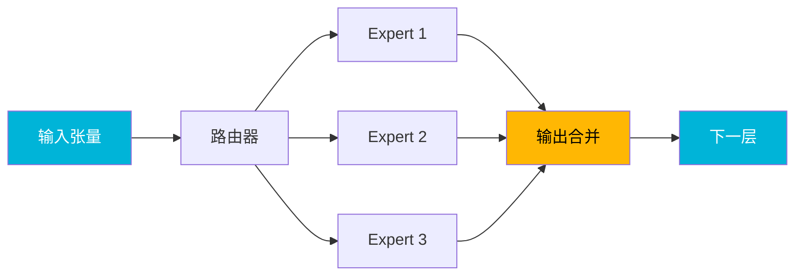

## 概述

llama.cpp核心开发者<strong>ggerganov</strong>发布了[PR #19375](https://github.com/ggml-org/llama.cpp/pull/19375)，对Qwen3 Coder Next模型的计算图进行了优化。通过消除不必要的张量复制操作并在图级别重构推理路径，实现了<strong>M2 Ultra上最高38%</strong>、<strong>DGX Spark上最高38%</strong>的速度提升。该优化在Reddit r/LocalLLaMA上获得了177分以上的高度关注，让我们深入了解其核心内容。

## 核心思想：图级优化

本次优化的核心思想很简单：从ggml计算图中<strong>移除不必要的张量复制操作</strong>。

Qwen3 Coder Next采用MoE（混合专家）架构，路由器选择要激活的专家并组合各专家的输出，这个过程中会产生大量中间张量复制。原有实现为了安全性过度插入了这些复制操作，而ggerganov仅保留了真正必要的复制，移除了其余部分。

## 基准测试结果

### M2 Ultra性能对比

Qwen3 Coder Next 80B.A3B模型在不同量化级别下的测试结果。

#### Q4_0量化

| 测试 | 基线 (t/s) | 优化后 (t/s) | 加速比 |
|------|-----------|-------------|--------|
| pp1（单token） | 37.92 | 51.99 | <strong>1.37x</strong> |
| pp8（8token批处理） | 137.75 | 176.36 | <strong>1.28x</strong> |
| pp512（提示词） | 930.70 | 1125.73 | <strong>1.21x</strong> |
| pp2048（长提示词） | 1049.91 | 1352.31 | <strong>1.29x</strong> |
| tg32（生成） | 38.02 | 50.39 | <strong>1.33x</strong> |

#### Q4_K_M量化

| 测试 | 基线 (t/s) | 优化后 (t/s) | 加速比 |
|------|-----------|-------------|--------|
| pp1 | 34.00 | 46.47 | <strong>1.37x</strong> |
| pp2048 | 977.30 | 1232.47 | <strong>1.26x</strong> |
| tg32 | 34.63 | 46.43 | <strong>1.34x</strong> |

#### Q8_0量化

| 测试 | 基线 (t/s) | 优化后 (t/s) | 加速比 |
|------|-----------|-------------|--------|
| pp1 | 34.38 | 43.98 | <strong>1.28x</strong> |
| pp2048 | 1047.39 | 1338.82 | <strong>1.28x</strong> |
| tg32 | 33.75 | 43.78 | <strong>1.30x</strong> |

### DGX Spark性能对比

NVIDIA DGX Spark上也确认了显著的性能提升。

| 量化 | 测试 | 基线 (t/s) | 优化后 (t/s) | 加速比 |
|------|------|-----------|-------------|--------|
| Q4_0 | pp512 | 1055.58 | 1161.67 | <strong>1.10x</strong> |
| Q4_0 | pp2048 | 1059.00 | 1324.66 | <strong>1.25x</strong> |
| Q4_0 | tg32 | 43.11 | 59.58 | <strong>1.38x</strong> |
| Q8_0 | pp2048 | 1009.43 | 1246.61 | <strong>1.23x</strong> |
| Q8_0 | tg32 | 31.13 | 39.68 | <strong>1.27x</strong> |

值得注意的是，DGX Spark在tg32（token生成）中Q4_0基准下实现了<strong>38%的速度提升</strong>。

## 技术背景：相关后端优化

这个PR并非孤立存在。图优化要发挥效果，各后端（Metal、CUDA、Vulkan）需要能够直接处理非连续（non-contiguous）张量。

### Metal（Apple Silicon）

- <strong>自适应CPU/GPU交错</strong>（[#19369](https://github.com/ggml-org/llama.cpp/pull/19369)）：根据节点数动态分配CPU/GPU工作负载
- <strong>二元内核整合</strong>（[#19390](https://github.com/ggml-org/llama.cpp/pull/19390)）：消除重复内核代码
- <strong>一元运算整合</strong>（[#19490](https://github.com/ggml-org/llama.cpp/pull/19490)）：改进一元运算处理
- <strong>非连续张量L2范数支持</strong>（[#19502](https://github.com/ggml-org/llama.cpp/pull/19502)）
- <strong>并发性改进</strong>（[#19555](https://github.com/ggml-org/llama.cpp/pull/19555)）

### CUDA（NVIDIA GPU）

- <strong>非连续张量PAD运算扩展</strong>（[#19429](https://github.com/ggml-org/llama.cpp/pull/19429)）
- <strong>启用CUDA图</strong>（[#19521](https://github.com/ggml-org/llama.cpp/pull/19521)）：用于Qwen3 Next风格架构
- <strong>防止融合ADD图变异</strong>（[#19566](https://github.com/ggml-org/llama.cpp/pull/19566)）

### Vulkan

- <strong>L2_NORM连续行支持</strong>（[#19604](https://github.com/ggml-org/llama.cpp/pull/19604)）
- <strong>GGML_OP_SET支持</strong>（[#19584](https://github.com/ggml-org/llama.cpp/pull/19584)）

## 注意事项：BF16张量问题

部分GGUF文件可能错误包含一维BF16张量。这会导致Metal等后端性能下降。[#19606](https://github.com/ggml-org/llama.cpp/pull/19606)通过将`ffn_gate_inp_shexp`张量存储为F32来解决了这个问题。

## 后续计划

ggerganov预告了进一步的优化工作：

1. <strong>Qwen3系列代码去重</strong>（[#19597](https://github.com/ggml-org/llama.cpp/pull/19597)）：共享delta-net图
2. <strong>利用`ggml_build_forward_select()`</strong>：将图常量化以获取更多优化空间
3. <strong>引入专用delta net ggml运算</strong>（[#19504](https://github.com/ggml-org/llama.cpp/pull/19504)）：更高效的内核执行

## 对本地LLM用户的影响

总结本次优化的实际意义：

- <strong>Apple Silicon用户</strong>：M2 Ultra基准下80B MoE模型tg32可达约50 t/s，完全满足实时对话需求。
- <strong>NVIDIA GPU用户</strong>：DGX Spark上20-38%的速度提升。CUDA图支持有望带来进一步优化。
- <strong>量化选择</strong>：Q4_0显示最大速度提升，但Q4_K_M和Q8_0也有一致的20-37%改善。
- <strong>无需代码更改</strong>：只需将llama.cpp更新到最新版本即可自动应用。

## 结论

ggerganov的图级优化大幅提升了llama.cpp的MoE模型推理性能。不是简单地优化内核，而是<strong>重构计算图本身</strong>的方法令人印象深刻。特别是与在多个后端（Metal、CUDA、Vulkan）中扩展非连续张量支持的并行工作相结合，将本地LLM推理的性能上限提升了一个台阶。

如果您在本地运行Qwen3 Coder Next等MoE模型，请更新llama.cpp到最新版本，立即体验这一性能提升。

## 参考资料

- [PR #19375: models : optimizing qwen3next graph](https://github.com/ggml-org/llama.cpp/pull/19375)
- [Reddit r/LocalLLaMA 讨论](https://www.reddit.com/r/LocalLLaMA/)
- [llama.cpp GitHub仓库](https://github.com/ggml-org/llama.cpp)
