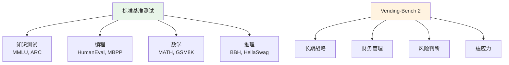
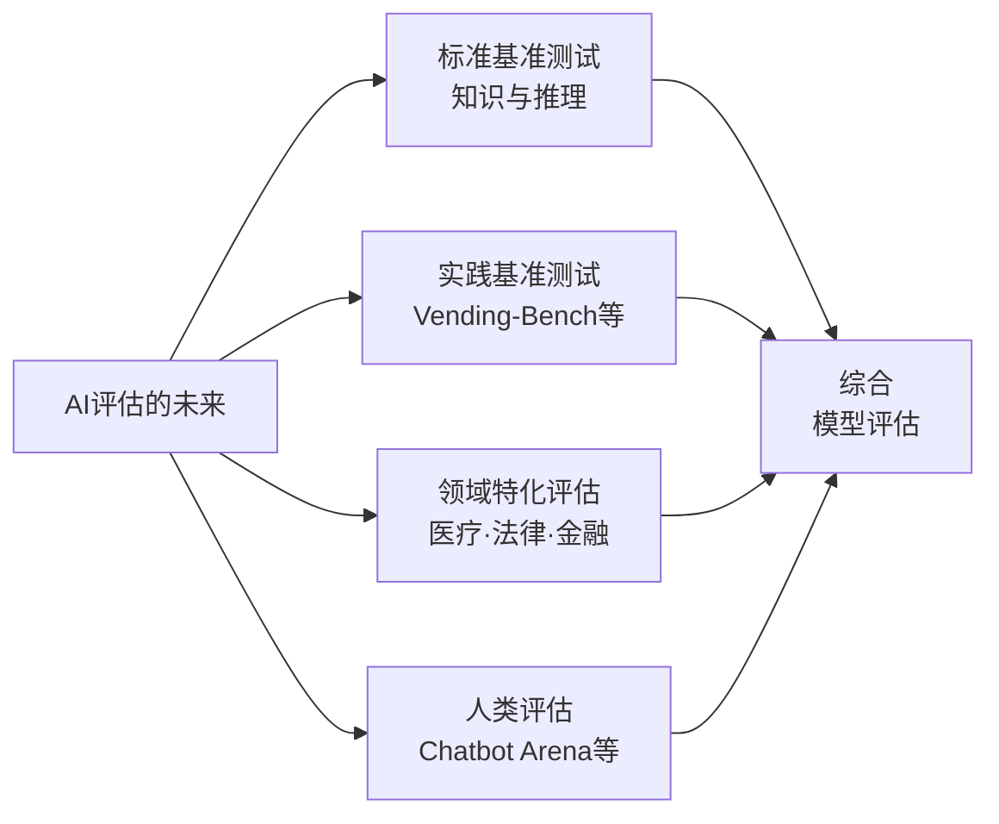

## 概述

阿里巴巴开发的大语言模型<strong>Qwen 3.5 Plus</strong>在MMLU、HumanEval、MATH等标准基准测试中始终位居前列。然而，在Andon Labs开发的非标准基准测试<strong>Vending-Bench 2</strong>中，该模型却得到了令人震惊的<strong>"破产"</strong>结果。这一发现在Reddit r/LocalLLaMA上获得了595+的点赞，引发了对AI评估方式的广泛讨论。

## 什么是Vending-Bench 2

Vending-Bench 2是Andon Labs开发的<strong>自动售货机经营模拟基准测试</strong>。它让AI模型运营虚拟自动售货机业务约365天，综合测量<strong>财务管理、决策制定和战略规划</strong>能力。

与传统基准测试不同，它测量以下实践能力：

- <strong>长期战略思维</strong>：一年内的连续商业决策
- <strong>财务风险管理</strong>：在盈利和可持续性之间保持平衡
- <strong>适应力</strong>：应对变化的模拟环境
- <strong>应用推理能力</strong>：不仅是知识，更是知识的应用

## 震惊的结果：Qwen 3.5垫底破产

上图展示了各模型365天模拟的结果：

| 排名 | 模型 | 最终余额（估计） |
|------|------|------------------|
| 第1名 | GLM-5 | 约$8,000+ |
| 第2名 | Gemini 3 Flash | 约$4,000~$4,500 |
| 第3名 | Kimi K2.5 | 约$3,500~$4,000 |
| 第4名 | Claude Opus 4.6 | 约$2,000~$2,500 |
| 第5名 | DeepSeek-V3.2 | 约$200~$500 |
| 第6名 | <strong>Qwen 3.5 Plus</strong> | <strong>约$0（破产）</strong> |

在标准基准测试中名列前茅的Qwen 3.5 Plus，以<strong>所有模型中最后一名</strong>、余额为零的结果收场。

## 为什么会出现这种差异

### 标准基准测试的局限性

标准基准测试擅长测量<strong>静态知识和单一任务</strong>，但无法衡量：

- <strong>多步骤决策的一致性</strong>
- <strong>不确定性下的判断力</strong>
- <strong>考虑长期结果的战略思维</strong>
- <strong>权衡取舍的评估与选择</strong>

### 基准测试优化问题

在AI模型开发中，提高标准基准测试分数已成为关键指标，这导致了<strong>"基准测试黑客"</strong>现象：

1. <strong>过拟合风险</strong>：专门针对类似基准测试的模式进行学习
2. <strong>泛化能力下降</strong>：牺牲了应对意外任务的能力
3. <strong>表面性能与实际性能的差距</strong>：数字好看但实际不好用

## 社区反应

Reddit r/LocalLLaMA的讨论中出现了以下观点：

- <strong>"活跃参数数 ≠ 智能"</strong>：模型规模不能决定能力
- <strong>架构的重要性</strong>：MoE（混合专家）路由效率显著影响结果
- <strong>训练数据质量</strong>：不仅是数量，质量和多样性同样重要

GLM-5以超过$8,000的利润位居榜首也值得关注。在标准基准测试中排名低于Qwen 3.5的模型，在实际任务中可能表现出压倒性优势。

## AI评估的未来方向

### 多维评估的必要性

这次结果清楚表明，<strong>不应仅凭单一基准测试来判断模型优劣</strong>：

1. <strong>多维评估</strong>：从知识、推理、实践、创造力等多个维度评估
2. <strong>真实世界模拟</strong>：推广Vending-Bench等实践基准测试
3. <strong>领域特化评估</strong>：针对使用目的的专业测试
4. <strong>持续监测</strong>：在各种条件下持续评估，而非一次性测试

## 结论

Qwen 3.5 Plus在Vending-Bench 2中的破产，象征性地揭示了<strong>基准测试偏重AI评估的危险性</strong>。标准基准测试中的顶尖模型在实际场景中可能垫底，这一事实提醒我们在选择AI模型时需要<strong>看透数字背后的真实能力</strong>。

衡量AI的真正能力，不仅需要标准化测试，更需要<strong>反映现实世界复杂性的多样化基准测试</strong>。

## 参考资料

- [Reddit r/LocalLLaMA — Qwen 3.5 goes bankrupt on Vending-Bench 2](https://www.reddit.com/r/LocalLLaMA/comments/1r6ghty/qwen_35_goes_bankrupt_on_vendingbench_2/)
- [Andon Labs](https://andonlabs.com/)
