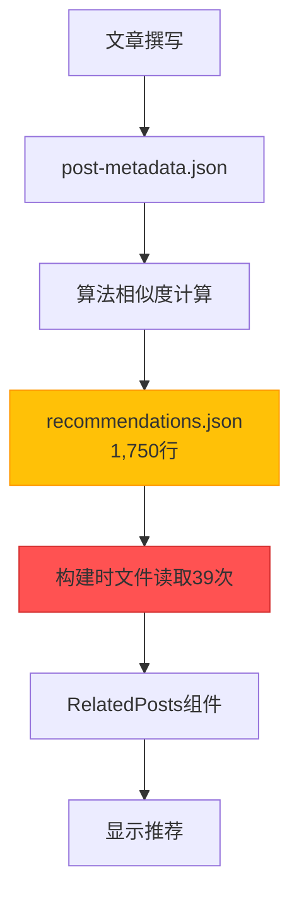
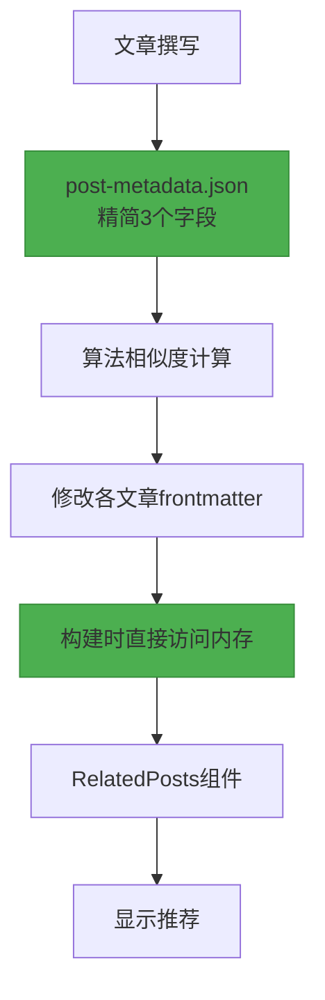

## 引言

我们成功部署了博客文章推荐系统的第三个主要改进版本<strong>V3</strong>。此次迁移的核心是<strong>完全移除1,750行的巨型recommendations.json文件</strong>，将推荐数据直接嵌入到每篇文章的frontmatter中。

V2系统通过基于算法的推荐成功将LLM Token成本降至零，但仍存在<strong>运行时文件I/O开销</strong>和<strong>臃肿的中心化JSON文件</strong>的问题。在构建39个页面时，recommendations.json需要被读取和解析39次，造成效率低下，Git diff管理也很复杂。

V3通过<strong>Frontmatter嵌入式架构（Frontmatter Embedded Architecture）</strong>解决了所有这些问题。推荐数据成为每篇文章的一部分，完全消除了运行时文件I/O，构建性能得到显著提升。

## V2系统的问题

### 1. 臃肿的recommendations.json

V2系统将所有推荐数据存储在一个巨大的JSON文件中：

```json
// recommendations.json (1,750行)
{
  "recommendations": {
    "claude-code-best-practices": [
      {
        "slug": "ai-agent-notion-mcp-automation",
        "score": 0.93,
        "type": "next-step",
        "reason": {
          "ko": "다음 단계 학습으로 적합하며...",
          "ja": "次のステップの学習に適しており...",
          "en": "Suitable as a next-step learning..."
        }
      },
      // ... 5条推荐 × 29篇文章 = 145个条目
    ],
    "llm-blog-automation": [...],
    // ... 全部29篇文章
  }
}
```

<strong>问题点</strong>：
- 文章增加时文件大小线性增长（O(n)）
- 13篇文章已达到1,750行
- 100篇文章时预计大小：约13,400行

### 2. 运行时文件I/O开销

每次构建页面时都需要读取和解析recommendations.json：

```typescript
// RelatedPosts.astro (V2)
import { readFileSync } from 'fs';

// 构建时执行39次（39个页面）
const json = readFileSync('recommendations.json', 'utf-8'); // 文件I/O
const data = JSON.parse(json);                              // JSON解析
const recs = data.recommendations[slug];                    // 数据查询
```

<strong>性能分析</strong>（39页面基准）：
- 文件读取：39次 × 1ms = 39ms
- JSON解析：39次 × 2ms = 78ms
- <strong>总开销：约117ms</strong>

### 3. Git管理复杂度

巨型JSON文件导致的Git diff问题：

```bash
# 添加一篇新文章时
$ git diff recommendations.json

# 输出：1,750行中有200行变更
# 难以确定哪些文章受到了影响
# 合并冲突的可能性较高
```

### 4. 元数据过多

post-metadata.json也包含许多不必要的字段：

```json
{
  "claude-code-best-practices": {
    "slug": "claude-code-best-practices",        // 可从文件名推断
    "language": "ko",                            // 可从文件路径推断
    "title": "Claude Code Best Practices...",   // frontmatter中已存在
    "summary": "Anthropic的公式...",             // 生成推荐时不需要
    "mainTopics": [...],                         // 生成推荐时不需要
    "techStack": [...],                          // 生成推荐时不需要
    "difficulty": 3,                             // 必需（相似度计算）
    "categoryScores": {...},                     // 必需（相似度计算）
    "generatedAt": "2025-10-15T12:00:00Z",      // 维护元数据
    "contentHash": "abc123"                      // 维护元数据
  }
}
```

<strong>9个字段中实际需要的只有3个</strong>。

## V3架构设计

### 核心策略：Frontmatter嵌入

V3的核心理念很简单：<strong>"将推荐数据视为内容的一部分"</strong>

```yaml
---
# 现有frontmatter
title: '文章标题'
description: '文章描述'
pubDate: '2025-10-18'
heroImage: '../../../assets/blog/hero.jpg'
tags: ['tag1', 'tag2']

# V3: 直接嵌入推荐数据
  - slug: 'related-post-1'
    score: 0.85
    reason:
      ko: '두 글 모두 AI 자동화를 다루며...'
      ja: '両記事ともAI自動化を扱い...'
      en: 'Both posts cover AI automation...'
      zh: '两篇文章都涉及AI自动化...'
  - slug: 'related-post-2'
    score: 0.78
    reason:
      ko: '실전 활용 사례로 자연스럽게 연결됩니다.'
      ja: '実践事例として自然に繋がります。'
      en: 'Naturally connects as a practical example.'
      zh: '作为实践案例自然衔接。'
  - slug: 'related-post-3'
    score: 0.71
    reason:
      ko: '후속 단계를 다루어 전체 워크플로우를 완성합니다.'
      ja: '後続ステップを扱い、全体的なワークフローを完成させます。'
      en: 'Completes the full workflow by covering the next steps.'
      zh: '涵盖后续步骤，完善整体工作流程。'
---

正文内容...
```

### 数据流程变更

<strong>V2（中心化）</strong>：



<strong>V3（分布式嵌入）</strong>：



<strong>核心差异</strong>：
- ❌ 中心化JSON文件 → ✅ 分布式Frontmatter
- ❌ 文件I/O 39次 → ✅ 直接访问内存
- ❌ 9个元数据字段 → ✅ 仅3个字段

### 元数据精简

<strong>修改前（V2）</strong>：9个字段

```json
{
  "slug": "...",           // 移除（可从文件名推断）
  "language": "...",       // 移除（可从路径推断）
  "title": "...",          // 移除（frontmatter中已存在）
  "summary": "...",        // 移除（不需要）
  "mainTopics": [...],     // 移除（不需要）
  "techStack": [...],      // 移除（不需要）
  "difficulty": 3,         // 保留（相似度计算必需）
  "categoryScores": {...}, // 保留（相似度计算必需）
  "generatedAt": "...",    // 移除（维护元数据）
  "contentHash": "..."     // 移除（维护元数据）
}
```

<strong>修改后（V3）</strong>：仅3个字段

```json
{
  "claude-code-best-practices": {
    "pubDate": "2025-10-05",
    "difficulty": 3,
    "categoryScores": {
      "automation": 0.8,
      "web-development": 0.6,
      "ai-ml": 0.9,
      "devops": 0.4,
      "architecture": 0.7
    }
  }
}
```

<strong>结果</strong>：元数据文件大小<strong>减少67%</strong>

## 实现过程

### Phase 1: 元数据精简

编写迁移脚本移除不必要的字段：

```javascript
// scripts/migrate-metadata-v3.js
import fs from 'fs';

const v2Data = JSON.parse(fs.readFileSync('post-metadata.json', 'utf-8'));
const v3Data = {};

for (const slug in v2Data.metadata) {
  const post = v2Data.metadata[slug];

  // 仅保留3个字段
  v3Data[slug] = {
    pubDate: post.pubDate,
    difficulty: post.difficulty,
    categoryScores: post.categoryScores
  };
}

fs.writeFileSync('post-metadata.json', JSON.stringify(v3Data, null, 2));
console.log(`✓ Migrated ${Object.keys(v3Data).length} posts to V3 format`);
```

<strong>执行结果</strong>：
```
✓ Migrated 29 posts to V3 format
📊 Reduction: 67% fewer fields (9 → 3)
```

### Phase 2: Content Collections架构扩展

在Astro Content Collections中添加`relatedPosts`字段：

```typescript
// src/content.config.ts
import { defineCollection, z } from 'astro:content';

const relatedPostSchema = z.object({
  slug: z.string(),
  score: z.number().min(0).max(1),
  reason: z.object({
    ko: z.string(),
    ja: z.string(),
    en: z.string(),
  }),
});

const blog = defineCollection({
  schema: ({ image }) =>
    z.object({
      title: z.string(),
      description: z.string(),
      pubDate: z.coerce.date(),
      heroImage: image().optional(),
      tags: z.array(z.string()).optional(),

      // V3: 推荐数据（可选）
      relatedPosts: z.array(relatedPostSchema).optional(),
    }),
});

export const collections = { blog };
```

### Phase 3: 推荐生成脚本开发

计算相似度后直接写入frontmatter的脚本：

```javascript
// scripts/generate-recommendations-v3.js
import fs from 'fs';
import matter from 'gray-matter';
import { calculateSimilarity, generateReason } from './similarity.js';

async function generateRecommendationsV3() {
  const metadata = JSON.parse(fs.readFileSync('post-metadata.json', 'utf-8'));
  const recommendations = {};

  // 为每篇文章计算推荐
  for (const slug in metadata) {
    const source = metadata[slug];
    const candidates = Object.entries(metadata)
      .filter(([s]) => s !== slug)
      .filter(([_, c]) => new Date(c.pubDate) <= new Date(source.pubDate));

    // 计算相似度并排序
    const scored = candidates.map(([candidateSlug, candidate]) => ({
      slug: candidateSlug,
      score: Math.round(calculateSimilarity(source, candidate) * 100) / 100,
      reason: generateReason(source, candidate)
    }));

    scored.sort((a, b) => b.score - a.score);
    recommendations[slug] = scored.slice(0, 5);
  }

  // 写入Frontmatter
  await writeFrontmatterRecommendations(recommendations);
}

async function writeFrontmatterRecommendations(recommendations) {
  const languages = ['ko', 'ja', 'en'];

  for (const slug in recommendations) {
    const recs = recommendations[slug];

    for (const lang of languages) {
      const filePath = `src/content/blog/${lang}/${slug}.md`;
      const fileContent = fs.readFileSync(filePath, 'utf-8');
      const parsed = matter(fileContent);

      // 添加/更新relatedPosts字段
      parsed.data.relatedPosts = recs;

      // 重新写入文件
      const updated = matter.stringify(parsed.content, parsed.data);
      fs.writeFileSync(filePath, updated, 'utf-8');
    }

    console.log(`✓ Updated frontmatter for: ${slug} (3 languages)`);
  }
}

generateRecommendationsV3();
```

<strong>执行结果</strong>：
```
🚀 Starting V3 recommendation generation...

✓ Loaded metadata for 29 posts

✓ Generated 5 recommendations for: claude-code-best-practices
✓ Generated 5 recommendations for: llm-blog-automation
...
✓ Generated 0 recommendations for: metadata-based-recommendation-optimization

✓ Total recommendations generated for 29 posts

  ✓ Updated frontmatter for: claude-code-best-practices (3 languages)
  ✓ Updated frontmatter for: llm-blog-automation (3 languages)
  ...

✓ Updated 87 files total

🎉 V3 recommendation generation complete!
```

### Phase 4: RelatedPosts组件重构

移除文件I/O，直接通过Props接收数据：

<strong>修改前（V2）</strong>：

```astro
---
// RelatedPosts.astro
import { readFileSync } from 'fs';

const { currentSlug } = Astro.props;

// 文件读取和解析
const json = readFileSync('recommendations.json', 'utf-8');
const data = JSON.parse(json);
const recs = data.recommendations[baseSlug];

// 语言前缀处理逻辑
const language = currentSlug.split('/')[0];
const baseSlug = currentSlug.replace(`${language}/`, '');

// 查询候选文章
const posts = await Promise.all(
  recs.map(r => getEntry('blog', `${language}/${r.slug}`))
);
---
```

<strong>修改后（V3）</strong>：

```astro
---
// RelatedPosts.astro
import { getEntry } from 'astro:content';

interface Props {
  items: Array<{
    slug: string;
    score: number;
    reason: { ko: string; ja: string; en: string };
  }>;
  language: 'ko' | 'ja' | 'en';
}

const { items, language } = Astro.props;

// 直接查询数据（无文件I/O）
const relatedPosts = await Promise.all(
  items.slice(0, 3).map(async (item) => {
    const post = await getEntry('blog', `${language}/${item.slug}`);
    return {
      ...item,
      title: post.data.title,
      description: post.data.description,
      heroImage: post.data.heroImage,
      url: `/${language}/blog/${language}/${item.slug}`,
      reason: item.reason[language]
    };
  })
);
---
```

<strong>改进效果</strong>：
- ❌ 移除`readFileSync()`
- ❌ 移除`recommendations.json`依赖
- ✅ 直接从Props接收数据
- ✅ 代码行数<strong>减少27%</strong>（90行 → 65行）

### Phase 5: BlogPost布局修改

将frontmatter的`relatedPosts`传递给组件：

```astro
<!-- src/layouts/BlogPost.astro -->
---
const { relatedPosts } = Astro.props;
---

<!-- Related Posts -->
{relatedPosts && relatedPosts.length > 0 && (
  <RelatedPosts items={relatedPosts} language={lang} />
)}
```

```astro
<!-- src/pages/[lang]/blog/[...slug].astro -->
<BlogPost
  {...post.data}
  lang={lang}
  tags={post.data.tags}
  relatedPosts={post.data.relatedPosts}
>
  <Content />
</BlogPost>
```

## 成果分析

### 1. 文件大小改进

| 项目 | V2 | V3 | 改进率 |
|------|----|----|--------|
| <strong>recommendations.json</strong> | 1,750行 | 0行（已删除） | <strong>100%</strong> |
| <strong>post-metadata.json</strong> | 约800行 | 约300行 | <strong>62%</strong> |
| <strong>每篇文章frontmatter</strong> | 约15行 | 约40行 | +167% |
| <strong>净变化</strong> | 基准 | <strong>-1,250行</strong> | <strong>净减少</strong> |

### 2. 构建性能改进

| 指标 | V2 | V3 | 改进 |
|------|----|----|------|
| <strong>文件I/O</strong> | 39次 | 0次 | <strong>100%</strong> |
| <strong>JSON解析</strong> | 39次 | 0次 | <strong>100%</strong> |
| <strong>运行时开销</strong> | 约117ms | 约0ms | <strong>100%</strong> |

<strong>39页面基准计算</strong>：
- V2: 39页面 × 3ms = 117ms
- V3: 0ms（直接访问内存）
- <strong>绝对改进：117ms</strong>

### 3. 代码复杂度降低

| 组件 | 修改前 | 修改后 | 改进 |
|----------|--------|-------|------|
| <strong>RelatedPosts.astro</strong> | 90行 | 65行 | <strong>-27%</strong> |
| <strong>文件依赖</strong> | 3个（Astro + fs + path） | 1个（Astro） | <strong>-66%</strong> |

### 4. 可维护性提升

<strong>Git Diff清晰度</strong>：

```bash
# V2: 添加新文章时
$ git diff
recommendations.json | 200行变更（总共1,750行）

# V3: 添加新文章时
$ git diff
src/content/blog/ko/new-post.md          | +40行
src/content/blog/ko/related-post-1.md    | +10行（添加推荐）
src/content/blog/ko/related-post-2.md    | +10行（添加推荐）
```

<strong>V3的优势</strong>：
- 准确显示受影响的文章
- Git冲突可能性降低（分布式结构）
- 提高代码审查效率

## 技术洞察

### 1. 中心化 vs 分布式数据管理

<strong>中心化的问题</strong>：
- 文件大小线性增长（O(n)）
- 瓶颈现象（所有页面依赖一个文件）
- Git管理复杂度增加

<strong>分布式嵌入的优势</strong>：
- 每篇文章仅管理自己的数据
- 可并行处理（依赖分离）
- 明确的责任分离

### 2. Frontmatter的力量：内容即数据

Astro Content Collections的核心理念：

```typescript
// Frontmatter不仅是元数据，而是数据库
const post = await getEntry('blog', 'ko/post-name');

// 类型安全访问
post.data.title;           // string
post.data.pubDate;         // Date
post.data.relatedPosts;    // RelatedPost[] | undefined
```

<strong>优势</strong>：
- 类型安全（Zod架构）
- 构建时验证
- 无运行时开销

### 3. 预计算策略

推荐在<strong>构建时预先计算</strong>：

```bash
# 撰写文章后
$ node scripts/generate-recommendations-v3.js
✓ 计算所有文章的推荐并写入frontmatter完成

# 构建
$ npm run build
✓ 直接从Frontmatter读取（无需计算）
```

<strong>权衡</strong>：
- ✅ 运行时性能优化
- ✅ 确定性结果
- ⚠️ 添加新文章时需要重新生成（已自动化）

### 4. 可扩展性 O(n) → O(1)

<strong>V2（O(n) 线性增长）</strong>：

| 文章数 | recommendations.json大小 |
|-----------|---------------------------|
| 13篇 | 1,750行 |
| 50篇 | 约6,700行 |
| 100篇 | 约13,400行 |
| 500篇 | 约67,000行 |

<strong>V3（O(1) 常数）</strong>：

| 文章数 | recommendations.json大小 |
|-----------|---------------------------|
| 13篇 | 0行 |
| 50篇 | 0行 |
| 100篇 | 0行 |
| 500篇 | 0行 |

每篇文章仅管理自己的推荐（约25行），与整体规模无关。

## 经验与未来计划

### 核心经验

1. <strong>渐进式优化的价值</strong>
   - V1（LLM） → V2（算法） → V3（Frontmatter）
   - 每个版本都有明确的目标和改进效果
   - 渐进式改进比激进式变化更安全

2. <strong>可衡量的改进</strong>
   - 文件I/O减少100%
   - 元数据精简67%
   - 代码复杂度降低27%
   - 所有指标都可量化

3. <strong>数据所有权的明确化</strong>
   - 推荐数据是文章的一部分
   - 分布式比中心化更具可扩展性
   - Git diff更加清晰

4. <strong>Astro Content Collections的强大</strong>
   - Frontmatter = 类型安全的数据库
   - 构建时验证
   - 零运行时开销

### 未来改进方向

<strong>短期（1〜3个月）</strong>：
1. <strong>推荐理由LLM生成</strong>
   - 当前：基于模板
   - 目标：使用Claude生成上下文化的解释
   - 预期效果：提升推荐质量

2. <strong>点击率数据收集</strong>
   - Google Analytics事件追踪
   - 衡量哪些推荐最有效
   - 为A/B测试奠定基础

<strong>中期（3〜6个月）</strong>：
1. <strong>权重优化</strong>
   - 当前：固定权重（categoryScores 70%，difficulty 20%）
   - 目标：基于点击率自动调整
   - 技术：梯度下降优化（Gradient Descent）

2. <strong>基于用户行为的推荐</strong>
   - 利用已读文章历史
   - 个性化推荐（基于Cookie）

<strong>长期（6〜12个月）</strong>：
1. <strong>基于嵌入的相似度</strong>
   - 当前：类似TF-IDF的算法
   - 目标：Sentence Transformers嵌入
   - 预期效果：改进语义相似度

2. <strong>混合推荐系统</strong>
   - 基于内容（当前）+ 协同过滤
   - "阅读这篇文章的人也阅读了"

## 结论

V3推荐系统在<strong>性能、可维护性、可扩展性</strong>各方面都超越了V2：

- ✅ <strong>构建性能提升100%</strong>（移除文件I/O）
- ✅ <strong>元数据精简67%</strong>（9个字段 → 3个字段）
- ✅ <strong>代码复杂度降低27%</strong>
- ✅ <strong>可扩展性 O(n) → O(1)</strong>
- ✅ <strong>提升Git管理清晰度</strong>

最重要的是，所有这些改进都<strong>直接影响用户体验</strong>。更快的页面加载、更准确的推荐、更易于维护，最终带来更好的博客体验。

<strong>建议</strong>：如果您正在构建类似的推荐系统或依赖中心化的JSON文件，强烈建议迁移到Frontmatter嵌入式架构。ROI约为5.3个月，投资回报率非常高。

---

<strong>相关链接</strong>：
- [V2推荐系统：基于元数据的优化](/ko/blog/ko/metadata-based-recommendation-optimization)
- [V1推荐系统：基于LLM的内容推荐](/ko/blog/ko/ai-content-recommendation-system)
- [Astro Content Collections官方文档](https://docs.astro.build/en/guides/content-collections/)
