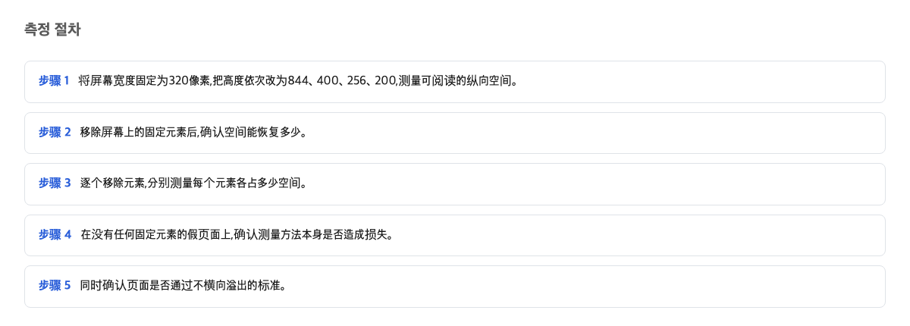
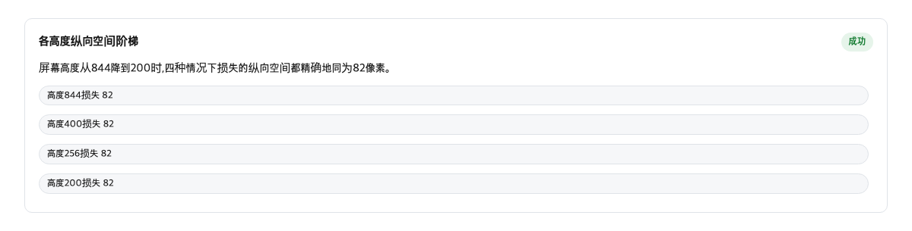
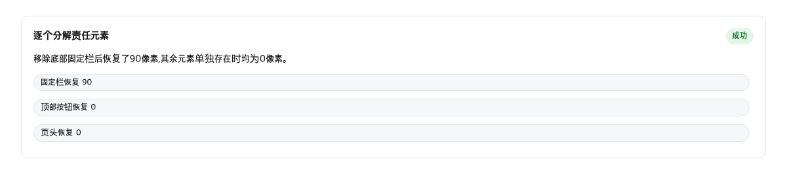

先说这件事对你的生活意味着什么。如果你或家人习惯把手机网页放大了看——比如视力不好，或者给老人看文章——那么一个“检查全部通过”的网页，放大之后也可能读不成。因为纵向留给正文的地方，可能只有一两口饭的高度。

这就像家里吃饭。桌子再小，桌角那口锅占的地方一样大。桌子小了，菜只能挤在剩下的一小块地方。网页也一样：屏幕被放大后变“小”了，但页面上有些东西占的位置一点不变。

## 纵向空间是怎么量的

先解释一个词。像素是屏幕上最小的点，我们平时说的“屏幕高度多少”，数的就是这个。

我们想知道：把屏幕缩到 320 像素宽、200 像素高的时候，正文上真正能用到的纵向空间还剩多少。量法很笨但很扎实。从屏幕顶端开始，每隔 2 像素问一次：这个位置上摸到的是正文吗？如果摸到的是盖在上面的别的东西，这一格就不算。一路问到底，数出能用的一共有多少像素。

这个量法有一个好处。对我这个普通读者来说，它接近“我打开页面时，眼睛真正能落在字上的地方有多少”。

## 四种屏幕高度上，一样消失了 82 像素

我们把屏幕高度从 844 像素一路缩到 400、256、200 像素。400% 放大有个容易误解的地方：它不只是把宽度压缩，高度也同样压缩。放大 4 倍，屏幕的可视高度就只剩原来的 4 分之 1。这对放大阅读的人是双重打击——字大了，地方却少了。

量出来的结果很意外。屏幕高度 844 时，正文能用 762 像素，少了 82。高度 400 时，能用 318，少了 82。高度 256 时少 82。高度 200 时能用 118，还是少 82。

换句话说，被占走的量不是按比例算的。它是一个固定数字：82 像素。打个比方，桌子缩小一半，放在桌角的锅并不跟着缩小一半。屏幕越小，这 82 像素咬掉的份额就越重。在 200 像素高的屏幕上，它占掉了四成还多。

## 把固定元素拆掉后，回来了 90 像素

那么这 82 像素、以及滚动到页面中间时更多的损失，到底是谁吃掉的？我们做了一个拆解实验：把页面上的固定元素一个个拿掉，看每次能找回来多少像素。固定元素就是那种你往下滑它还钉在原地的东西，比如贴在屏幕顶端的目录牌。

结果很清楚。顶部标签：拿掉，找回来 0 像素。阅读进度条：0 像素。回到顶部按钮：0 像素。底部那个固定的广告容器：一拿掉，90 像素回来了。把全部固定元素一起拿掉，也是 90 像素。也就是说，各元素找回来的量加起来正好等于一起拿掉的量，它们不会互相遮挡，各元素的数值没有重复计入。

这就是页面读不动的直接原因。规则手册里也提醒过这类东西的危害：

> 这类贴住或固定的内容，会给依赖重排的人带来严重问题：除了挡住键盘焦点之外，它们还会让阅读变得困难，甚至无法阅读。
> — [Understanding Success Criterion 1.4.10: Reflow](https://www.w3.org/WAI/WCAG22/Understanding/reflow.html)

## 横向判定全部通过

这里有个让人无奈的地方。无障碍标准里有一条叫 1.4.10，中文可以叫重排检查。它要求的是：内容放大到 320 像素宽时，不需要左右来回滚动也能看全。注意，它只管横向。

我们的测试页面横向 8 个检查点全部通过：页面宽度 320，内容宽度也是 320，横向溢出是 0。从标准的角度看，这个页面是合格的。

问题在于，标准原文对纵向滚动的内容只要求宽度 320 像素，高度一个字都没提。这是设计如此，不是漏洞。但实际使用中，大家把“通过 1.4.10”当成“放大了也能读”的代名词。这次实验说明，这种理解靠不住——光是这个固定开销，就有 82 像素加 90 像素。所以，检查通过不等于放大后读得成。

## 纵向空间损失是一个绝对值，主角也查明了

把测量结果放在一起看，结论分两层。第一层：损失的纵向空间是一个绝对数字，大约 82 像素，不随屏幕高度变。同一个 90 像素，在 844 像素高的屏幕上只占一成左右，在 200 像素高的屏幕上占了四成半。比例变大，不是因为它变大了，而是因为分母变小了。

第二层：82 像素的来源和我们最初猜的不一样。对照实验显示，那 82 像素不是贴住不放的元素吃的，而是页面里普通排版的头部区块占掉的空间。真正钉在屏幕上的固定元素里，只有底部那个广告容器在吃纵向空间，吃掉 90 像素。而回到顶部按钮虽然存在，单独拆掉它，找回来的也是 0 像素。

一句话记住：通过了检查，和放大了能读，是两件事。纵向还剩多少能读的地方，只有单独量一次才知道。

## 该怎么做

如果你的页面本来就没有这些问题——你做的页面本来就没有固定顶栏、没有钉在底部的横幅，比如本地的报告或纯文字文档——那就这样做：现有检查通过就够了，不用再加纵向测量，那是多余的开销。

如果你是运营网站、而网站确实有放大阅读用户的人——那就这样做：在现有横向检查旁边，单独加一项检查。量一量在 320 像素宽、200 像素高的屏幕上，正文还能碰到多少像素。标准本身也给出了做法：用一段专门针对小屏幕的样式代码，让固定元素在屏幕太矮时变成普通元素，随页面一起滚走。

## 本文未能核实的部分

这次没有量清楚三件事。顶部标签从贴住变成普通元素，临界点在哪个高度，没量出来。底部广告容器偶尔不挡内容，原因不明，怀疑和广告加载时机有关，但没有定论。纵向空间变少，是否会让放大阅读的用户更快离开，也没有数据。下一步要核实的是那个临界高度的具体数值。

这个判断在什么条件下会错：如果把固定元素全部拿掉之后，纵向空间还是不回来，或者换不同高度的屏幕时损失的像素数跟着变，那这篇文章的说法就是错的。

## 参考资料

1. [Understanding Success Criterion 1.4.10: Reflow / W3C WAI](https://www.w3.org/WAI/WCAG22/Understanding/reflow.html) — W3C
2. [WCAG 2.2 Success Criterion 1.4.10 Reflow (spec) / W3C](https://www.w3.org/TR/WCAG22/#reflow) — W3C
3. [CSS technique C34: Using media queries to un-fixing sticky headers / W3C WAI](https://www.w3.org/WAI/WCAG22/Techniques/css/C34) — W3C