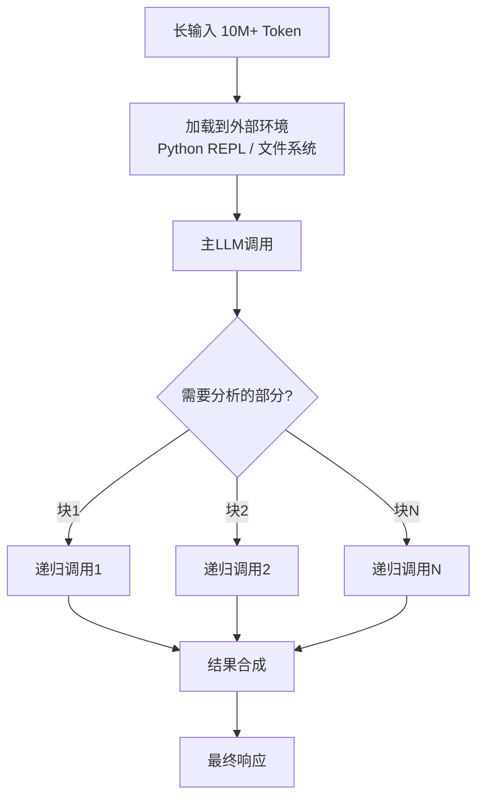
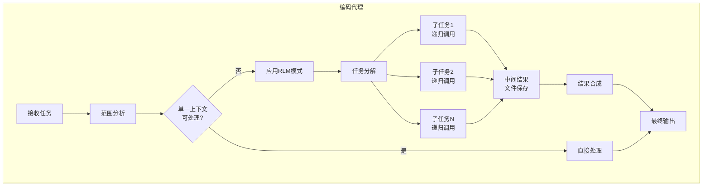
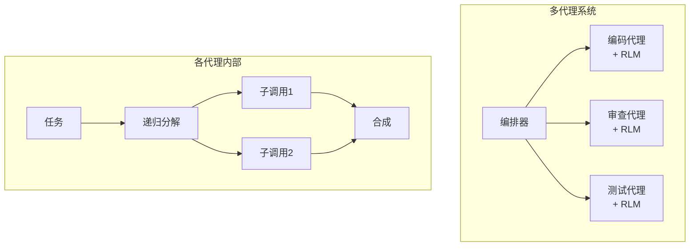

## 概述

在运营基于LLM的编码代理时，必然会遇到一堵墙：<strong>上下文窗口的限制</strong>。无论是128K还是200K token，处理大规模代码库时模型会开始遗漏重要信息。这就是所谓的"Context Rot"——随着上下文长度增加，性能急剧下降的现象。

MIT发表的<strong>Recursive Language Models（RLM）</strong>论文（arXiv:2512.24601）为这个问题提出了根本性的解决方案。最近，一位名为Tenobrus的开发者将这个想法直接实现到Claude Code中，引起了广泛关注。他在编码代理内部将RLM实现为一个"技能"。

从用AI构建系统的工程管理者角度，让我分析这个方法为什么重要，以及在实际工作中如何应用。

## RLM是什么

### 核心理念

RLM的核心很简单：<strong>让LLM能够递归地调用自身</strong>。

传统方式中，长提示词直接输入给模型。自然地，超过上下文窗口的部分会被截断，即使没有超过，也会发生Context Rot导致遗漏中间信息。

RLM采取不同的方法：

1. <strong>将提示词加载到外部环境</strong>：在Python REPL等执行环境中存储长输入
2. <strong>程序化探索</strong>：LLM编写代码只查看需要的部分
3. <strong>递归自调用</strong>：将子任务委托给自身的新实例
4. <strong>结果合成</strong>：程序化地组合各递归调用的结果



### 论文的主要成果

MIT论文的结果令人印象深刻：

- <strong>可处理10M+token</strong>：超过基础上下文窗口的100倍
- <strong>91.3%的性能提升</strong>：BrowseComp+基准测试中相对基线
- <strong>解决Context Rot</strong>：输入长度增加时几乎没有性能下降
- <strong>成本效率高</strong>：与直接调用基础模型相当或更低

特别值得注意的是，他们训练的原生递归模型<strong>RLM-Qwen3-8B</strong>相比基础Qwen3-8B平均提升了28.3%，在部分任务上接近原生GPT-5的性能。

## 在编码代理中实现RLM

### Tenobrus的实验

Tenobrus在Claude Code内部将RLM实现为"技能"。核心思路是：

- <strong>使用Bash作为执行环境</strong>：用Bash shell代替Python REPL
- <strong>文件作为变量</strong>：将中间结果保存在文件系统中
- <strong>在编码代理内部实现</strong>：作为代理本身的功能，无需额外基础设施

这实际上是"编码代理内部的编码代理递归调用自身"的结构。

### 为什么编码代理需要RLM

在实际运营编码代理时，以下场景频繁出现：

1. <strong>大规模重构</strong>：需要跨越数十个文件的更改
2. <strong>代码审查</strong>：分析PR中数百个文件的变更
3. <strong>调试</strong>：错误原因跨越多个模块
4. <strong>架构分析</strong>：需要理解整个代码库的结构

单一上下文窗口难以妥善处理这些任务。应用RLM模式后，代理可以自主分割工作、递归处理各部分，然后合成结果。

### 实现架构

在编码代理中实现RLM的基本结构如下：



核心要点有三个：

1. <strong>自动分解</strong>：LLM自主将任务分割为适当大小
2. <strong>利用外部存储</strong>：使用文件系统作为"内存"来绕过上下文窗口限制
3. <strong>程序化合成</strong>：不是简单的拼接，而是通过代码进行智能结果合并

## 单体模型的局限与RLM的定位

### 多代理 vs RLM

近期AI行业为克服单体模型的局限，<strong>多代理系统</strong>备受关注——多个模型协作的方式。

RLM是不同的方法。因为<strong>同一个模型递归调用自身</strong>，所以没有模型间通信开销，并且能保持一致的"思维方式"。

| 比较项 | 多代理 | RLM |
|-------|-------|-----|
| 模型多样性 | 可组合多个模型 | 单一模型 |
| 通信开销 | 高 | 低 |
| 一致性 | 模型间存在差异 | 同一模型保持一致 |
| 上下文扩展 | 分布式处理 | 递归分割 |
| 实现复杂度 | 高 | 相对较低 |

### 实践中的混合方法

从EM管理团队的角度来看，RLM和多代理<strong>不是二选一而是互补的</strong>。

- <strong>RLM</strong>：在单个代理内部高效处理大规模上下文
- <strong>多代理</strong>：具有不同专业能力的代理之间的协作

实际上最有效的架构是<strong>多代理系统中的每个代理在内部使用RLM模式</strong>。



## 实战应用：现在就能尝试的事情

### 1. Claude Code中的RLM技能

参考Tenobrus的方法，可以用以下模式实现RLM：

```bash
# 示例：大规模代码库分析
# 步骤1：将文件列表保存到外部环境
find src/ -name "*.ts" > /tmp/rlm_files.txt

# 步骤2：递归分析每个文件
while read file; do
  # 对每个文件执行子任务
  analysis=$(claude --task "总结这个文件的核心接口和依赖关系" < "$file")
  echo "$analysis" >> /tmp/rlm_summaries.txt
done < /tmp/rlm_files.txt

# 步骤3：合成摘要以了解整体结构
claude --task "基于以下摘要分析整体架构" < /tmp/rlm_summaries.txt
```

### 2. 分阶段引入策略

在组织中引入RLM模式时，建议以下步骤：

1. <strong>Phase 1</strong>：首先应用于代码审查自动化（风险低）
2. <strong>Phase 2</strong>：扩展到大规模重构辅助
3. <strong>Phase 3</strong>：集成到调试工作流程
4. <strong>Phase 4</strong>：应用到整个开发流水线

## 论文的启示：未来展望

RLM论文的启示很明确：

1. <strong>当前的LLM被低估了</strong>：配备适当的软件基础设施后，性能可以显著提升
2. <strong>上下文窗口扩展竞赛可以被绕过</strong>：软件层面的递归比硬件扩展更高效
3. <strong>原生RLM训练是下一步</strong>：像RLM-Qwen3-8B那样原生学习递归能带来更大效果
4. <strong>编码代理是首批受益领域</strong>：文件系统作为天然的外部环境已经存在

## 结论

RLM不仅仅是学术概念。正如Tenobrus的实验所示，它是<strong>现在就可以在编码代理中实现的实用模式</strong>。

如果你感受到了单体模型的局限，在构建多代理系统之前，先试试RLM模式吧。你会惊讶于同一个模型能做到多少事情。

从用AI构建系统的角度来说，RLM体现了工程的本质——"不换模型，用架构提升性能"。不是等待更大的模型，而是用现有模型构建更智能的结构——这是工程管理者应该关注的方向。

## 参考资料

- [Recursive Language Models — MIT（arXiv:2512.24601）](https://arxiv.org/abs/2512.24601)
- [Tenobrus的Claude Code RLM实现实验](https://x.com/tenobrus/status/2020770310958768449)
- [RLM GitHub仓库](https://github.com/alexzhang13/rlm)
