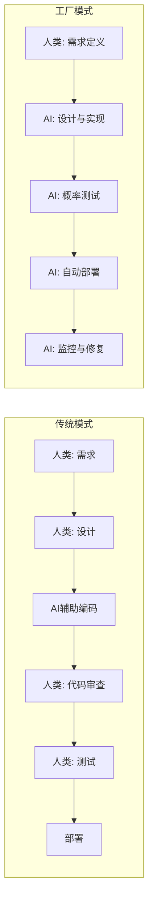
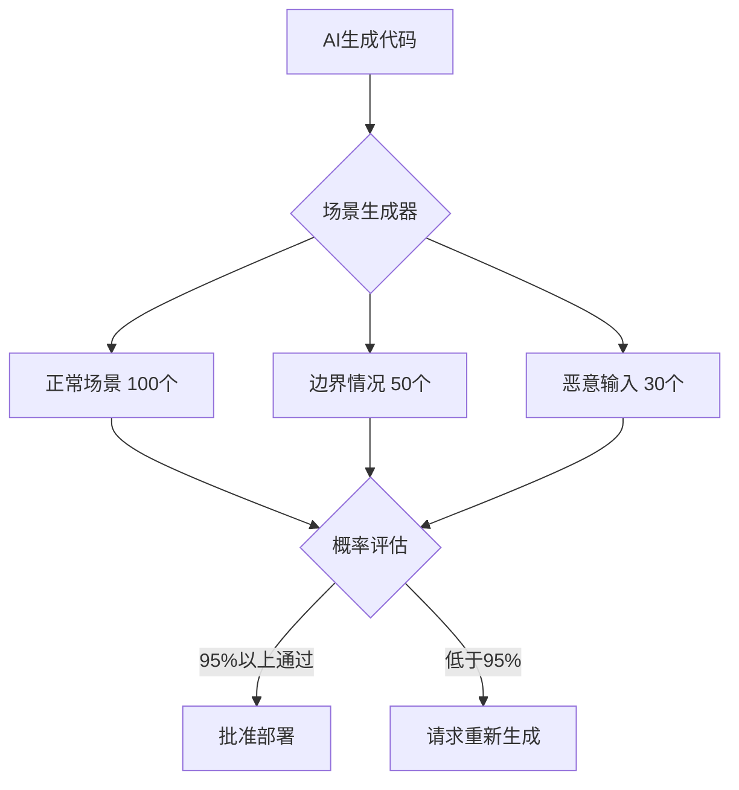
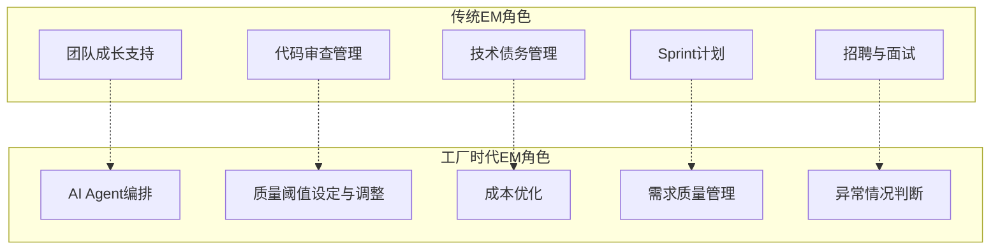

## 概述

"人类一行代码都不写。"仅仅一年前，这句话还只是一个夸张的未来预测。而在2026年的今天，它已经作为实际运营模式登上舞台。

iwashi86在「[Software Factories And The Agentic Moment](https://iwashi.co/2025/02/01/Software-Factories-And-The-Agentic-Moment)」中提出的<strong>Software Factory</strong>模式，超越了简单使用AI编程工具的范畴，从根本上重新设计了软件开发的全过程。它消除了人类开发者编写或审查代码的环节，由AI Agent自主运营从需求到部署的整个流水线。

本文分析该工厂模式的核心要素：<strong>零代码流程</strong>、<strong>基于场景的概率测试</strong>、<strong>每天1000美元的计算成本结构</strong>，以及<strong>EM（Engineering Manager）角色的根本变化</strong>。

## 零代码的开发流程

### 传统模式 vs 工厂模式

传统的AI辅助开发以人类开发者为中心。GitHub Copilot建议代码，人类审查和修改。但Software Factory模式颠覆了这一前提。



在工厂模式中，人类的角色集中在<strong>定义"做什么"</strong>上。"怎么做"完全属于AI Agent的领域。

### 代码审查为何消失

人类不审查代码并不意味着放弃质量。恰恰相反，这是承认<strong>人类审查的局限性</strong>。

- 人类审查者每天能处理的PR数量有物理上限
- 在AI Agent每天生成数百个PR的环境中，人类审查成为瓶颈
- 取而代之的是<strong>基于场景的概率测试</strong>承担质量门控的角色

## 基于场景的概率测试

### 确定性测试的局限

传统软件测试是确定性的："输入A应该得到输出B"。但AI生成的代码需要不同的方法。



### 概率测试的原理

概率测试不要求100%通过。它验证的是<strong>统计学上有意义的准确度水平</strong>。

1. <strong>场景自动生成</strong>: AI自动创建多种使用场景
2. <strong>大规模执行</strong>: 并行执行数百到数千个场景
3. <strong>统计评估</strong>: 分析整体通过率、性能分布和错误模式
4. <strong>基于阈值的判断</strong>: 超过预定义的通过率（如95%）即批准部署

这种方式类似于制造业的<strong>统计质量控制（SQC）</strong>——通过统计抽样来保证整体质量，而不是逐一检查每个产品。

### 测试成本与代码生成成本的逆转

有趣的是，<strong>测试成本超过了代码生成成本</strong>。代码生成只需一次，但验证代码质量需要运行数百个场景。这是每天1000美元计算成本的主要原因。

## 每天1000美元的计算成本

### 成本结构分析

运营Software Factory每天约需1000美元计算成本的估算，由以下构成：

| 项目 | 占比 | 日成本（估算） |
|------|------|---------------|
| AI Agent推理（代码生成） | 30% | ~$300 |
| 场景测试执行 | 40% | ~$400 |
| CI/CD流水线 | 15% | ~$150 |
| 监控与回滚系统 | 15% | ~$150 |

### 与开发者人力成本的比较

将一名高级开发者的日薪按$500-$800计算，每天$1000的计算成本相当于<strong>1.5-2名开发者</strong>。但AI工厂处理的工作量是人类团队的数十倍。

```
工厂模式的经济性:
- 日成本: ~$1,000（计算资源）
- 日产出: 处理200-500个PR
- 人类团队等量产出: 需要20-50名开发者
- 人类团队日成本: $10,000-$40,000
```

这10倍以上的成本效率是Software Factory模式的经济基础。当然，这是<strong>重复性、标准化工作</strong>的比较——全新架构设计等创造性工作仍需人类参与。

## EM（Engineering Manager）角色的变化

### 传统EM的角色

传统EM执行以下角色：

- 支持团队成员的技术成长
- 管理代码审查流程
- Sprint计划和任务分配
- 管理技术债务
- 招聘和面试

### 工厂时代的EM

在Software Factory模式中，EM的角色发生根本性变化。



具体来看：

1. <strong>AI Agent编排</strong>: 设计使用哪些Agent、以何种组合运行，以及Agent间的协作模式
2. <strong>质量阈值设定</strong>: 根据业务需求调整概率测试的通过标准。支付系统99.9%，管理后台95%等
3. <strong>成本优化</strong>: 决定如何将每天$1000的计算预算分配到各个任务
4. <strong>需求质量管理</strong>: AI要生成正确的代码，需求必须清晰。模糊的需求产生模糊的结果
5. <strong>异常情况判断</strong>: 对AI无法处理的边界情况做出最终判断

### 从EM到"工厂经理"

这一变化的核心是，EM从<strong>管理人的角色</strong>转变为<strong>管理系统的角色</strong>。不再培养人类团队成员的能力，而是以优化AI Agent流水线效率为中心。

这与制造业中现场主管因自动化产线引入而转变为"工厂管理者"的模式如出一辙。

## 现实挑战与局限

### 工厂模式适合的领域

- 以CRUD为核心的业务逻辑
- 标准化的API开发
- 重复性UI组件实现
- 迁移与重构工作

### 仍需人类参与的领域

- 系统架构的根本设计
- 需要深入理解业务领域的决策
- 法规应对与合规
- 用户体验的感性评估

### 组织层面的挑战

- <strong>信任问题</strong>: 建立对AI生成代码无需人工审查即部署到生产环境的组织信任
- <strong>责任问题</strong>: AI产生的Bug由谁负责
- <strong>成长问题</strong>: 初级开发者在不写代码的环境中如何成长

## 结论

Software Factory模式堪称软件开发的<strong>工业革命</strong>。正如制造业从手工作坊转向工厂生产，软件开发也在从工匠的手工制作转向自动化的工厂流水线。

重要的是，这一变化并非让开发者变得不必要，而是<strong>重新定义开发者的角色</strong>。从写代码的人变为设计和监督系统的人。EM从管理团队的人变为优化工厂流水线的人。

每天$1000的计算成本是这一转型的入场券。而且这一成本还将持续下降。真正的问题不是"这个模式是否可行？"，而是<strong>"我们的组织是否为这一转型做好了准备？"</strong>

## 参考资料

- [Software Factories And The Agentic Moment — iwashi86](https://iwashi.co/2025/02/01/Software-Factories-And-The-Agentic-Moment)
- [Anthropic Claude的Agentic编程模式](https://docs.anthropic.com/en/docs/agents)
- [Statistical Quality Control in Manufacturing — ASQ](https://asq.org/quality-resources/statistical-quality-control)
