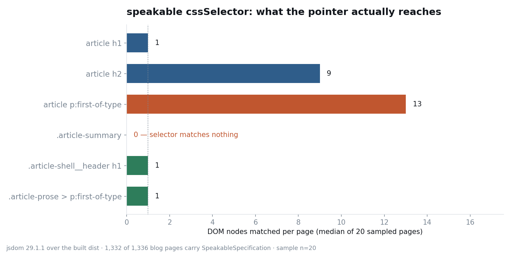
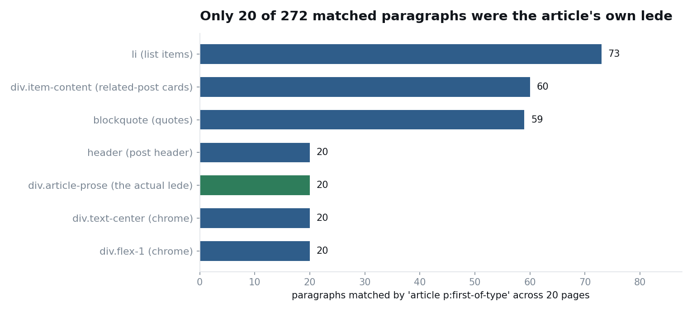

`article p:first-of-type`，看上去就是选一个段落。它选中了十三个。

这是样本的中位数，最多的一页抓了二十四个。而且这个选择器并不待在样式表里——那样至少肉眼能看出不对。它待在结构化数据里，对着任何会朗读我页面的机器说：读这几处。

## 一种带着值，一种指着 DOM

给页面加结构化数据，多数时候是在填值。标题填进 `headline`，日期填进 `datePublished`，姓名填进 `author`。填什么就发出去什么，错了看得见：标题空着就空着发出去，日期格式不对，检验器当场报格式错误。

`speakable` 不是这么运作的。schema.org 的 `SpeakableSpecification` 根本不装文本，它装的是 `cssSelector` 或 `xPath`，也就是<strong>一个指向文档内部位置的地址</strong>。值在 DOM 那边，标记这边只握着地址。设计意图很清楚：让作者而不是启发式规则来决定语音端该念哪几句。

握地址的标记，风险结构和带值的标记不一样。指向的东西没了，标记本身照样活蹦乱跳：JSON 语法对，类型对，必填属性齐全。你重构掉一个 class 名，从那天起这条指令就开始指向空气，而构建是绿的，测试全过。普通流水线里没有任何东西在盯着这层关系。在 Google 记录在案的结构化数据类型里，具备这个性质的实际上只有 `speakable` 一个。

指针腐坏有两个方向：什么都不指，或者指得太多。我的站点两样同时发生了。

## 官方给 speakable 划的那几条线

动手之前我把 [speakable 文档](https://developers.google.com/search/docs/appearance/structured-data/speakable)重读了一遍。条件摆在开头。

> This feature is in beta and subject to change. We're currently developing this feature and you may see changes in requirements or guidelines.

受众范围比多数人以为的窄得多。

> The `speakable` property works for users in the U.S. that have Google Home devices set to English, and publishers that publish content in English.

用英文发布的发布方，美国境内把 Google Home 设成英文的用户。一个同时发中日韩英四个版本的个人技术博客，不在这句话的任何一处。关于选择器的用法只有一行。

> Use either `cssSelector` or `xPath`; don't use both.

至于保证，这句我宁可原样引用（出处同上：https://developers.google.com/search/docs/appearance/structured-data/speakable ）。

> Google does not guarantee that features that consume structured data will show up in search results.

另一边，[Search Gallery](https://developers.google.com/search/docs/appearance/structured-data/search-gallery) 的支持类型清单里，Speakable 至今仍在。这是两件独立的事实，混着读，剩下的就只有"官方清单上有，先挂着说不定哪天有好处"这种模糊期待。顺带一提，这几年 Google 一直在减这份清单而不是加。翻[文档更新日志](https://developers.google.com/search/updates)可以看到，2026-05-08 给 FAQ 富媒体结果加了停止支持公告（"This feature will no longer appear in Google Search starting May 7, 2026."），2026-06-15 删掉了相关文档；练习题（practice problem）类型的文档更早，2026-01-06 就没了。FAQ 那次我给出的结论是[别删 Q&A 标记](/zh/blog/zh/faqpage-deprecation-ai-citation-2026)，理由是那套词汇自己带着文本，别的解析器还读得到。这套理由在指针身上不成立。指向的地方是空的，那对谁都是空的。

## 与其读选择器，不如把它跑一遍

我的页面一直在输出这么一段。

```json
{
  "@type": "SpeakableSpecification",
  "cssSelector": [
    "article h1",
    "article h2",
    "article p:first-of-type",
    ".article-summary"
  ]
}
```

标题、小标题、导语。意图很清楚。但发出去的不是意图。于是我用 jsdom 打开构建好的 HTML，把四个选择器真的执行了一遍。Node 22.22，jsdom 29.1.1，对象是 2026-08-11 的 `dist`。1,336 个博客页面里有 1,332 个带着 `SpeakableSpecification`，我从四种语言各取五页，共二十页做了 DOM 解析。

| 选择器 | 每页匹配数（中位数） | 20 页合计 | 判定 |
|---|---:|---:|---|
| `article h1` | 1 | 24 | 4 页上有两个 h1 |
| `article h2` | 9 | 229 | 把小标题全括进去 |
| `article p:first-of-type` | 13 | 272 | 指得太多 |
| `.article-summary` | 0 | 0 | 什么都没有 |

`.article-summary` 为 0 的原因平淡得让人泄气：站点里没有任何组件用这个 class。它曾经存在过，还是从头到尾只停在设想里，我翻提交记录也没能定论。能确定的是，这个选择器随着 1,332 个页面发出去的这段时间里，一次都没指到过东西。

这里有个有意思的坑。在整个 `dist` 里 grep `article-summary`，1,332 个页面全部命中，于是很容易一句"在啊"就翻过去了。打开来看，这个字符串每页只出现一次，就是 JSON-LD 里选择器自己的值。

```
...akableSpecification","cssSelector":["article h1","article h2",
"article p:first-of-type",".article-summary"]},"url":"https://jangwo...
```

<strong>指针因为自己的名字而被 grep 命中。</strong>文本搜索根本抓不住这类腐坏。选择器只有跑起来才算数。



## 那 272 个段落住在哪里

比起 0，13 更值得追。我把匹配到的段落按父元素归了个类。



| 父元素 | 匹配到的段落数 | 实际上是什么 |
|---|---:|---|
| `li` | 73 | 列表项里的段落 |
| `div.item-content` | 60 | 相关文章推荐卡片 |
| `blockquote` | 59 | 引用块 |
| `header.article-shell__header` | 20 | 文章头部 |
| `div.article-prose` | 20 | 正文导语 |
| `div.text-center` | 20 | 布局外壳 |
| `div.flex-1` | 20 | 布局外壳 |

我想要的是 272 个里的那 20 个。原因不神秘，就在选择器的定义本身：`:first-of-type` 指的不是"文档中最先出现的那个类型"，而是<strong>"同一父元素下同类兄弟中的第一个"</strong>。再配上不管层级、一路往下扫的后代组合符，每个装着段落的容器都会贡献一个。

最扎人的是 `div.item-content` 那 60 个。它们是相关文章卡片上的推荐语，机器写的导航文案。假如真有语音端遵照这条标注，它会把三段推荐语和文章开头那一段<strong>以同等身份放进朗读候选</strong>。自己的论点，输给了自己的侧边栏。

这个形状我认得。[之前实测文本片段引用深链](/zh/blog/zh/text-fragment-citation-deep-link-audit-2026)时，代码块里 15 条断了 14 条。同一类故障。指针很少在写下的那一刻坏掉，它坏在<strong>周围的东西动了以后</strong>。

## 每样工具能看见什么，看不见什么

schema.org 的 Schema Markup Validator 抓住了那个空指针。把线上 URL 丢进去，返回 3 个对象、1 条错误，`NO_MATCHES_FOUND`、`isSevere: true`，点名 `.article-summary`。这说明它不只看语法，还会<strong>把选择器放到抓取到的文档上执行</strong>。这是个挺硬的能力，我估计多数人从没用到过。

而对那个 13，它一声没吭。这很合理，匹配多个节点不是错误。`speakable` 接受数组，指向多个目标是规范认可的写法。它不违规，只是不对。

| 故障类型 | schema 检验器 | 构建 | 文本 grep | 真正能拦住的东西 |
|---|---|---|---|---|
| 选择器匹配 0 个 | 能抓（severe） | 放行 | 放行 | 部署闸门 |
| 选择器匹配过多 | 放行 | 放行 | 放行 | 自己写的数量上限 |
| 用在受众范围之外 | 放行 | 放行 | 放行 | 人的判断 |

第三行没有工具解。一个多语言个人博客该不该挂上一个明确写着"面向美国英文 Google Home 用户"的功能，没有哪个 linter 会替你回答。

## 改后的选择器，以及守住它的断言

四个减到两个，各自收窄到只命中一处。

```js
// src/components/BaseHead.astro
const speakableSchema = articleData ? {
  '@context': 'https://schema.org',
  '@type': 'WebPage',
  'speakable': {
    '@type': 'SpeakableSpecification',
    'cssSelector': ['.article-shell__header h1', '.article-prose > p:first-of-type']
  },
  'url': canonicalURL.toString()
} : null;
```

起作用的是把后代组合符换成了子组合符。`.article-prose > p:first-of-type` 只看正文容器的直接子元素，列表和引用块里的段落压根进不了候选集。同样二十页重新测了一遍。

| 选择器 | 命中页面 | 每页节点数 |
|---|---:|---:|
| `.article-shell__header h1` | 20 / 20 | 1 |
| `.article-prose > p:first-of-type` | 20 / 20 | 1 |

然后在 postbuild 上挂了一条断言，免得它再一次悄悄烂掉：打开产物，执行选择器，为 0 判失败，段落选择器超过上限判失败。

```js
// scripts/validate-speakable.mjs（要点）
for (const selector of selectors) {
  const count = dom.window.document.querySelectorAll(selector).length;
  if (count === 0) {
    failures.push(`${file}: "${selector}" 什么都没匹配到`);
  } else if (/\bp\b|paragraph/.test(selector) && count > MAX_PARAGRAPH_MATCHES) {
    failures.push(`${file}: "${selector}" 匹配了 ${count} 个`);
  }
}
```

把它对准修改前的 `dist`，正好挂 40 条：二十页乘两个坏选择器。

```
❌ validate-speakable 失败（40 条）
  - dist/en/blog/en/45-day-analytics-report-2025-11/index.html:
      "article p:first-of-type" 匹配了 24 个（上限 2）
  - dist/en/blog/en/45-day-analytics-report-2025-11/index.html:
      ".article-summary" 什么都没匹配到
  ...
```

当初搭[在 CI 里校验 JSON-LD 的流程](/zh/blog/zh/validate-structured-data-ci-jsonld-2026)时，我看的是语法和必填属性。那套检查会天天放这段标记过去，因为它语法无懈可击。对指针型属性，得单独问一句：<strong>它解析出来到底是几个节点。</strong>

有条线得老实划清楚。我不会说这次修改能改善搜索表现。我不是面向美国英文 Google Home 用户的英文新闻发布方，Google 也白纸黑字写着结构化数据不保证在结果中出现；至于 LLM 爬虫会不会读 `speakable`，我没有验证过，所以也不会写得好像它们会读。我修好的是<strong>自己站点对机器所作陈述的准确度</strong>。与其把一句错的陈述印在 1,332 个页面上发出去，不如留两行对的。样本是二十页，不是全量，这点也一并写在这里。

## 发布"指路型"标记之前

- 先在结构化数据里搜一遍 `cssSelector` 和 `xPath`。装地址而不是装值的属性，要单独管。
- 选择器靠执行来验证，不靠 grep。选择器字符串永远会命中它自己。
- 看到 `:first-of-type`、`:first-child` 或后代组合符，就数一遍匹配数。想要 1 个却出来两位数，把组合符收紧成 `>`。
- schema 检验器会把 0 匹配判成 severe，却对"匹配过多"直接放行。上限得你自己写。
- 重构 class 名的时候顺手搜一遍 JSON-LD。样式和结构化数据依赖同一个 class 名这件事，没有哪个 linter 会提醒你。
- 加类型之前先读受众限制。测试版标注和地区、语言的限制，通常就在文档第一段。

还有一件我没想明白：明知不在受众范围内，却把这两行留着，这个判断到底对不对。删掉就少一样要维护的东西；留着就多一句机器可读的陈述——这页的核心是标题和第一段。眼下有闸门保证这句陈述为真，所以我选了留。半年后是不是同一个答案，我说不好。

把结构化数据绑进部署闸门，这是我当作正经活儿在做的事。联系方式放在个人资料里。
