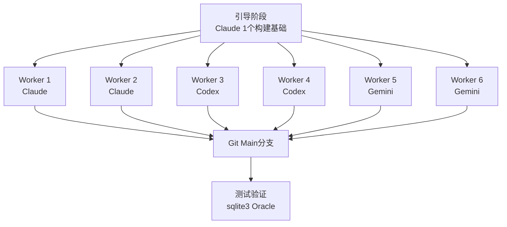
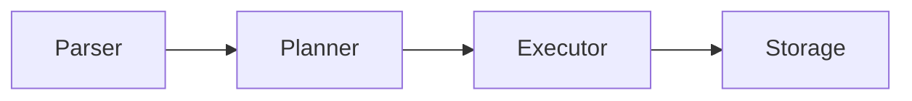

## 概述

6个AI智能体（Claude 2个、Codex 2个、Gemini 2个）<strong>并行协作</strong>，用Rust构建了一个SQLite兼容的数据库引擎。成果为约19,000行代码，通过282个单元测试的高完成度系统。

该实验在[Kian Kyars的博客文章](https://kiankyars.github.io/machine_learning/2026/02/12/sqlite.html)中详细介绍，在Hacker News上获得63分的关注。

## 架构：将软件开发视为分布式系统

项目的核心理念很简单：<strong>将软件工程当作分布式系统来处理</strong>。协调手段是git、锁文件、测试和合并纪律。

### 工作流程



### 智能体循环

每个智能体无限循环以下步骤：

1. 拉取最新main分支
2. 认领一个限定范围的任务（锁文件）
3. 实现 + 以sqlite3为oracle进行测试
4. 更新共享进度文档/笔记
5. 推送

## 已实现功能

该集群构建的SQLite克隆完成度令人惊叹：

| 层级 | 实现项目 |
|------|----------|
| <strong>解析器</strong> | SQL解析器 |
| <strong>规划器</strong> | 基于统计的查询规划 |
| <strong>执行器</strong> | Volcano模型执行器 |
| <strong>存储</strong> | 分页器、B+树 |
| <strong>事务</strong> | WAL、恢复、事务语义 |
| <strong>功能</strong> | JOIN、聚合、索引、分组聚合 |

共<strong>154次提交</strong>，开发周期2天（2026-02-10至02-12）。

## 协调成本的现实

最有趣的发现是<strong>协调税（coordination tax）</strong>。

```
总提交数: 154
协调相关提交: 84 (54.5%)
├── 锁认领
├── 锁释放
├── 过期锁清理
└── 任务协调
```

<strong>全部提交的54.5%是纯粹的协调开销</strong>。这表明多智能体系统的并行吞吐量在很大程度上取决于锁卫生和过期锁清理纪律。

## 成功因素分析

### 1. Oracle验证 + 高频测试

使用sqlite3作为正确答案（oracle）验证每个智能体的输出。通过`cargo test`和`./test.sh`实现的快速反馈循环起到了决定性作用。

### 2. 强模块边界



解析器→规划器→执行器→存储的明确模块边界使智能体能在<strong>正交切片</strong>上工作，合并冲突最小化。

### 3. 共享状态文档是"运行时"而非"文档"

PROGRESS.md和设计笔记不是单纯的文档，而是作为<strong>系统的运行时状态</strong>发挥作用。这展示了多智能体协作中共享状态管理的重要性。

## 局限与教训

### 合并器的缺失

为清理重复和漂移而实现的合并器智能体仅在项目结束时运行了一次。Gemini未能完成全部去重工作便中途停止。<strong>合并器应与其他智能体同样频繁地运行</strong>。

### 无法追踪Token使用量

各平台使用不同的格式，无法确定哪个智能体贡献最大。

### 文档爆炸

PROGRESS.md增长到490行，notes目录积累了大量文档——这是智能体间通信成本的直观体现。

## 与先前研究的关联

该实验与[Verdent AI的多智能体SWE-bench结果](/zh/blog/multi-agent-swe-bench-verdent)处于同一脉络。Verdent展示了基准测试中的并行执行效果，而本SQLite项目则实证了<strong>实际系统构建中的多智能体分工</strong>。

核心共同点：

- 给智能体提供<strong>窄接口</strong>、<strong>共同真相来源</strong>和<strong>快速反馈</strong>，就能在实际系统代码中获得复合吞吐量
- 测试是<strong>反熵力量</strong>

## 核心总结

| 项目 | 数值 |
|------|------|
| 智能体数量 | 6个（Claude 2 + Codex 2 + Gemini 2） |
| 代码行数 | 约19,000行（Rust） |
| 提交次数 | 154 |
| 协调开销 | 54.5% |
| 测试 | 282个通过 |
| 开发周期 | 2天 |

## 结论

该实验同时展示了多智能体开发的潜力与局限。6个智能体在2天内构建出19,000行可工作的数据库引擎令人印象深刻，但超过一半的提交是协调开销这一事实不容忽视。

<strong>并行性很强大，但只有在严格的任务边界下才有效</strong>。测试不仅仅是质量保证，更是对抗智能体系统熵增的核心机制。

## 参考资料

- [Building SQLite With a Small Swarm — Kian Kyars](https://kiankyars.github.io/machine_learning/2026/02/12/sqlite.html)
- [GitHub: kiankyars/sqlite](https://github.com/kiankyars/sqlite)
- [GitHub: kiankyars/parallel-ralph](https://github.com/kiankyars/parallel-ralph)
- [Anthropic: Building a C Compiler](https://www.anthropic.com/engineering/building-c-compiler)
- [Cursor: Scaling Agents](https://cursor.com/blog/scaling-agents)
