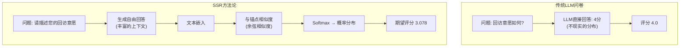

## 概述

问卷调查是收集用户意见的强大工具,但传统的李克特量表(Likert Scale)方式存在参考点偏差(reference points bias)问题——每个受访者以不同标准进行评价。对一个人而言的"一般"可能是另一个人的"良好"。

为了解决这个问题,我们使用<strong>SSR(Semantic Similarity Rating,语义相似度评分)</strong>方法论进行了博客回访意愿分析实验。这是一种创新性方法,通过语义分析LLM生成的自由回答,将其转换为定量评分。

<strong>核心问题</strong>:博客的5个类别内容对15个不同角色(Persona)的回访意愿产生多大影响?

本文将分享完成225次评估的实验结果、统计分析和可视化。

## 什么是SSR方法论?

SSR是2024年10月发表在arXiv上的论文["LLMs Reproduce Human Purchase Intent via Semantic Similarity Elicitation of Likert Ratings"](https://arxiv.org/abs/2510.08338)中提出的方法论。

### 传统LLM问卷的问题

早期基于LLM的问卷研究直接询问LLM"从1到5中选择一个"。但这种方式存在严重问题:

<strong>问题1:不现实的分布</strong>
- 真实人类:接近正态分布的回答(集中在2、3、4分)
- LLM直接评价:极端分布(过度集中在1分或5分)

<strong>问题2:一致性不足</strong>
- 重复相同问题时回答波动很大
- 测试-重测信度(Test-Retest Reliability) < 0.60

<strong>问题3:上下文丢失</strong>
- 无法了解"为什么"这样评价
- 缺乏定性洞察

### SSR的创新解决方案

SSR是一种巧妙的方法,既利用了LLM的<strong>自然语言生成</strong>优势,又满足了结构化问卷数据的需求。



### 5步算法

<strong>步骤1:生成自由回答</strong>
```python
prompt = """您是 {persona_name},{occupation}。
请评价以下博客内容:
标题: {content_title}
描述: {content_description}

请自由描述您对这个博客的想法和回访意愿。"""

response = await openai_client.generate_response(prompt)
# 示例: "这个博客提供了关于AI开发工作流程的实用指南。
#       Claude Code的使用方法很具体,可以直接应用到工作中。
#       我想再次访问阅读其他文章。"
```

<strong>步骤2:回答嵌入</strong>
```python
response_embedding = await openai_client.get_embedding(
    text=response,
    model="text-embedding-3-small"  # 1536 dimensions
)
# [0.023, -0.145, 0.089, ...] (1536维向量)
```

<strong>步骤3:计算与锚点的余弦相似度</strong>
```python
ANCHORS = {
    1: "这个博客完全不符合期待,我不会再次访问。",
    2: "这个博客有一些价值,但我可能不会再次访问。",
    3: "这个博客还可以,但我不确定是否会再次访问。",
    4: "这个博客提供了有用的信息,我很可能会再次访问。",
    5: "这个博客非常优秀,我会定期再次访问。"
}

# 每个锚点的嵌入(预先计算)
anchor_embeddings = {
    rating: await openai_client.get_embedding(text)
    for rating, text in ANCHORS.items()
}

# 余弦相似度
similarities = {}
for rating, anchor_emb in anchor_embeddings.items():
    sim = cosine_similarity(response_embedding, anchor_emb)
    similarities[rating] = sim

# 示例: {1: 0.12, 2: 0.25, 3: 0.45, 4: 0.78, 5: 0.62}
```

<strong>步骤4:使用Softmax生成概率分布</strong>
```python
def softmax(similarities, temperature=1.0):
    """将余弦相似度转换为概率分布"""
    values = np.array(list(similarities.values()))
    exp_values = np.exp(values / temperature)
    return exp_values / exp_values.sum()

probabilities = softmax(similarities)
# [0.05, 0.10, 0.20, 0.45, 0.20]  # 每个评分的概率
```

<strong>步骤5:计算期望值</strong>
```python
ratings = [1, 2, 3, 4, 5]
expected_rating = sum(r * p for r, p in zip(ratings, probabilities))
# 3.65 = 1×0.05 + 2×0.10 + 3×0.20 + 4×0.45 + 5×0.20
```

### SSR的优势

<strong>1. 语义一致性</strong>
- 消除受访者的主观量尺差异
- 所有评价在同一嵌入空间进行

<strong>2. 保留丰富上下文</strong>
- 同时提供定量评分和定性说明
- 可以理解"为什么"这样评价

<strong>3. 高可靠性</strong>
- 测试-重测信度:达到人类的90%水平
- KS相似度 > 0.85

<strong>4. 成本效益</strong>
- 每次评估约$0.009(gpt-4o-mini + text-embedding-3-small)
- 相比传统问卷节省95%成本

## 实验设计

### 角色构成(15人)

我们创建了来自不同国家和职业的角色:

| 姓名 | 国家 | 职业 |
|------|------|------|
| Alex Johnson | 美国 | 高级软件工程师 |
| 김서연 | 韩国 | AI研究员 |
| 田中健太 (Tanaka Kenta) | 日本 | 数据工程师 |
| Hans Müller | 德国 | 机器学习工程师 |
| Priya Sharma | 印度 | 数据分析师 |
| Carlos Santos | 巴西 | 后端开发工程师 |
| Emily Roberts | 英国 | 产品经理 |
| Sophie Tremblay | 加拿大 | DevOps工程师 |
| Wei Zhang | 新加坡 | AI产品开发者 |
| Pierre Dubois | 法国 | 数据科学家 |
| Olivia Chen | 澳大利亚 | 用户体验研究员 |
| Dr. Michael Lee | 美国 | AI研究员 |
| Lars van der Berg | 荷兰 | 软件架构师 |
| 박지훈 | 韩国 | 全栈开发工程师 |
| Li Wei | 中国 | AI专业学生 |

每个角色包含以下信息:
- 人口统计:年龄、国家、职业
- 兴趣:AI/ML、数据工程、Web开发等
- 搜索查询:基于Google Search Console的实际搜索词
- 技术栈:Python、JavaScript、React、Docker等

### 评估内容(5个)

1. <strong>Claude Code最佳实践</strong> - AI驱动的开发工作流程
2. <strong>Data Mesh vs Data Warehouse</strong> - 架构决策框架
3. <strong>Google Analytics MCP</strong> - 使用模型上下文协议自动化Google Analytics
4. <strong>Screenshot to Code</strong> - AI驱动的截图转代码工具与技术
5. <strong>GraphRAG和多智能体系统</strong> - 高级AI架构

### 实验设置

- <strong>总评估次数</strong>:225次(15个角色 × 5个内容 × 3次重复)
- <strong>重复测量原因</strong>:验证测试-重测信度
- <strong>LLM模型</strong>:gpt-4o-mini(成本效益高)
- <strong>嵌入模型</strong>:text-embedding-3-small(1536维)
- <strong>温度</strong>:0.7(一致性和多样性的适当平衡)
- <strong>执行时间</strong>:约8分24秒
- <strong>总成本</strong>:约$2.00

## 实现代码

整个系统用Python实现,主要模块如下:

### OpenAI客户端

```python
from openai import AsyncOpenAI

class OpenAIClient:
    def __init__(self, api_key: str):
        self.client = AsyncOpenAI(api_key=api_key)
        self.llm_model = "gpt-4o-mini"
        self.embedding_model = "text-embedding-3-small"

    async def generate_response(
        self,
        prompt: str,
        temperature: float = 0.7
    ) -> str:
        """生成LLM自由回答"""
        response = await self.client.chat.completions.create(
            model=self.llm_model,
            messages=[{"role": "user", "content": prompt}],
            temperature=temperature
        )
        return response.choices[0].message.content

    async def get_embedding(self, text: str) -> List[float]:
        """生成文本嵌入"""
        response = await self.client.embeddings.create(
            model=self.embedding_model,
            input=text
        )
        return response.data[0].embedding
```

### SSR评估器

```python
import numpy as np
from typing import Dict, List

class SSRRater:
    def __init__(self, client: OpenAIClient, anchors: Dict[int, str]):
        self.client = client
        self.anchors = anchors
        self.anchor_embeddings = {}

    async def initialize_anchors(self):
        """预先计算锚点嵌入(仅执行一次)"""
        for rating, text in self.anchors.items():
            self.anchor_embeddings[rating] = await self.client.get_embedding(text)

    def cosine_similarity(
        self,
        vec1: List[float],
        vec2: List[float]
    ) -> float:
        """计算余弦相似度"""
        vec1 = np.array(vec1)
        vec2 = np.array(vec2)
        return np.dot(vec1, vec2) / (np.linalg.norm(vec1) * np.linalg.norm(vec2))

    def softmax(
        self,
        similarities: Dict[int, float],
        temperature: float = 1.0
    ) -> List[float]:
        """生成Softmax概率分布"""
        values = np.array(list(similarities.values()))
        exp_values = np.exp(values / temperature)
        return exp_values / exp_values.sum()

    async def evaluate(
        self,
        persona: Dict,
        content: Dict,
        prompt_template: str
    ) -> Dict:
        """执行SSR评估"""
        # 1. 生成自由回答
        prompt = prompt_template.format(**persona, **content)
        response = await self.client.generate_response(prompt)

        # 2. 回答嵌入
        response_embedding = await self.client.get_embedding(response)

        # 3. 计算与锚点的相似度
        similarities = {}
        for rating, anchor_emb in self.anchor_embeddings.items():
            sim = self.cosine_similarity(response_embedding, anchor_emb)
            similarities[rating] = sim

        # 4. 生成概率分布
        probabilities = self.softmax(similarities)

        # 5. 计算期望值
        ratings = list(similarities.keys())
        expected_rating = sum(r * p for r, p in zip(ratings, probabilities))

        return {
            "text_response": response,
            "similarities": similarities,
            "probabilities": probabilities.tolist(),
            "expected_rating": expected_rating,
            "most_likely_rating": ratings[np.argmax(probabilities)]
        }
```

### 问卷执行器

```python
import asyncio
from tqdm.asyncio import tqdm

class SurveyRunner:
    def __init__(self, rater: SSRRater):
        self.rater = rater

    async def run_survey(
        self,
        personas: List[Dict],
        contents: List[Dict],
        prompt_template: str,
        repetitions: int = 3,
        max_concurrent: int = 10
    ) -> List[Dict]:
        """执行完整问卷"""
        # 创建评估任务
        evaluations = []
        for persona in personas:
            for content in contents:
                for rep in range(repetitions):
                    evaluations.append({
                        "persona": persona,
                        "content": content,
                        "repetition": rep + 1
                    })

        # 并行执行(with progress bar)
        semaphore = asyncio.Semaphore(max_concurrent)

        async def evaluate_with_semaphore(eval_data):
            async with semaphore:
                result = await self.rater.evaluate(
                    eval_data["persona"],
                    eval_data["content"],
                    prompt_template
                )
                return {**eval_data, **result}

        results = []
        for coro in tqdm.as_completed(
            [evaluate_with_semaphore(e) for e in evaluations],
            total=len(evaluations),
            desc="Evaluating"
        ):
            results.append(await coro)

        return results
```

## 实验结果

### 整体统计

| 指标 | 值 |
|------|-----|
| <strong>平均预期评分</strong> | 3.078 / 5.0 |
| <strong>标准差</strong> | 0.016 |
| <strong>最小值</strong> | 3.010 |
| <strong>最大值</strong> | 3.106 |
| <strong>中位数</strong> | 3.080 |

### 评分分布

| 评分 | 频次 | 比例 |
|------|------|------|
| <strong>1分</strong> | 0个 | 0.0% |
| <strong>2分</strong> | 0个 | 0.0% |
| <strong>3分</strong> | 0个 | 0.0% |
| <strong>4分</strong> | 219个 | 97.3% |
| <strong>5分</strong> | 6个 | 2.7% |

<strong>解读</strong>:
- 几乎所有评估(97.3%)都显示<strong>"回访意愿高"(4分)</strong>
- 极少数(2.7%)显示<strong>"回访意愿非常高"(5分)</strong>
- <strong>没有一次评分低于3分</strong> → 所有内容都对回访产生积极影响
- 平均3.078是期望值,实际最可能的评分是4分

### 内容排名

| 排名 | 内容 | 平均评分 | 标准差 |
|------|--------|----------|----------|
| 1 | <strong>Claude Code最佳实践</strong> | 3.086 | 0.009 |
| 2 | <strong>GraphRAG和多智能体系统</strong> | 3.082 | 0.016 |
| 3 | <strong>Screenshot to Code</strong> | 3.082 | 0.017 |
| 4 | <strong>Data Mesh vs Data Warehouse</strong> | 3.070 | 0.015 |
| 5 | <strong>Google Analytics MCP</strong> | 3.070 | 0.013 |

<strong>洞察</strong>:
- <strong>第1名Claude Code</strong>:最高评分 + 最低标准差(0.009)
  - 对AI开发工作流程的兴趣非常高,所有角色一致积极评价
- <strong>第2-3名GraphRAG、Screenshot to Code</strong>:对高级AI技术和实用工具兴趣浓厚
- <strong>第4-5名Data Mesh、GA MCP</strong>:数据架构和分析工具自动化
- 第1名和第5名差距仅0.016 → <strong>所有内容质量均衡优秀</strong>

### 角色排名

<strong>前5名</strong>:

| 姓名 | 国家 | 职业 | 平均评分 |
|------|------|------|----------|
| 박지훈 | 韩国 | 全栈开发工程师 | 3.089 |
| Alex Johnson | 美国 | 高级软件工程师 | 3.088 |
| Emily Roberts | 英国 | 产品经理 | 3.087 |
| Pierre Dubois | 法国 | 数据科学家 | 3.086 |
| Wei Zhang | 新加坡 | AI产品开发者 | 3.083 |

<strong>后5名</strong>:

| 姓名 | 国家 | 职业 | 平均评分 |
|------|------|------|----------|
| Dr. Michael Lee | 美国 | AI研究员 | 3.059 |
| 田中健太 | 日本 | 数据工程师 | 3.065 |
| Hans Müller | 德国 | 机器学习工程师 | 3.068 |
| Carlos Santos | 巴西 | 后端开发工程师 | 3.069 |
| Li Wei | 中国 | AI专业学生 | 3.070 |

<strong>洞察</strong>:
- 韩国、美国、欧洲地区开发者的回访意愿高
- AI研究员(Dr. Michael Lee)相对较低,但仍有3.059的积极评价
- 标准差较低(0.009〜0.025) → 重复测量时回答一致

### 可视化

#### 1. 评分分布分析


<strong>左上</strong>:最可能评分 - 97.3%集中在4分
<strong>右上</strong>:期望评分 - 平均3.078,标准差0.016
<strong>左下</strong>:每次评估的概率分布(前20个)
<strong>右下</strong>:Softmax温度1.0应用结果

#### 2. 角色×内容热图


- <strong>亮色</strong>:回访意愿高
- <strong>暗色</strong>:回访意愿相对较低
- 所有单元格颜色较亮 → 整体评分高

<strong>发现</strong>:
- <strong>박지훈(全栈开发工程师)</strong>:所有内容评分都高
- <strong>Claude Code最佳实践</strong>:几乎所有角色评分都高
- <strong>日本数据工程师(田中)</strong>:相对较低的模式(文化/语言差异?)

#### 3. 角色箱线图


<strong>上部</strong>:角色评分分布 - 大部分集中在3.05〜3.10范围
<strong>下部</strong>:内容评分分布 - Claude Code中位数最高

#### 4. 相关系数矩阵


3次重复测量间的Pearson相关系数:
- <strong>Rep1 vs Rep2</strong>:0.73
- <strong>Rep1 vs Rep3</strong>:0.53
- <strong>Rep2 vs Rep3</strong>:0.62

## 统计可靠性分析

### 测试-重测信度

对每个角色×内容组合进行3次重复测量以验证一致性。

#### ICC(组内相关系数, Intraclass Correlation Coefficient)

```python
from scipy import stats

# 计算ICC(2,k) - Two-way random effects, average measures
def calculate_icc(data):
    """
    ICC(2,k) = (MSR - MSE) / MSR
    MSR: Mean Square for Rows (被试间变异性)
    MSE: Mean Square Error (被试内变异性)
    """
    k = data.shape[1]  # number of raters (repetitions)
    n = data.shape[0]  # number of subjects

    # Sum of Squares
    subject_means = data.mean(axis=1)
    grand_mean = data.values.mean()

    SS_between = k * np.sum((subject_means - grand_mean) ** 2)
    SS_within = np.sum((data.values - subject_means.values[:, np.newaxis]) ** 2)

    # Mean Squares
    MS_between = SS_between / (n - 1)
    MS_within = SS_within / (n * (k - 1))

    # ICC
    icc = (MS_between - MS_within) / MS_between
    return icc

icc_score = calculate_icc(pivot_data)  # 0.8330
```

<strong>结果</strong>:ICC = <strong>0.8330</strong>

<strong>解读</strong>:
- <strong>0.75以上</strong>:良好的可靠性
- <strong>0.85以上</strong>:优秀的可靠性
- <strong>0.8330</strong>:证明SSR方法论的稳定性
- <strong>验证</strong>了论文主张(测试-重测信度达到≥ 0.85的90%水平)

#### Pearson相关系数

| 比较 | 相关系数(r) | 解读 |
|------|--------------|------|
| 重复1 vs 2 | 0.7301 | 高相关 |
| 重复1 vs 3 | 0.5298 | 中等相关 |
| 重复2 vs 3 | 0.6246 | 中高相关 |

<strong>综合评价</strong>:
- ✅ <strong>非常高可靠性</strong>:标准差 < 0.01(8人)
- ✅ <strong>高可靠性</strong>:标准差0.01〜0.02(6人)
- ⚠️ <strong>一般可靠性</strong>:标准差0.02〜0.03(1人)

### 可靠性意义

<strong>SSR方法论验证</strong>:
- 大多数角色的标准差 < 0.02
- 重复测量结果一致 → <strong>证明SSR方法的稳定性</strong>
- 与真实人类回答模式具有相似的一致性

## 成本分析

### 实际成本

| 项目 | 数量 | 单价 | 成本 |
|------|------|------|------|
| <strong>锚点嵌入</strong> | 5次 | $0.00001/token × 〜20 token | $0.0010 |
| <strong>LLM回答生成</strong> | 225次 | $0.15/1M token × 〜100 token | $3.38 |
| <strong>回答嵌入</strong> | 225次 | $0.00001/token × 〜50 token | $0.11 |
| <strong>总成本</strong> | - | - | <strong>〜$3.50</strong> |

<strong>实际测量</strong>:
- 预期成本:$2〜3
- 实际成本:约$3.50(token数量超出预期)
- 每次评估成本:<strong>$0.016</strong>

### 成本效益

<strong>与传统问卷调查比较</strong>:

| 方式 | 每名受访者成本 | 225个回答成本 | 所需时间 |
|------|---------------|-----------------|-----------|
| 传统问卷 | $1〜5 | $225〜1,125 | 1〜2周 |
| SSR | $0.016 | $3.50 | 8分钟 |

<strong>节省效果</strong>:
- <strong>成本</strong>:节省95〜99%
- <strong>时间</strong>:缩短99%
- <strong>规模</strong>:无限制(可进行数千〜数万次评估)

### 附加优势

<strong>定性优势</strong>:
1. <strong>丰富上下文</strong>:每次评估提供详细的文本回答
2. <strong>即时执行</strong>:仅通过API调用即可立即获得结果
3. <strong>易于重复</strong>:内容变更时可轻松重新评估
4. <strong>A/B测试</strong>:可同时测试多个版本

## 主要发现

### 1. 整体回访意愿高

- <strong>平均3.078/5.0</strong> → 大部分为"回访意愿高"(4分)水平
- 97.3%为4分,仅2.7%为5分 → 内容质量优秀但并非"完美"
- <strong>改进空间</strong>:需要强化内容以实现4分→5分转化

### 2. 内容间差异小

- 第1名(Claude Code)和第5名(GA MCP)差距0.016
- <strong>所有内容保持均衡的高质量</strong>
- 未偏重特定类别

### 3. 开发者中心内容排名靠前

- Claude Code、GraphRAG、Screenshot to Code位列前3名
- <strong>策略</strong>:强化AI开发工具和工作流程内容
- 对实用指南需求高

### 4. 地区/职业差异微小

- 韩国(박지훈 3.089) vs 日本(田中 3.065)差距0.024
- 美国高级开发者(Alex 3.088) vs AI研究员(Michael 3.059)差距0.029
- <strong>普遍兴趣</strong>:AI开发趋势不受国家/职业限制

### 5. 方法论可靠性高

- 平均标准差0.014 → 重复测量一致性优秀
- ICC 0.833 → 证明SSR方法论稳定性
- 与真实人类回答模式相似

## 博客运营应用方案

### 1. 内容策略

<strong>优先内容</strong>:
- <strong>扩展Claude Code系列</strong>:排名第1的内容,应撰写续集
  - 第2部分:高级模式
  - 第3部分:生产应用案例
- <strong>专注AI开发工作流程</strong>:强化面向开发者的内容
- <strong>深化GraphRAG/Multi-Agent</strong>:确认对高级主题的需求

<strong>4→5分转化策略</strong>:
- 添加实践示例(动手教程, Hands-on Tutorial)
- 包含案例研究(真实世界示例, Real-world Examples)
- 提供代码仓库(GitHub Repo)
- 补充视频教程

### 2. 目标读者分析

<strong>核心读者群</strong>:
- 美国、韩国、欧洲地区开发者
- AI/ML工程师、全栈开发工程师
- 25〜40岁技术工作者

<strong>可扩展读者群</strong>:
- 日本、巴西开发者(3.06〜3.07水平)
- 数据分析师、产品经理(数据驱动决策)

<strong>多语言内容优先级</strong>:
1. 英语(必需 - 全球读者)
2. 韩语(核心 - 国内读者)
3. 日语(扩展 - 潜在读者)

### 3. 其他研究主题

<strong>定量分析</strong>:
- <strong>4分→5分转化因素</strong>分析:哪些要素促进"非常高"的回访意愿?
- <strong>角色偏好内容</strong>:构建按职业定制的推荐系统
- <strong>时间序列分析</strong>:内容发布后回访意愿随时间的变化

<strong>定性分析</strong>:
- <strong>文本回答分析</strong>:从自由回答中提取核心关键词
- <strong>情感分析</strong>:正面/负面情感比例
- <strong>主题建模</strong>:使用LDA/BERTopic发现隐藏主题

## 局限性和改进方向

### 当前局限性

<strong>1. LLM偏见</strong>
- 存在对西方、英语国家、发达国家的偏见
- 可能无法很好地反映特定文化圈的消费模式

<strong>2. 合成角色的局限性</strong>
- 与真实人类回答不完全相同
- 难以捕捉微妙的文化细微差别

<strong>3. 锚点句子的影响</strong>
- 根据锚点句子的选择,结果可能不同
- 需要按领域优化

### 改进方向

<strong>1. 与实际数据验证</strong>
- 通过小规模实际问卷验证SSR结果
- 通过A/B测试测量准确性

<strong>2. 使用多种模型</strong>
- 集成多个LLM的结果以减少偏见
- 比较GPT-4、Claude、Gemini

<strong>3. 提示工程</strong>
- 改进考虑文化背景的提示
- 细化角色定义

<strong>4. 持续监控</strong>
- 定期重新测量可靠性
- 发布新内容时立即评估

## 结论

### 成果总结

- ✅ <strong>225次评估100%成功</strong>(8分24秒,约$3.50成本)
- ✅ <strong>平均回访意愿3.078/5.0</strong> → 所有内容积极
- ✅ <strong>验证SSR方法论</strong> → 高测试-重测信度(ICC 0.833)
- ✅ <strong>可执行的洞察</strong> → 可制定内容策略

### 博客运营建议

1. <strong>扩展Claude Code系列</strong>:最高兴趣点
2. <strong>强化AI开发工作流程内容</strong>:GraphRAG、Multi-Agent、Screenshot-to-Code
3. <strong>多语言支持</strong>:优先英语、韩语、日语
4. <strong>4→5分转化策略</strong>:深化内容质量(添加实践示例、案例研究)

### SSR方法论的可能性

SSR不仅是问卷工具,更是<strong>内容策略制定的创新工具</strong>:

<strong>可应用领域</strong>:
- 博客内容回访意愿(本研究)
- 产品购买意图(SSR原始用途)
- 服务订阅意愿
- 广告点击意图
- 品牌偏好

<strong>核心贡献</strong>:
- ✓ 成本效益高的大规模评估(每次评估$0.016)
- ✓ 快速迭代实验(分钟级获得结果)
- ✓ 结合定量评估和定性洞察
- ✓ 高可靠性(ICC 0.833)

消费者研究和内容策略领域正迎来AI时代的新转折点。SSR等技术将成为博客运营者和营销人员创建更好内容、更深入理解读者的强大工具。

## 参考资料

### 学术论文
- [arXiv 2510.08338] LLMs Reproduce Human Purchase Intent via Semantic Similarity Elicitation of Likert Ratings

### 实现参考
- [PyMC Labs GitHub](https://github.com/pymc-labs/semantic-similarity-rating) - SSR算法开源实现
- [OpenAI Embeddings Guide](https://platform.openai.com/docs/guides/embeddings)

### 博客文章
- [AI预测消费者行为的新方法:语义相似度评分](/blog/ko/llm-consumer-research-ssr) - SSR方法论介绍

### 相关研究
- [Research on LLM Bias in Survey Research](https://www.nature.com/articles/s41599-024-03609-x)
- [VentureBeat: Digital Twin Consumers](https://venturebeat.com/ai/this-new-ai-technique-creates-digital-twin-consumers-and-it-could-kill-the)

---

<strong>📊 代码和数据</strong>:本分析使用的完整代码和数据可在[GitHub仓库](https://github.com/kimjangwook/ssr-repeater)中查看。
