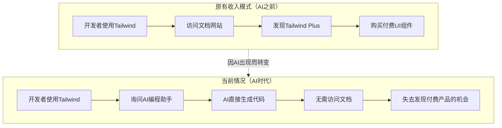
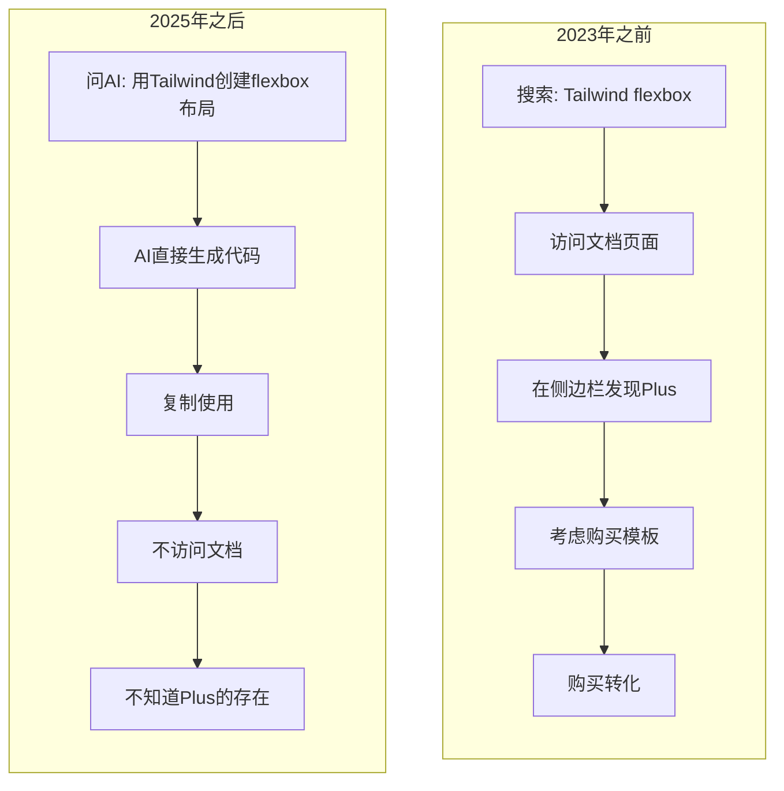
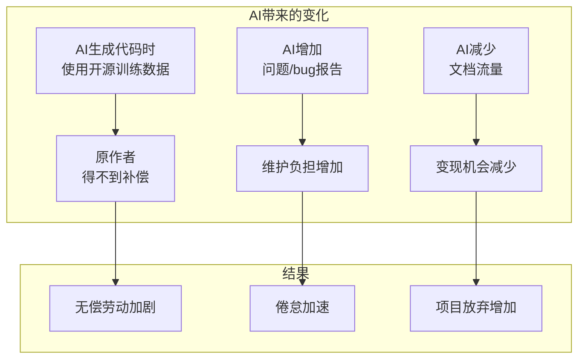
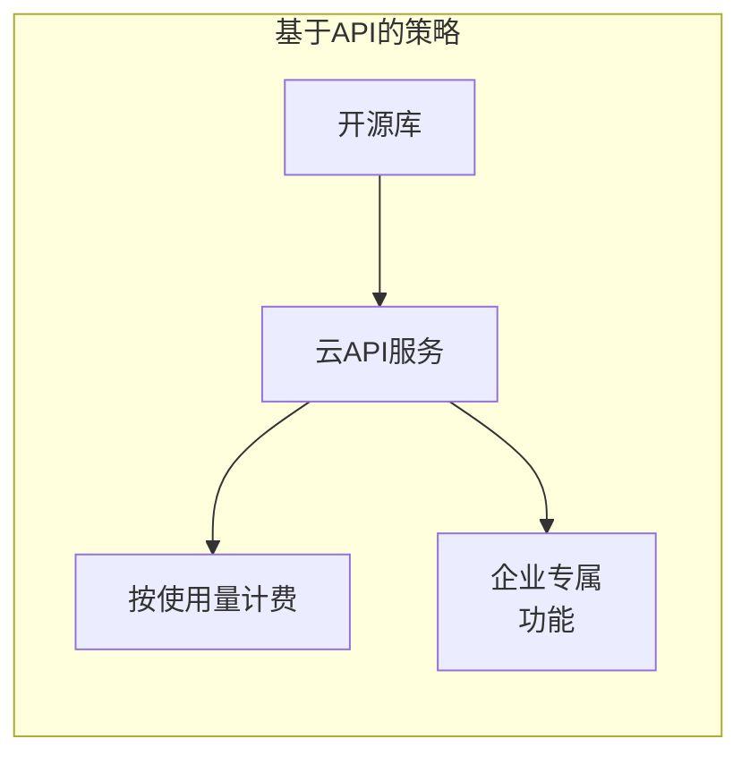
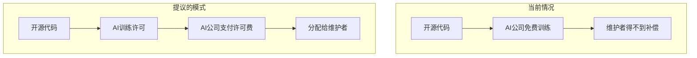

## 概述

2026年1月6日，消息传出：<strong>Tailwind CSS</strong>——Web开发者中最受欢迎的CSS框架之一——的创建者Tailwind Labs解雇了75%的工程团队。创始人兼CEO Adam Wathan直接将这一决定归因于"AI对我们业务造成的残酷影响"。

这不仅仅是一个初创公司的简单重组。它提出了一个根本性问题：<strong>在AI时代，开源项目如何创造收入并保持可持续性？</strong>

## Tailwind Labs事件：发生了什么

### 令人震惊的数字

| 指标 | 变化 |
|------|------|
| 工程团队 | 4人 → 1人（减少75%）|
| 收入 | 下降约80% |
| 文档流量 | 自2023年初下降40% |
| 框架受欢迎程度 | 持续上升（617,000+网站使用）|

最讽刺的是，<strong>Tailwind CSS本身比以往任何时候都更受欢迎</strong>。用户增加了，但收入却暴跌。

### 商业模式的崩溃

Tailwind Labs的收入结构如下：



<strong>核心问题</strong>：AI编程助手（GitHub Copilot、Cursor、Claude等）现在直接回答开发者的问题，开发者不再需要访问官方文档。由于文档流量是发现付费产品的唯一途径，流量下降直接导致收入下降。

### 拒绝LLM友好的文档请求

事件公开的方式很有趣。一位开源贡献者提交了一个PR，<strong>将Tailwind文档合并成LLM更容易消费的格式</strong>。Adam Wathan拒绝了这个请求，并表示：

> "这个改变会使我们的业务更加不可持续。"

使文档对AI更友好会让AI提供更准确的答案，这将进一步减少文档网站的访问——形成恶性循环。

## AI摧毁了"文档 → 付费产品"漏斗

### 传统的开源变现模式

许多开源项目一直使用以下变现策略：

1. <strong>开放核心（Open Core）</strong>：核心免费，高级功能付费
2. <strong>基于文档的转化</strong>：在文档网站上推广付费产品/服务
3. <strong>SaaS/托管服务</strong>：提供托管服务
4. <strong>咨询/培训</strong>：基于专业知识的服务
5. <strong>赞助/捐赠</strong>：GitHub Sponsors、Open Collective等

Tailwind Labs主要依赖<strong>第2种模式</strong>。他们销售名为Tailwind Plus的付费UI组件/模板，开发者在浏览文档时会自然发现它们。

### AI时代的漏斗崩溃



<strong>AI接管了中介角色</strong>，切断了开发者与文档网站之间的联系。这不仅仅是Tailwind的问题。所有依赖文档流量的商业模式都面临威胁。

## 开源贡献者无偿劳动问题加剧

### 令人震惊的统计数据

Tailwind事件是更大问题的一部分：

- <strong>60%的开源维护者</strong>因倦怠而退出或考虑退出项目
- 大多数维护者<strong>无偿</strong>管理关键基础设施
- 企业依赖<strong>价值数十亿美元</strong>的开源软件，却几乎不做贡献

### AI使无偿劳动问题恶化

AI时代，开源贡献者的处境更加困难：



<strong>问题的核心</strong>：AI公司用开源代码训练模型并赚取数十亿美元，但编写这些代码的维护者几乎什么都得不到。

### 不可持续的生态系统

当前的开源生态系统依赖于<strong>少数专注维护者的无偿劳动</strong>。这是不可持续的，并带来以下风险：

1. <strong>安全漏洞</strong>：因维护者缺席导致补丁延迟
2. <strong>创新放缓</strong>：因倦怠导致开发停止
3. <strong>供应链风险</strong>：关键依赖项突然被放弃

## AI时代的可持续变现策略

### 1. 转向API/服务模式

基于<strong>实际使用量</strong>而非文档流量进行变现：



<strong>示例</strong>：
- Vercel（Next.js）- 托管和部署服务
- Supabase - 托管PostgreSQL
- PlanetScale - 托管MySQL

### 2. 进入AI代理/插件生态系统

与AI工具<strong>合作</strong>创造新的收入来源：

```typescript
// 假设的Tailwind AI插件示例
const tailwindPlugin = {
  name: "tailwind-premium-components",
  capabilities: ["generate_ui", "suggest_design"],
  pricing: {
    free: { components: 10 },
    pro: { components: "unlimited", price: "$19/month" }
  },
  // AI通过此插件推荐高级组件
  onGenerate: async (context) => {
    if (context.needsComplexUI) {
      return suggestPremiumComponent(context);
    }
  }
};
```

<strong>策略</strong>：作为AI编程助手的<strong>插件/扩展</strong>存在，让AI在生成代码时自然推荐高级产品。

### 3. 加强企业许可

个人开发者免费，企业付费：

| 级别 | 目标 | 价格 | 包含内容 |
|------|------|------|----------|
| 社区版 | 个人、初创公司 | 免费 | 基本功能 |
| 团队版 | 中小企业 | $99/月 | 团队协作、优先支持 |
| 企业版 | 大型公司 | 定制 | SLA、专属支持、安全审计 |

### 4. AI训练数据许可

通过<strong>AI训练数据许可</strong>创造新收入来源：



一些项目已经开始在许可证中添加"禁止AI训练"条款。这是确保谈判筹码的策略。

### 5. 基于社区的可持续性

超越<strong>GitHub Sponsors</strong>和<strong>Open Collective</strong>的模式：

- <strong>强制企业赞助</strong>：达到一定规模的公司必须为其依赖的开源做出贡献
- <strong>贡献者工会</strong>：维护者联合起来确保谈判筹码
- <strong>公共资金</strong>：政府/基金会层面的开源基础设施支持

## Tailwind可以选择的方向

结合Adam Wathan分享的计划，以下策略是可行的：

### 短期策略

1. <strong>发布Tailwind v4</strong>：用新版本重新点燃兴趣
2. <strong>AI工具集成</strong>：与Cursor、Copilot等建立官方合作伙伴关系
3. <strong>高级CLI工具</strong>：将开发生产力工具变现

### 长期策略

1. <strong>设计系统平台</strong>：超越简单的CSS，演变为综合设计工具
2. <strong>企业市场重点</strong>：B2B许可和支持服务
3. <strong>教育平台</strong>：认证培训课程

## 我们应该学到的教训

### 作为开发者

- 不要只依赖开源——<strong>贡献或赞助</strong>
- 检查你使用的项目的<strong>可持续性</strong>
- 即使使用AI工具也要保持<strong>访问文档网站</strong>的习惯

### 作为开源维护者

- 重新考虑只依赖<strong>文档流量</strong>的收入模式
- 建立<strong>多元化的收入来源</strong>
- 探索与AI生态系统的<strong>合作方式</strong>

### 作为企业

- <strong>积极赞助</strong>你依赖的开源
- 建立<strong>长期合作伙伴关系</strong>
- 认识到开源生态系统的健康<strong>对你的业务也很重要</strong>

## 结论

Tailwind Labs的裁员是<strong>AI时代开源生态系统结构性变化</strong>的标志性事件。

基于文档的收入模式崩溃、开源贡献者无偿劳动加剧、AI公司搭便车问题——这些都是相互关联的。如果我们不解决这些问题，我们所依赖的开源生态系统本身可能会面临风险。

<strong>解决方案是存在的。</strong> 基于API的服务、与AI生态系统合作、企业许可以及加强社区支持。但所有这些都需要<strong>整个生态系统意识的转变</strong>。

开源不是"免费"的。它是用某人的时间和努力创造的。这一事实在AI时代并没有改变。如果说有什么变化的话，它变得更加重要了。

---

## 参考资料

- [Tailwind Labs lays off 75 percent of its engineers - DEVCLASS](https://devclass.com/2026/01/08/tailwind-labs-lays-off-75-percent-of-its-engineers-thanks-to-brutal-impact-of-ai/)
- [Business Insider: Tailwind layoffs](https://www.businessinsider.com/tailwind-engineer-layoffs-ai-github-2026-1)
- [Open Source Trends for 2025 and Beyond - InfoWorld](https://www.infoworld.com/article/3800992/open-source-trends-for-2025-and-beyond.html)
- [The Decoder: Tailwind's shattered business model](https://the-decoder.com/tailwinds-shattered-business-model-is-a-grim-warning-for-every-business-relying-on-site-visits-in-the-ai-era/)
