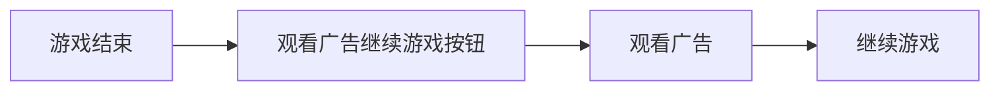
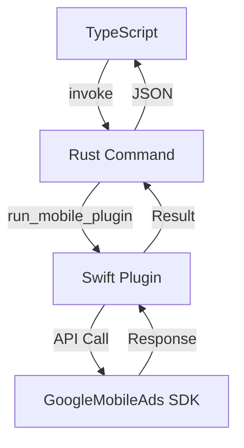
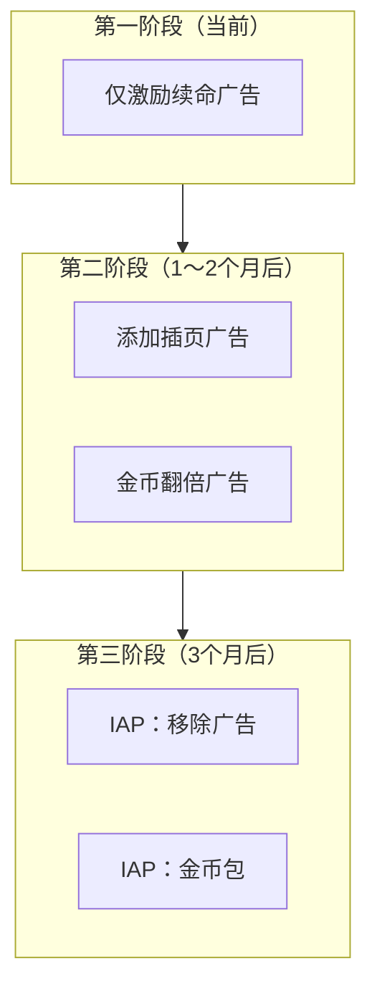

import { Image } from 'astro:assets';
import screenshot01 from '../../../assets/portfolio/shadow-dash/shadow-dash-01_iphone.png';
import screenshot04 from '../../../assets/portfolio/shadow-dash/shadow-dash-04_iphone.png';

## 概述

您使用 Tauri 2.x 开发了一个 iOS 应用，现在想要通过 AdMob 广告来变现。该怎么做呢？

遗憾的是，**Tauri 没有官方的 AdMob 插件**。在本文中，我将分享开发自定义 Swift 插件来集成 AdMob 激励广告的完整过程。

> 本文是 [使用 Tauri + PixiJS 开发 iOS 游戏](/zh/blog/zh/tauri-pixijs-ios-game-development) 的续篇。基于在 Shadow Dash 游戏中集成广告的实际经验撰写。

<Image src={screenshot04} alt="Shadow Dash 游戏结束画面" width={300} class="mx-auto rounded-lg shadow-lg" />

## 为什么选择 AdMob？

### 手游变现方式对比

| 方式 | 优点 | 缺点 |
|------|------|------|
| **激励广告** | 用户体验好，高 eCPM | 实现复杂 |
| 横幅广告 | 实现简单 | 低 eCPM，影响体验 |
| 应用内购买 | 高收益 | 实现复杂，支付审核 |

### 为什么选择激励广告

在 Shadow Dash 中，我将激励广告应用于**续命系统**：



用户**自愿**观看广告并获得奖励（继续游戏），这种结构不会损害用户体验。

### 广告 SDK 选择过程

我评估了 Tauri 应用可用的广告 SDK：

| SDK | 优点 | 缺点 | 决定 |
|-----|------|------|------|
| **AdMob** | 高 eCPM，多种广告格式 | 需要原生插件 | ✅ 采用 |
| AppLixir | 仅需 JS SDK 集成 | **需要 5,000+ DAU** | ❌ 未采用 |
| H5 Game Ads | HTML5 游戏专用 | **Beta 服务（不稳定）** | ❌ 未采用 |

**为什么不选择 AppLixir**：
- 需要最少 5,000 日活跃用户（DAU）才能申请
- 新应用很难满足这个条件

**为什么不选择 H5 Game Ads**：
- 仍处于 Beta 服务阶段
- 稳定性和收益性尚未验证

### AdMob vs AppLixir 详细对比

对比 AdMob 和 AppLixir 的性能：

| 项目 | AdMob | AppLixir |
|------|-------|----------|
| eCPM（激励） | $20〜30 | $15〜25 |
| Fill Rate | 95%+ | 80〜90% |
| 支持格式 | 激励、插页、横幅 | 仅激励 |
| Mediation | 支持 | 不支持 |
| 集成难度 | 高（需要原生） | 低（JS SDK） |
| 准入门槛 | 无 | 需要 5,000+ DAU |

**结论**：虽然需要原生插件开发，但 AdMob 没有准入门槛，并提供更高的 eCPM 和 Fill Rate。

---

## 升级 Tauri CLI

### 需要 XCFramework 支持

在 Tauri v2 中开发 iOS 插件需要使用 Swift Package Manager（SPM）。对于需要外部框架依赖（如 GoogleMobileAds SDK）的插件，需要 **XCFramework 支持**。

### 升级到 Tauri CLI 2.9.6+

```bash
# 通过 Cargo 升级 Tauri CLI
cargo install tauri-cli --force

# 验证版本
cargo tauri --version
# 输出: tauri-cli 2.9.6（或更高）
```

### --ios-framework 选项

创建插件时可以指定 iOS 框架类型：

```bash
# Xcode 项目方式（便于添加 SPM 依赖）- 推荐
cargo tauri plugin new admob --ios --ios-framework xcode

# XCFramework 方式
cargo tauri plugin new admob --ios --ios-framework xcframework
```

| 选项 | 说明 | 优点 | 缺点 |
|------|------|------|------|
| `xcode` | 创建 Xcode 项目 | 便于通过 SPM 添加依赖 | 需要管理项目文件 |
| `xcframework` | 创建 XCFramework | 便于分发 | 外部依赖添加复杂 |

**AdMob 插件推荐使用 `xcode` 选项**：可以通过 SPM 轻松添加 GoogleMobileAds SDK。

---

## 理解 Tauri 插件结构

### 目录结构

```
tauri-plugin-admob/
├── src/                    # Rust 代码
│   ├── lib.rs             # 插件入口点
│   ├── mobile.rs          # iOS/Android 桥接
│   ├── desktop.rs         # 桌面端存根
│   ├── commands.rs        # Tauri 命令
│   └── models.rs          # 请求/响应类型
├── ios/                    # iOS 原生代码
│   └── tauri-plugin-admob/
│       └── AdmobPlugin.swift
├── guest-js/              # TypeScript API
│   └── index.ts
├── permissions/           # Tauri 权限设置
│   └── default.toml
├── build.rs               # 构建脚本
└── Cargo.toml
```

### 数据流



---

## 开始插件开发

### 插件脚手架

```bash
# 使用 Xcode 项目方式创建
cargo tauri plugin new admob --ios --ios-framework xcode
```

### 添加 GoogleMobileAds SDK

在 Xcode 中打开插件项目，通过 Swift Package Manager 添加 SDK：

1. 打开 `tauri-plugin-admob/ios/tauri-plugin-admob.xcodeproj`
2. **File → Add Package Dependencies**
3. 输入 URL：`https://github.com/googleads/swift-package-manager-google-mobile-ads`
4. 选择 **GoogleMobileAds** 并添加

---

## Swift 插件实现

### AdmobPlugin.swift

```swift
import SwiftRs
import Tauri
import UIKit
import WebKit
import GoogleMobileAds

// MARK: - Argument Types
class InitializeArgs: Decodable {}

class LoadRewardedArgs: Decodable {
    let adUnitId: String
}

class ShowRewardedArgs: Decodable {}

// MARK: - AdMob Plugin
class AdmobPlugin: Plugin {
    private var rewardedAd: GADRewardedAd?
    private var isInitialized = false
    private var pendingInvoke: Invoke?

    // 测试广告 ID（生产环境使用实际 ID）
    private let testAdUnitId = "ca-app-pub-3940256099942544/1712485313"

    @objc public override func load(webview: WKWebView) {
        NSLog("[AdMob Plugin] Loaded")
    }

    // SDK 初始化
    @objc public func initialize(_ invoke: Invoke) {
        if isInitialized {
            invoke.resolve(["success": true, "message": "Already initialized"])
            return
        }

        GADMobileAds.sharedInstance().start { status in
            self.isInitialized = true
            NSLog("[AdMob Plugin] SDK Initialized")
            invoke.resolve(["success": true, "message": "SDK initialized"])
        }
    }

    // 加载激励广告
    @objc public func loadRewardedAd(_ invoke: Invoke) {
        do {
            let args = try invoke.parseArgs(LoadRewardedArgs.self)
            let adUnitId = args.adUnitId.isEmpty ? testAdUnitId : args.adUnitId

            let request = GADRequest()
            GADRewardedAd.load(withAdUnitID: adUnitId, request: request) { [weak self] ad, error in
                if let error = error {
                    invoke.resolve(["success": false, "error": error.localizedDescription])
                    return
                }

                self?.rewardedAd = ad
                self?.rewardedAd?.fullScreenContentDelegate = self
                invoke.resolve(["success": true])
            }
        } catch {
            invoke.reject(error.localizedDescription)
        }
    }

    // 检查广告是否就绪
    @objc public func isRewardedAdReady(_ invoke: Invoke) {
        let isReady = rewardedAd != nil
        invoke.resolve(["ready": isReady])
    }

    // 显示广告
    @objc public func showRewardedAd(_ invoke: Invoke) {
        guard let rewardedAd = rewardedAd else {
            invoke.resolve(["success": false, "rewarded": false, "error": "No ad loaded"])
            return
        }

        guard let rootViewController = getRootViewController() else {
            invoke.resolve(["success": false, "rewarded": false, "error": "No root view controller"])
            return
        }

        pendingInvoke = invoke

        DispatchQueue.main.async {
            rewardedAd.present(fromRootViewController: rootViewController) { [weak self] in
                let reward = rewardedAd.adReward
                if let pending = self?.pendingInvoke {
                    pending.resolve([
                        "success": true,
                        "rewarded": true,
                        "rewardAmount": reward.amount.intValue,
                        "rewardType": reward.type
                    ])
                    self?.pendingInvoke = nil
                }
            }
        }
    }

    // 获取 Root View Controller
    private func getRootViewController() -> UIViewController? {
        if let windowScene = UIApplication.shared.connectedScenes
            .compactMap({ $0 as? UIWindowScene })
            .first(where: { $0.activationState == .foregroundActive }),
           let keyWindow = windowScene.windows.first(where: { $0.isKeyWindow }),
           let rootVC = keyWindow.rootViewController {
            var topController = rootVC
            while let presented = topController.presentedViewController {
                topController = presented
            }
            return topController
        }
        return nil
    }
}

// MARK: - GADFullScreenContentDelegate
extension AdmobPlugin: GADFullScreenContentDelegate {
    func adDidDismissFullScreenContent(_ ad: GADFullScreenPresentingAd) {
        rewardedAd = nil
        if let pending = pendingInvoke {
            pending.resolve(["success": true, "rewarded": false])
            pendingInvoke = nil
        }
    }

    func ad(_ ad: GADFullScreenPresentingAd, didFailToPresentFullScreenContentWithError error: Error) {
        rewardedAd = nil
        if let pending = pendingInvoke {
            pending.resolve(["success": false, "rewarded": false, "error": error.localizedDescription])
            pendingInvoke = nil
        }
    }
}

// MARK: - Plugin Export
@_cdecl("init_plugin_admob")
func initPlugin() -> Plugin {
    return AdmobPlugin()
}
```

### 关键点

1. **`@objc` 注解**：通过 Objective-C 运行时暴露给 Rust 调用
2. **`pendingInvoke` 模式**：将异步广告回调桥接到 Tauri 的同步 invoke 模式
3. **`GADFullScreenContentDelegate`**：处理广告关闭/错误事件
4. **`@_cdecl("init_plugin_admob")`**：为 Rust 插件加载导出 C 函数

---

## Rust 桥接实现

### models.rs

```rust
use serde::{Deserialize, Serialize};

#[derive(Debug, Clone, Default, Deserialize, Serialize)]
#[serde(rename_all = "camelCase")]
pub struct InitializeResponse {
    pub success: bool,
    pub message: Option<String>,
}

#[derive(Debug, Deserialize, Serialize)]
#[serde(rename_all = "camelCase")]
pub struct LoadRewardedAdRequest {
    pub ad_unit_id: String,
}

#[derive(Debug, Clone, Default, Deserialize, Serialize)]
#[serde(rename_all = "camelCase")]
pub struct LoadRewardedAdResponse {
    pub success: bool,
    pub error: Option<String>,
}

#[derive(Debug, Clone, Default, Deserialize, Serialize)]
#[serde(rename_all = "camelCase")]
pub struct IsRewardedAdReadyResponse {
    pub ready: bool,
}

#[derive(Debug, Clone, Default, Deserialize, Serialize)]
#[serde(rename_all = "camelCase")]
pub struct ShowRewardedAdResponse {
    pub success: bool,
    pub rewarded: bool,
    pub reward_amount: Option<i32>,
    pub reward_type: Option<String>,
    pub error: Option<String>,
}
```

### mobile.rs

```rust
use serde::de::DeserializeOwned;
use tauri::{
    plugin::{PluginApi, PluginHandle},
    AppHandle, Runtime,
};
use crate::models::*;

#[cfg(target_os = "ios")]
tauri::ios_plugin_binding!(init_plugin_admob);

pub fn init<R: Runtime, C: DeserializeOwned>(
    _app: &AppHandle<R>,
    api: PluginApi<R, C>,
) -> crate::Result<Admob<R>> {
    #[cfg(target_os = "ios")]
    let handle = api.register_ios_plugin(init_plugin_admob)?;
    Ok(Admob(handle))
}

pub struct Admob<R: Runtime>(PluginHandle<R>);

impl<R: Runtime> Admob<R> {
    pub fn initialize(&self) -> crate::Result<InitializeResponse> {
        self.0.run_mobile_plugin("initialize", ()).map_err(Into::into)
    }

    pub fn load_rewarded_ad(&self, ad_unit_id: String) -> crate::Result<LoadRewardedAdResponse> {
        self.0.run_mobile_plugin("loadRewardedAd",
            LoadRewardedAdRequest { ad_unit_id }).map_err(Into::into)
    }

    pub fn is_rewarded_ad_ready(&self) -> crate::Result<IsRewardedAdReadyResponse> {
        self.0.run_mobile_plugin("isRewardedAdReady", ()).map_err(Into::into)
    }

    pub fn show_rewarded_ad(&self) -> crate::Result<ShowRewardedAdResponse> {
        self.0.run_mobile_plugin("showRewardedAd", ()).map_err(Into::into)
    }
}
```

### build.rs（重要！）

```rust
const COMMANDS: &[&str] = &[
    "initialize",
    "load_rewarded_ad",
    "is_rewarded_ad_ready",
    "show_rewarded_ad"
];

fn main() {
    // iOS 构建时链接框架
    let target = std::env::var("TARGET").unwrap_or_default();
    if target.contains("ios") {
        println!("cargo:rustc-link-lib=framework=GoogleMobileAds");
        println!("cargo:rustc-link-lib=framework=UserMessagingPlatform");
    }

    tauri_plugin::Builder::new(COMMANDS)
        .android_path("android")
        .ios_path("ios")
        .build();
}
```

**注意**：`#[cfg(target_os = "ios")]` 在 build.rs 中不起作用。因为 build.rs 在**宿主机**（macOS）上运行，需要使用 `std::env::var("TARGET")` 来检查目标。

---

## TypeScript API 实现

### guest-js/index.ts

```typescript
import { invoke } from '@tauri-apps/api/core'

export interface InitializeResponse {
  success: boolean;
  message?: string;
}

export interface LoadRewardedAdResponse {
  success: boolean;
  error?: string;
}

export interface IsRewardedAdReadyResponse {
  ready: boolean;
}

export interface ShowRewardedAdResponse {
  success: boolean;
  rewarded: boolean;
  rewardAmount?: number;
  rewardType?: string;
  error?: string;
}

export async function initialize(): Promise<InitializeResponse> {
  return await invoke<InitializeResponse>('plugin:admob|initialize');
}

export async function loadRewardedAd(adUnitId: string = ''): Promise<LoadRewardedAdResponse> {
  return await invoke<LoadRewardedAdResponse>('plugin:admob|load_rewarded_ad', {
    adUnitId,
  });
}

export async function isRewardedAdReady(): Promise<IsRewardedAdReadyResponse> {
  return await invoke<IsRewardedAdReadyResponse>('plugin:admob|is_rewarded_ad_ready');
}

export async function showRewardedAd(): Promise<ShowRewardedAdResponse> {
  return await invoke<ShowRewardedAdResponse>('plugin:admob|show_rewarded_ad');
}
```

---

## 将插件集成到应用

### 在 Cargo.toml 中添加插件

```toml
[dependencies]
tauri-plugin-admob = { path = "../tauri-plugin-admob" }
```

### 在 lib.rs 中注册插件

```rust
pub fn run() {
    tauri::Builder::default()
        .plugin(tauri_plugin_admob::init())
        .run(tauri::generate_context!())
        .expect("error while running tauri application");
}
```

### 权限配置

**src-tauri/capabilities/default.json**:

```json
{
  "permissions": [
    "core:default",
    "admob:default"
  ]
}
```

**tauri-plugin-admob/permissions/default.toml**:

```toml
[default]
description = "Default permissions for the AdMob plugin"
permissions = [
    "allow-initialize",
    "allow-load-rewarded-ad",
    "allow-is-rewarded-ad-ready",
    "allow-show-rewarded-ad"
]
```

### 在 Info.plist 中添加应用 ID

**src-tauri/gen/apple/AppName_iOS/Info.plist**:

```xml
<key>GADApplicationIdentifier</key>
<string>ca-app-pub-XXXXXXXXXXXXXXXX~XXXXXXXXXX</string>
<key>SKAdNetworkItems</key>
<array>
    <dict>
        <key>SKAdNetworkIdentifier</key>
        <string>cstr6suwn9.skadnetwork</string>
    </dict>
</array>
```

---

## 在游戏中使用广告

### 广告配置文件

**src/lib/config/admob.ts**:

```typescript
// 广告启用标志（审核通过前设为 false）
export const ADS_ENABLED = false;

const TEST_AD_UNITS = {
  rewardedAd: 'ca-app-pub-3940256099942544/1712485313',
  appId: 'ca-app-pub-3940256099942544~1458002511',
};

const PRODUCTION_AD_UNITS = {
  rewardedAd: 'ca-app-pub-XXXXXXXX/XXXXXXXXXX',  // 实际广告单元 ID
  appId: 'ca-app-pub-XXXXXXXX~XXXXXXXXXX',       // 实际应用 ID
};

const isDevelopment = import.meta.env.DEV;

export const AD_UNITS = isDevelopment ? TEST_AD_UNITS : PRODUCTION_AD_UNITS;
export const isTestMode = isDevelopment;
```

### 在游戏结束画面中使用

```typescript
import { AD_UNITS, ADS_ENABLED } from '$lib/config/admob';
import * as admob from 'tauri-plugin-admob-api';

let adLoading = false;
let adError = '';

async function handleWatchAd() {
  if (!ADS_ENABLED) {
    // 广告禁用时直接续命
    game.startContinue();
    return;
  }

  adLoading = true;
  adError = '';

  try {
    // 检查广告是否就绪
    const readyCheck = await admob.isRewardedAdReady();

    if (!readyCheck.ready) {
      // 广告未就绪则加载
      const loadResult = await admob.loadRewardedAd(AD_UNITS.rewardedAd);
      if (!loadResult.success) {
        adError = loadResult.error || 'Failed to load ad';
        adLoading = false;
        return;
      }
    }

    // 显示广告
    const showResult = await admob.showRewardedAd();

    if (showResult.rewarded) {
      // 获得奖励 - 继续游戏
      game.startContinue();
    } else if (showResult.error) {
      adError = showResult.error;
    }
  } catch (error) {
    adError = String(error);
  } finally {
    adLoading = false;
  }
}
```

---

## 故障排除

### Swift 类型错误："cannot find type 'RewardedAd' in scope"

**原因**：GoogleMobileAds SDK 基于 Objective-C，在 Swift 中需要 `GAD` 前缀。

```swift
// ❌ 错误
private var rewardedAd: RewardedAd?

// ✅ 正确
private var rewardedAd: GADRewardedAd?
```

### 链接器错误："Undefined symbols for architecture arm64"

**原因**：GoogleMobileAds 框架未链接

**解决方案1**：在主应用 Xcode 项目中也添加 SDK

1. 打开 `src-tauri/gen/apple/AppName.xcodeproj`
2. **File → Add Package Dependencies**
3. 添加 GoogleMobileAds SDK

**解决方案2**：在 build.rs 中链接框架

```rust
let target = std::env::var("TARGET").unwrap_or_default();
if target.contains("ios") {
    println!("cargo:rustc-link-lib=framework=GoogleMobileAds");
}
```

### Tauri 权限错误

**错误信息**：
```
admob.is_rewarded_ad_ready not allowed.
Permissions associated with this command: admob:allow-is-rewarded-ad-ready
```

**解决方案**：在 `permissions/default.toml` 和 `capabilities/default.json` 中添加权限

### 广告不显示

**症状**：点击按钮但广告不显示

**检查**：
1. 确认使用的是测试广告 ID
2. 确认 `GADMobileAds.sharedInstance().start()` 已调用
3. 在真机上测试（模拟器支持有限）

---

## 变现策略思考

### 分阶段实施计划



### 变现三原则

1. **保护游戏平衡**：仅外观付费，禁止能力值销售
2. **尊重免费玩家**：所有内容可免费获取
3. **价值优先**：用户觉得"值得购买"的商品

### 预期收益（DAU 10,000 人基准）

| 阶段 | 广告类型 | 日收益 | 月收益 |
|------|----------|--------|--------|
| 1 | 仅激励 | 〜$130 | 〜$3,900 |
| 2 | 激励 + 插页 | 〜$425 | 〜$12,750 |
| 3 | 广告 + IAP | 〜$600 | 〜$18,000 |

---

## 总结

### 经验教训

1. **保持 Tauri CLI 更新**：XCFramework 支持等重要功能持续添加
2. **理解 Tauri 插件结构**：必须理解 Rust ↔ Swift 桥接
3. **交叉编译**：build.rs 中 HOST vs TARGET 的区分很重要
4. **Tauri v2 权限系统**：capabilities 和 permissions 是必需的

### 检查清单

- [ ] 升级到最新 Tauri CLI（`cargo install tauri-cli --force`）
- [ ] 使用 `--ios-framework xcode` 选项创建插件
- [ ] 在**主应用和插件**中都添加 GoogleMobileAds SDK
- [ ] 在 build.rs 中使用 `std::env::var("TARGET")` 检测 iOS
- [ ] 在 `permissions/default.toml` 中定义所有命令权限
- [ ] 在 `capabilities/default.json` 中添加 `admob:default`
- [ ] 在 Info.plist 中添加 `GADApplicationIdentifier`
- [ ] 分离管理测试/生产广告 ID

### 下一步

- 添加 Android 支持
- 实现插页广告
- 实现横幅广告
- StoreKit 2 集成（IAP）

---

## 下载 Shadow Dash

试试使用本文介绍的技术开发的 **Shadow Dash** 吧！

<a href="https://apps.apple.com/app/shadow-dash/id6740092498" target="_blank" rel="noopener noreferrer">
  
</a>

**欢迎反馈！** 如果在游戏过程中发现改进建议或 bug，请通过 App Store 评论或邮件告知我们。

> 📱 **Shadow Dash 详情**: 访问[作品集页面](/zh/portfolio/shadow-dash)查看游戏核心机制和更多截图。

## 参考资料

- [Tauri 2.0 官方文档](https://v2.tauri.app/)
- [Google AdMob iOS 文档](https://developers.google.com/admob/ios/quick-start)
- [Swift Package Manager for Google Mobile Ads](https://github.com/googleads/swift-package-manager-google-mobile-ads)
- [Tauri 插件开发](https://v2.tauri.app/develop/plugins/)
