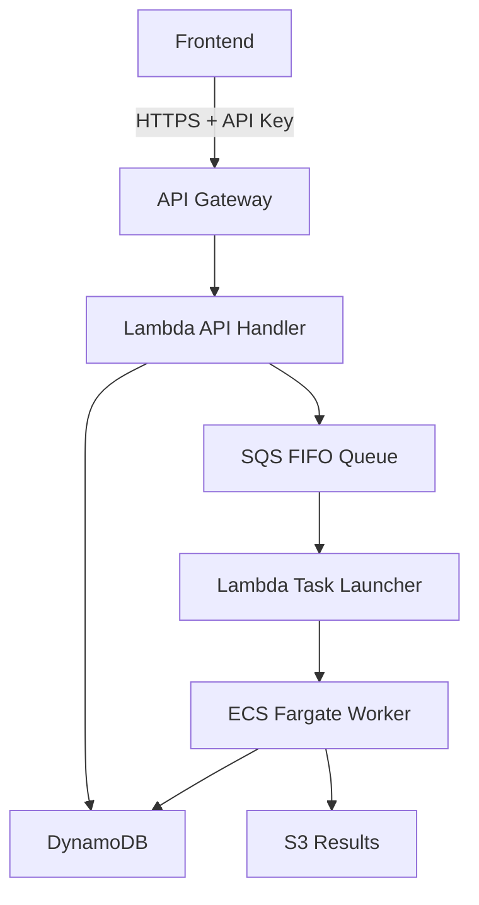

## 概述

将AI系统部署到生产环境时，最大的挑战之一是<strong>基础设施成本</strong>。批处理特性的AI工作负载不需要常驻服务器，但在任务执行时需要足够的计算资源。

本文分析了在实际项目中构建的<strong>无服务器AI批处理系统</strong>架构，并探讨使用Terraform进行基础设施管理的优势。

## 架构设计

### 整体结构



### 核心组件

| 组件 | 角色 | 计费特点 |
|-----|------|---------|
| API Gateway | REST API端点 | 按请求计费 |
| Lambda | 任务创建/触发执行 | 按执行时间计费 |
| SQS FIFO | 任务队列管理 | 几乎免费 |
| ECS Fargate | AI Worker执行 | 按运行时间计费 |
| DynamoDB | 状态管理 | 按需计费 |
| S3 | 结果存储 | 按存储容量计费 |

## Terraform的优势

### 1. 与LLM的优秀兼容性

Terraform的HCL（HashiCorp配置语言）具有<strong>声明式和结构化的语法</strong>，使LLM非常容易生成和理解代码。

```hcl
# LLM容易生成的清晰结构
resource "aws_lambda_function" "api_handler" {
  function_name = "ai-batch-api-handler"
  runtime       = "python3.11"
  handler       = "main.lambda_handler"
  memory_size   = 256
  timeout       = 30

  environment {
    variables = {
      DYNAMODB_TABLE = aws_dynamodb_table.jobs.name
      SQS_QUEUE_URL  = aws_sqs_queue.tasks.url
    }
  }
}
```

截至2025年，Claude和GPT-4等LLM在Terraform代码生成方面已经能够产出<strong>接近生产级别</strong>的成果。用自然语言描述需求，即可获得高完成度的IaC配置。

### 2. 基础设施状态管理

Terraform的State文件<strong>保证</strong>实际基础设施与代码之间的一致性。

```bash
# 查看当前基础设施状态
terraform show

# 预览变更
terraform plan

# 安全应用
terraform apply
```

### 3. 可重现的环境

使用相同的Terraform代码可以一致地构建<strong>开发/预发布/生产</strong>环境。

```hcl
# variables.tf
variable "environment" {
  description = "部署环境"
  type        = string
  default     = "dev"
}

variable "allowed_ips" {
  description = "允许的IP地址列表"
  type        = list(string)
  default     = []
}
```

## 基于Shell脚本的运维

### 部署自动化

将复杂的部署过程抽象为单个脚本。

```bash
#!/bin/bash
# deploy.sh
set -e

echo "=== AI System Deployment ==="

# 加载环境变量
source .env

# 1. Docker镜像构建和推送
cd workers/image_alt_generator
docker build -t ai-batch-worker:latest .
aws ecr get-login-password --region ${AWS_REGION} | \
    docker login --username AWS --password-stdin ${ECR_REGISTRY}
docker push ${ECR_REGISTRY}/ai-batch-worker:latest

# 2. Terraform基础设施部署
cd ../../terraform
terraform apply -auto-approve \
    -var="allowed_ips=${ALLOWED_IPS}" \
    -var="environment=prod"

# 3. 输出结果
echo "API Endpoint: $(terraform output -raw api_endpoint)"
echo "API Key: $(terraform output -raw api_key)"
```

### 监控脚本

```bash
#!/bin/bash
# monitor.sh

# 检查运行中的ECS Task
aws ecs list-tasks --cluster ai-batch-cluster

# 实时查看CloudWatch日志
aws logs tail /ecs/ai-batch/worker --follow

# 查询DynamoDB任务状态
aws dynamodb scan --table-name ai-batch-jobs \
    --filter-expression "#s = :status" \
    --expression-attribute-names '{"#s": "status"}' \
    --expression-attribute-values '{":status": {"S": "RUNNING"}}'
```

## 成本优化策略

### 无服务器架构的成本优势

| 场景 | EC2常驻运行 | 无服务器 |
|-----|------------|---------|
| 月10,000任务 | ~$150 | ~$21 |
| 月1,000任务 | ~$150 | ~$5 |
| 月100任务 | ~$150 | ~$1 |

对于批处理工作负载，<strong>按使用量计费</strong>的无服务器模式具有压倒性优势。

### 利用Fargate Spot

```hcl
resource "aws_ecs_service" "worker" {
  # ...

  capacity_provider_strategy {
    capacity_provider = "FARGATE_SPOT"
    weight           = 1
    base             = 0
  }
}
```

使用Fargate Spot可以实现<strong>最高70%的成本节省</strong>。AI批处理任务大多可以重试，非常适合Spot实例。

## 通知与Notion集成

### Slack通知集成

```python
# lambda/notifier/main.py
import boto3
import requests

def notify_job_completion(job_id, status, result_url=None):
    webhook_url = os.environ['SLACK_WEBHOOK_URL']

    message = {
        "blocks": [
            {
                "type": "section",
                "text": {
                    "type": "mrkdwn",
                    "text": f"*任务完成通知*\n"
                           f"Job ID: `{job_id}`\n"
                           f"Status: {status}"
                }
            }
        ]
    }

    if result_url:
        message["blocks"].append({
            "type": "actions",
            "elements": [{
                "type": "button",
                "text": {"type": "plain_text", "text": "下载结果"},
                "url": result_url
            }]
        })

    requests.post(webhook_url, json=message)
```

### Notion数据库集成

将任务结果自动记录到Notion数据库，实现<strong>项目管理集成</strong>。

```python
from notion_client import Client

def log_to_notion(job_data):
    notion = Client(auth=os.environ["NOTION_TOKEN"])

    notion.pages.create(
        parent={"database_id": os.environ["NOTION_DATABASE_ID"]},
        properties={
            "任务ID": {"title": [{"text": {"content": job_data["job_id"]}}]},
            "状态": {"select": {"name": job_data["status"]}},
            "处理时间": {"number": job_data["duration_seconds"]},
            "完成时间": {"date": {"start": job_data["completed_at"]}}
        }
    )
```

## 可扩展性考虑

### 添加新的AI Worker

```
workers/
├── image_alt_generator/    # 图片Alt Text生成
├── meta_desc_generator/    # Meta描述生成
└── content_analyzer/       # 内容分析
```

添加新Worker时：

1. 创建Worker目录并实现代码
2. 在`terraform/ecs.tf`中添加Task Definition
3. 在`terraform/sqs.tf`中添加专用队列
4. 更新Lambda队列映射
5. 运行`./deploy.sh`

得益于Terraform的模块化，<strong>添加新服务非常简单</strong>。

## 实践应用成果

### 运营指标

- <strong>部署时间</strong>：手动30分钟 → 自动5分钟
- <strong>基础设施成本</strong>：相比EC2降低85%
- <strong>故障恢复</strong>：基于State文件可立即重建
- <strong>代码审查</strong>：通过IaC对基础设施变更进行PR审查

### 经验教训

1. <strong>HCL学习曲线低</strong>：相比JSON/YAML可读性更好
2. <strong>LLM活用是关键</strong>：复杂的资源配置也可用自然语言请求
3. <strong>用Shell脚本抽象</strong>：简化复杂命令
4. <strong>State管理很重要</strong>：S3 + DynamoDB Lock必不可少

## 总结

使用Terraform的无服务器AI批处理系统提供以下优势：

- <strong>成本效率</strong>：基于使用量计费，最适合批处理
- <strong>LLM友好</strong>：AI工具轻松生成和管理基础设施代码
- <strong>运维便利</strong>：Shell脚本自动化复杂任务
- <strong>可扩展性</strong>：模块化结构使添加新服务变得简单

在构建AI系统时从一开始就采用IaC，可以显著提高<strong>长期运营效率</strong>。

## 参考资料

- [AWS Fargate Terraform部署指南](https://aws.amazon.com/blogs/developer/provision-aws-infrastructure-using-terraform-by-hashicorp-an-example-of-running-amazon-ecs-tasks-on-aws-fargate/)
- [HashiCorp - 部署无服务器AI Agent](https://www.hashicorp.com/en/resources/deploying-serverless-ai-agents-on-aws-with-terraform-and-securing-them-with-hcp-v)
- [使用LLM生成Terraform代码](https://terrateam.io/blog/using-llms-to-generate-terraform-code)
