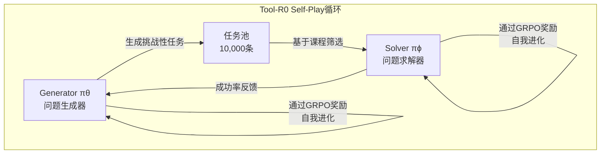
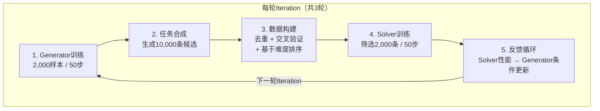
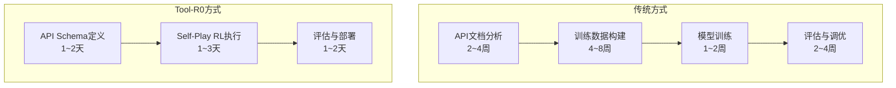

AI Agent的核心能力是<strong>"准确调用外部工具的能力"</strong>。调用API、查询数据库、执行代码——如果没有这些能力，Agent不过是一个简单的聊天机器人。然而，要训练这种工具调用能力，此前一直需要数万到数十万条标注数据。

2026年2月在arXiv上发布的<strong>Tool-R0</strong>（Acikgoz et al., arXiv 2602.21320）颠覆了这一常识。它在<strong>零训练数据（zero-data）</strong>的条件下，仅通过Self-Play强化学习从零开始训练工具调用Agent，并实现了超越传统监督学习方法的性能。

## 为什么这篇论文现在如此重要

当前AI Agent市场正以工具调用（Function Calling / Tool Use）能力为核心快速增长。OpenAI的Function Calling、Anthropic的Tool Use、Google的Gemini Function Calling——前沿模型都将这一能力作为核心功能。

然而，开源模型或领域专用模型要获得这一能力，就不可避免地需要<strong>高成本的训练数据构建</strong>：

- xLAM数据集：60,000条工具调用示例
- Hammer数据集：210,000条
- ToolACE数据集：12,000条

这些数据在领域变更时需要重新构建，针对企业内部API进行定制化更是难上加难。Tool-R0通过Self-Play RL彻底消除了这一瓶颈。

## Tool-R0的核心思想：Generator-Solver共进化

Tool-R0的架构优雅得令人惊叹。它从一个基础LLM初始化出两个独立的Agent：

<strong>Generator（πθ）</strong>负责生成工具调用任务。具体来说，它会生成（用户查询、工具菜单、正确工具调用）三元组。

<strong>Solver（πϕ）</strong>学习从给定的查询和工具列表中预测正确的工具调用。

关键在于两者通过<strong>互补奖励信号（complementary rewards）</strong>相连接：

- Generator在生成Solver<strong>感到适度困难</strong>的问题时获得高奖励
- Solver在执行准确的工具调用时获得高奖励

随着这种交互的不断迭代，Generator生成越来越精妙的问题，Solver也能解决越来越困难的问题——完全无需数据。

## 奖励设计的精妙之处

Tool-R0性能卓越的原因在于奖励函数的设计。

### Generator奖励：三级质量管理

| 奖励组成要素 | 作用 | 说明 |
|:---|:---|:---|
| Format Reward (r_fmt) | 结构合规 | XML标签、JSON解析有效性校验 |
| Validity Reward (r_valid) | 内部一致性 | 正确工具存在于菜单中、包含必需参数、参数值基于问题 |
| Curriculum Reward (r_curr) | 难度调节 | 以Solver成功率 p̂_succ ∈ [0.25, 0.75] 范围为目标 |

尤其<strong>Curriculum Reward</strong>是核心。当生成的问题使Solver成功率落在25%~75%之间时，给予最高奖励。太简单的问题（成功率 > 75%）或太难的问题（成功率 < 25%）对学习没有帮助。这与教育学中<strong>"最近发展区（Zone of Proximal Development）"</strong>的概念完全一致。

### Solver奖励：精细化的准确度衡量

Solver的准确度奖励不是简单的正确/错误二元判定，而是分解为三个维度：

1. <strong>工具名称匹配</strong>（二元）：是否选择了正确的工具？
2. <strong>键重叠</strong>（F1分数）：是否遗漏了必需参数？
3. <strong>值匹配</strong>（灵活比较）：参数值是否准确？

对生成多余工具调用的情况施加乘法惩罚（multiplicative penalty）。这种精细化的奖励使得部分得分成为可能，即使在学习初期也能提供有意义的梯度。

## 训练Pipeline：3轮迭代的威力

整个训练由3轮迭代（iteration）组成：

值得注意的是，每轮仅使用<strong>2,000条自生成数据</strong>。与传统监督学习方法需要数万到数十万条数据形成了鲜明对比。

## Benchmark结果：超越监督学习

### 基于Qwen2.5-1.5B的主要结果

| Benchmark | Baseline | Tool-R0 | 相对提升 |
|:---|---:|---:|---:|
| ToolAlpaca | 35.96% | 47.36% | +31.7% |
| SealTools | 47.27% | 83.00% | +75.6% |
| NexusRaven | 17.61% | 34.59% | +86.4% |
| API-Bank | 19.13% | 50.62% | +164.6% |
| SNIPS | 4.29% | 20.86% | +386.3% |
| <strong>平均</strong> | <strong>24.85%</strong> | <strong>47.84%</strong> | <strong>+92.5%</strong> |

尤其API-Bank和SNIPS的巨幅提升令人瞩目。这些benchmark模拟了真实的API调用场景，零数据方法能达到如此性能实属惊人。

### 与监督学习数据集的对比

最令人印象深刻的结果是<strong>超越了使用真实训练数据训练的模型</strong>：

| 训练方法 | 数据规模 | 平均准确率 |
|:---|---:|---:|
| xLAM数据集 | 60,000条 | 43.60% |
| Hammer数据集 | 210,000条 | 43.74% |
| ToolACE数据集 | 12,000条 | 44.71% |
| ToolRL数据集 | 4,000条 | 46.06% |
| <strong>Tool-R0（零数据）</strong> | <strong>0条</strong> | <strong>47.84%</strong> |

使用21万条训练数据的Hammer，其性能反而比零数据训练的Tool-R0低了4个百分点以上。

### 在多种模型上的验证

Tool-R0不依赖于特定模型：

| 模型 | Baseline | Tool-R0 | 提升 |
|:---|---:|---:|---:|
| Qwen2.5-0.5B | 15.47% | 30.57% | +101.0% |
| Qwen2.5-1.5B | 24.85% | 47.84% | +92.5% |
| Qwen2.5-3B | 43.97% | 48.50% | +10.3% |
| Llama-3.2-3B | 36.12% | 40.47% | +12.0% |

小模型（0.5B）实现了2倍以上的提升，大模型（3B）也达到了10%以上的提升。虽然在工具调用能力已达一定水平的大模型上提升幅度有所减小，但改进是一致且稳定的。

## 核心发现：为什么参数分离至关重要

消融实验中最重要的发现是<strong>Generator和Solver的参数必须分离</strong>：

| 配置 | 准确率 | 性能下降 |
|:---|---:|---:|
| 完整Tool-R0（分离） | 47.84% | — |
| 共享权重 | 30.42% | -36.4% |
| 固定Generator | 41.65% | -12.9% |
| 移除难度奖励 | 43.54% | -9.0% |

使用共享权重时性能骤降36.4%。研究团队将此归因于<strong>"梯度干扰（gradient interference）"</strong>——在同一个参数空间中同时优化探索（Generator）和执行（Solver）这两个相反的目标，会导致两个目标相互干扰。

这从组织理论角度也具有重要启示意义。它提供了研究依据，证明<strong>将定义问题的团队与解决问题的团队分离</strong>，同时通过反馈循环连接的结构才是最优的。

## EM/CTO视角的实务启示

### 1. 企业内部API工具调用Agent构建成本大幅降低

在传统方法中，最大的成本在于训练数据的构建。为企业内部API定制数万条工具调用示例需要数月的工作。Tool-R0完全消除了这一环节。

### 2. 小型模型的重新评估

Tool-R0在0.5B模型上也实现了2倍的性能提升。这意味着<strong>在边缘设备或成本敏感环境中也能构建有效的工具调用Agent</strong>。对于GPU预算有限的初创公司或私有云环境尤为有意义。

### 3. 课程学习的自动化

最令人印象深刻的方面是<strong>学习课程能够自动生成</strong>。以往需要人工将数据从"简单示例到困难示例"进行排序，而Tool-R0的Generator能够自动感知Solver当前的能力水平，并生成适当难度的问题。

这为<strong>自主运行AI系统的学习Pipeline</strong>开辟了可能性。

## ICLR 2026 Agent研究趋势的背景

Tool-R0是2026年AI Agent研究大趋势——<strong>"自我进化（Self-Evolving）Agent"</strong>范式的一部分：

- <strong>EvolveR</strong>（ICLR 2026 under review）：基于经验的生命周期Agent自我改进
- <strong>Agent0</strong>：通过工具集成推理从零数据构建Agent
- <strong>EvoAgentX</strong>（GitHub开源）：自我进化Agent生态系统
- <strong>ICLR 2026 Workshop</strong>："Lifelong Agents: Learning, Aligning, Evolving"

这些研究的共同信息很明确：<strong>不再依赖人工创建的数据，Agent自行生成训练数据并自我进化的时代</strong>正在到来。

## 结论

Tool-R0是一项重要研究，实证了"无需数据也能构建强大的AI Agent"。核心教训总结如下：

1. <strong>仅凭Self-Play RL即可超越监督学习</strong>（92.5%提升，优于21万条数据集）
2. <strong>Generator-Solver分离</strong>是必要的（共享时性能下降36.4%）
3. <strong>课程自动生成</strong>是学习效率的关键（ZPD范围 [0.25, 0.75]）
4. <strong>在小型模型上同样有效</strong>（0.5B上实现2倍提升）

对EM和CTO来说，最重要的启示是：在构建企业内部API用AI Agent时，<strong>能够绕过训练数据构建这一最大瓶颈</strong>的方法论已经出现。虽然仍需生产级别的验证，但这一方向将成为2026年AI Agent开发的重要转折点。

## 参考资料

- [Tool-R0论文（arXiv 2602.21320）](https://arxiv.org/abs/2602.21320)
- [EvolveR: Self-Evolving LLM Agents（ICLR 2026）](https://openreview.net/forum?id=sooLoD9VSf)
- [EvoAgentX GitHub](https://github.com/EvoAgentX/EvoAgentX)
- [ICLR 2026 Lifelong Agents Workshop](https://lifelongagent.github.io/)
