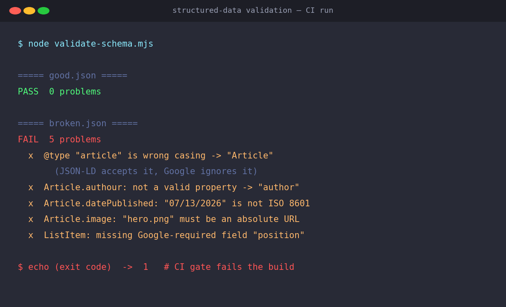

部署流水线里的结构化数据检查是绿的。这个绿只证明一件事：你的 JSON-LD <strong>格式没坏</strong>。它并不代表 Google 能读懂里面任何一个字段。这是两个不同的问题，可大多数团队把它们当成了一个。

我真正意识到这点，是看见一个把 `@type` 写成小写 `article` 的标记，一声不响地通过了解析器。在 JSON-LD 处理器眼里，它完全合法。在 Google 眼里，它只是个未知类型，被默默忽略。中间什么都没有。没有警告，没有报错，没有红灯。你要等到半年后翻 Search Console、查富媒体结果为什么不出现时，才会发现。

## 校验其实分两层

人们说"校验"结构化数据时，往往指的是两件不同的事。

第一层是<strong>语法校验</strong>。这段 JSON-LD 能解析吗？花括号闭合了吗，有 `@context` 吗，JSON-LD 1.1 处理器能把它展开成图吗？这件事，`jsonld` 这类库做得滴水不漏。

第二层是<strong>schema 语义校验</strong>。类型名是 schema.org 词汇里真实存在的拼写和大小写吗？属性名有没有拼错？日期是 ISO 8601 吗？URL 字段是绝对路径吗？这个类型上，Google 推荐的字段带上了吗？这些，解析器<strong>一个都不会告诉你</strong>。

陷阱就在这里：第二层失败时，第一层照样面不改色地通过。而 Google 官方的两个校验工具——Rich Results Test 和 Schema Markup Validator（validator.schema.org）——都是<strong>要你在浏览器里粘 URL 或代码的手动工具</strong>。它们不在你的构建里。所以除非有人手动打开去看，坏掉的 schema 就一路流到线上。

如果你已经[在 JSON-LD、Microdata、RDFa 之间选定了语法](/zh/blog/zh/structured-data-syntax-comparison-jsonld-microdata-rdfa-2026)，下一个问题就是：用这门语法每天写的标记，每次提交时谁来确认它写对了？

## 为什么这道缝现在更贵了

从前结构化数据悄悄坏掉，损失顶多是一条富媒体摘要。现在不一样了。搜索的重心在迁移，那些生成 AI 概览和生成式回答的爬虫，越来越依赖结构化数据来判断一个页面讲的是什么。而这类爬虫里有不少[根本不跑你的 JavaScript，只抓 raw HTML 就走](/zh/blog/zh/ai-crawlers-dont-render-javascript-csr-2026)。服务端吐出的那段 JSON-LD，几乎就是它们能看到的全部。

要是这段 JSON-LD 的 `@type` 是小写的 `article` 呢？人眼看页面正常，解析器也放行，可在读它的机器眼里，那是个没有作者、没有发布日期、身份不明的节点。一个疏漏的代价，从"错过一条摘要"变成了"AI 误读这个页面"。在上线前拦下它，比过去更划算了。

## 为什么解析器抓不到拼写错误

光说没人信，我在沙箱里复现了一遍。Node v22，`jsonld` 8.x。我造了个 `broken.json`，故意埋进五个常见错误。

```json
{
  "@context": "https://schema.org",
  "@graph": [
    {
      "@type": "article",
      "headline": "Broken sample",
      "datePublished": "07/13/2026",
      "authour": "Kim Jangwook",
      "image": "hero.png"
    },
    {
      "@type": "BreadcrumbList",
      "itemListElement": [
        { "@type": "ListItem", "name": "Blog", "item": "https://example.com/blog" }
      ]
    }
  ]
}
```

小写的 `article`、拼错的 `authour`、美式日期 `07/13/2026`、相对路径 `hero.png`、少了 `position` 的 `ListItem`。把它送进 `jsonld.expand()`，就能看见处理器把每个词项解析成了哪个 IRI。

```text
$ node expand-demo.mjs

===== broken.json — jsonld.expand() =====
resolved @type IRIs : http://schema.org/article, http://schema.org/BreadcrumbList, ...
resolved term IRIs  : http://schema.org/article, http://schema.org/authour,
                      http://schema.org/datePublished, http://schema.org/headline, ...
```

关键就在这。`article` 展开成 `http://schema.org/article`，`authour` 展开成 `http://schema.org/authour`，<strong>干干净净</strong>。没有报错，没有警告，也没有被丢弃。

原因是 schema.org 托管的 JSON-LD 上下文把 `@vocab` 设成了 `https://schema.org/`。一旦有了 `@vocab`，处理器就把任何未定义的字符串<strong>直接拼</strong>到这个前缀后面。它从不去核对 schema.org 里有没有 `authour` 这个属性，只是造出一个不存在的 IRI，而这在 JSON-LD 语法上完全合法。解析器看的是语法，不是词汇。

于是"JSON-LD 合法"和"Google 读得懂"之间就裂开了一道缝。这道缝也贯穿在[把散落的块连成一个 @graph](/zh/blog/zh/json-ld-graph-entity-linking-2026) 的问题里：谈连接之前，得先保证每个节点本身就是用合法的类型和属性写的。

## 一个 60 行的、懂 schema 的校验器

解析器抓不到，那就自己加一段懂 schema 的检查。不用搞得复杂，只要你关心的那几个类型的部分词汇，加上五条规则就够。

```javascript
const VOCAB = {
  Article: {
    props: ['headline','datePublished','dateModified','author','image','description'],
    // Google 对 Article 没有列出"必需"属性（只有推荐）。强制 headline 是团队约定。
    recommended: ['headline'],
    urlProps: ['image'], dateProps: ['datePublished','dateModified'],
  },
  BreadcrumbList: { props: ['itemListElement'], required: ['itemListElement'] },
  ListItem: { props: ['position','name','item'], required: ['position','name'], urlProps: ['item'] },
};
const KNOWN = Object.keys(VOCAB);
const ISO = /^\d{4}-\d{2}-\d{2}(T\d{2}:\d{2}(:\d{2})?([+-]\d{2}:\d{2}|Z)?)?$/;
const ABS = /^https?:\/\//;

function checkNode(node, errors) {
  let t = node['@type'];
  if (!KNOWN.includes(t)) {
    const near = KNOWN.find(k => k.toLowerCase() === String(t).toLowerCase());
    if (near) { errors.push(`@type "${t}" 大小写错误 → "${near}"`); t = near; }
    else return;
  }
  const spec = VOCAB[t];
  for (const key of Object.keys(node)) {
    if (key.startsWith('@')) continue;
    if (!spec.props.includes(key)) {
      const near = spec.props.find(p => p.toLowerCase() === key.toLowerCase());
      errors.push(`${t}.${key}: 不是合法属性${near ? ` → "${near}"?` : ''}`);
    }
  }
  for (const r of (spec.required || [])) if (!(r in node)) errors.push(`${t}: 缺少必需字段 "${r}"`);
  for (const d of (spec.dateProps || [])) if (node[d] && !ISO.test(node[d])) errors.push(`${t}.${d}: 不是 ISO 8601`);
  for (const u of (spec.urlProps || [])) { const v = node[u]; if (v && !ABS.test(v)) errors.push(`${t}.${u}: 不是绝对 URL`); }
  // 递归进入嵌套节点和 itemListElement
  for (const v of Object.values(node))
    (Array.isArray(v) ? v : [v]).forEach(x => x && typeof x === 'object' && x['@type'] && checkNode(x, errors));
}
```

注意，碰到大小写错误时它不是抛个错就收工，而是<strong>纠正成正确类型、继续往下查</strong>。这样你能一次看清：`article` 写错了，同时这个节点里还有 `authour`、坏日期、相对 URL。我第一版没加这个纠正，只报了一个类型错误，漏掉另外四个。CI 就得一次把全部亮出来，否则每修一处就要跑一个来回。

留意 Article 标的是 `recommended` 而不是 `required`。按 Google 官方文档，<strong>Article 没有必需属性</strong>。`author`、`datePublished`、`dateModified`、`headline`、`image` 全都只是"推荐"。所以强制 headline 是我们团队的约定，不是 Google 的规矩。校验器的价值恰恰在这里：把"在官方推荐之上、本团队定的最低标准"用代码钉死。

## 实际跑出来的结果

我把 `good.json`（一个正常的 Article 加两级 BreadcrumbList）和 `broken.json` 喂给同一个校验器。



```text
===== good.json =====
PASS — 0 problems

===== broken.json =====
FAIL — 5 problems
  x @type "article" is wrong casing → "Article"
  x Article.authour: not a valid property → "author"
  x Article.datePublished: "07/13/2026" is not ISO 8601
  x Article.image: "hero.png" must be an absolute URL
  x ListItem: missing Google-required field "position"
process exit code = 1
```

五个全抓到了，`broken.json` 让进程以 <strong>exit 1</strong> 结束。这个退出码就是全部。`good.json` 退出 0。有了这一行，CI 不用任何额外配置就会拦下构建。

注意只有 `ListItem` 缺 `position` 被标成了"Google-required"。这是准确的。BreadcrumbList 要求至少两个 ListItem，每个 ListItem 确实要求 `position` 和 `name`（官方）。而 Article 那四个错误里，一个"必需"的标签都没有。校验器说得很有分寸，把 Google 的规则和团队的约定分行讲清楚。

## 接进 CI 关卡

退出码已经是 1 了，剩下的只是接线。`package.json` 里一行脚本。

```json
{ "scripts": { "validate:schema": "node scripts/validate-schema.mjs" } }
```

GitHub Actions 作业里一个步骤。

```yaml
- name: Validate structured data
  run: npm run validate:schema
```

校验器失败，作业就失败，带着坏 schema 的 PR 合不进去。想扫全站，就从构建好的 HTML 里把每个 `<script type="application/ld+json">` 块抓出来，逐个灌进同一个 `checkNode`。道理一样。这跟[把无障碍检查放进 CI](/zh/blog/zh/axe-core-ci-a11y-jsdom-vs-browser-2026) 是同一副骨架：把人每次用肉眼盯的活儿，换成一个失败就变红的确定性关卡。

## 这个校验器做不到的事

得把界限划清楚，这篇才算诚实。

<strong>它不是 Rich Results Test 的替代品。</strong>它只认识手工挑的一小块词汇（Article、BreadcrumbList、ListItem、Person）。实战里，你得从 schema.org 的公开导出里生成类型和属性清单来填 `VOCAB`，才有全面覆盖。这里展示的是概念验证，不是成品。

<strong>通过校验，不保证会出富媒体结果。</strong>这不是我的看法，是 Google 官方立场。通用结构化数据指南写得很直白：使用结构化数据"让某项特性<strong>有可能</strong>出现，但不保证它一定出现"。就算标记完美无缺，Google 的算法也可能根据用户、设备、地点判断纯文本结果更合适。指南还明确写道，结构化数据"本身不是通用的排名因素"。校验器放行的是"格式对了"，不是"会出富媒体结果"，更不是"排名会涨"。

<strong>解析器的展开只看语法。</strong>如前所示，因为 `@vocab`，连拼写错误都会展开成合法 IRI。所以别把"展开成功"当成"校验通过"。两层互不替代。语法交给解析器，语义交给懂 schema 的检查。

## 开发者今天可以做的

- 把构建产物里的 JSON-LD 手动粘进 Rich Results Test 一次，定个基线。然后把这道检查搬进代码。
- 从你最常用的类型（一般是 Article/BlogPosting、BreadcrumbList、Organization、WebSite）的词汇和规则开始填 `VOCAB`。别想着填全，先填你老出错的。
- 大小写、属性拼写、日期格式、相对 URL 这四样，务必检查。它们是解析器绝不会替你标出来的。
- 把 Google 的"必需"和团队的"约定"在代码里分开标注。以后没人再纳闷这个字段为什么被强制。
- 把退出码 1 绑进 CI 步骤。只打印报告却照样放行的检查，没人会看。

如果你想把结构化数据可靠地从服务端输出，或者想在流水线层面体检现有站点的 schema、无障碍、爬虫应对，我个人接咨询和实现的委托。可以通过我资料页的联系方式找我。看绿灯背后剩下什么，正是我做的事。
