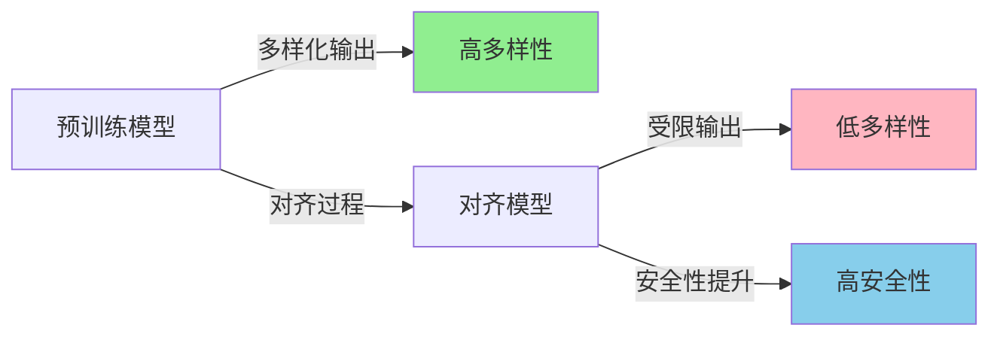
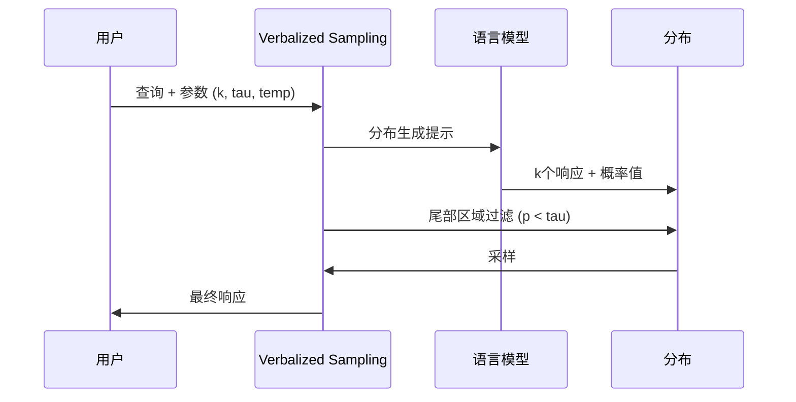

# Verbalized Sampling: 无需训练的提示技术恢复LLM多样性

最新的大型语言模型(Large Language Model, LLM)展现了惊人的性能,但同时也存在一个重要问题,那就是<strong>输出多样性的降低</strong>。特别是在经过RLHF(Reinforcement Learning from Human Feedback,人类反馈强化学习)等对齐(alignment)过程后,模型虽然变得更加安全和准确,但往往会失去创造性。

斯坦福大学和佐治亚理工学院研究团队发表的最新论文"Verbalized Sampling: How to Mitigate Mode Collapse and Unlock LLM Diversity"为这个问题提出了创新性的解决方案。最有趣的是,<strong>无需重新训练模型</strong>,仅通过提示技术就能将多样性提升1.6〜2.1倍。

本文将详细介绍Verbalized Sampling的原理、实现方法以及实际应用案例。

## 问题本质: 什么是模式崩溃(Mode Collapse)?

### 对齐过程的悖论

现代LLM的开发通常经过两个阶段:

1. <strong>预训练(Pre-training)</strong>: 通过海量文本数据学习语言模式
2. <strong>对齐(Alignment)</strong>: 根据人类偏好调整输出(RLHF、DPO等)

对齐过程使模型变得更有用、更安全,但却带来了意想不到的副作用,那就是<strong>模式崩溃(mode collapse)</strong>。



### 典型性偏差(Typicality Bias)

研究团队将这一现象的根本原因归结为<strong>偏好数据的典型性偏差</strong>。人类评估者存在以下倾向:

- 偏好熟悉的模式
- 对可预测的响应给予高分
- 低估创造性但非典型的答案

结果,对齐后的模型只生成"安全"的答案,忽略了输出分布的尾部(tail distribution)。

### 实际影响

这种多样性降低在以下任务中尤其成为问题:

- <strong>创意写作</strong>: 诗歌、小说、笑话生成
- <strong>合成数据生成</strong>: 需要多样化的训练样本
- <strong>对话模拟</strong>: 表现多样化的人物角色
- <strong>开放式问答</strong>: 提供多视角的答案

## Verbalized Sampling: 创新性解决方案

### 核心思想

Verbalized Sampling(VS)不是简单地要求模型生成答案,而是要求模型<strong>用语言表达可能响应的概率分布</strong>。这通过以下过程实现:

1. 要求模型生成k个可能的响应
2. 要求为每个响应分配概率值
3. 明确指定从低概率区域(尾部)采样
4. 从生成的分布中随机选择一个



### 为什么有效?

Verbalized Sampling之所以有效,原因如下:

1. <strong>显式多样性引导</strong>: 直接要求模型提供多样化响应
2. <strong>概率控制</strong>: 通过tau参数调节稀有度
3. <strong>无需训练</strong>: 利用现有模型的能力
4. <strong>能力利用</strong>: 越强大的模型效果越好

## 实现方法

### 使用Python库

研究团队提供了易用的Python库:

```python
from verbalized_sampling import verbalize

# 基本用法
dist = verbalize(
    "请讲一个有趣的笑话",
    k=5,              # 生成5个候选
    tau=0.10,         # 从概率10%以下区域采样
    temperature=0.9   # 控制响应多样性
)

# 从分布中采样
joke = dist.sample(seed=42)
print(joke.text)
print(f"概率: {joke.probability}")

# 查看所有候选
for response in dist.responses:
    print(f"[{response.probability:.3f}] {response.text}")
```

### 直接提示

即使不使用库,也可以直接编写提示:

```python
prompt = """<instructions>
请针对以下问题生成5个响应。每个响应用<response>标签包裹,
包含<text>和数字型<probability>。
从分布的尾部随机采样,使每个响应的概率低于0.10。
</instructions>

请创作一个关于熊的短故事。
"""

# API调用
response = client.messages.create(
    model="claude-3-5-sonnet-20241022",
    max_tokens=2000,
    temperature=0.9,
    messages=[{"role": "user", "content": prompt}]
)

# 解析响应
import xml.etree.ElementTree as ET
root = ET.fromstring(f"<root>{response.content[0].text}</root>")

responses = []
for resp in root.findall('response'):
    text = resp.find('text').text
    prob = float(resp.find('probability').text)
    responses.append({'text': text, 'probability': prob})

# 随机选择
import random
chosen = random.choice(responses)
print(chosen['text'])
```

### 主要参数说明

| 参数 | 默认值 | 说明 | 推荐范围 |
|---------|--------|------|-----------|
| `k` | 5 | 生成的候选响应数 | 3〜10 |
| `tau` | 0.10 | 概率阈值(仅采样低于此值) | 0.05〜0.20 |
| `temperature` | 0.9 | 响应多样性控制 | 0.7〜1.0 |

<strong>参数调整指南</strong>:

- <strong>需要更多样化的输出</strong>: 降低tau(0.05),增加k(10)
- <strong>保持质量同时增加多样性</strong>: 保持tau=0.10, temperature=0.9
- <strong>引导特定风格</strong>: 在提示中添加明确指示

## 实验结果分析

### 多样性提升指标

研究团队在各种任务中测量了Verbalized Sampling的效果:

```python
# 多样性测量示例(使用Self-BLEU)
from nltk.translate.bleu_score import sentence_bleu

def calculate_diversity(responses):
    """计算Self-BLEU: 值越低多样性越高"""
    scores = []
    for i, resp in enumerate(responses):
        others = [r for j, r in enumerate(responses) if j != i]
        score = sentence_bleu(others, resp)
        scores.append(score)
    return 1 - sum(scores) / len(scores)

# 基准采样
baseline_responses = [generate_joke() for _ in range(100)]
baseline_diversity = calculate_diversity(baseline_responses)

# Verbalized Sampling
vs_responses = [verbalize("Tell a joke").sample() for _ in range(100)]
vs_diversity = calculate_diversity(vs_responses)

print(f"多样性提升: {vs_diversity / baseline_diversity:.2f}x")
# 输出示例: 多样性提升: 2.1x
```

### 按任务类型的性能

| 任务类型 | 多样性提升 | 准确性保持 | 安全性保持 |
|----------|------------|------------|------------|
| 创意写作(诗歌、故事) | 2.1x | ✓ | ✓ |
| 笑话生成 | 1.9x | ✓ | ✓ |
| 开放式问答 | 1.6x | ✓ | ✓ |
| 对话模拟 | 1.8x | ✓ | ✓ |
| 合成数据生成 | 2.0x | ✓ | ✓ |

<strong>重要发现</strong>:
- 在更强大的模型(GPT-4、Claude 3.5 Sonnet)上效果更显著
- 准确性和安全性保持在现有水平
- 无需重新训练或微调

### 模型对比

```python
# 比较不同模型上的VS效果
models = [
    "gpt-3.5-turbo",
    "gpt-4",
    "claude-3-opus",
    "claude-3-5-sonnet"
]

for model in models:
    # 用每个模型生成100个响应
    baseline = measure_diversity(model, use_vs=False, n=100)
    vs_enhanced = measure_diversity(model, use_vs=True, n=100)

    improvement = vs_enhanced / baseline
    print(f"{model}: {improvement:.2f}x 提升")

# 预期输出:
# gpt-3.5-turbo: 1.3x 提升
# gpt-4: 1.9x 提升
# claude-3-opus: 2.0x 提升
# claude-3-5-sonnet: 2.1x 提升
```

## 实际应用案例

### 1. 创意写作: 生成多样化的诗歌

```python
def generate_diverse_poems(topic, n=5):
    """生成关于主题的多种风格诗歌"""

    prompt = f"请创作一首关于{topic}的短诗。"

    poems = []
    for i in range(n):
        dist = verbalize(
            prompt,
            k=8,              # 更多候选
            tau=0.08,         # 更低阈值(更多样)
            temperature=1.0   # 高创造性
        )
        poem = dist.sample(seed=i)
        poems.append(poem.text)

    return poems

# 使用示例
poems = generate_diverse_poems("秋天的枫叶")
for i, poem in enumerate(poems, 1):
    print(f"\n=== 诗歌 {i} ===\n{poem}")
```

### 2. 合成数据生成: 多样化的训练样本

```python
def generate_training_data(task_description, n=1000):
    """生成训练用合成数据"""

    prompt = f"""请针对以下任务生成示例:
    {task_description}

    格式: 明确区分输入和输出"""

    dataset = []
    for i in range(n):
        dist = verbalize(
            prompt,
            k=5,
            tau=0.10,
            temperature=0.9
        )
        example = dist.sample(seed=i)
        dataset.append(parse_example(example.text))

    # 去重和质量验证
    dataset = remove_duplicates(dataset)
    dataset = filter_quality(dataset, min_quality=0.8)

    return dataset

# 生成情感分析训练数据
sentiment_data = generate_training_data(
    "电影评论及情感(积极/消极)标签"
)
print(f"生成数据: {len(sentiment_data)}条")
```

### 3. 对话模拟: 多样化的人物角色

```python
def simulate_conversation(persona1, persona2, topic, turns=5):
    """模拟两个人物角色之间的对话"""

    conversation = []
    context = f"主题: {topic}"

    personas = [persona1, persona2]

    for turn in range(turns):
        speaker = personas[turn % 2]

        prompt = f"""你是{speaker}。

        之前的对话:
        {format_conversation(conversation)}

        请就{topic}自然地回应。"""

        dist = verbalize(
            prompt,
            k=6,
            tau=0.12,
            temperature=0.85
        )

        response = dist.sample(seed=turn)
        conversation.append({
            'speaker': speaker,
            'text': response.text
        })

    return conversation

# 使用示例
dialogue = simulate_conversation(
    persona1="热情的AI研究者",
    persona2="谨慎的伦理学家",
    topic="AI安全性",
    turns=10
)

for turn in dialogue:
    print(f"{turn['speaker']}: {turn['text']}\n")
```

### 4. 多视角答案生成

```python
def generate_multiperspective_answer(question):
    """针对一个问题生成多个视角的答案"""

    perspectives = []

    # 生成5个不同视角
    for i in range(5):
        prompt = f"""问题: {question}

        请从不同视角回答。
        请采用与之前答案不同的角度。"""

        dist = verbalize(
            prompt,
            k=7,
            tau=0.10,
            temperature=0.9
        )

        answer = dist.sample(seed=i)
        perspectives.append({
            'viewpoint': extract_viewpoint(answer.text),
            'answer': answer.text,
            'probability': answer.probability
        })

    return perspectives

# 对复杂问题的多视角答案
question = "人工智能能否拥有创造力?"
answers = generate_multiperspective_answer(question)

for i, ans in enumerate(answers, 1):
    print(f"\n视角 {i} ({ans['viewpoint']}):")
    print(ans['answer'])
    print(f"(概率: {ans['probability']:.3f})")
```

## 性能优化技巧

### 1. 成本效率使用

```python
class CachedVerbalizedSampler:
    """通过缓存降低成本"""

    def __init__(self):
        self.cache = {}

    def sample(self, prompt, k=5, tau=0.10, n_samples=1):
        """相同提示只调用一次API"""
        cache_key = (prompt, k, tau)

        if cache_key not in self.cache:
            # 生成分布(API调用)
            dist = verbalize(prompt, k=k, tau=tau)
            self.cache[cache_key] = dist

        # 从缓存的分布中采样(免费)
        dist = self.cache[cache_key]
        return [dist.sample() for _ in range(n_samples)]

# 使用示例
sampler = CachedVerbalizedSampler()

# 首次调用: 产生API费用
jokes_batch1 = sampler.sample("Tell a joke", n_samples=10)

# 后续调用: 无API费用(使用缓存)
jokes_batch2 = sampler.sample("Tell a joke", n_samples=10)
jokes_batch3 = sampler.sample("Tell a joke", n_samples=10)
```

### 2. 并行处理

```python
import asyncio
from concurrent.futures import ThreadPoolExecutor

async def batch_verbalized_sampling(prompts, k=5, tau=0.10):
    """并行处理多个提示"""

    async def process_one(prompt):
        dist = verbalize(prompt, k=k, tau=tau)
        return dist.sample()

    # 并行执行
    tasks = [process_one(p) for p in prompts]
    results = await asyncio.gather(*tasks)

    return results

# 使用示例
prompts = [
    "Tell me a joke about programming",
    "Tell me a joke about cats",
    "Tell me a joke about coffee",
    # ... 100个提示
]

# 顺序处理: 约100秒
# 并行处理: 约10秒(10x速度提升)
results = asyncio.run(batch_verbalized_sampling(prompts))
```

### 3. 质量过滤

```python
def sample_with_quality_threshold(prompt, min_quality=0.7, max_attempts=10):
    """采样直到满足质量标准"""

    for attempt in range(max_attempts):
        dist = verbalize(
            prompt,
            k=5,
            tau=0.10,
            temperature=0.9
        )

        response = dist.sample(seed=attempt)
        quality = evaluate_quality(response.text)

        if quality >= min_quality:
            return response

    # 最大尝试次数后仍不达标则返回最佳结果
    return max(
        [dist.sample(seed=i) for i in range(10)],
        key=lambda r: evaluate_quality(r.text)
    )

def evaluate_quality(text):
    """简单质量评估(实际应使用更精细的指标)"""
    # 长度检查
    if len(text.split()) < 10:
        return 0.3

    # 重复检查
    if has_repetition(text):
        return 0.5

    # 连贯性检查
    if not is_coherent(text):
        return 0.6

    return 0.9
```

## 限制和注意事项

### 什么时候不应该使用?

Verbalized Sampling并非适用于所有情况:

1. <strong>需要事实准确性的场合</strong>
   - 医疗诊断、法律咨询等
   - 准确性优先于多样性

2. <strong>需要统一风格的场合</strong>
   - 维护品牌语气和语调
   - 正式文件撰写

3. <strong>需要实时响应的场合</strong>
   - 生成k个响应会增加延迟
   - 成本也增加k倍

### API成本考虑

```python
# 成本比较(以GPT-4为例,价格为假设值)
standard_cost = calculate_cost(
    input_tokens=100,
    output_tokens=200,
    model="gpt-4"
)
# 约 $0.01

vs_cost = calculate_cost(
    input_tokens=100 + 200,  # 额外指令
    output_tokens=200 * 5,   # k=5个响应
    model="gpt-4"
)
# 约 $0.05 (5倍)

print(f"基准: ${standard_cost:.4f}")
print(f"VS: ${vs_cost:.4f} (成本增加: {vs_cost/standard_cost:.1f}x)")
```

### 模型兼容性

目前Verbalized Sampling效果良好的模型:

- ✅ GPT-4及GPT-4 Turbo
- ✅ Claude 3 (Opus, Sonnet)
- ✅ Claude 3.5 Sonnet
- ⚠️ GPT-3.5 (效果有限)
- ⚠️ 小型开源模型(效果微弱)

## 高级应用: 自定义分布设计

### 条件多样性控制

```python
def adaptive_tau(prompt, context):
    """根据上下文动态调整tau值"""

    # 创造性重要的任务: 低tau
    creative_keywords = ['诗', '故事', '笑话', '创意']
    if any(kw in prompt.lower() for kw in creative_keywords):
        return 0.05

    # 准确性重要的任务: 高tau
    factual_keywords = ['事实', '准确', '具体']
    if any(kw in prompt.lower() for kw in factual_keywords):
        return 0.20

    # 默认值
    return 0.10

# 使用示例
def smart_verbalize(prompt, context=None):
    tau = adaptive_tau(prompt, context)
    return verbalize(prompt, k=5, tau=tau, temperature=0.9)
```

### 集成采样

```python
def ensemble_sampling(prompt, n_distributions=3, samples_per_dist=3):
    """从多个分布采样以确保更广泛的多样性"""

    all_samples = []

    for i in range(n_distributions):
        # 每个分布使用不同的tau
        tau = 0.08 + (i * 0.04)  # 0.08, 0.12, 0.16

        dist = verbalize(
            prompt,
            k=5,
            tau=tau,
            temperature=0.9 + (i * 0.05)
        )

        for j in range(samples_per_dist):
            sample = dist.sample(seed=i*10+j)
            all_samples.append(sample)

    # 去重
    unique_samples = remove_semantic_duplicates(all_samples)

    return unique_samples

# 超高多样性采样
diverse_jokes = ensemble_sampling(
    "Tell me a joke about AI",
    n_distributions=5,
    samples_per_dist=4
)
```

## 结论: 多样性与质量的平衡

Verbalized Sampling优雅地解决了LLM的根本问题。无需重新训练或复杂设置,仅通过简单的提示技术就能大幅提升输出多样性。

### 核心总结

1. <strong>问题</strong>: 对齐过程降低了LLM的多样性(模式崩溃)
2. <strong>原因</strong>: 偏好数据的典型性偏差
3. <strong>解决方案</strong>: Verbalized Sampling - 显式表达分布并从尾部区域采样
4. <strong>结果</strong>: 多样性提升1.6〜2.1倍,保持质量
5. <strong>优点</strong>: 无需训练,可立即应用,成本效益高

### 实战应用指南

<strong>推荐场景</strong>:
- 创意内容生成(博客、营销文案、故事讲述)
- AI训练数据生成(需要多样化样本)
- 头脑风暴和创意发散
- 多视角分析和决策支持

<strong>注意场景</strong>:
- 需要高准确性的领域(医疗、法律、金融)
- 统一品牌语气很重要的场合
- 需要实时响应的聊天机器人

### 开始使用

```bash
# 安装库
pip install verbalized-sampling

# 简单测试
python -c "
from verbalized_sampling import verbalize
dist = verbalize('Tell me a creative story', k=5, tau=0.10)
print(dist.sample().text)
"
```

### 了解更多

- <strong>论文</strong>: [arXiv:2510.01171](https://arxiv.org/abs/2510.01171)
- <strong>GitHub</strong>: [stanford-oval/verbalized-sampling](https://github.com/stanford-oval/verbalized-sampling)
- <strong>演示</strong>: [Hugging Face Space](https://huggingface.co/spaces/stanford-oval/verbalized-sampling-demo)

Verbalized Sampling是释放LLM创造潜力的强大工具。如果您的项目中需要多样性,请尝试这种技术。仅通过简单的提示更改就能获得惊人的结果。

---

<strong>参考资料</strong>:
- Zhang, J., Yu, S., Chong, D., Sicilia, A., Tomz, M. R., Manning, C. D., & Shi, W. (2025). Verbalized Sampling: How to Mitigate Mode Collapse and Unlock LLM Diversity. arXiv preprint arXiv:2510.01171.
- OpenAI. (2023). GPT-4 Technical Report.
- Anthropic. (2024). Claude 3 Model Card.
