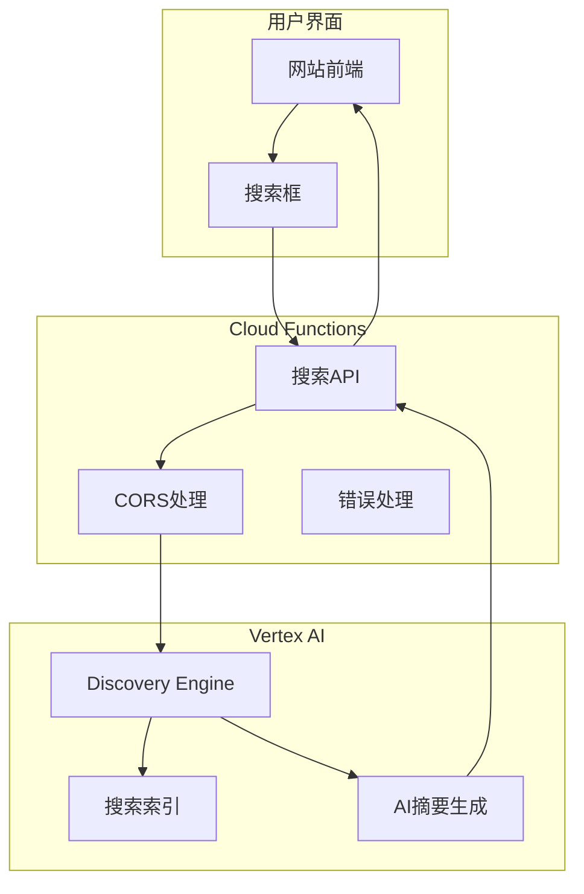

## 引言

现代网站搜索不再局限于简单的关键词匹配。用户期待的是能够理解上下文、提供智能摘要的搜索体验。Google Cloud的<strong>Vertex AI Search</strong>正是为此而生——它结合了传统全文搜索和AI驱动的语义理解，能够提供精准且富有洞察力的搜索结果。

本文将详细介绍如何：
- 使用Vertex AI Search构建企业级搜索引擎
- 通过Cloud Functions创建搜索API服务器
- 利用Shell脚本实现自动化部署
- 将AI搜索功能集成到实际网站

无论你是想为博客添加智能搜索，还是为企业知识库构建搜索系统，本文都将为你提供完整的实施方案。

## Vertex AI Search 的特点

### 与传统搜索的区别

Vertex AI Search不仅仅是一个搜索引擎，它是一个完整的AI搜索平台：

| 特性 | 传统搜索 | Vertex AI Search |
|------|---------|------------------|
| 搜索方式 | 关键词匹配 | 语义理解 + 关键词 |
| 结果呈现 | 链接列表 | AI生成摘要 + 链接 |
| 数据源 | 单一数据库 | 多源整合（网站、文档等） |
| 个性化 | 基础排序 | AI驱动的相关性排序 |
| 开发成本 | 高（需自建索引） | 低（托管服务） |

### 架构概览

整体系统采用三层架构：



核心流程：
1. 用户在网站输入搜索查询
2. 前端调用Cloud Functions API
3. Cloud Functions转发请求到Vertex AI Search
4. AI引擎处理查询、生成摘要
5. 结果返回给用户

## 前置准备

### Google Cloud项目配置

<strong>步骤1：创建或选择GCP项目</strong>

```bash
# 创建新项目
gcloud projects create my-search-project \
  --name="AI Search Project"

# 设置当前项目
gcloud config set project my-search-project
```

<strong>步骤2：启用必需的API</strong>

```bash
# 启用Vertex AI Search API
gcloud services enable discoveryengine.googleapis.com

# 启用Cloud Functions API
gcloud services enable cloudfunctions.googleapis.com

# 启用Cloud Build API（用于部署）
gcloud services enable cloudbuild.googleapis.com
```

### 创建Vertex AI Search引擎

<strong>使用Agent Builder创建搜索应用</strong>：

1. 访问[Google Cloud Console](https://console.cloud.google.com/)
2. 导航到 **Vertex AI** → **Agent Builder**
3. 点击 **创建应用** → 选择 **搜索**
4. 配置数据源：
   - **网站爬取**：输入你的网站URL
   - **文档上传**：上传PDF、HTML等文件
   - **BigQuery**：连接数据库

5. 配置搜索选项：
   - 启用 **生成式摘要**（AI Summary）
   - 设置 **结果排序规则**
   - 配置 **过滤器和刻面**

6. 记下创建完成后的：
   - **ENGINE_ID**（搜索引擎ID）
   - **PROJECT_ID**（项目ID）
   - **PROJECT_NUMBER**（项目编号）

## Cloud Functions API服务器实现

### 核心代码说明（index.js）

创建 `index.js` 文件，实现搜索API端点：

```javascript
// 导入Google Discovery Engine客户端
const { SearchServiceClient } = require('@google-cloud/discoveryengine').v1alpha;

// 从环境变量获取配置
const PROJECT_ID = process.env.PROJECT_ID;
const ENGINE_ID = process.env.ENGINE_ID;
const LOCATION = process.env.LOCATION || 'global';
const ALLOWED_DOMAINS = process.env.ALLOWED_DOMAINS?.split(',') || [];

/**
 * HTTP Cloud Function - 搜索端点
 *
 * @param {Object} req - Express请求对象
 * @param {Object} res - Express响应对象
 */
exports.search = async (req, res) => {
  // CORS设置 - 只允许特定域名访问
  const origin = req.headers.origin;
  if (ALLOWED_DOMAINS.includes(origin)) {
    res.set('Access-Control-Allow-Origin', origin);
  }

  res.set('Access-Control-Allow-Methods', 'POST, OPTIONS');
  res.set('Access-Control-Allow-Headers', 'Content-Type');

  // 处理预检请求
  if (req.method === 'OPTIONS') {
    res.status(204).send('');
    return;
  }

  try {
    // 1. 验证请求参数
    const { query, pageSize = 10 } = req.body;

    if (!query || query.trim() === '') {
      res.status(400).json({
        error: 'Search query is required'
      });
      return;
    }

    // 2. 初始化Discovery Engine客户端
    const client = new SearchServiceClient();

    // 3. 构建搜索请求
    const servingConfig = `projects/${PROJECT_ID}/locations/${LOCATION}/collections/default_collection/engines/${ENGINE_ID}/servingConfigs/default_config`;

    const request = {
      servingConfig,
      query: query.trim(),
      pageSize: Math.min(pageSize, 50), // 限制最大结果数
      queryExpansionSpec: { condition: 'AUTO' },
      spellCorrectionSpec: { mode: 'AUTO' },

      // 启用AI摘要生成
      contentSearchSpec: {
        summarySpec: {
          summaryResultCount: 5,
          includeCitations: true,
          ignoreAdversarialQuery: true,
          ignoreNonSummarySeekingQuery: true,
        },
      },
    };

    // 4. 执行搜索
    const [response] = await client.search(request);

    // 5. 整理搜索结果
    const results = response.results?.map(result => {
      const doc = result.document;
      const structData = doc.structData || {};

      return {
        id: doc.id,
        title: structData.title || '无标题',
        link: structData.link || doc.name,
        snippet: structData.snippet || structData.description || '',
        // 缩略图（如果存在）
        thumbnail: structData.thumbnailUrl || structData.image_url || null,
        // 发布日期
        publishDate: structData.pubDate || structData.publishedDate || null,
      };
    }) || [];

    // 6. 提取AI摘要
    const summary = response.summary?.summaryText || null;
    const citations = response.summary?.summaryWithMetadata?.references || [];

    // 7. 返回结果
    res.json({
      query,
      totalResults: results.length,
      results,
      summary: summary ? {
        text: summary,
        citations: citations.map(ref => ({
          title: ref.title,
          url: ref.uri,
        })),
      } : null,
    });

  } catch (error) {
    console.error('Search error:', error);

    // 配额超限时的降级处理
    if (error.code === 8 || error.code === 429) {
      res.status(503).json({
        error: 'Search quota exceeded. Please try again later.',
        retryAfter: 60,
      });
      return;
    }

    // 其他错误
    res.status(500).json({
      error: 'Internal server error',
      message: error.message,
    });
  }
};
```

<strong>代码亮点</strong>：

1. **环境变量驱动配置**：所有敏感信息通过环境变量管理
2. **CORS安全控制**：只允许白名单域名访问
3. **智能降级**：配额超限时返回友好错误
4. **结果标准化**：统一的JSON响应格式
5. **AI摘要集成**：自动生成搜索结果摘要

### 依赖管理（package.json）

创建 `package.json` 文件：

```json
{
  "name": "vertex-ai-search-function",
  "version": "1.0.0",
  "description": "Vertex AI Search API for website",
  "main": "index.js",
  "engines": {
    "node": "20"
  },
  "dependencies": {
    "@google-cloud/discoveryengine": "^1.0.0",
    "@google-cloud/functions-framework": "^3.4.0"
  },
  "scripts": {
    "start": "functions-framework --target=search"
  }
}
```

## 环境变量配置

### 创建.env文件

创建 `.env.example` 模板文件：

```bash
# ============================================
# Vertex AI Search Configuration
# ============================================

# 必需配置
PROJECT_ID=your-project-id              # GCP项目ID
PROJECT_NUMBER=123456789                # GCP项目编号
ENGINE_ID=your-engine-id_1234567890     # 搜索引擎ID

# CORS设置（多个域名用逗号分隔）
ALLOWED_DOMAINS=https://example.com,https://www.example.com

# ============================================
# Deployment Configuration
# ============================================

# Cloud Functions部署区域
REGION=asia-northeast1                  # 东京
# REGION=us-central1                    # 爱荷华（备选）

# 资源配置
MEMORY=256MB                            # 内存分配
TIMEOUT=60s                             # 超时时间
MIN_INSTANCES=0                         # 最小实例数（冷启动优化设为1）
MAX_INSTANCES=10                        # 最大实例数

# ============================================
# Vertex AI Search Settings
# ============================================

LOCATION=global                         # 搜索引擎位置
DEFAULT_PAGE_SIZE=10                    # 默认结果数
MAX_PAGE_SIZE=50                        # 最大结果数
```

<strong>配置说明</strong>：

- **PROJECT_ID**: 在GCP控制台顶部查看
- **PROJECT_NUMBER**: 在项目设置中的"项目编号"
- **ENGINE_ID**: 创建搜索引擎后在Agent Builder中查看
- **ALLOWED_DOMAINS**: 限制哪些网站可以调用API（安全性）
- **REGION**: 选择离用户最近的区域以降低延迟

## 自动化部署脚本（deploy.sh）

这是本文的<strong>核心亮点</strong>——一个全功能的部署脚本，能够自动化整个部署流程。

### 脚本主要功能

创建 `deploy.sh` 文件：

```bash
#!/bin/bash

# ============================================
# Vertex AI Search Cloud Functions 部署脚本
# ============================================
#
# 功能：
# - 自动读取.env配置
# - 检查并切换GCP项目
# - 启用必需的API
# - 部署Cloud Functions
# - 生成测试HTML
#
# 使用方法：
#   ./deploy.sh                    # 使用.env文件
#   ./deploy.sh --env-file .env.prod  # 使用指定环境文件
#   ./deploy.sh --dry-run          # 仅显示将执行的命令
# ============================================

set -e  # 遇到错误立即退出

# 颜色输出（增强可读性）
RED='\033[0;31m'
GREEN='\033[0;32m'
YELLOW='\033[1;33m'
BLUE='\033[0;34m'
NC='\033[0m' # No Color

# 日志函数
log_info() {
    echo -e "${BLUE}[INFO]${NC} $1"
}

log_success() {
    echo -e "${GREEN}[SUCCESS]${NC} $1"
}

log_warning() {
    echo -e "${YELLOW}[WARNING]${NC} $1"
}

log_error() {
    echo -e "${RED}[ERROR]${NC} $1"
}

# ============================================
# 1. 解析命令行参数
# ============================================

ENV_FILE=".env"
DRY_RUN=false

while [[ $# -gt 0 ]]; do
    case $1 in
        --env-file)
            ENV_FILE="$2"
            shift 2
            ;;
        --dry-run)
            DRY_RUN=true
            shift
            ;;
        *)
            log_error "Unknown parameter: $1"
            exit 1
            ;;
    esac
done

# ============================================
# 2. 读取环境变量
# ============================================

log_info "Loading environment from ${ENV_FILE}..."

if [ ! -f "${ENV_FILE}" ]; then
    log_error "Environment file ${ENV_FILE} not found!"
    log_info "Please copy .env.example to ${ENV_FILE} and configure it."
    exit 1
fi

# 读取.env文件（忽略注释和空行）
export $(grep -v '^#' ${ENV_FILE} | grep -v '^$' | xargs)

# 验证必需变量
REQUIRED_VARS=("PROJECT_ID" "ENGINE_ID" "REGION")
for var in "${REQUIRED_VARS[@]}"; do
    if [ -z "${!var}" ]; then
        log_error "Required variable ${var} is not set in ${ENV_FILE}"
        exit 1
    fi
done

log_success "Environment loaded successfully"

# ============================================
# 3. GCP项目检查与切换
# ============================================

log_info "Checking GCP project..."

CURRENT_PROJECT=$(gcloud config get-value project 2>/dev/null || echo "")

if [ "${CURRENT_PROJECT}" != "${PROJECT_ID}" ]; then
    log_warning "Current project (${CURRENT_PROJECT}) differs from target (${PROJECT_ID})"

    if [ "${DRY_RUN}" = false ]; then
        log_info "Switching to project ${PROJECT_ID}..."
        gcloud config set project ${PROJECT_ID}
        log_success "Switched to project ${PROJECT_ID}"
    fi
else
    log_success "Already using project ${PROJECT_ID}"
fi

# ============================================
# 4. 启用必需的API
# ============================================

log_info "Enabling required APIs..."

REQUIRED_APIS=(
    "cloudfunctions.googleapis.com"
    "cloudbuild.googleapis.com"
    "discoveryengine.googleapis.com"
    "run.googleapis.com"
)

for api in "${REQUIRED_APIS[@]}"; do
    log_info "Checking ${api}..."

    if [ "${DRY_RUN}" = false ]; then
        gcloud services enable ${api} --quiet
        log_success "Enabled ${api}"
    else
        echo "  Would enable: ${api}"
    fi
done

# ============================================
# 5. 部署Cloud Functions
# ============================================

log_info "Deploying Cloud Functions..."

FUNCTION_NAME="vertex-ai-search"
ENTRY_POINT="search"

# 构建gcloud命令
DEPLOY_CMD="gcloud functions deploy ${FUNCTION_NAME} \\
  --gen2 \\
  --runtime=nodejs20 \\
  --region=${REGION} \\
  --source=. \\
  --entry-point=${ENTRY_POINT} \\
  --trigger-http \\
  --allow-unauthenticated \\
  --memory=${MEMORY:-256MB} \\
  --timeout=${TIMEOUT:-60s} \\
  --min-instances=${MIN_INSTANCES:-0} \\
  --max-instances=${MAX_INSTANCES:-10} \\
  --set-env-vars=\"PROJECT_ID=${PROJECT_ID},ENGINE_ID=${ENGINE_ID},LOCATION=${LOCATION:-global},ALLOWED_DOMAINS=${ALLOWED_DOMAINS}\""

if [ "${DRY_RUN}" = true ]; then
    log_info "Dry run mode - would execute:"
    echo -e "${DEPLOY_CMD}"
else
    log_info "Deploying function (this may take a few minutes)..."
    eval ${DEPLOY_CMD}
    log_success "Function deployed successfully!"
fi

# ============================================
# 6. 获取并保存端点URL
# ============================================

if [ "${DRY_RUN}" = false ]; then
    log_info "Retrieving function URL..."

    FUNCTION_URL=$(gcloud functions describe ${FUNCTION_NAME} \
        --region=${REGION} \
        --gen2 \
        --format="value(serviceConfig.uri)")

    if [ -z "${FUNCTION_URL}" ]; then
        log_error "Failed to retrieve function URL"
        exit 1
    fi

    log_success "Function URL: ${FUNCTION_URL}"

    # 保存到文件
    echo "${FUNCTION_URL}" > function_url.txt
    log_info "URL saved to function_url.txt"
fi

# ============================================
# 7. 生成测试HTML
# ============================================

if [ "${DRY_RUN}" = false ]; then
    log_info "Generating test HTML..."

    cat > test_search.html <<EOF
<!DOCTYPE html>
<html lang="zh">
<head>
    <meta charset="UTF-8">
    <meta name="viewport" content="width=device-width, initial-scale=1.0">
    <title>Vertex AI Search 测试</title>
    <style>
        body {
            font-family: -apple-system, BlinkMacSystemFont, 'Segoe UI', Roboto, Oxygen, Ubuntu, sans-serif;
            max-width: 800px;
            margin: 0 auto;
            padding: 20px;
            line-height: 1.6;
        }
        .search-box {
            display: flex;
            gap: 10px;
            margin-bottom: 30px;
        }
        input {
            flex: 1;
            padding: 12px;
            font-size: 16px;
            border: 2px solid #ddd;
            border-radius: 8px;
        }
        button {
            padding: 12px 24px;
            font-size: 16px;
            background: #4285f4;
            color: white;
            border: none;
            border-radius: 8px;
            cursor: pointer;
        }
        button:hover {
            background: #357ae8;
        }
        .summary {
            background: #f8f9fa;
            padding: 15px;
            border-radius: 8px;
            margin-bottom: 20px;
            border-left: 4px solid #4285f4;
        }
        .result {
            padding: 15px;
            border-bottom: 1px solid #eee;
        }
        .result h3 {
            margin: 0 0 5px 0;
        }
        .result a {
            color: #4285f4;
            text-decoration: none;
        }
        .result a:hover {
            text-decoration: underline;
        }
        .error {
            color: #d93025;
            padding: 15px;
            background: #fce8e6;
            border-radius: 8px;
        }
        .loading {
            text-align: center;
            padding: 20px;
            color: #666;
        }
    </style>
</head>
<body>
    <h1>🔍 Vertex AI Search 测试</h1>

    <div class="search-box">
        <input type="text" id="query" placeholder="输入搜索关键词..." />
        <button onclick="performSearch()">搜索</button>
    </div>

    <div id="results"></div>

    <script>
        const FUNCTION_URL = '${FUNCTION_URL}';

        // 回车键搜索
        document.getElementById('query').addEventListener('keypress', (e) => {
            if (e.key === 'Enter') performSearch();
        });

        async function performSearch() {
            const query = document.getElementById('query').value.trim();
            const resultsDiv = document.getElementById('results');

            if (!query) {
                resultsDiv.innerHTML = '<p class="error">请输入搜索关键词</p>';
                return;
            }

            resultsDiv.innerHTML = '<p class="loading">搜索中...</p>';

            try {
                const response = await fetch(FUNCTION_URL, {
                    method: 'POST',
                    headers: {
                        'Content-Type': 'application/json',
                    },
                    body: JSON.stringify({ query, pageSize: 10 }),
                });

                if (!response.ok) {
                    throw new Error(\`HTTP error! status: \${response.status}\`);
                }

                const data = await response.json();
                displayResults(data);

            } catch (error) {
                console.error('Search error:', error);
                resultsDiv.innerHTML = \`<p class="error">搜索失败：\${error.message}</p>\`;
            }
        }

        function displayResults(data) {
            const resultsDiv = document.getElementById('results');
            let html = '';

            // 显示AI摘要
            if (data.summary) {
                html += \`
                    <div class="summary">
                        <strong>AI 摘要：</strong>
                        <p>\${data.summary.text}</p>
                    </div>
                \`;
            }

            // 显示搜索结果
            if (data.results && data.results.length > 0) {
                html += \`<p>找到 \${data.totalResults} 个结果</p>\`;

                data.results.forEach(result => {
                    html += \`
                        <div class="result">
                            <h3><a href="\${result.link}" target="_blank">\${result.title}</a></h3>
                            <p>\${result.snippet}</p>
                        </div>
                    \`;
                });
            } else {
                html += '<p>未找到相关结果</p>';
            }

            resultsDiv.innerHTML = html;
        }
    </script>
</body>
</html>
EOF

    log_success "Test HTML generated: test_search.html"
    log_info "Open test_search.html in your browser to test the search function"
fi

# ============================================
# 8. 部署摘要
# ============================================

log_success "=================================================="
log_success "Deployment completed successfully!"
log_success "=================================================="

if [ "${DRY_RUN}" = false ]; then
    echo ""
    log_info "Function Details:"
    echo "  Name:        ${FUNCTION_NAME}"
    echo "  Region:      ${REGION}"
    echo "  URL:         ${FUNCTION_URL}"
    echo ""
    log_info "Next Steps:"
    echo "  1. Open test_search.html to test the search"
    echo "  2. Integrate the API into your website"
    echo "  3. Monitor usage in GCP Console"
fi
```

### 脚本使用方法

<strong>基本使用</strong>：

```bash
# 1. 赋予执行权限
chmod +x deploy.sh

# 2. 使用默认.env文件部署
./deploy.sh

# 3. 使用生产环境配置
./deploy.sh --env-file .env.production

# 4. 试运行（不实际部署）
./deploy.sh --dry-run
```

<strong>多环境管理</strong>：

```bash
# 项目结构
.
├── .env.development    # 开发环境
├── .env.staging        # 测试环境
├── .env.production     # 生产环境
├── deploy.sh
├── index.js
└── package.json

# 部署到不同环境
./deploy.sh --env-file .env.development   # 开发
./deploy.sh --env-file .env.staging       # 测试
./deploy.sh --env-file .env.production    # 生产
```

### 脚本核心亮点

1. **智能环境管理**
   - 自动读取和验证.env文件
   - 支持多环境配置切换
   - 必需变量检查

2. **安全的GCP操作**
   - 自动检查当前项目
   - 避免误操作其他项目
   - 安全的项目切换

3. **自动化API启用**
   - 检测并启用必需的GCP API
   - 幂等操作（重复执行安全）

4. **详细的日志输出**
   - 彩色日志增强可读性
   - 清晰的操作步骤提示
   - 错误时立即停止

5. **测试工具生成**
   - 自动生成测试HTML页面
   - 包含完整的搜索UI
   - 即开即用

## 前端集成

### 创建搜索组件

在Astro网站中集成搜索功能：

```astro
---
// src/components/VertexAISearch.astro
const SEARCH_API_URL = import.meta.env.PUBLIC_SEARCH_API_URL;
---

<div class="search-container">
  <input
    type="search"
    id="ai-search-input"
    placeholder="在站内搜索..."
    aria-label="站内搜索"
  />
  <div id="search-results"></div>
</div>

<script define:vars={{ SEARCH_API_URL }}>
  const searchInput = document.getElementById('ai-search-input');
  const resultsDiv = document.getElementById('search-results');

  let searchTimeout;

  // 防抖搜索（避免频繁请求）
  searchInput.addEventListener('input', (e) => {
    clearTimeout(searchTimeout);

    const query = e.target.value.trim();

    if (query.length < 2) {
      resultsDiv.innerHTML = '';
      return;
    }

    searchTimeout = setTimeout(() => {
      performSearch(query);
    }, 300); // 300ms延迟
  });

  async function performSearch(query) {
    resultsDiv.innerHTML = '<div class="loading">搜索中...</div>';

    try {
      const response = await fetch(SEARCH_API_URL, {
        method: 'POST',
        headers: {
          'Content-Type': 'application/json',
        },
        body: JSON.stringify({
          query,
          pageSize: 10
        }),
      });

      if (!response.ok) {
        throw new Error(`搜索失败：${response.status}`);
      }

      const data = await response.json();
      displayResults(data);

    } catch (error) {
      console.error('Search error:', error);
      resultsDiv.innerHTML = `
        <div class="error">
          搜索失败，请稍后重试
        </div>
      `;
    }
  }

  function displayResults(data) {
    if (!data.results || data.results.length === 0) {
      resultsDiv.innerHTML = '<div class="no-results">未找到相关结果</div>';
      return;
    }

    let html = '';

    // AI摘要（如果存在）
    if (data.summary && data.summary.text) {
      html += `
        <div class="ai-summary">
          <h3>🤖 AI 摘要</h3>
          <p>${data.summary.text}</p>
        </div>
      `;
    }

    // 搜索结果
    html += '<div class="search-results-list">';

    data.results.forEach(result => {
      html += `
        <article class="search-result-item">
          <h4>
            <a href="${result.link}">${result.title}</a>
          </h4>
          ${result.snippet ? `<p>${result.snippet}</p>` : ''}
          ${result.publishDate ? `
            <time>${new Date(result.publishDate).toLocaleDateString('zh-CN')}</time>
          ` : ''}
        </article>
      `;
    });

    html += '</div>';

    resultsDiv.innerHTML = html;
  }
</script>

<style>
  .search-container {
    position: relative;
    max-width: 600px;
    margin: 0 auto;
  }

  #ai-search-input {
    width: 100%;
    padding: 12px 16px;
    font-size: 16px;
    border: 2px solid #e0e0e0;
    border-radius: 24px;
    outline: none;
    transition: border-color 0.2s;
  }

  #ai-search-input:focus {
    border-color: #4285f4;
  }

  #search-results {
    margin-top: 20px;
  }

  .ai-summary {
    background: linear-gradient(135deg, #667eea 0%, #764ba2 100%);
    color: white;
    padding: 20px;
    border-radius: 12px;
    margin-bottom: 20px;
  }

  .ai-summary h3 {
    margin: 0 0 10px 0;
    font-size: 18px;
  }

  .search-result-item {
    padding: 16px;
    border-bottom: 1px solid #e0e0e0;
  }

  .search-result-item:last-child {
    border-bottom: none;
  }

  .search-result-item h4 {
    margin: 0 0 8px 0;
  }

  .search-result-item a {
    color: #1a73e8;
    text-decoration: none;
  }

  .search-result-item a:hover {
    text-decoration: underline;
  }

  .loading {
    text-align: center;
    padding: 20px;
    color: #666;
  }

  .error, .no-results {
    text-align: center;
    padding: 20px;
    color: #666;
  }
</style>
```

### 环境变量配置

在 `.env` 文件中添加：

```bash
PUBLIC_SEARCH_API_URL=https://asia-northeast1-your-project.cloudfunctions.net/vertex-ai-search
```

## 高级功能实现

### 1. 搜索结果缓存

为了减少API调用成本，实现客户端缓存：

```javascript
// 简单的内存缓存
const searchCache = new Map();
const CACHE_TTL = 5 * 60 * 1000; // 5分钟

async function performSearch(query) {
  const cacheKey = query.toLowerCase();
  const cached = searchCache.get(cacheKey);

  // 检查缓存
  if (cached && Date.now() - cached.timestamp < CACHE_TTL) {
    displayResults(cached.data);
    return;
  }

  // 执行搜索
  const data = await fetchSearchResults(query);

  // 保存到缓存
  searchCache.set(cacheKey, {
    data,
    timestamp: Date.now(),
  });

  displayResults(data);
}
```

### 2. 搜索分析追踪

集成Google Analytics追踪搜索行为：

```javascript
function trackSearch(query, resultsCount) {
  // Google Analytics 4
  if (typeof gtag !== 'undefined') {
    gtag('event', 'search', {
      search_term: query,
      results_count: resultsCount,
    });
  }

  // 或使用自定义API
  fetch('/api/track-search', {
    method: 'POST',
    headers: { 'Content-Type': 'application/json' },
    body: JSON.stringify({ query, resultsCount }),
  });
}
```

### 3. 搜索建议（自动完成）

实现搜索建议功能：

```javascript
// 获取热门搜索关键词
const popularQueries = [
  'Vertex AI',
  'Cloud Functions',
  'Google Cloud',
  'AI Search',
];

function showSuggestions(inputValue) {
  const suggestions = popularQueries
    .filter(q => q.toLowerCase().includes(inputValue.toLowerCase()))
    .slice(0, 5);

  // 显示建议列表
  const suggestionsHTML = suggestions.map(s =>
    `<div class="suggestion" onclick="selectSuggestion('${s}')">${s}</div>`
  ).join('');

  document.getElementById('suggestions').innerHTML = suggestionsHTML;
}

function selectSuggestion(query) {
  searchInput.value = query;
  performSearch(query);
}
```

## 成本优化策略

### Cloud Functions配置优化

根据实际流量调整配置：

```bash
# 低流量网站（个人博客）
MEMORY=128MB
MIN_INSTANCES=0      # 冷启动可接受
MAX_INSTANCES=3      # 限制最大成本

# 中等流量网站
MEMORY=256MB
MIN_INSTANCES=1      # 避免冷启动
MAX_INSTANCES=10

# 高流量网站
MEMORY=512MB
MIN_INSTANCES=3      # 保证响应速度
MAX_INSTANCES=50
```

### Vertex AI Search配额管理

监控和优化API使用：

1. **启用配额告警**：
   - GCP Console → IAM & Admin → Quotas
   - 设置告警阈值（如80%）

2. **实施速率限制**：
   ```javascript
   // 在Cloud Functions中添加
   const rateLimit = new Map();

   function checkRateLimit(ip) {
     const now = Date.now();
     const requests = rateLimit.get(ip) || [];

     // 清理过期记录
     const recent = requests.filter(time => now - time < 60000);

     if (recent.length >= 10) { // 每分钟最多10次
       return false;
     }

     recent.push(now);
     rateLimit.set(ip, recent);
     return true;
   }
   ```

3. **客户端防抖**：
   - 输入300ms后才发起请求
   - 避免每次按键都调用API

## 监控与调试

### Cloud Functions日志查看

```bash
# 实时查看日志
gcloud functions logs read vertex-ai-search \
  --region=asia-northeast1 \
  --limit=50 \
  --format="table(time, log)"

# 筛选错误日志
gcloud functions logs read vertex-ai-search \
  --region=asia-northeast1 \
  --filter="severity>=ERROR"
```

### 性能监控仪表板

在GCP Console中设置：

1. **Cloud Monitoring → Dashboards**
2. 创建自定义仪表板
3. 添加以下指标：
   - 函数调用次数
   - 平均响应时间
   - 错误率
   - 配额使用率

### 测试脚本

创建自动化测试：

```bash
#!/bin/bash
# test_search.sh

FUNCTION_URL="https://asia-northeast1-xxx.cloudfunctions.net/vertex-ai-search"

# 测试查询列表
QUERIES=(
  "Vertex AI"
  "Cloud Functions"
  "人工智能"
)

for query in "${QUERIES[@]}"; do
  echo "Testing query: ${query}"

  response=$(curl -s -X POST "${FUNCTION_URL}" \
    -H "Content-Type: application/json" \
    -d "{\"query\": \"${query}\", \"pageSize\": 5}")

  results_count=$(echo "${response}" | jq -r '.totalResults')

  if [ "${results_count}" -gt 0 ]; then
    echo "✅ Success: ${results_count} results"
  else
    echo "❌ Failed: No results"
  fi

  echo "---"
done
```

## 故障排除

### 常见问题解决

<strong>问题1：CORS错误</strong>

```
Access to fetch at '...' from origin '...' has been blocked by CORS policy
```

<strong>解决方案</strong>：
- 确认 `ALLOWED_DOMAINS` 环境变量包含你的域名
- 检查域名格式（包含协议：`https://example.com`）
- 重新部署Cloud Functions

<strong>问题2：配额超限</strong>

```json
{
  "error": "Search quota exceeded. Please try again later.",
  "retryAfter": 60
}
```

<strong>解决方案</strong>：
- 检查GCP配额使用情况
- 实施请求缓存
- 考虑升级Vertex AI Search计划

<strong>问题3：部署失败</strong>

```
ERROR: (gcloud.functions.deploy) OperationError: code=7, message=Build failed
```

<strong>解决方案</strong>：
```bash
# 1. 检查package.json语法
npm install  # 本地测试依赖

# 2. 查看详细日志
gcloud functions logs read vertex-ai-search --limit=100

# 3. 清理并重新部署
rm -rf node_modules
./deploy.sh
```

### 调试技巧

1. **本地测试Cloud Functions**：
   ```bash
   # 安装Functions Framework
   npm install @google-cloud/functions-framework

   # 本地运行
   export PROJECT_ID=your-project-id
   export ENGINE_ID=your-engine-id
   npx functions-framework --target=search --port=8080

   # 测试请求
   curl -X POST http://localhost:8080 \
     -H "Content-Type: application/json" \
     -d '{"query": "test", "pageSize": 5}'
   ```

2. **启用详细日志**：
   ```javascript
   // index.js中添加
   console.log('Request received:', JSON.stringify(req.body));
   console.log('Search request:', JSON.stringify(request));
   console.log('Search response:', JSON.stringify(response));
   ```

## 总结

本文详细介绍了如何使用Vertex AI Search构建智能站内搜索系统：

<strong>核心要点回顾</strong>：

1. **架构设计**
   - Vertex AI Search提供AI驱动的搜索能力
   - Cloud Functions作为API中间层
   - 前端通过HTTP调用搜索API

2. **自动化部署**
   - Shell脚本实现一键部署
   - 多环境配置管理
   - 自动生成测试工具

3. **安全与性能**
   - CORS域名白名单
   - 请求速率限制
   - 客户端缓存优化

4. **成本控制**
   - 合理的资源配置
   - 配额监控告警
   - 降级策略

### 后续优化方向

1. **增强功能**：
   - 实现搜索历史记录
   - 添加个性化推荐
   - 支持多语言搜索
   - 集成语音搜索

2. **性能提升**：
   - 使用CDN缓存搜索结果
   - 实施服务端渲染（SSR）
   - 优化首屏加载速度

3. **分析深化**：
   - 搜索关键词分析
   - 用户行为追踪
   - A/B测试不同搜索UI

4. **扩展场景**：
   - 整合到移动应用
   - 支持图片搜索
   - 接入企业知识库

通过本文的实践，你已经掌握了从零到一构建企业级AI搜索系统的完整流程。Vertex AI Search的强大能力，结合自动化部署流程，能够大幅提升用户搜索体验，同时降低开发和维护成本。

现在就开始为你的网站添加智能搜索功能吧！

## 参考资源

- [Vertex AI Search 官方文档](https://cloud.google.com/generative-ai-app-builder/docs/enterprise-search-introduction)
- [Cloud Functions 文档](https://cloud.google.com/functions/docs)
- [Discovery Engine API 参考](https://cloud.google.com/generative-ai-app-builder/docs/reference/rest)
- [GCP Shell 脚本最佳实践](https://cloud.google.com/sdk/gcloud/reference)
