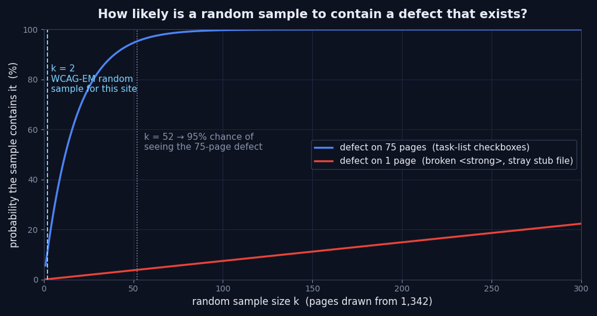

7月23日，W3C把[WCAG Evaluation Methodology (WCAG-EM) 2.0](https://www.w3.org/TR/WCAG-EM/)作为Group Note发布了。上一版的日期是2014年7月10日，隔了十二年。

读下来有一处让我停住：怎么挑样本，文档写得很细；这批样本会漏掉什么，文档没有给出测量的办法。我的站点是静态构建，每个页面都是磁盘上的文件，两边都做得起。于是照着流程挑了26个页面，又把同一次构建的1,342个页面整个扫了一遍。结果是，全量扫描找出4类违规，抽样只碰到其中1类。

## 抽样评估这套流程为什么存在

先把地基铺好。WCAG 2.2是一组达成标准，而符合性是按页面定义的。所以“这个网站是AA”这句话，严格来说等于“这个网站的每一个页面都满足AA”。站点有几千个页面时，要让这句话站得住，就得做几千次评估。现实中的审计不是这么跑的。

WCAG-EM就是来补这个缺口的。不看全部，而是挑出有代表性的样本，按WCAG 2的五项符合性要求检查，再把结果写成报告。流程分五步：定义评估范围、探索目标产品、选定代表性样本集、评估样本集、报告评估结果。每一步都带着编号的“Methodology Requirement”，报告里能追溯到哪一步是怎么做的。

比流程更值得注意的是，这份文档把自己的天花板写明白了。只做抽样评估，不能对整站提出符合性主张。[原文](https://www.w3.org/TR/WCAG-EM/)是这么写的：

> WCAG 2 conformance claims cannot be made for entire websites based upon the evaluation of a selected sub-set of web pages and functionality alone

同一段还承认，实务中绝大多数评估都只看样本，所以单靠这套方法通常到不了符合性主张那一步。收到过审计报告的人，这句话值得记住：“依据WCAG-EM完成评估”是流程记录，不是符合性证明。

## 2.0真正改动的地方

宣传得最多的差异是适用范围。1.0针对的是网站和网页，2.0还覆盖应用及其他数字产品（见[WAI概览页](https://www.w3.org/WAI/test-evaluate/conformance/wcag-em/)的说明）。文档里“web page”整体换成了“sample”和“view”，就是这次扩展的结果，为的是让自助终端、原生应用这类屏幕数量不多的产品也能套进来。

对Web开发者来说，更实在的改动在Step 3的结构。它拆成结构化样本集（3.1）、随机样本集（3.2）、完整流程（3.3），并在Step 4.3要求把前两者做对照。随机样本的数量是定死的：

> The number of samples to randomly select is 10% of the structured sample set selected through the previous steps.

随机样本不是用来多抓几个违规的，它是用来检验结构化样本有没有代表性的。Step 4.3的要求写得很清楚：

> Check that each sample in the randomly selected sample set does not show types of content and outcomes that are not represented in the structured sample set.

一旦随机样本里冒出结构化样本中没有的内容类型或新发现，就当作代表性不足的信号，退回Step 3重选。我认为这个对照装置是本次修订里最有价值的部分。而我想测的问题也正好落在这里：这道装置到底有多灵敏。

还有一句，藏在Step 3开头，容易被跳过：

> If feasible, it is recommended to evaluate the entire digital product. The sampling procedure may then be skipped.

审计现场几乎没人引这两句，因为抽样几乎等同于“审计该长什么样”的默认设定。静态站点上的“feasible”究竟意味着什么，后面用数字说。

## 照着流程挑出来的26个页面

Step 1是范围定义。对象定为jangwook.net的生产构建产物全部，符合性目标是WCAG 2.2 Level AA，无障碍支持基线取当前的桌面浏览器加屏幕阅读器。这里留下一个要拍板的问题：没有任何链接指向的文件，算不算在范围内。我选择把域名下所有能以URL响应的HTML都算进去。这个决定后面会带来一个我没预料到的结果。

按Step 2和Step 3.1，结构化样本挑了24个页面。选取依据原样列出：

| 依据（WCAG-EM步骤） | 样本 | 数量 |
|---|---|---|
| 2.1 常见视图（入口） | `/`、`/ko/`、`/ja/`、`/en/`、`/zh/` | 5 |
| 2.1 常见视图（列表） | 各语言的 `/blog/` | 4 |
| 2.2 关键功能（联系与简介） | 各语言的 `/about/` | 4 |
| 2.3 样本类型（错误页） | `/404.html` | 1 |
| 2.3 样本类型（独立落地页） | `/deepdiner/`、`/ja/social/` | 2 |
| 2.4 所依赖的技术（文章模板） | 每种语言1篇 | 4 |
| 2.5 其他相关样本（语料中段） | 每种语言1篇 | 4 |

按Step 3.2，随机样本取24的10%，也就是2个页面，从结构化样本之外抽取，为可复现固定了随机种子。抽中的是一篇日文文章和一篇英文文章。合计26个页面，占全站的1.9%。

到这一步已经能看出一件事：决定随机样本数量的不是站点规模，而是结构化样本的数量；而结构化样本的数量来自视图类型的多少。我的站点无论有300篇还是1,300篇文章，视图类型都差不多。文章翻十倍，随机样本还是2个。这个性质正是后面那组概率的来源。

## 把同一次构建的1,342个页面全部跑一遍

全量扫描用axe-core 4.12.1跑在jsdom 30.0.1上，规则限定在 `wcag2a`、`wcag2aa`、`wcag21a`、`wcag21aa`、`wcag22aa` 这几个标签，对象是刚构建出来的1,342个HTML文件。

第一次跑失败了。单进程遍历到450个页面左右，堆就炸了。

```
FATAL ERROR: Reached heap limit Allocation failed - JavaScript heap out of memory
node scan.js ... exit 134
```

即使调用了 `window.close()`，jsdom实例回收得也不够快，而单页耗时从303ms涨到533ms其实早就把征兆写在脸上了。拆成12个分片、每次并行4个之后问题消失：CPU时间合计800秒，实际耗时5分钟，失败页面0个。前面引的那句“if feasible”，实测值就是这个数——静态站点上评估整个产品的成本是5分钟。

结果如下：

| axe规则 | 严重度 | 违规页面 | 违规节点 | 成因 |
|---|---|---|---|---|
| `label` | critical | 75 | 907 | GFM任务列表生成的无标签复选框 |
| `list` | serious | 1 | 1 | `<ol>` 的直接子元素里混进了 `<strong>` |
| `document-title` | serious | 1 | 1 | 广告联盟所有权验证用的桩文件 |
| `html-has-lang` | serious | 1 | 1 | 同一个桩文件 |

1,342个页面里，至少有一处违规的是77个，占5.7%。三种成因的性质完全不同。

907处 `label` 全部来自Markdown的任务列表语法。`- [ ] 条目` 渲染出来是 `<li class="task-list-item"><input type="checkbox" disabled> 条目</li>`。复选框没有可访问名称，屏幕阅读器只念到“未选中，复选框”，至于这一条是什么，它不会说。成因只有一处，在Markdown渲染管线里；后果散落在75个页面上。

那1处 `list` 出自一篇快五年前的文章。顺着查，是这一行：

```markdown
4. <strong>Query Patterns**:
```

开标签用的是HTML，收尾用的是Markdown语法。这个仓库把粗体写法从 `**文本**` 迁移到 `<strong>文本</strong>` 过，而这一行在迁移中只改了一半。没闭合的 `<strong>` 把后面的内容吞掉，跑到了 `<ol>` 的直接子元素位置上，列表结构就此破掉。1,300篇里，正好一篇。

`document-title` 和 `html-has-lang` 这一对更难为情。罪魁是放在 `public/` 下的一个30字节文件：

```
$ cat public/ezoic-BCuedJHJQiUWKNs9gWL0mfiNSGnQFy.html
BCuedJHJQiUWKNs9gWL0mfiNSGnQFy
```

2025年12月为广告联盟做所有权验证放上去，之后就忘了。没有 `<html>`，没有 `<title>`，也没有 `lang`。没有任何地方链接到它，站点地图里也没有，但直接请求URL会返回200。它之所以被扫到，是因为Step 1里我把范围定成了“域名下所有HTML”。范围定义会制造结果——这一点，我举不出比它更干净的例子。

## 抽样漏掉了什么，以及为什么非漏不可

开始对照。24个结构化样本只抓到 `label`，因为其中4个页面刚好含有任务列表。2个随机样本什么都没扫出来。也就是说，Step 4.3的对照以“无新发现”通过，按方法论的字面流程，我可以判定结构化样本具有代表性，然后动手写报告。而那一刻，站点上还留着抽样从未见过的3类违规。



漏掉是偶然还是结构性的，概率一算就分明。n个页面里有m个带缺陷，随机抽k个至少命中一个的概率，超几何分布直接给出答案：

```js
// m：带缺陷的页面数，k：样本量，n：总页面数
function pDetect(m, k, n) {
  let p = 1;
  for (let i = 0; i < k; i++) p *= (n - m - i) / (n - i);
  return 1 - p;
}
```

把真实数字代进去：

| 缺陷所在页面数 | k=2 | k=50 | k=100 | 达到95%所需的k |
|---|---|---|---|---|
| 75个（任务列表） | 10.9% | 94.7% | 99.7% | 52 |
| 1个（坏掉的 `<strong>`、桩文件） | 0.15% | 3.7% | 7.5% | 1,275 |

想以95%的把握抓住只存在于1个页面的缺陷，得从1,342个里抽1,275个。那已经不是抽样，是绕了个弯的全量。反过来，散在75个页面上的缺陷，抽52个就到95%。同样叫“违规”，检出曲线完全是两回事。

Step 4.3这道对照装置本身我也测了。换着种子抽了20,000次两页的随机样本，每次统计有没有出现结构化样本里没有的发现。出现58次，概率0.29%。在这个站点上，Step 4.3每1,000次有997次返回“无异常”。代表性检验通过了，并不构成代表性的证据。

不想造成误解，所以把话说明白：这不是方法论的缺陷。WCAG-EM的设计前提是人工评估，而人的时间有限。把24个页面的人工检查和1,342个页面的人工检查放在一起比，抽样流程完全合理。只是这批样本保证了什么、没保证什么，你得心里有数，而且是有数字的那种。

## 模板来的违规，和内容来的违规

这次测量给我的判断是：无障碍违规按诞生位置分成两类，而抽样只看得见其中一类。

模板类违规诞生在某个组件或布局里，然后被复制到每个页面上：页头的地标结构、卡片的链接名称、表单的标签关联，都属于这一类。随便抽哪个页面都能看见，一个样本就够，审计报告里被归进“全站通用”的条目大多在这儿。我站点上那907处 `label` 正是这个形状——成因是渲染管线里的一处，24个样本轻松就逮到了。

内容类违规完全不同。它诞生在某一篇文章的Markdown、某一张图片的替代文本、某一个表格的表头单元格里。单页发生的概率很低，但绝对数量会随内容量堆积。而且关键在于，它只存在于一个页面上，按上面那张表，抽样抓不到。我[顺着构建产物测抓取深度](/zh/blog/zh/crawl-depth-flat-archive-audit-2026/)那次也见过同样的性质：面向全站的指标，通常都是被少数例外拖垮的。

由此得出一个很实际的结论。把审计预算分配成“要人工看多少个样本页”，这个设计只对了一半。更该问的是：哪些交给机器做全量，人的时间又花在哪。静态构建下，把可由机器判定的规则跑遍全站的成本，前面量过了，5分钟。这5分钟覆盖的地盘再让人一页页抽着复查，是浪费。人更应该待在[自动检查沉默的那一段](/zh/blog/zh/axe-automated-a11y-coverage-gap-2026/)。

## 改完之后再测一遍

只测不改，事情只做了一半。三个成因里，这次处理掉两个。

坏掉的 `<strong>` 那一行改了，一个字符的事。

任务列表的复选框则在渲染阶段拦住，而不是回头去改所有Markdown。往管线里插了一个rehype插件，把同一个 `li` 的文本取出来，作为复选框的可访问名称挂上去：

```js
function rehypeTaskListLabels() {
  const textOf = (node) => {
    if (node.type === "text") return node.value;
    if (!node.children) return "";
    return node.children.map(textOf).join("");
  };

  return (tree) => {
    visit(tree, "element", (node) => {
      if (node.tagName !== "li") return;
      const box = node.children?.find(
        (child) =>
          child.type === "element" &&
          child.tagName === "input" &&
          child.properties?.type === "checkbox"
      );
      if (!box || box.properties.ariaLabel) return;
      const label = textOf(node).replace(/\s+/g, " ").trim();
      if (!label) return;
      box.properties.ariaLabel = label.slice(0, 120);
    });
  };
}
```

渲染结果会变成这样：

```html
<!-- 改之前 -->
<li class="task-list-item"><input type="checkbox" disabled> Check GA4 Acquisition report</li>
<!-- 改之后 -->
<li class="task-list-item"><input type="checkbox" disabled aria-label="Check GA4 Acquisition report"> Check GA4 Acquisition report</li>
```

这里又栽了一次。插件加好、构建跑完，输出没变。Astro 5的内容层会缓存渲染后的HTML，而它的失效依据是Markdown文件有没有变，不是配置文件有没有变。我改过的那一篇拿到了新HTML，其余1,300篇原样从缓存里出来。删掉 `.astro` 和 `node_modules/.astro` 重新构建之后才全部生效。动渲染管线的时候顺手清缓存，这个教训学得挺便宜。

清完缓存重新构建的1,342个页面，用同样的条件又扫了一遍。有违规的页面从77个降到1个，违规节点从910个降到2个。剩下的那1个，就是下面这个桩文件。

| | 违规页面 | 违规节点 | 规则种类 |
|---|---|---|---|
| 修改前 | 77 | 910 | 4 |
| 修改后 | 1 | 2 | 2 |

剩下这个桩文件我没动。广告联盟要验的就是文件内容本身，加上 `<html lang>` 和 `<title>` 有可能把验证弄坏。我改成在Step 1的范围定义里把它明确排除掉。从范围里排除，和压根忘了它存在，是完全不同的两种状态。这次审计真正的收获，其实更靠近这一点，而不是那份违规清单。

## 这次测量没有说的事

限制照实写。

全量扫描跑在jsdom上，而jsdom没有布局引擎。对比度、目标尺寸这些必须等元素真正绘制出来才能判定的规则，一律给不出结论。[实测目标尺寸](/zh/blog/zh/wcag22-target-size-audit-2026/)那次得起真实浏览器，原因就在这儿。这次的4类违规，是“只看标记就能判定的违规”清单，不是无障碍违规本身的清单。

再者，axe能抓的只是达成标准中可由机器判定的那一部分。替代文本有没有真的描述图像内容、焦点顺序是否贴合画面语义、错误提示能不能被理解，这些都无法还原成规则。4类违规这个数字，不等于“这个站点无障碍做得好”。

最后再引一次WCAG-EM自己的话，位置在[原文](https://www.w3.org/TR/WCAG-EM/)靠前的部分：

> This document does not replace the need for quality assurance throughout all phases of product development.

方法论不替代开发全过程中的质量保证。这次我做的事，与其说是审计，不如说更接近质量保证。改渲染管线里的一处、抹掉907条，对站点的推动比人工把26个页面看一遍要大得多。

## 小结：挑样本之前先问的四个问题

把这次测量留下的执行要点按顺序列出来。

1. **先确认全量是否可行。** 静态构建的产物就是文件，可由机器判定的规则跑遍全站只花几分钟CPU时间。WCAG-EM本身也是先建议在可行时评估整个产品、跳过抽样。
2. **算出样本的检出概率，再决定信它多少。** 上面 `pDetect(m, k, n)` 三行就够。结论来得很快：只存在于一个页面的缺陷，实际上非全量不可。
3. **把违规按来源分开数：模板来的，还是内容来的。** 模板来的，修一处成因，全站一起消失；内容来的，数量随内容量增长，要靠管线拦住，而不是靠人一页页找。
4. **在范围定义里明确处理没有链接指向的文件。** 收进来还是排除掉都行，从没做过决定才是问题。我这边就是一个被遗忘的30字节文件，成了全站分数最低的页面。

把无障碍审计从“样本怎么挑”重新设计成“哪些交给机器做全量、人的时间往哪儿放”，这类工作眼下占了我不小的比重。想为规模相近的站点一起排一排这个分配，[个人简介页](/zh/about/)里留了联系方式。

---

*出处：W3C的[WCAG Evaluation Methodology (WCAG-EM) 2.0](https://www.w3.org/TR/WCAG-EM/)（W3C Group Note，2026年7月23日）与[WCAG-EM Overview](https://www.w3.org/WAI/test-evaluate/conformance/wcag-em/)（均为官方）。测量环境：自有Astro构建产物HTML 1,342个，axe-core 4.12.1 + jsdom 30.0.1，Node 22.22，规则限定在wcag2a/wcag2aa/wcag21a/wcag21aa/wcag22aa标签，12分片4并行，CPU时间合计800秒。概率值来自超几何分布计算与固定种子的蒙特卡洛20,000次抽样。所有数字都出自本站点的这一次构建，并非对WCAG-EM方法论一般性能的论断。*
