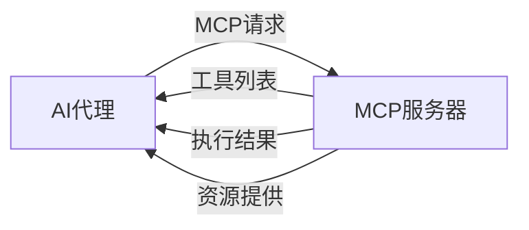
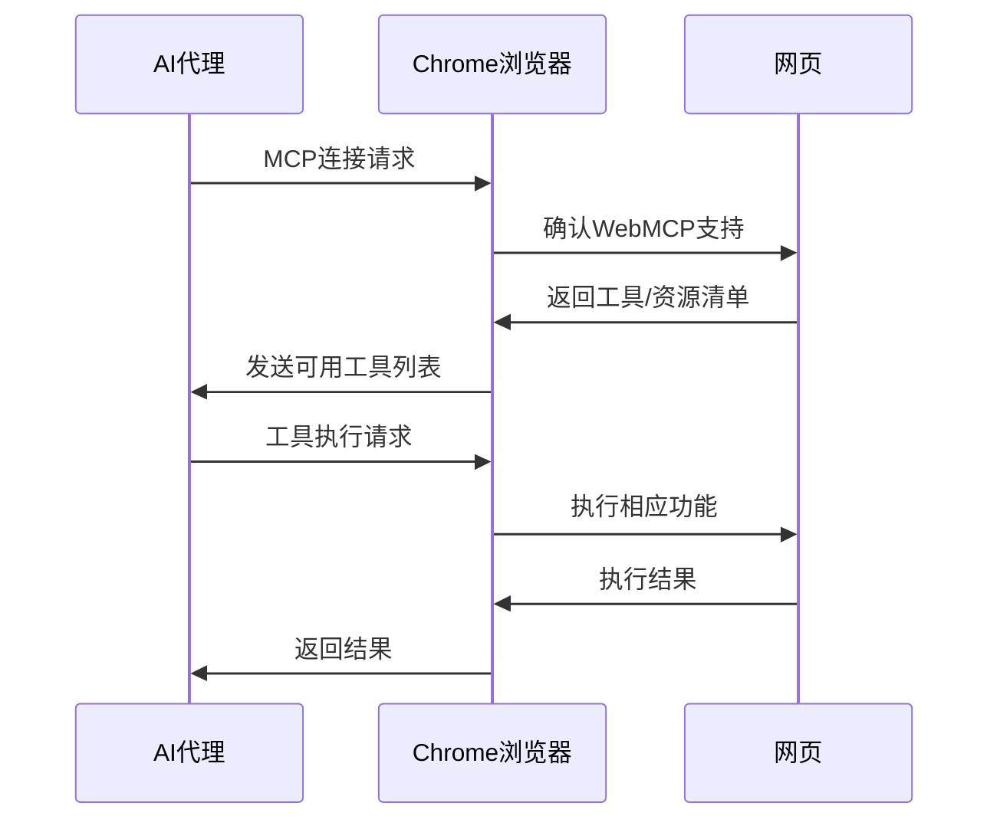
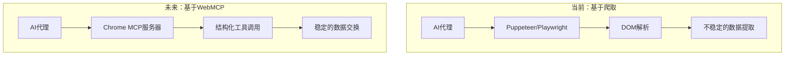

## 概述

Google Chrome 146引入了<strong>WebMCP</strong>。这是一项革新性功能，使浏览器本身作为MCP（Model Context Protocol）服务器运行，让AI代理能够直接将浏览器用作工具服务器。

此前，AI代理要与网页交互，需要使用Puppeteer、Playwright等独立的自动化工具。WebMCP从根本上改变了这一范式。浏览器自身成为<strong>MCP服务器</strong>，直接向AI代理提供结构化的工具和数据。

## 什么是MCP（Model Context Protocol）？

MCP是Anthropic提出的开放协议，是AI模型与外部工具及数据源之间的标准化通信规范。



MCP的核心组件包括：

- <strong>Tools</strong>：AI可调用的函数（搜索、表单填写、页面操作等）
- <strong>Resources</strong>：AI可读取的结构化数据
- <strong>Prompts</strong>：预定义的提示模板

## WebMCP的工作原理

WebMCP使网页能够将自身功能作为MCP服务器公开。Web开发者可以声明式地定义AI代理可使用的工具和数据。

### 架构



### 核心变化

| 项目 | 传统方式 | WebMCP |
|------|---------|--------|
| 浏览器控制 | Puppeteer/Playwright | 原生MCP |
| 页面理解 | DOM解析/爬取 | 结构化资源 |
| 交互方式 | CSS选择器 | 声明式工具调用 |
| 认证/权限 | 手动配置 | 浏览器内置 |
| 稳定性 | UI变更即失效 | API级别稳定性 |

## 面向Web开发者的WebMCP实现

Web开发者可以在自己的网站上实现WebMCP，向AI代理公开可用功能。

### 示例：电商网站

```javascript
// WebMCP工具定义示例
navigator.mcp.registerTool({
  name: "search_products",
  description: "搜索商品",
  inputSchema: {
    type: "object",
    properties: {
      query: { type: "string", description: "搜索关键词" },
      category: { type: "string", description: "分类筛选" },
      maxPrice: { type: "number", description: "最高价格" }
    },
    required: ["query"]
  },
  handler: async (params) => {
    const results = await searchAPI(params);
    return { products: results };
  }
});

// 资源注册
navigator.mcp.registerResource({
  uri: "cart://current",
  name: "当前购物车",
  description: "当前用户的购物车内容",
  handler: async () => {
    return { items: await getCartItems() };
  }
});
```

### 示例：SaaS仪表板

```javascript
// 向AI代理提供仪表板数据
navigator.mcp.registerTool({
  name: "generate_report",
  description: "生成指定期间的分析报告",
  inputSchema: {
    type: "object",
    properties: {
      startDate: { type: "string", format: "date" },
      endDate: { type: "string", format: "date" },
      metrics: {
        type: "array",
        items: { type: "string" }
      }
    }
  },
  handler: async (params) => {
    return await dashboardAPI.generateReport(params);
  }
});
```

## 对AI代理生态系统的影响

WebMCP从根本上改变了AI代理利用Web的方式。



### 1. 爬取时代的终结

网站直接提供结构化接口，消除了对不稳定DOM爬取的需求。即使网站UI发生变化，MCP接口仍然保持稳定。

### 2. 代理开发简化

AI代理开发者无需为每个网站编写定制爬取逻辑，通过标准化的MCP协议即可与所有支持WebMCP的网站通信。

### 3. 安全与权限管理

浏览器作为中间层运行，可以在用户授权下安全地控制AI代理的访问。现有的浏览器安全模型（CORS、CSP等）无缝适用。

### 4. 新商业模式

为AI代理提供<strong>MCP端点</strong>可能成为与SEO同等重要的战略。"AI引擎优化（AEO）"这一新领域即将诞生。

## 跨浏览器支持与标准化展望

目前WebMCP率先在Chrome 146中引入，但预计将通过Web标准化向其他浏览器扩展。

- <strong>Firefox</strong>：可能与Mozilla的AI战略联动引入
- <strong>Safari</strong>：从Apple Intelligence集成角度值得关注
- <strong>Edge</strong>：预计与Copilot自然集成

由于MCP已作为开放协议设计，实现跨浏览器兼容性相对容易。

## 开发者应做的准备

### 短期（3-6个月）

1. 学习MCP协议规范
2. 梳理自有服务的AI代理应用场景
3. 在Chrome 146 Beta中试验WebMCP

### 中期（6-12个月）

1. 设计并实现WebMCP接口
2. AI代理兼容性测试
3. 建立安全与权限模型

### 长期（1年以上）

1. 制定AEO（AI Engine Optimization）策略
2. 部署代理专用分析与监控
3. 应对多代理场景

## 结论

WebMCP是Web的下一个进化阶段。网页从单纯的人类浏览UI，转变为<strong>AI代理可利用的结构化服务</strong>。

Chrome 146引入WebMCP只是开端。未来所有Web服务将同时提供"面向人类的UI"和"面向AI的MCP接口"。

对Web开发者而言，这不仅是一个新功能，更是<strong>重新定义Web存在意义的转折点</strong>。

## 参考资料

- [MCP官方网站](https://modelcontextprotocol.io/)
- [Chrome 146发布说明](https://developer.chrome.com/blog)
- [@firt的WebMCP介绍推文](https://x.com/firt/status/2020903127428313461)
- [Anthropic MCP发布](https://www.anthropic.com/news/model-context-protocol)
