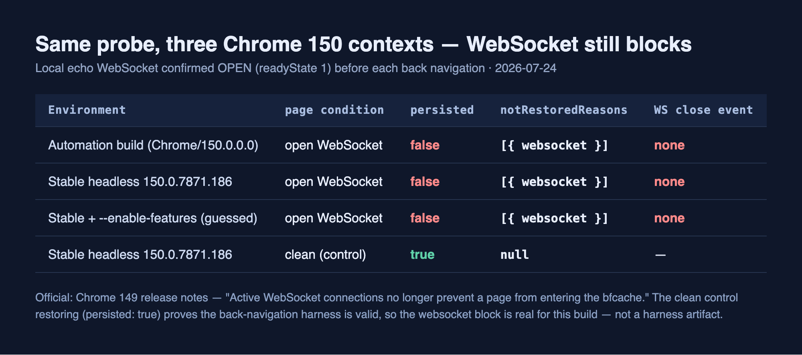

官方说变了。Chrome 149 的发行说明写得清清楚楚：「活动中的 WebSocket 连接不再阻止页面进入 Back/Forward Cache（bfcache）」。7月22日，我在旧测量那篇文章里附了条勘误，承诺在新行为下用同一套探针重跑一遍并更新结果。等于我提前认定自己会被推翻。

今天重测了。没被推翻。或者说，在我看的地方没有翻。我用三种方式跑了 Chrome 150，抱着一个活动 WebSocket 的页面三次都没能复原。`notRestoredReasons` 每一次都返回 `websocket`。本文如实记下这道分叉：发布与实测为什么会裂开，以及这道裂缝对于从 CI 里盯 bfcache 的人来说，为什么是个真会咬人的陷阱。

## bfcache 是什么，WebSocket 又为什么会拦它

先把概念垫稳。本文结论既窄又技术，没有地基，就只剩几个悬空的数字。

back/forward cache（bfcache）是浏览器的一项功能：用户离开页面时，它不销毁页面，而是把整页连同内存一起冻结。DOM、JavaScript 堆、滚动位置，原样保留。用户一按后退，浏览器就把这份快照解冻。web.dev 的说法很直接：「Loading the previous page is essentially instant, because the entire page can be restored from memory, without having to go to the network at all.」不重新解析文档，不重新执行脚本，不重新计算布局。在来回穿梭搜索结果的移动端，这种差别尤其能感觉到。

先把预期压下来。bfcache 不是排名因素。修好它并不会抬高你的搜索排名，官方也没这么说过，我同样不这么讲。这纯粹是真实用户体会到的导航手感。

麻烦在于，不是随便哪个页面都能冻。页面若还攥着活的连接或回调，浏览器就把它丢掉，而不是缓存。长期挂在这份「不合格」名单上的，就有打开着的 WebSocket。带实时聊天挂件、通知流、行情跳动的页面，每次后退都得整页重载。

这个状态不用猜，浏览器用两个 API 给答案。`pageshow` 事件的 `event.persisted` 为 `true`，说明页面是从 bfcache 复原的。当它**没能**复原，`PerformanceNavigationTiming.notRestoredReasons` 会带上原因。这个 API 从 Chrome 123 起就发布了。我在[上一篇的六探针测量](/zh/blog/zh/bfcache-notrestoredreasons-audit-2026/)里，用这两个 API 把六个拦截候选逐个拆开，确认了打开的 WebSocket 会以 `reason: "websocket"` 拦住页面。

## 发布说得很明白：不再拦了

把这个结论撬松的，是 web.dev 2026 年 6 月的平台综述。原文开头是：「In Chrome 149, pages with active WebSocket connections can now enter the Back/Forward Cache (bfcache). Previously, an open WebSocket connection rendered a page ineligible for bfcache. Now, the browser automatically closes active WebSocket connections upon bfcache entry.」

关键在最后一句。浏览器不再把页面标为不合格再销毁，而是**在进入 bfcache 时替你关掉 WebSocket**，页面照冻。Chrome 149 的发行说明把同一件事说得更短：「Active WebSocket connections no longer prevent a page from entering the Back/Forward Cache (bfcache).」blink-dev 的变更公告（PSA）还点到了开发者这一侧的含义：「By closing connections on BFCache entry instead of marking the document as ineligible...」并补充说，健壮的 WebSocket 客户端本就会用 `close` 事件察觉断开并重连，多数情况下能平顺吸收。

照字面读，我旧测量里的「WebSocket=拦截」就成了旧版本下的过期结论。于是我在勘误里写下「将重测」，今天来兑现这个承诺。只是，确认一条发布和在自己环境里复现它，是两码事。这两者裂开的那一刻，才是本文的正题。

## 同一套探针，重跑一遍——三次都被拦

测量对象一混，结果就没法读。所以我把上次那台最小服务器重新搭起来。两条路由：只挂一个打开的 WebSocket 的 `/websocket`，以及不带任何拦截候选的对照组 `/clean`。这回为了不重蹈上次的坑，我真的起了一台本地回声服务器来接这个 socket，并在每次跳转前确认 `readyState` 为 `1`（OPEN）。埋点脚本就六行：

```js
window.addEventListener('pageshow', (e) => {
  const nav = performance.getEntriesByType('navigation')[0];
  window.__bfcache = {
    persisted: e.persisted,
    nrr: nav && nav.notRestoredReasons
      ? JSON.parse(JSON.stringify(nav.notRestoredReasons))
      : null,
  };
});
```

夹一层 `JSON.parse(JSON.stringify(...))` 的缘由上一篇写过：`notRestoredReasons` 直接打进日志只会留下 `[object Object]`，得强制序列化一次，值才显出来。

流程固定。打开 `/websocket`。确认 `readyState === 1`。跳到 `/next`。把历史退回去。在复原的页面上读 `window.__bfcache`。这套流程我在三个 Chrome 150 环境里各跑了一遍。

第一个是用 DevTools 协议驱动的自动化构建，`navigator.userAgent` 返回 `Chrome/150.0.0.0`。第二个是我 Mac 上装的正式版 Google Chrome 150.0.7871.186，用 `--headless=new` 全新启动，直接用 CDP 驱动。第三个是同一个正式版 Chrome，这次加了几个我猜可能是 WebSocket 相关的 `--enable-features` 标志再启动。三次结果完全一致。



| 环境 | 页面条件 | `persisted` | `notRestoredReasons` | WS `close` 事件 |
| --- | --- | --- | --- | --- |
| 自动化构建 (Chrome/150.0.0.0) | 打开的 WebSocket | `false` | `[{ reason: "websocket" }]` | 无 |
| 正式版 headless 150.0.7871.186 | 打开的 WebSocket | `false` | `[{ reason: "websocket" }]` | 无 |
| 正式版 + `--enable-features`（猜的） | 打开的 WebSocket | `false` | `[{ reason: "websocket" }]` | 无 |
| 正式版 headless 150.0.7871.186 | 对照组 (clean) | `true` | `null` | — |

有两点显眼。其一，对照组在三个环境里都以 `persisted: true` 复原。也就是说后退这套测试脚手架本身是好的，bfcache 在这个构建里也正常工作。那么 WebSocket 页面的 `false` 就不是脚手架的毛病，而是真被拦了。其二，发布里说的「浏览器替你关掉 WebSocket」这个动作，在我的环境里根本没发生。复原失败之后，socket 的 `readyState` 仍是 `1`，`close` 事件一次都没触发。新的代码路径压根没点亮。

读这些数字时还有个容易绊倒的地方。光凭 `persisted: false` 分不清「bfcache 被拦」和「就是普通地重新加载了一次」，因为首次加载时 `pageshow` 也会以 `persisted: false` 触发。分开这两者靠两点：导航类型是不是 `back_forward`，以及 `notRestoredReasons.reasons` 里有没有装具体原因。上面这轮里，正式版 headless 那次 `nav.type` 是 `back_forward`，`reasons` 是 `[{ reason: "websocket" }]`。这两个条件同时成立，才能断定「这是一次后退，却因为 WebSocket 没能复原」。只看 `persisted` 判定拦截的埋点，会把首次加载错当成拦截。

老实交代。第三个环境那几个 `--enable-features` 标志名是我猜的，什么变化都没带来。这个功能确切的 `base::Feature` 名字，我到最后也没能敲定。Chrome 对不认识的功能名会默默忽略，所以那次尝试顶多证明「不是这几个名字」。

## 发布与实测为什么会裂开

从这里往下掺了我专业之外的东西，就不下断言了。排名算法内部、浏览器的实验下发服务器逻辑，我都没亲眼看过。把查到的、最说得通的几个候选按序摆出来。

最有力的是**分阶段放量**。Chrome 就算宣布某功能「已发布到 stable」，实际上也常常靠服务端配置（俗称 Finch 的现场试验）把它逐步向用户点亮。这不是臆测，是能观察到的套路。紧挨着的前例就是 `Cache-Control: no-store` 进入 bfcache，Chrome 官方文档把那次放量明确标为在 2025 年 3 至 4 月间「向全体用户完成放量」。「发布」和「对所有人点亮」之间存在时差，是官方自己承认的。这套现场配置一般依赖从网络取来的种子。而我启动的正式版 Chrome，每次都是全新的空白配置文件。没有种子的新配置文件跑在功能默认值（多半是关）上，反倒是意料之中。

第二个候选是**无头与自动化环境**本身的差异。`--headless=new` 号称贴近有头模式，但实验下发和一部分优化在自动化下解析出不同结果，是有过先例的。我只在这个环境里测过，没验证过人手操作的有头 stable 配置文件会不会给出一样的结果。反过来，若信发布所言，拿到种子的真实用户的有头 Chrome，很可能已经能复原了。

所以本文的主张不是「Chrome 没兑现它的发布」。那样读就错了。准确的主张是这个：**「已发布到 stable」不等于「你面前每一个 Chrome 150 里都点亮着」，在新配置文件和自动化、无头环境里尤其如此。**发布是真的，我的实测也是真的。两者量的是不同的层。

## 那开发者该做什么

这道裂缝不是空谈。上一篇里我建议把 bfcache 测量搬进无头脚本，[每次部署当作 CI 关卡跑一遍](/zh/blog/zh/validate-structured-data-ci-jsonld-2026/)。今天这次测量正好戳中那条建议的盲点。你 CI 里的浏览器，十有八九是新配置文件的无头实例。这种环境，如刚才所见，反映平台放量比真实用户要慢。平台宣布「修好了」之后，你的关卡还可能有一阵子照吐 `websocket` 当拦截原因。

按能立刻上手的顺序整理：

- **在 CI 的 bfcache 关卡里把浏览器构建和渠道记进日志。**把 `navigator.userAgent` 和版本串一并写进结果。哪天关卡和现场数据对不上，元凶可能不是代码，而是放量的时差。
- **拿真实用户的现场数据去对关卡。**用 `sendBeacon` 收 `notRestoredReasons` 的 RUM 片段，上一篇原封不动就在那儿。如果 CI 亮绿，现场却已看不到 `websocket`（或者反过来），这个落差本身就是信号。别只信一边。
- **WebSocket 照旧在 `pagehide` 里关掉。**就算浏览器会在进入时替你关，也别假设这个行为对所有用户都点亮了就动手写代码。放量还没触达的用户，走的仍是旧规则。显式关闭的代码在两个世界里都安全。
- **在 `pageshow` 里一定写 `event.persisted === true` 分支。**浏览器关掉 WebSocket 把页面冻上后，回来的画面上那条实时连接是断的。在这个分支里重连，并把冻结期间过期的值（通知、库存、价格）重新取一遍。少了这个分支，你给用户的就是「快，但断了」的画面。

```js
let socket;
function connect() { socket = new WebSocket('wss://example.com/live'); }
connect();

// 就算浏览器会在进入时关掉它，也显式关一次，两种放量下都稳。
window.addEventListener('pagehide', () => {
  if (socket && socket.readyState === WebSocket.OPEN) socket.close();
});

// 复原后重连，刷新冻结期间过期的画面。
window.addEventListener('pageshow', (event) => {
  if (event.persisted) { connect(); refreshStaleUI(); }
});
```

## 收尾：勘误只回收一半

这次重测的要点很短。官方宣布 Chrome 149 解除了打开的 WebSocket 对 bfcache 的拦截。我信了这条发布，还提前认定旧结论会翻。可在 Chrome 150 的自动化与无头三个环境里重测，打开的 WebSocket 依然以 `reason: "websocket"` 拦住页面。对照组正常复原，所以不能怪脚手架。

于是我把旧勘误这样更新。WebSocket 的拦截**正在平台层被解除**，拿到种子的真实用户环境，很可能已经切到复原了。但在新配置文件的自动化、无头 Chrome 里，旧行为仍能被观察到。所以在你按「WebSocket 不再拦了」去删代码之前，先确认**你的测量环境和真实用户处在同一个放量阶段**。

限制也照实写。这三轮是在一台 macOS 机器上用 Chrome 150 系测的。Safari 和 Firefox 的拦截条件不同，`notRestoredReasons` 本身也是 Chromium 系的 API。我没复现拿到种子的有头 stable 配置文件，也没敲定功能确切的标志名。把这个结果读成「Chrome 150 会拦 WebSocket」就错了；准确地读成「我测的三个自动化环境里，还在拦」才对。复现步骤都留着，各自在自己的目标环境里跑同样三轮，就能得到自己放量阶段的答案。

测量去确认一条发布，和那条发布在你面前的浏览器里是否真被点亮，是两个问题。后者不是意见，只有测量能回答，而答案因环境而异。我个人接这类活：实测线上站点的 bfcache 资格，再把结果落成一道不会跟真实用户现场数据跑偏的关卡。若用得上，可以通过[联系页面](/zh/contact/)找我。
