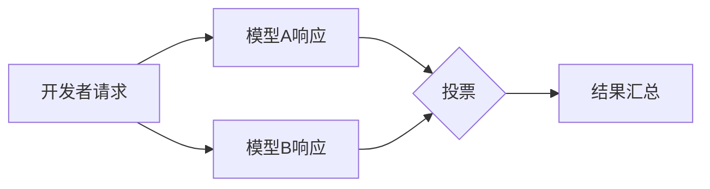
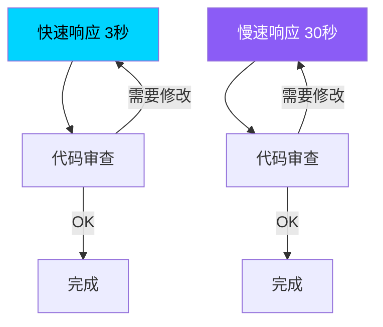

## 概述

Windsurf在其AI编码助手中推出的<strong>Arena Mode</strong>产生了有趣的投票结果。在这项超过4万票的大规模实验中，开发者们<strong>压倒性地优先选择速度而非精度</strong>。

这一结果对AI编码工具市场的方向具有重要启示。开发者更喜欢快速生成代码并快速迭代的工作流程，而不是等待完美准确的代码。

## 什么是Arena Mode？

Windsurf的Arena Mode是一种<strong>盲测</strong>形式，将两个AI模型的响应并排显示，让开发者投票选择更好的响应。

这种方式与Chatbot Arena（LMSYS）类似，但其差异化在于专注于<strong>实际编码任务</strong>。开发者在代码补全、重构、调试等实战工作中比较评估两个模型。

## 核心发现：速度胜过精度

来自4万多票投票数据的核心洞察非常明确：

- <strong>提供更快响应的模型始终获得更高的偏好</strong>
- 轻微的精度差异在速度优势面前被忽视
- 这种趋势在<strong>重复性代码编写和修改任务</strong>中尤为显著

### 为什么是速度？

考虑到开发者的实际工作流程，这一结果完全合理：

1. <strong>快速反馈循环</strong>：快速接收代码并运行，有问题立即请求修改
2. <strong>上下文保持</strong>：响应过慢会打断开发者的思维流
3. <strong>可迭代性</strong>：即使第一次响应不完美，快速迭代2-3次即可达到期望结果
4. <strong>够好即可</strong>：快速获得80%准确的代码比长时间等待100%准确的代码更高效

快速模型可以在3秒×3次=9秒内完成，而慢速模型即使30秒×1次在绝对时间上也处于劣势。

## 对AI编码工具市场的启示

### 1. 模型选择策略的变化

这一结果直接影响AI编码工具提供商的模型选择策略。与最准确的前沿模型相比，<strong>速度与精度平衡良好的模型</strong>可能在用户满意度上更具优势。

### 2. 流式传输和渐进式生成的重要性

提升感知速度的技术成为核心竞争力：

- <strong>Token流式传输</strong>：在完整响应完成前先显示部分结果
- <strong>渐进式生成</strong>：先生成骨架，再逐步填充细节
- <strong>缓存策略</strong>：缩短相似请求的响应时间

### 3. 重新定义"好代码"

对开发者而言，"好的AI代码"意味着<strong>不是完美的代码，而是可以快速开始工作的起点</strong>。这改变了AI编码工具的评估标准本身：

| 传统评估标准 | Arena Mode揭示的现实 |
|---|---|
| 代码精度 | 响应速度 |
| 首次成功率 | 迭代修改效率 |
| 基准测试分数 | 感知生产力 |

## 与其他基准测试的比较

SWE-bench和HumanEval等现有基准测试以<strong>精度为中心</strong>评估模型。Arena Mode的结果表明，这些基准测试可能与实际开发者偏好存在脱节。

在实际开发环境中：

- 基准测试排名第一的模型不一定是最受欢迎的
- <strong>感知速度（perceived speed）</strong>对满意度的影响大于实际精度
- 开发者选择"快速且大致正确"而非"缓慢但精确"

## 结论

Windsurf Arena Mode的4万多票投票结果向AI编码工具行业传达了明确信息：<strong>开发者想要的不是完美，而是速度。</strong>

这不仅仅是"越快越好"的故事。这反映了现代软件开发已经进化为<strong>迭代式和渐进式的过程</strong>。AI编码工具应该定位为快速反馈循环的推动者，而非完美解决方案的提供者。

在评估AI编码工具时，不仅要考虑基准测试分数，还要考虑<strong>实际工作中的感知速度</strong>。

## 参考资料

- [Windsurf Arena Mode投票结果（X/Twitter）](https://x.com/windsurf/status/2021693447099273530)
- [Windsurf官方网站](https://windsurf.com)
- [Chatbot Arena（LMSYS）](https://chat.lmsys.org/)
